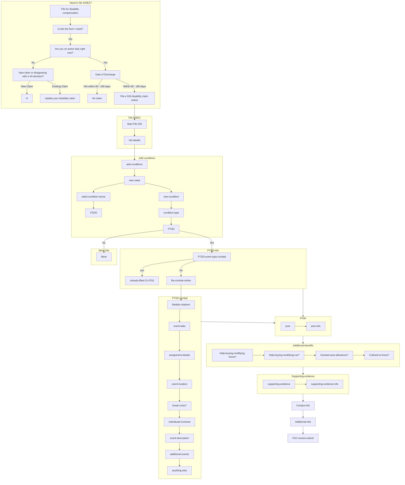

# Flow of 526EZ submission

Mermaid flowchart of the flow of the 21-526EZ disability compensation form, based on [the mural](https://app.mural.co/t/vsa8243/m/vsa8243/1636749936875/50f454702e8cd9ddf5d4e18b7209a7f6872b51a1?sender=ae9f125f-266e-4da1-9139-b15ad66209ae) and [the actual form](https://www.va.gov/disability/file-disability-claim-form-21-526ez/introduction).

