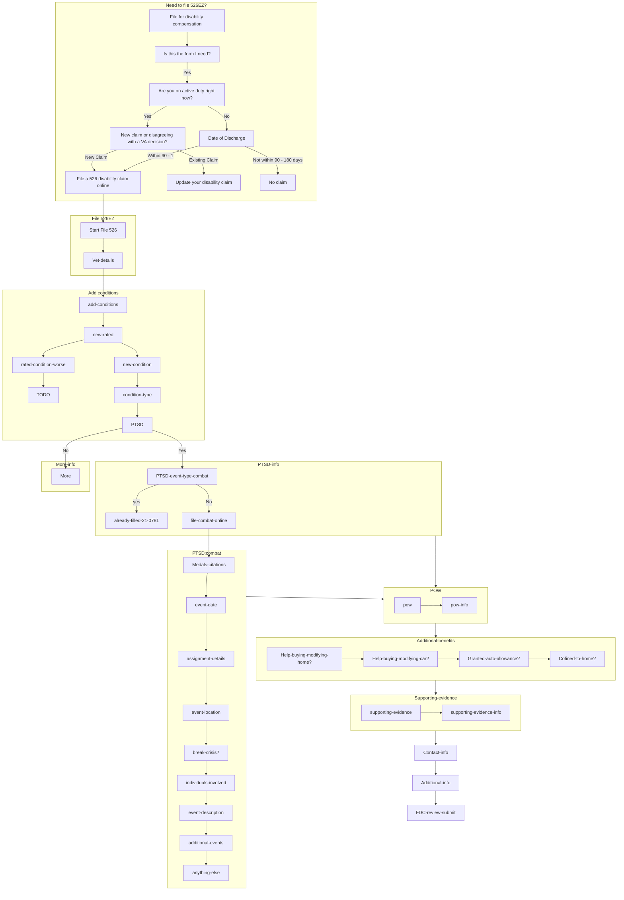

# Flow of 526EZ submission

```mermaid

flowchart TD
    subgraph Need to file 526EZ?
    A[File for disability compensation] --> B(Is this the form I need?)
    B[Is this the form I need?] --> | Yes | C[Are you on active duty right now?]
    C --> |Yes| E
    C --> |No| F
    E[New claim or disagreeing with a VA decision?] --> |New Claim| H
    E[New claim or disagreeing with a VA decision?] --> |Existing Claim| G
    G[Update your disability claim] 
    F[Date of Discharge 90 - 180 days] --> |Not within 90 - 180 days| L
    F[Date of Discharge] --> |Within 90 - 1| H
    L[No claim]
    end
    subgraph File 526EZ
    H[File a 526 disability claim online] --> File-526-start
    File-526-start[Start File 526 ] --> Vet-details
    end
    subgraph Add conditions
    Vet-details --> add-conditions
    add-conditions --> new-rated
    new-rated -->  new-condition
    new-rated -->  rated-condition-worse
    rated-condition-worse --> TODO
    new-condition --> condition-type
    condition-type --> PTSD
    end
      direction LR
    subgraph PTSD-info
        PTSD --> |Yes| PTSD-event-type-combat
        PTSD-event-type-combat --> |yes| already-filled-21-0781
        PTSD-event-type-combat --> |No| file-combat-online
    end
    subgraph PTSD:combat
        file-combat-online --> Medals-citations --> event-date --> assignment-details
         --> event-location --> break-crisis? --> individuals-involved --> event-description
         --> additional-events --> anything-else 
    end
    subgraph More-info
        PTSD --> |No| More
    end
    subgraph POW
        pow --> pow-info
    end
    subgraph Additional-benefits
        Help-buying-modifying-home? --> Help-buying-modifying-car?
        Help-buying-modifying-car? --> Granted-auto-allowance?
        Granted-auto-allowance? --> Cofined-to-home?
        Cofined-to-home?
    end
    subgraph Supporting-evidence
        supporting-evidence --> supporting-evidence-info
    end
     Additional-benefits --> Supporting-evidence
    PTSD-info --> POW
    PTSD:combat --> POW
    POW --> Additional-benefits
    Supporting-evidence --> Contact-info
    Contact-info --> Additional-info
    Additional-info --> FDC-review-submit
```
