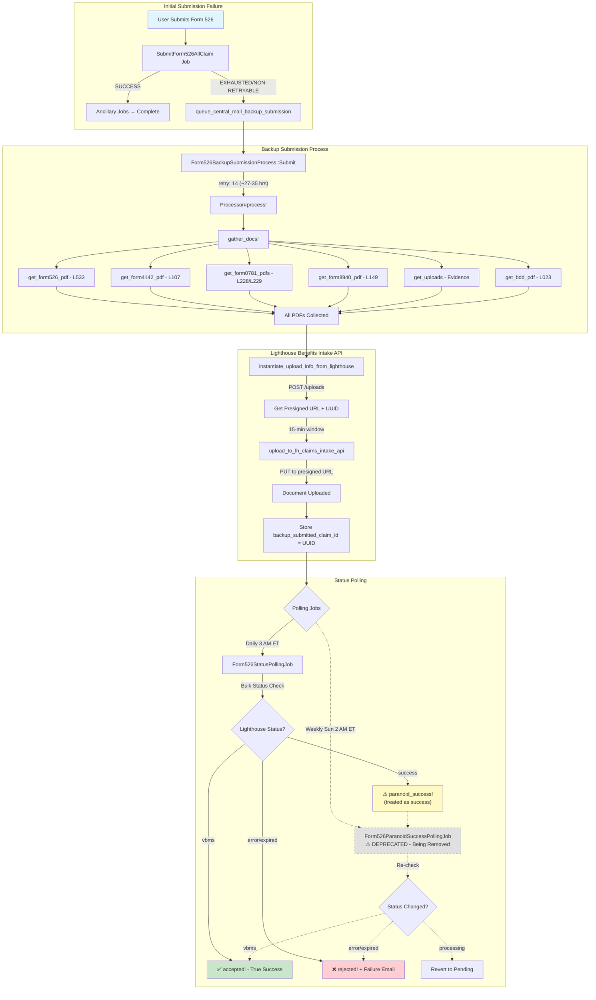
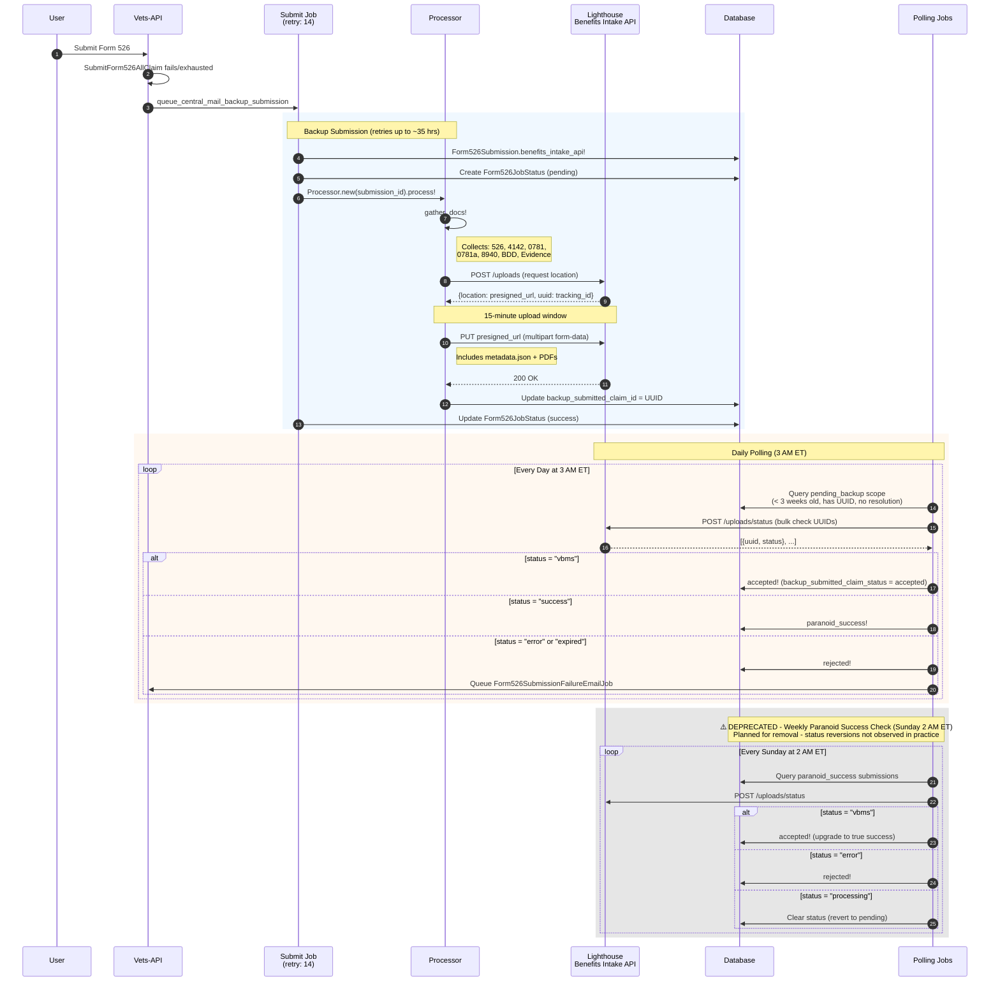
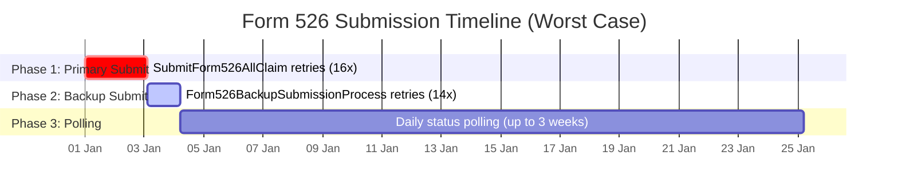
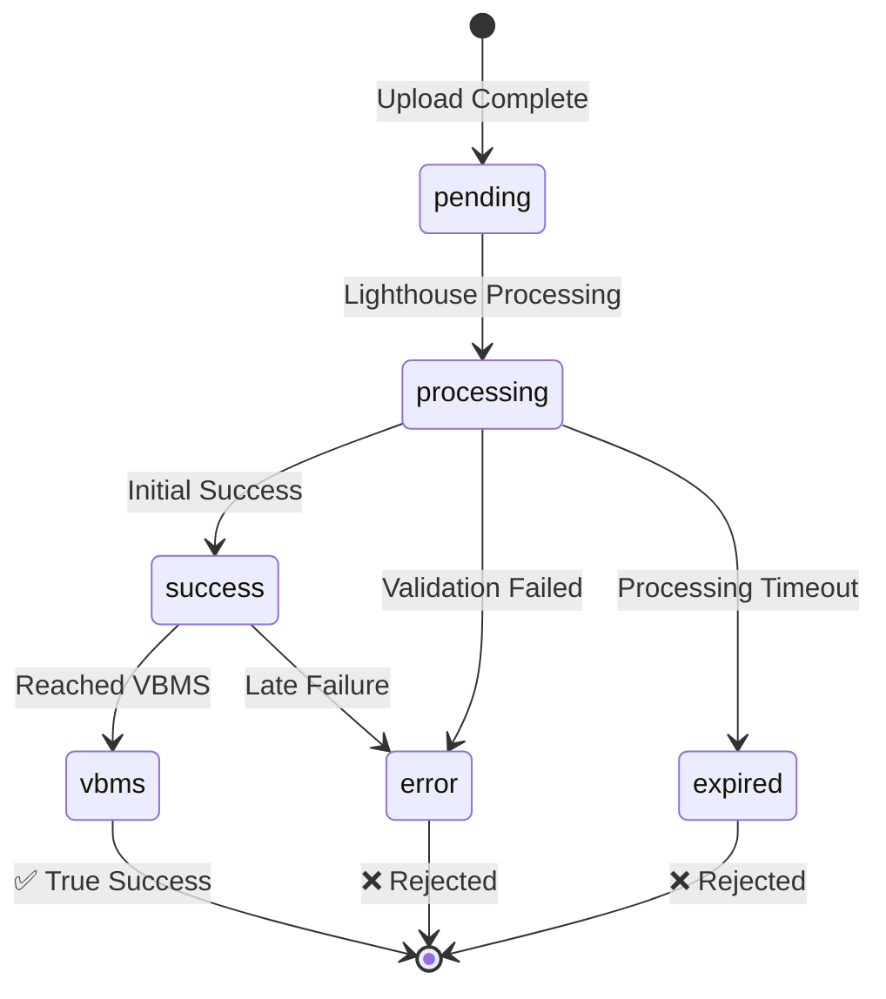

# Form526 Backup Submission Process Flow

This document describes the complete flow of the `Form526BackupSubmissionProcess` including upload, status polling, and durations.

## High-Level Flow Diagram



## Detailed Sequence Diagram



## Timing & Durations

### End-to-End Timeline Summary



| Phase | Job | Max Retries | Max Duration | Cumulative |
|-------|-----|-------------|--------------|------------|
| **1. Primary Submission** | `SubmitForm526AllClaim` | 16 | ~2 days 2 hours | ~2 days 2 hours |
| **2. Backup Submission** | `Form526BackupSubmissionProcess::Submit` | 14 | ~27 hours | ~3 days 5 hours |
| **3. Status Polling** | `Form526StatusPollingJob` | N/A (scheduled) | Up to 3 weeks | ~24 days total |

**Worst-case time from user submission to final resolution: ~3.5 weeks**

---

### Phase 1: Primary Submit Job (`SubmitForm526AllClaim`)

**Sidekiq retry: 16** — retries for up to **~2 days 2 hours** (per code comment: "2d 1h 47m 12s")

Sidekiq uses exponential backoff: `(retry_count ** 4) + 15 + (rand(10) * (retry_count + 1))` seconds

| Retry # | Approximate Delay | Cumulative Time |
|---------|-------------------|-----------------|
| 1 | ~16 sec | 16 sec |
| 2 | ~31 sec | 47 sec |
| 3 | ~1 min | 2 min |
| 4 | ~4 min | 6 min |
| 5 | ~10 min | 16 min |
| 6 | ~22 min | 38 min |
| 7 | ~40 min | 1 hr 18 min |
| 8 | ~1 hr 8 min | 2 hr 26 min |
| 9 | ~1 hr 49 min | 4 hr 15 min |
| 10 | ~2 hr 47 min | 7 hr 2 min |
| 11 | ~4 hr 4 min | 11 hr 6 min |
| 12 | ~5 hr 44 min | 16 hr 50 min |
| 13 | ~7 hr 50 min | 24 hr 40 min |
| 14 | ~10 hr 27 min | 35 hr 7 min |
| 15 | ~13 hr 38 min | 48 hr 45 min |
| 16 | ~17 hr 27 min | **~66 hr (~2d 18h)** |

After exhaustion → triggers `queue_central_mail_backup_submission` → Phase 2

---

### Phase 2: Backup Submit Job (`Form526BackupSubmissionProcess::Submit`)

**Sidekiq retry: 14** — retries for up to **~27 hours**

| Retry # | Approximate Delay | Cumulative Time |
|---------|-------------------|-----------------|
| 1 | ~16 sec | 16 sec |
| 2 | ~31 sec | 47 sec |
| 3 | ~1 min | 2 min |
| 4 | ~4 min | 6 min |
| 5 | ~10 min | 16 min |
| 6 | ~22 min | 38 min |
| 7 | ~40 min | 1 hr 18 min |
| 8 | ~1 hr 8 min | 2 hr 26 min |
| 9 | ~1 hr 49 min | 4 hr 15 min |
| 10 | ~2 hr 47 min | 7 hr 2 min |
| 11 | ~4 hr 4 min | 11 hr 6 min |
| 12 | ~5 hr 44 min | 16 hr 50 min |
| 13 | ~7 hr 50 min | 24 hr 40 min |
| 14 | ~10 hr 27 min | **~35 hr (~1d 11h)** |

After success → stores `backup_submitted_claim_id` (Lighthouse UUID) → Phase 3

After exhaustion → sends `Form526SubmissionFailureEmailJob` (if flipper enabled)

---

### Phase 3: Status Polling

| Job | Schedule | Max Polling Duration | Purpose |
|-----|----------|---------------------|---------|
| `Form526StatusPollingJob` | **Daily at 3 AM ET** | **3 weeks** (`MAX_PENDING_TIME`) | Check Lighthouse status for pending submissions |
| ~~`Form526ParanoidSuccessPollingJob`~~ | ~~Weekly Sunday 2 AM ET~~ | ~~Ongoing~~ | ~~Re-verify submissions with `paranoid_success` status~~ |

> ⚠️ **DEPRECATION NOTICE:** `Form526ParanoidSuccessPollingJob` is planned for removal. Analysis has shown that Lighthouse statuses do not revert from `success` back to `processing` or other states in practice, making this re-verification unnecessary. The `paranoid_success` status will be treated equivalently to `accepted` going forward.

**Polling stops when:**
- Status becomes `vbms` → `accepted!` (true success)
- Status becomes `error` or `expired` → `rejected!` + failure email
- Submission is older than 3 weeks (falls out of `pending_backup` scope)

---

### Key Timeouts & Windows

| Parameter | Value | Description |
|-----------|-------|-------------|
| Upload Window | **15 minutes** | Time to upload after getting presigned URL from Lighthouse |
| MAX_PENDING_TIME | **3 weeks** | Submissions older than this aren't included in polling |
| STALE_SLA | **10 days** | Alert threshold for submissions still pending |
| PDF Max Size | **100 MB** | Maximum PDF file size for upload |
| API Timeout | **30 seconds** | Default HTTP timeout for Lighthouse calls |

## Lighthouse Status Values



| Status | Meaning | DB Action |
|--------|---------|-----------|
| `pending` | Uploaded, not yet processed | Continue polling |
| `processing` | Being processed by Lighthouse | Continue polling |
| `success` | Processed but not confirmed in VBMS | `paranoid_success!` |
| `vbms` | Confirmed in VBMS | `accepted!` (true success) |
| `error` | Processing failed | `rejected!` + failure email |
| `expired` | Timed out | `rejected!` + failure email |

## Document Types Uploaded

| Document | Doc Type Code | Lighthouse Type |
|----------|--------------|-----------------|
| Form 21-526EZ | `L533` | Main disability claim |
| Form 21-4142 | `L107` | Authorization for records |
| Form 21-0781 | `L228` | PTSD statement |
| Form 21-0781a | `L229` | Secondary PTSD statement |
| Form 21-8940 | `L149` | Unemployability claim |
| BDD Instructions | `L023` | Benefits Delivery at Discharge |
| Evidence | Varies | Supporting documents |

## Metadata Payload

```json
{
  "veteranFirstName": "John",
  "veteranLastName": "Doe",
  "fileNumber": "123456789",
  "zipCode": "12345",
  "source": "va.gov backup submission",
  "docType": "21-526EZ",
  "businessLine": "CMP",
  "claimDate": "2024-01-15",
  "forceOfframp": "true"
}
```
