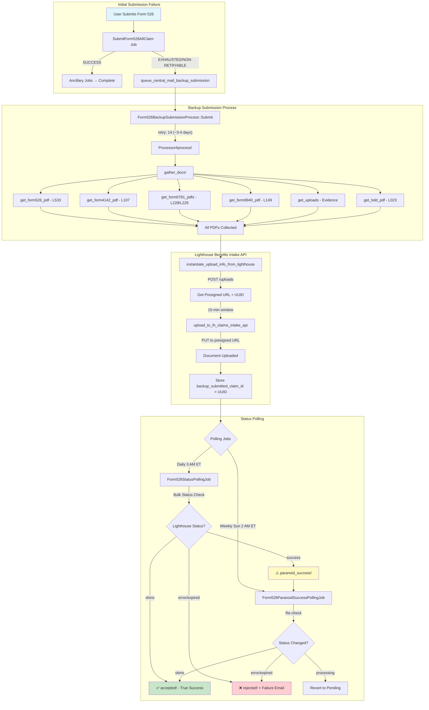
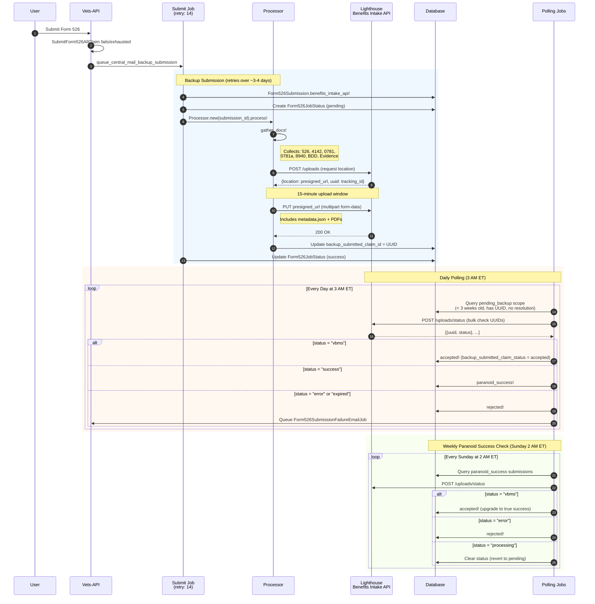
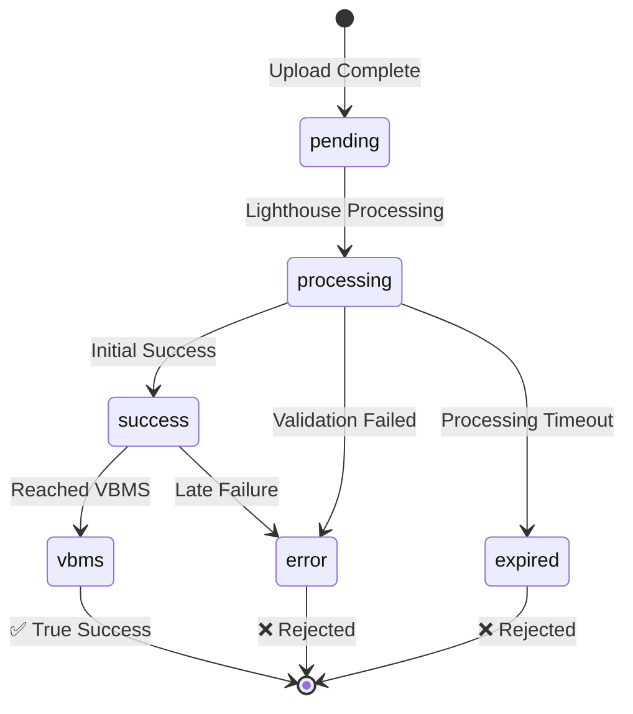

# Form526 Backup Submission Process Flow

This document describes the complete flow of the `Form526BackupSubmissionProcess` including upload, status polling, and durations.

## High-Level Flow Diagram



## Detailed Sequence Diagram



## Timing & Durations

### Submit Job Retry Schedule (Sidekiq retry: 14)

| Retry # | Approximate Delay | Cumulative Time |
|---------|-------------------|-----------------|
| 1 | ~15 seconds | 15 sec |
| 2 | ~16 seconds | 31 sec |
| 3 | ~31 seconds | 1 min |
| 4 | ~1 minute | 2 min |
| 5 | ~2 minutes | 4 min |
| 6 | ~4 minutes | 8 min |
| 7 | ~8 minutes | 16 min |
| 8 | ~16 minutes | 32 min |
| 9 | ~32 minutes | 1 hr |
| 10 | ~1 hour | 2 hr |
| 11 | ~2 hours | 4 hr |
| 12 | ~4 hours | 8 hr |
| 13 | ~8 hours | 16 hr |
| 14 | ~11 hours | ~27 hr |

**Total time before exhaustion: ~3-4 days**

### Polling Schedule

| Job | Schedule | Purpose |
|-----|----------|---------|
| `Form526StatusPollingJob` | Daily at 3 AM ET | Check status of pending backup submissions |
| `Form526ParanoidSuccessPollingJob` | Weekly Sunday 2 AM ET | Re-verify "success" status submissions |

### Key Timeouts & Windows

| Parameter | Value | Description |
|-----------|-------|-------------|
| Upload Window | **15 minutes** | Time to upload after getting presigned URL |
| MAX_PENDING_TIME | **3 weeks** | Submissions older than this aren't polled |
| STALE_SLA | **10 days** | Alert threshold for stale submissions |
| PDF Max Size | **100 MB** | Maximum PDF file size |
| API Timeout | **30 seconds** | Default HTTP timeout |

## Lighthouse Status Values



| Status | Meaning | DB Action |
|--------|---------|-----------|
| `pending` | Uploaded, not yet processed | Continue polling |
| `processing` | Being processed by Lighthouse | Continue polling |
| `success` | Processed but not confirmed in VBMS | `paranoid_success!` |
| `vbms` | Confirmed in VBMS | `accepted!` (true success) |
| `error` | Processing failed | `rejected!` + failure email |
| `expired` | Timed out | `rejected!` + failure email |

## Document Types Uploaded

| Document | Doc Type Code | Lighthouse Type |
|----------|--------------|-----------------|
| Form 21-526EZ | `L533` | Main disability claim |
| Form 21-4142 | `L107` | Authorization for records |
| Form 21-0781 | `L228` | PTSD statement |
| Form 21-0781a | `L229` | Secondary PTSD statement |
| Form 21-8940 | `L149` | Unemployability claim |
| BDD Instructions | `L023` | Benefits Delivery at Discharge |
| Evidence | Varies | Supporting documents |

## Metadata Payload

```json
{
  "veteranFirstName": "John",
  "veteranLastName": "Doe",
  "fileNumber": "123456789",
  "zipCode": "12345",
  "source": "va.gov backup submission",
  "docType": "21-526EZ",
  "businessLine": "CMP",
  "claimDate": "2024-01-15",
  "forceOfframp": "true"
}
```
