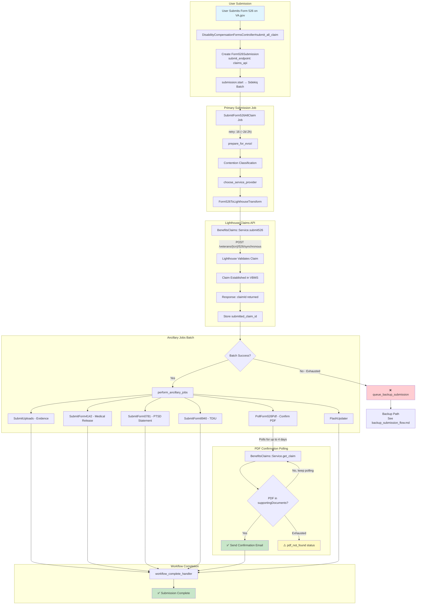
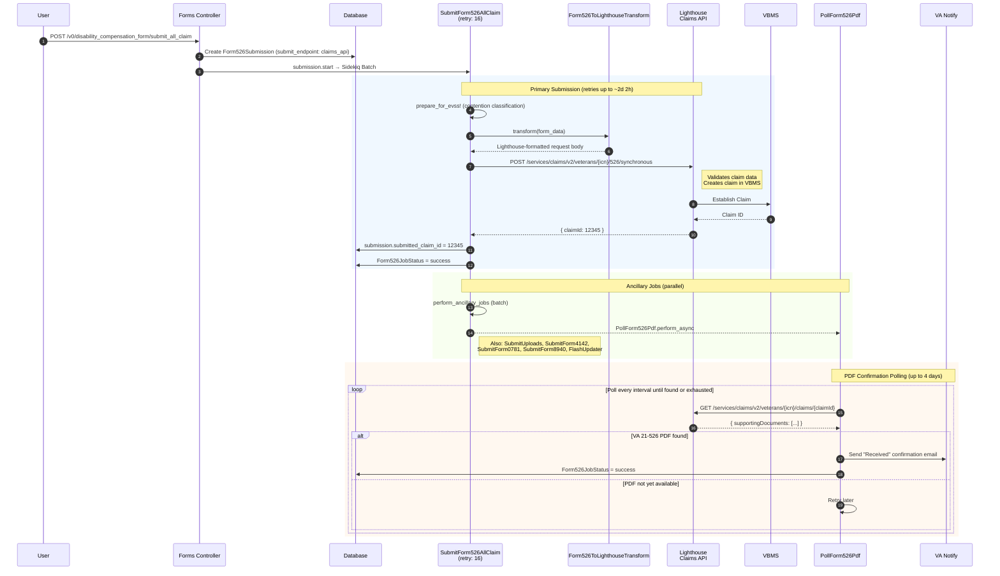
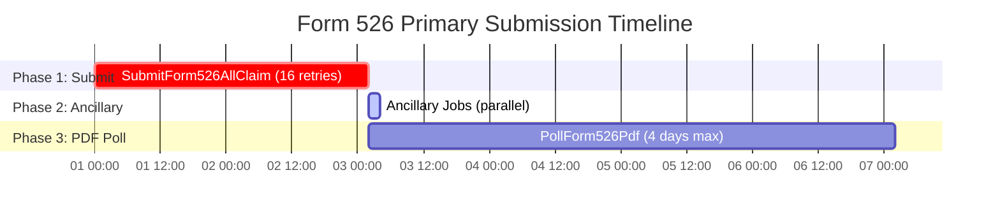

# Form 526 Primary Submission Flow (Lighthouse Claims API)

This document describes the primary (non-backup) submission flow for Form 526 disability claims, including the submission to Lighthouse Claims API, PDF generation, and tracking.

## High-Level Flow Diagram



## Detailed Sequence Diagram



## Timing & Durations

### End-to-End Timeline Summary



| Phase | Job | Max Retries | Max Duration | Notes |
|-------|-----|-------------|--------------|-------|
| **1. Primary Submission** | `SubmitForm526AllClaim` | 16 | ~2 days 2 hours | Submits to Lighthouse synchronous endpoint |
| **2. Ancillary Jobs** | Various | Varies | ~hours | Runs in parallel after successful submit |
| **3. PDF Confirmation** | `PollForm526Pdf` | N/A | **4 days** | Polls until PDF appears in VBMS |

---

### Phase 1: Primary Submit Job (`SubmitForm526AllClaim`)

**Sidekiq retry: 16** — retries for up to **~2 days 2 hours** (per code comment: "2d 1h 47m 12s")

Sidekiq exponential backoff formula: `(retry_count ** 4) + 15 + (rand(10) * (retry_count + 1))` seconds

| Retry # | Approximate Delay | Cumulative Time |
|---------|-------------------|-----------------|
| 1 | ~16 sec | 16 sec |
| 2 | ~31 sec | 47 sec |
| 3 | ~1 min | 2 min |
| 4 | ~4 min | 6 min |
| 5 | ~10 min | 16 min |
| 6 | ~22 min | 38 min |
| 7 | ~40 min | 1 hr 18 min |
| 8 | ~1 hr 8 min | 2 hr 26 min |
| 9 | ~1 hr 49 min | 4 hr 15 min |
| 10 | ~2 hr 47 min | 7 hr 2 min |
| 11 | ~4 hr 4 min | 11 hr 6 min |
| 12 | ~5 hr 44 min | 16 hr 50 min |
| 13 | ~7 hr 50 min | 24 hr 40 min |
| 14 | ~10 hr 27 min | 35 hr 7 min |
| 15 | ~13 hr 38 min | 48 hr 45 min |
| 16 | ~17 hr 27 min | **~66 hr (~2d 18h)** |

**On Success:** Stores `submitted_claim_id` from Lighthouse response → triggers ancillary jobs

**On Exhaustion:** Triggers `queue_central_mail_backup_submission` → [Backup Path](form526_backup_submission_flow.md)

---

### Phase 2: Ancillary Jobs

After successful primary submission, these jobs run **in parallel** as a Sidekiq batch:

| Job | Purpose | Retry Config |
|-----|---------|--------------|
| `SubmitUploads` | Upload supporting evidence documents | Standard |
| `SubmitForm4142` | Submit medical records release authorization | Standard |
| `SubmitForm0781` | Submit PTSD statement | Standard |
| `SubmitForm8940` | Submit TDIU (unemployability) form | Standard |
| `PollForm526Pdf` | Confirm 526 PDF exists in VBMS | 4 days |
| `FlashUpdater` | Update veteran flash indicators | Standard |

When all ancillary jobs complete → `workflow_complete_handler` is called.

---

### Phase 3: PDF Confirmation Polling (`PollForm526Pdf`)

**Max Duration:** `4.days` (hardcoded in job)

**What it does:**
1. Calls `BenefitsClaims::Service.get_claim(submitted_claim_id)`
2. Checks `supportingDocuments` array for document with `documentTypeLabel == 'VA 21-526EZ...'`
3. If found → sends confirmation email via VA Notify
4. If not found → retries until 4-day limit

**Why this exists:** The Lighthouse `/526/synchronous` endpoint establishes the claim, but the actual PDF may take time to appear in VBMS's supporting documents.

---

## Lighthouse Claims API Details

### Endpoint

```
POST /services/claims/v2/veterans/{icn}/526/synchronous
```

**Base URL:** Configured per environment (sandbox vs production)

### Authentication

- OAuth2 client credentials flow
- Token endpoint: `/oauth2/claims/system/v1/token`
- Requires `lighthouse_client_id` and RSA key

### Request Transformation

The `Form526ToLighthouseTransform` service converts VA.gov form data to Lighthouse schema:

```ruby
# lib/evss/disability_compensation_form/form526_to_lighthouse_transform.rb
def transform(evss_data)
  form526 = evss_data['form526']
  lh_request_body = choose_request_body(form526)
  lh_request_body.claimant_certification = true
  lh_request_body.claim_process_type = evss_claims_process_type(form526)
  transform_veteran_section(form526, lh_request_body)
  # ... additional transformations
  lh_request_body
end
```

### Response

```json
{
  "claimId": 12345,
  "claimDate": "2024-01-15",
  "endProductCode": "020",
  ...
}
```

The `claimId` is stored as `Form526Submission.submitted_claim_id`.

---

## Submission Endpoint Types

The `Form526Submission` model has an enum tracking which API path was used:

```ruby
# app/models/form526_submission.rb
enum :submit_endpoint, { 
  evss: 0,              # Legacy EVSS path (deprecated)
  claims_api: 1,        # Lighthouse Claims API (primary path)
  benefits_intake_api: 2 # Lighthouse Benefits Intake (backup path)
}
```

| Value | Path | When Used |
|-------|------|-----------|
| `evss` (0) | Legacy EVSS | Deprecated |
| `claims_api` (1) | Lighthouse `/526/synchronous` | **Primary VA.gov submissions** |
| `benefits_intake_api` (2) | Lighthouse Benefits Intake | Backup/paper submission path |

---

## Job Status Tracking

Each submission step creates/updates a `Form526JobStatus` record:

```ruby
# lib/sidekiq/form526_job_status_tracker/job_tracker.rb
STATUS = {
  try: 'try',
  success: 'success',
  retryable_error: 'retryable_error',
  non_retryable_error: 'non_retryable_error',
  exhausted: 'exhausted',
  pdf_not_found: 'pdf_not_found'
}
```

---

## Key Files Reference

| Component | File Path |
|-----------|-----------|
| **Main Job** | `app/sidekiq/evss/disability_compensation_form/submit_form526_all_claim.rb` |
| **Parent Job** | `app/sidekiq/evss/disability_compensation_form/submit_form526.rb` |
| **Controller** | `app/controllers/v0/disability_compensation_forms_controller.rb` |
| **Submission Model** | `app/models/form526_submission.rb` |
| **Lighthouse Service** | `lib/lighthouse/benefits_claims/service.rb` |
| **LH Config** | `lib/lighthouse/benefits_claims/configuration.rb` |
| **Transform** | `lib/evss/disability_compensation_form/form526_to_lighthouse_transform.rb` |
| **PDF Poller** | `app/sidekiq/lighthouse/poll_form526_pdf.rb` |
| **Job Tracker** | `lib/sidekiq/form526_job_status_tracker/job_tracker.rb` |
| **Job Status Model** | `app/models/form526_job_status.rb` |

---

## Comparison: Primary vs Backup Path

| Aspect | Primary Path | Backup Path |
|--------|--------------|-------------|
| **API** | Lighthouse Claims API | Lighthouse Benefits Intake API |
| **Endpoint** | `/526/synchronous` | `/uploads` (presigned URL) |
| **Submission Type** | Direct claim establishment | Paper/PDF submission |
| **PDF Generation** | Lighthouse generates after submit | vets-api generates before submit |
| **Tracking** | `submitted_claim_id` | `backup_submitted_claim_id` |
| **Status Polling** | `PollForm526Pdf` (4 days) | `Form526StatusPollingJob` (3 weeks) |
| **When Used** | Normal VA.gov submissions | After primary exhausts/fails |

---

## Note on Claims API Module

The `modules/claims_api` directory is a **separate API module** for external third-party consumers (e.g., VSOs, accredited representatives) submitting claims on behalf of veterans. 

The VA.gov Form 526 flow uses `lib/lighthouse/benefits_claims/service.rb` directly — **not** the claims_api module. The `claims_api` value in `submit_endpoint` refers to using the Lighthouse Claims API endpoint, not the Rails engine module.
