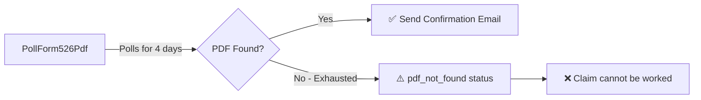
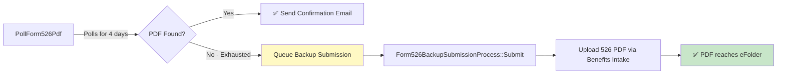
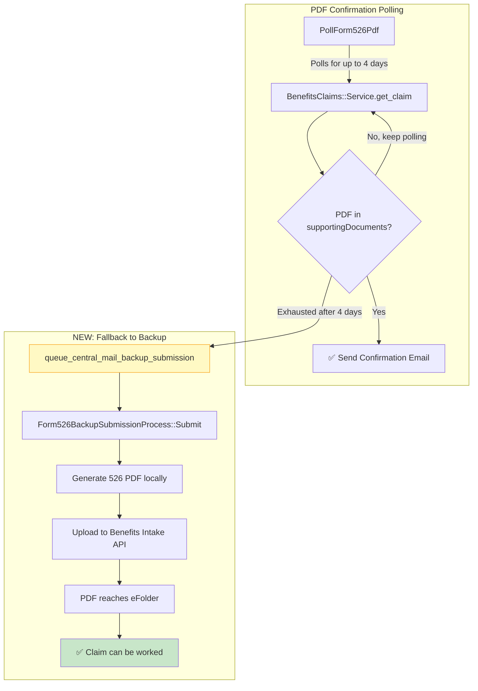
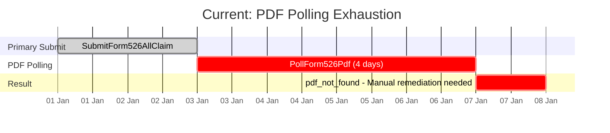
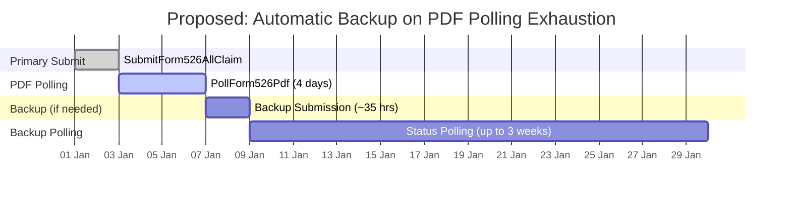

# Proposal: Queue Backup Submission on PDF Polling Failure

**Author:** Benefits Team  
**Date:** January 2026  
**Status:** Proposed

---

## Summary

When the `PollForm526Pdf` job exhausts after 4 days without finding the 526 PDF in VBMS, we propose queueing a backup submission instead of simply marking the job as `pdf_not_found`. This ensures the veteran's claim has a 526 PDF and can be worked by claims processors.

---

## Problem Statement

### Current Behavior



When `PollForm526Pdf` exhausts:
1. The job status is set to `pdf_not_found`
2. No further action is taken
3. **The claim exists in VBMS but has no 526 PDF**
4. Claims processors cannot work the claim without the 526 PDF
5. This becomes a silent failure requiring manual remediation

### Impact

- Veterans' claims sit unworked indefinitely
- Manual intervention required to remediate
- No automated recovery path
- Potential for claims to fall through the cracks

---

## Proposed Solution

### Queue Backup Submission on PDF Polling Exhaustion



When `PollForm526Pdf` exhausts after 4 days:
1. Instead of setting `pdf_not_found`, call `queue_central_mail_backup_submission`
2. Backup submission generates the 526 PDF locally
3. Uploads to Lighthouse Benefits Intake API
4. PDF reaches veteran's eFolder via paper processing path
5. Claim can now be worked

---

## Updated Flow Diagram



---

## Trade-offs

### ✅ Benefits

| Benefit | Description |
|---------|-------------|
| **Claim is workable** | The 526 PDF will exist in the eFolder, allowing claims processors to work the claim |
| **Automated recovery** | No manual intervention required |
| **Consistent with existing pattern** | We already queue backup submissions when `SubmitForm526AllClaim` exhausts |
| **Veteran experience** | Claim progresses without veteran needing to resubmit |

### ⚠️ Trade-offs

| Trade-off | Description | Mitigation |
|-----------|-------------|------------|
| **Duplicate documents** | All ancillary documents (evidence, 4142, 0781, 8940) will be uploaded again via backup path | Duplicates don't block claim processing; processors can ignore duplicates |
| **Additional processing time** | Backup path takes longer (up to 3 weeks for status resolution) | The alternative (no PDF) means claim is never worked |
| **Slight increase in storage** | Duplicate files in eFolder | Minimal impact; storage is not a constraint |
| **Duplicate claim entries?** | Need to verify backup doesn't create a second claim | Backup path uploads to existing claim's eFolder, doesn't create new claim |

### Why Duplicates Are Acceptable

> **A claim with duplicate documents and 1 PDF is infinitely better than a claim with no duplicates and 0 PDFs.**

- Claims processors can work a claim with duplicate documents
- Claims processors **cannot** work a claim without the 526 PDF
- The 526 PDF is the core document that defines the claim

---

## Implementation Details

### Code Change Location

**File:** `app/sidekiq/lighthouse/poll_form526_pdf.rb`

### Current Behavior (Pseudocode)

```ruby
def perform(submission_id)
  # ... polling logic ...
  
  if pdf_found?
    send_confirmation_email
    update_status(:success)
  end
  # If not found, job eventually exhausts with pdf_not_found status
end

sidekiq_retries_exhausted do |msg, _ex|
  # Currently just logs and sets pdf_not_found status
  form_job_status.update(status: :pdf_not_found)
end
```

### Proposed Behavior (Pseudocode)

```ruby
def perform(submission_id)
  # ... polling logic unchanged ...
  
  if pdf_found?
    send_confirmation_email
    update_status(:success)
  end
end

sidekiq_retries_exhausted do |msg, _ex|
  submission_id = msg['args'].first
  submission = Form526Submission.find(submission_id)
  
  Rails.logger.warn(
    'PollForm526Pdf exhausted - queueing backup submission',
    { submission_id: submission_id }
  )
  
  # Queue backup submission to ensure 526 PDF reaches eFolder
  submission.queue_central_mail_backup_submission(
    reason: 'pdf_polling_exhausted'
  )
  
  StatsD.increment('poll_form526_pdf.backup_queued')
end
```

### Metrics to Add

| Metric | Description |
|--------|-------------|
| `poll_form526_pdf.backup_queued` | Count of backup submissions queued due to PDF polling exhaustion |
| `poll_form526_pdf.backup_queued_success` | Backup submissions that succeeded after being queued from PDF polling |

---

## Updated Timeline

### Current: PDF Not Found = Dead End



### Proposed: PDF Not Found = Automatic Backup



**Additional worst-case time if backup needed:** ~3.5 weeks after PDF polling exhausts

---

## Questions to Resolve

1. **Does the backup submission upload to the existing claim or create a new one?**
   - Need to verify `backup_submitted_claim_id` vs `submitted_claim_id` behavior
   - Goal: Documents should go to the same eFolder

2. **Should we skip uploading ancillary documents in this scenario?**
   - Could add a flag to backup processor to only upload the 526 PDF
   - Trade-off: More code complexity vs. fewer duplicates
   - Lots of code, for limited benefit (only hit this error couple times a year)

3. **What if backup also fails?**
   - Falls into existing backup exhaustion handling
   - Sends `Form526SubmissionFailureEmailJob`

---

## Acceptance Criteria

- [ ] When `PollForm526Pdf` exhausts, `queue_central_mail_backup_submission` is called
- [ ] Backup submission successfully uploads 526 PDF to veteran's eFolder
- [ ] Metrics track how often this fallback path is triggered
- [ ] Existing backup submission flow handles these submissions correctly
- [ ] No new claim is created (documents go to existing claim's eFolder)

---

## Related Documents

- [Form 526 Primary Submission Flow](form526_primary_submission_flow.md)
- [Form 526 Backup Submission Flow](form526_backup_submission_flow.md)
