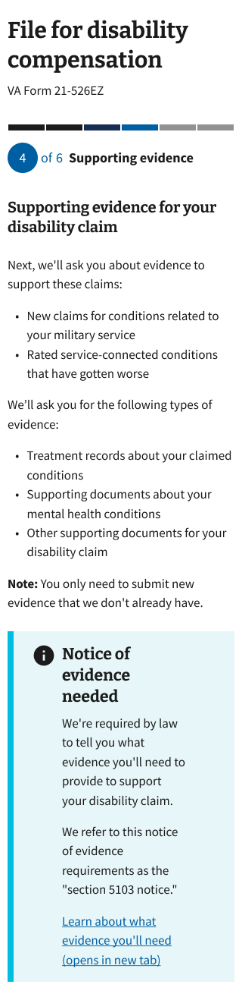
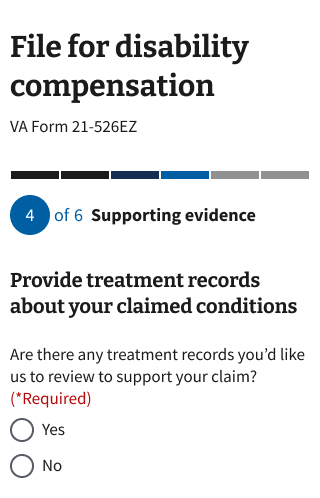
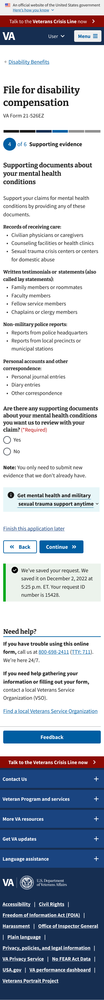
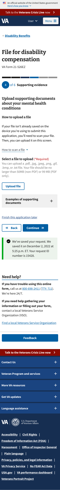
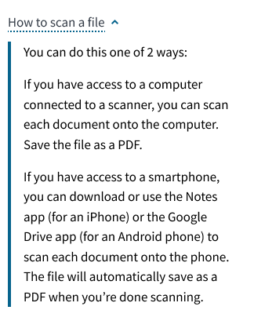
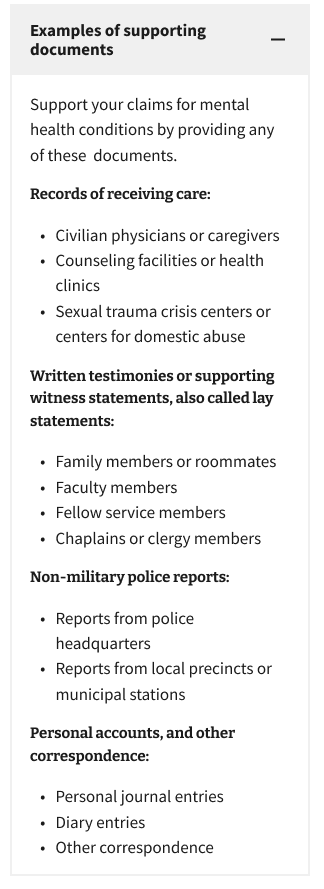
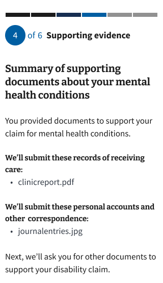
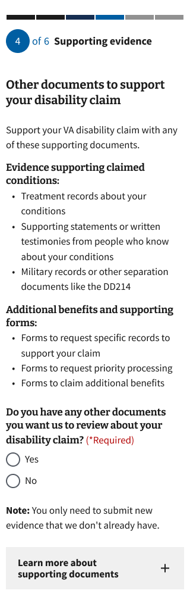
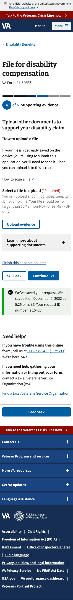
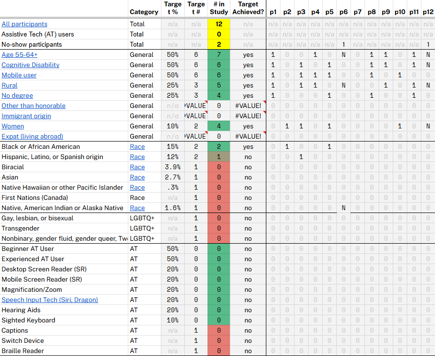

# **0781 Evidence Upload Research Report**

Office of the CTO \- Digital Experience (OCTO-DE), 526/0781, Pathways

Date: October 2025

Contacts: Momo Miyazaki, Brent Schneider, Amy Goldman

Jump to:

* [Background](#background)  
* [Research goals](#research-goals)  
* [Methodology](#methodology)  
* [Hypotheses and conclusions](#hypotheses-and-conclusions)  
* [Key findings](#key-findings)  
* [Details of findings](#details-of-findings)
* [Additional insights](#additional-insights)
* [What happened next](#what-happened-next) 
* [Appendix](#appendix)

## Background

At present, all Veterans upload their documents as supporting evidence of their claim in one step at the very end of VA form 21-526 EZ, the application Veterans use to apply for disability compensation benefits. Veterans who opt into form 0781, which supports claims for mental health conditions, do not currently have a specific section that walks them through the process of uploading documents to support those conditions. Although opting into the 0781 form is optional, once the Veteran does so, they need to provide evidence to support their stated mental health conditions. If the Veteran doesn’t provide the correct evidence, it can delay adjudication or result in their claim being denied. Additionally, if the Veteran doesn’t provide enough of the right kind of evidence, the VBA will not be equipped to follow up on these items, leading to their claim being denied. 

## Research goals

* Goal 1: Gather feedback on the instructional content on each page.  
* Goal 2: Evaluate the effectiveness of the formatting and visual hierarchy of the information presented.  
* Goal 3: Evaluate whether users are able to navigate through the document upload sections.  
* Goal 4: Understand how users think through uploading evidence in support of their condition(s).

## Methodology

This study was conducted with semi-structured user interviews and observations. It was moderated remotely on Zoom to support screen sharing.

Although the prototype was high-fidelity and fairly refined, we chose a discovery-leaning methodology so that we can gather stories that users create about the content that they are seeing. We chose not to do an unmoderated usability study because the process of uploading condition-appropriate documentation is highly specific to the individual; setting up a study like this would take an immense amount of preparation that did not feel appropriate. Instead, we asked participants to pretend that they had two conditions, anxiety and arthritis, as they went through the prototype. 

As part of this semi-structured approach, the researcher asked participants to complete certain small tasks. These tasks were followed with questions to understand the why behind the participant's choices and understanding.

## Hypotheses and conclusions 

* Most participants will be able to understand that there are three steps to the supporting evidence upload step.  
  * **Definitely false:** Most participants were confused by the structure (finding \#1).  
* Most participants will find it helpful that there is specific guidance for uploading documents to support mental health conditions  
  * **Likely true:** Participants found specific guidance helpful for uploading documents, but not specifically for mental health conditions (finding \#6, \#3, \#1)  
* Most participants will find the summary screens helpful for reflecting on and confirming their upload choices  
  * **Definitely true:** The summary screens helped participants affirm their uploads (finding \#10).  
* Most participants will understand the document descriptions, and will find the external links to be supportive in their understanding  
  * **Likely true:** Participants seemed to understand and recognize certain document descriptions, but wanted more details about the document types to help them more accurately choose the right document (finding \#3, \#6). 

## Key findings

* [Finding #1:](#finding-1-most-participants-struggled-to-understand-the-differences-between-the-three-sections-of-the-supporting-evidence-upload-experience) Most participants struggled to understand the differences between the three sections of the supporting evidence upload experience.
* [Finding #2:](#finding-2-7-out-of-8-participants-could-navigate-the-document-upload-process) 7 out of 8 participants could navigate the document upload process.
* [Finding #3:](#finding-3-8-out-of-10-participants-wanted-more-information-up-front-about-the-evidence-they-could-submit-to-support-their-claim) 8 out of 10 participants wanted more information up front about the evidence they could submit to support their claim.
* [Finding #4:](#finding-4-2-out-of-10-participants-were-drawn-to-the-notice-of-evidence-needed-alert-but-only-skimmed-the-instructional-content-above) 2 out of 10 participants were drawn to the “Notice of evidence needed” alert but only skimmed the instructional content above.   
* [Finding #5:](#finding-5-6-out-of-10-participants-didnt-understand-they-would-be-asked-for-information-about-the-medical-centers-they-visited-they-had-inaccurate-expectations-for-what-would-happen-next) 6 out of 10 participants didn’t understand they would be asked for information about the medical centers they visited. They had inaccurate expectations for what would happen next.  
* [Finding #6:](#finding-6-6-out-of-10-participants-found-the-detailed-list-of-document-types-helpful) 6 out of 10 participants found the detailed list of document types helpful.  
* [Finding #7:](#finding-7-5-out-of-8-participants-didnt-find-the-how-to-scan-a-file-instructions-helpful) 5 out of 8 participants didn’t find the ‘How to scan a file’ instructions helpful.  
* [Finding #8:](#finding-8-4-out-of-8-participants-appreciated-that-the-examples-of-supporting-documents-accordion-repeated-content-from-the-previous-page-others-felt-the-accordion-should-provide-more-information-about-supporting-documents) 4 out of 8 participants appreciated that the “Examples of supporting documents” accordion repeated content from the previous page. Others felt the accordion should provide more information about supporting documents.  
* [Finding #9:](#finding-9-4-out-of-5-participants-successfully-completed-or-predicted-how-to-delete-a-document) 4 out of 5 participants successfully completed or predicted how to delete a document.  
* [Finding #10:](#finding-10-6-out-of-8-participants-expected-a-summary-page-to-confirm-which-documents-they-uploaded) 6 out of 8 participants expected a summary page to confirm which documents they uploaded.    
* [Finding #11:](#finding-11-3-out-of-5-participants-found-it-confusing-that-the-two-upload-pages-looked-identical-and-didnt-know-what-to-upload) 3 out of 5 participants found it confusing that the two upload pages looked identical and therefore they didn’t know what to upload. 

## 

## Details of findings

Note to reader:

* Not all participants made it through the entire prototype. In the final research report, we will be counting the number of people who have certain opinions, but they will be caveated with a “out of X number of people who saw this screen.”

### Overarching architecture

#### **Finding #1: Most participants struggled to understand the differences between the three sections of the supporting evidence upload experience.** 

In the prototype, the participants were taken through three sections within the Supporting Evidence step:

1. Treatment records: provide details about the medical facilities they were treated at so that the VA can gather the treatment records  
2. Documents for mental health conditions: upload documents related to their mental health condition(s)  
3. Documents for other conditions, and other documents: upload documents related to their other conditions, as well as any other additional benefits and supporting forms.

The first 7 participants struggled at various parts of the prototype with understanding what the different sections were asking them to do and what to expect next.

Decision page for treatment records: 5 out of 10 participants thought that providing treatment records and uploading supportive documentation was the same concept, and were confused about why they were being asked to provide them separately. 

* *“Why are treatment records separate from documentation?” – P8*

* *(After having the participant select “no” to the previous page, which asked “Are there any treatment records you’d like us to review to support your claim?”)  “It was a little confusing, because before it says “do you have any supporting documentation? You hit no, and now it’s asking you for supporting documentation and supporting evidence? Is this something different?” – P7*

Decision page for other documents: 8 out of 8 participants who saw the decision page for other documents did not understand that it was asking for documents for other conditions as well as other documents to support the claim. Once they did understand that the page was asking them for two specific things, they were still confused by why they were being asked to submit “additional benefits and supporting forms” at that stage.

* *“And now it's asking me again, do you have other documents? That's crazy. So are these documents I don't categorize into the other two?” –P3*

* *“So you have a clinical records request from the VA…then you have a second supporting documents request, and now you have another documents request. Why is… so it's like a main, an other, and an other other?” –P8*  
* *“Not sure why we’re talking about benefit forms there if it’s about claims and supporting docs. Might want to talk about benefits after you get the claim, not during the submission process. It could be confusing because you’re not done yet.” – P5*

One participant questioned why she had to upload mental health documents separately from physical condition documents. They wanted to know where they would upload documents that don’t neatly fall into those two categories.

* *“I don't know which \[documents\] would go with which conditions, specifically a mental health condition, because a physical condition may be causing a mental health condition.” – P5*


For the last 3 research sessions, we added labels that indicated to each decision page that said “condition: anxiety” for section two and “condition: arthritis” for section three (we did not call out the other documents) (see image to the left). We wanted to see if making it more obvious would make the instructions clearer. For those 3 participants, the distinction between the sections was clearer than it had been for the previous 7 participants, but they still struggled to understand why the form was asking for additional benefits and  supporting forms.<br>
* *“Additional benefits…I don’t know what that means.” – P10*  </ul></li>
* *“I thought, we're on to the next one, and we're just doing the same process over again, and I don't feel like that's what's happening. I feel like the bullet points changed…” – P10*</ul></li>

<Br><br><br><Br>
**Recommendation:**  

Since participants struggled with understanding the two supporting evidence upload sections, we recommend maintaining the current process of having one page for uploading supporting documents. We recommend making changes that support content comprehension. 

1. Make changes to instructional content  
   1. We recommend reviewing all of the content on the existing upload pages and change instructional content based on the findings and recommendations in this document. We believe that having instructions that clearly describe the expectations and actions to be taken will help orient Veterans in the process and eliminate ambiguity around what is expected. Adding more details around accepted documents will help Veterans select more relevant evidence and feel more confident in what they choose to submit.   
2. Add accordions and additional information design components to support the hierarchy of instructional content  
   1. Since there will be more instructional and supporting content on the upload pages, we recommend strategically placing accordions and additional information design components. These will help Veteran comprehension by decreasing information overload.   
3. Update the upload component   
   1. The current upload component is V1, and was identified in the Midpoint Review as a launch blocker. We recommend updating it to the V3 component, however, that component will need to be updated to include the additional field dropdown so that Veterans can select the document type for their uploaded document. 

#### **Finding #2: 7 out of 8 participants could navigate the document upload process.**

Throughout the sessions, most of the participants had accurate expectations around where the ‘back’ and ‘continue’ buttons would lead them. As reflected in the first finding, they may not have been able to predict which section they would go to, but they knew that they would be taken to a page that asks them to upload, shows them a summary, etc. They also were able to accurately navigate or guess how to delete a file, from the summary page. 

**Recommendation**: We recommend keeping the progression of screens for uploading documents.


### Page 1: Introduction page to the supporting evidence section
 
 <table><tr><td></td></tr></table>
 

#### **Finding #3: 8 out of 10 participants wanted more information up front about the evidence they could submit to support their claim.**

Participants wanted more information as they mentally prepared to submit documents for the section. Although they discovered more detailed information in the next screen, their requests for this information on the intro page suggests that the overview that we are providing is not enough. 8 out of 10 requested descriptions of the evidence, visuals of the evidence types, a list of file types, and how to get access to the evidence (similar to finding \#6).

* *“I’m looking for more information than those three bullet points.” – P1*  
* *“It’s weird that there isn’t information about items that would support this in terms of what to upload.” – P5*   
* *“Link out to where you can get treatment records and supporting documents instead of just listing the examples.” – P9*

**Recommendation:** We recommend providing more detailed information about acceptable supporting documents as a part of the introduction to the section (this may link out to another page). Since people will need to leave the application process in order to gather evidence for their claim, it would help Veterans if we provided them with the complete list of what is needed for the entire supporting evidence section. This avoids the scenario where people leave to get a piece of evidence, return, then leave again as the requirements are given to them step-by-step. 


#### **Finding #4: 2 out of 10 participants were drawn to the “Notice of evidence needed” alert but only skimmed the instructional content above.** 

This is the first page of the prototype where participants are asked to take their time and share their thoughts out loud. 2 out of 10 participants quickly read through the instructional content and then started giving feedback on the “Notice” content below it. The researcher guided the participants back to the top of the page to give feedback about the instructional content.

**Recommendation:** The “Notice of evidence” information itself is a legally required part of the process; Veterans need to be informed of the evidence they’ll need and told that they are being informed. Although we observed this skipping behavior in only a few participants, it’s important to consider that the other participants may not have skipped the instructional content because they were in a semi-moderated research session in which they were asked to give feedback on every piece of content. Knowing the natural inclination to skim content, we want to make sure to call attention to this behavioral pattern insight and not overlook it. Therefore, our recommendation is to reduce the visual emphasis on the notice as it takes away from the important information above it. 


### Page 2: Decision page for treatment records
 
<table><tr><td></td></tr></table>


#### **Finding #5: 6 out of 10 participants didn’t understand they would be asked for information about the medical centers they visited. They had inaccurate expectations for what would happen next.**

The intent of this section is to collect information about medical centers in which the Veteran received treatment so the VA can request treatment records on their behalf (or for the Veteran to be able to upload treatment records from a private medical center, if they prefer that route). 6 out of 10 participants believed that selecting “yes” would lead to a workflow that would involve them uploading or submitting treatment records or adding information about behavior changes. 

* *“If \[you select\] yes, you’re submitting your claim records, if \[you select\] no, you’re not submitting anything.” – P3*  
* *“Nowhere here links me to where I can go get that information.” – P9*  
* *“It asks for treatment records but not what ones to provide.” – P11*

**Recommendation:** The current content does not communicate expectations about what exactly will be happening on the following screens. We recommend that the content be reframed to specify that the Veteran will be providing information about the medical centers in which they were treated, so that the VA can get access to all of their treatment records. This finding also supports implementing the recommendation from finding #2; we believe that the list and loop will further support Veterans in understanding what to expect next.   


### Page 3: Decision page for mental health documents

<table><tr><td></td></tr></table>

#### **Finding #6: 6 out of 10 participants found the detailed list of document types helpful.**

Most participants appreciated the list of examples. 4 out of 10 participants commented that the list made them consider submitting document types that they hadn’t thought to submit.

* *“List is very useful, it gives you examples for each section.” – P4*  
* *“I could have provided some letters, but I didn’t know I could send this non-military related.” – P2*  
* *“It’s giving me different ideas…on what would be considered supporting documentation. I think it’s good because it could be anything.” – P7*

Still, the participants wanted even more specific examples and guidelines around what the VA would accept as evidence.  

* *“I have no idea what the non-military police records have to do with your health.” – P1*  
* *“I mean, you could probably combine that bullet \[about police reports\]…reports from police headquarters, local precincts, or municipal stations, that's still a police report, whether it's from the headquarters, whether it's from the local, it's a police report.” – P5*

**Recommendation**: We recommend continuing to provide this information, and include as much detail as possible about each document type. Finding \#3 also includes suggested details from participants. It will be helpful to do research with VSOs to understand how they describe requirements to Veterans. 

### Page 4: Upload page for mental health documents


  <table>
   <tr valign="top">
     <td></td>
     <td></td>
     <td></td>
   </tr>
  </table>


#### **Finding #7: 5 out of 8 participants didn’t find the “How to scan a file” instructions helpful.**

Most participants found the instructions to be too prescriptive about what application to use. They suggested alternative ways that they would capture a document, including using their camera app.

* *“I’m not aware of the method you’re talking about here. And honestly, it doesn’t make sense to me.” – P2*  
* *“Almost nobody is going to scan. This is an older process.” – P8*  
* *“It seems like you’re trying to help me, but it doesn’t because you told me to use the notes app, but that’s not something I use or is helpful. If I’m trying to get the evidence from my phone or computer, it’s not helpful, like if it’s in an electronic file on another website.” – P10*  
* *“No one is going to try to upload a \[literal\] piece of paper.” – P8*

They wanted some more instructional content to help them support their data input. 

* *“How many uploads can I have? Is it unlimited?” – P2*  
* *“Maybe having some sort of way you'd like me to name it, so that I know that \[it’s good\].” – P10*

**Recommendation:** We recommend changing the content to be less specific about the applications that someone could use, and rather focus on the general process (take a photo, take a screenshot, or scan the document). Additionally, we recommend including guidance around the maximum number of uploaded files and revisiting the “Select a file to upload” and “Upload file” button copy; as currently written, it implies that you can only upload one file overall. It will be more helpful to suggest that multiple files can be uploaded in general, even if the upload component allows for only one file at a time to be uploaded. 

#### **Finding #8: 4 out of 8 participants appreciated that the “Examples of supporting documents” accordion repeated content from the previous page. Others felt the accordion should provide more information about supporting documents.** 

* *“\[Helpful to have this content repeated\], keeps you from having to jump back and forth.” – P4*  
* *“Ok so it’s doubling down \[by showing the same content as the previous page\]. I wasn’t actually expecting that. I thought it might give me…like, a file, and a picture. I was envisioning a document.” – P2*

Additionally, 2 out of 8 participants wanted the information to be presented before the ’Upload file’ call to action so they could use the information as a reference before uploading.

* *“I don’t look at samples after I do the upload.” – P1*

**Recommendation:** Although some participants were disappointed in duplicative content, we recommend keeping the content to support those who will use it as a reference when selecting the document type of their uploaded file. We also recommend placing the accordion above the ‘Upload file’ call to action, in case people need it as a reference as they upload files. 

#### **Finding #9: 4 out of 5 participants successfully completed or predicted how to delete a document.**

(Reminder that not all participants made it through the entire prototype, so the numbers are adjusted to reflect that).

* *“I’d click back, go to specific docs click on that doc, and you should be able to click delete, suggests stacking so she could delete all or just delete one.” – P5*  
* *“If you wanted to delete, hit back button and delete \[does this without difficulty\].” – P4*

```Page 5: Summary page for mental health documents```

<table><tr><td></td></tr></table>

#### **Finding #10: 6 out of 8 participants expected a summary page to confirm which documents they uploaded.**  

* *“This is pretty much what I expected.” – P9*  
* *“Alright, so summary of documents, you're telling me…what you have uploaded, which is good.*” – P7

One participant gave feedback about the lack of distinct hierarchy of information on the page.  

* *“I wish this could look a little different. It blended so much together that it took me a minute to figure out what I was looking at.” –P2* 

**Recommendation:** We recommend keeping the summary pages as a way for people to confirm their uploads. 

### Page 6: Decision page for other conditions and other documents
<table><tr><td></td></tr></table>

Findings about this page can be found in the “Overarching Architecture” section at the beginning of the list of findings. 

```Page 7: Upload page for other documents```

<table><tr><td></td></tr></table>

#### **Finding #11: 3 out of 5 participants found it confusing that the two upload pages looked identical and didn’t know what to upload.** 

The participants didn’t realize that the second upload page was specifically for other conditions and documents. The visual repetition made the page feel redundant, even if it was asking for different documents.

* *“It would be for anxiety, we're still under anxiety” – P8*  
* *“You don’t want to see the upload again, didn't it work? Should I re-upload everything I uploaded again?” –P5*  
* *After the researcher explained the difference between the two upload pages: “It looks the same, but if it isn't,… maybe break down into one screen that says upload supporting documentation. And then it should say on the bottom in bold things, uh, upload other documents to support your disability if you have. And you could upload right there, so everything's on there. It feels like you're doing multiple steps for no reason.” – P7*  
* *“I was hoping that the point of this was to make things easier. And it kept asking me the same thing over and over again, which was not… helpful, I guess. I was hoping that it would be better in the streamlined process.” –P10*

### Page 8: Summary page for other conditions

2 out of 10 participants viewed this page. It tested favorably, with similar opinions found in finding #10: Most participants expected and appreciated a summary page as a way to confirm their uploaded documents.   

---

## **Additional insights**

Additionally, one participant was confused by “Note: You only need to submit new evidence that we already don’t have.” They had never applied for benefits before and were unsure about what “new evidence” meant, since the phrase implies that the VA might already have access to some data. We recommend clarifying the definition of “new evidence.”

* *“Is that because you only need to submit new evidence because I've already may have submitted things? Is that only if I'm submitting new things, or how else would you already have it?” – P10*

Some participants noticed that the prototypes used both ‘document’ and ‘evidence’ to refer to files to be uploaded. They recommended we use the same language across the pages for simplicity. Internally, we should consider treating documents as files (e.g., PDFs or Word docs) and evidence as specific pieces of information, often contained within documents, that VBA uses to decide a claim.

* *“So, you gotta switch these to ‘evidence’ \[or\] ‘document.’ I'd say stick with one \[word\], whatever you're gonna call it, call it that all the way through…I would say documents to support your claim, because using evidence can get this weird connotation…I deal a lot with special operations, so when you say evidence …then there are people who worked in different classification settings that get worried, because they're like, no, they're asking me for evidence. I know that I was at this location, at this place, but I don't want anything to be associated as evidence.” – P5*  
* *“I don't think a video is a document.” – P5*  
* *“Before, it was, like, upload documents, but now this is saying upload evidence, but it should just \[say\]  upload documents slash evidence, something like that, because it's all evidence.”  – P7*

As participants went through the list of accepted documents, they suggested adding or specifically calling out these documents and file types:

* Document types  
  * Treatment centers for drugs and alcohol   
  * Listing specific form names “because people call them different things, but exact form numbers are harder to mix up” – P5  
  * Other  
* File types  
  * Pictures   
  * Videos

### **What happened next**

## Appendix

### **Research documents**

* [Product outline/epic](https://github.com/department-of-veterans-affairs/va.gov-team/issues/114046)  
* [Research plan](https://github.com/department-of-veterans-affairs/va.gov-team/blob/master/products/disability/526ez/research/2025-10-0781-EvidenceUpload/research-plan.md)  
* [Conversation guide](https://github.com/department-of-veterans-affairs/va.gov-team/blob/master/products/disability/526ez/research/2025-10-0781-EvidenceUpload/conversation-guide.md)  
* [Topline summary](https://github.com/department-of-veterans-affairs/va.gov-team/blob/master/products/disability/526ez/research/2025-10-0781-EvidenceUpload/topline_summary.md)

### **Tools used for synthesis**

* [Synthesis Mural](https://app.mural.co/t/departmentofveteransaffairs9999/m/departmentofveteransaffairs9999/1761003566230/dc3e972e8041453d5bdfe67f4af20ab396454590)  
  * Notes were taken in this Mural during the research sessions

### **Pages and applications used**

* [Figma](https://www.figma.com/design/9idAmDRkCyDwJ7hTemJgAV/0781---Evidence-Upload?node-id=803-39449&p=f&t=rVD38SF2BE1MWCxC-0) (“Prototype for research” tab)  
  * [Path 1 prototype:](https://www.figma.com/proto/9idAmDRkCyDwJ7hTemJgAV/0781---Evidence-Upload?node-id=1178-8038&t=K98xjgC6J6mVcyg4-0&scaling=min-zoom&content-scaling=fixed&page-id=803%3A39449&starting-point-node-id=1178%3A8038&show-proto-sidebar=1) For those who have never applied before (includes screens to walk participants through the earlier pages of the application for orienting their understanding of where they are in the form)  
  * [Path 2 prototype:](https://www.figma.com/proto/9idAmDRkCyDwJ7hTemJgAV/0781---Evidence-Upload?node-id=1178-8048&t=K98xjgC6J6mVcyg4-0&scaling=min-zoom&content-scaling=fixed&page-id=803%3A39449&starting-point-node-id=1178%3A8048&show-proto-sidebar=1) For those who have applied before (skips screens of the earlier pages of the application)

### **Research participants**

#### **Recruitment criteria**

Perigean recruited 12 people. There were 2 cancellations, resulting in 10 completed sessions. Our target was 7 completed sessions. 

#### **Primary recruitment criteria**

* Return claimants who have filed a 526 and an 0781, with mental health conditions  
  * Their most recent application should be within the past 5 years  
  * Applications can be paper or digital  
  * We are looking for at least 3 participants in this category  
* Claimants who have never filed for a disability benefit and have a mental health condition(s)  
  * This group can also include those who have started the process but never completed filing  
  * We are looking for at least 4 participants in this category  
* At least 3 participants whose highest level of education completed is high school  
* At least 3 participants who identify as having a cognitive disability  
* At least 3 participants who are 55+ in age  
* All participants should identify as having a mental health condition such as PTSD, Military sexual trauma, or other mental health conditions related to a traumatic event, such as depression or anxiety

#### **Demographic**

Audience segment:

* Veterans: 10  
* Caregivers: 0  
* Family members of a Veteran: 0

Gender:

* Male: 6  
* Female: 4

LGBTQ+:

* Transgender: Unknown  
* Nonbinary, gender fluid, gender queer, Two-Spirit (Indigenous only), or another gender beyond man or woman: Unknown  
* Gay, lesbian, or bisexual: Unknown

Devices used during study:

* Desktop: 2  
* Tablet: 1  
* Smart phone: 7  
* Assistive Technology: Unknown

Age:

* 25-34: 3  
* 35-44: 2  
* 45-54: x  
* 55-64: 6  
* 65+: 1

Education:

* High school degree or equivalent: 5  
* Some college (no degree): x  
* Associate's degree, trade certificate or vocational training: 1  
* Bachelor's degree: 5  
* Master's degree: 1  
* Doctorate degree: x  
* Unknown: x

Geographic location:

* Urban: 5  
* Rural: 5  
* Unknown: x

Race:

* White: 7  
* Black: 2  
* Hispanic: x  
* Biracial: 2  
* Asian: x  
* Native: x  
* Prefer not to answer: 1

Disability and Assistive Technology (AT):

* Cognitive: 6  
* AT beginner: Unknown  
* AT advanced user: Unknown  
* Desktop screen reader: Unknown  
* Mobile screen reader:Unknown  
* Magnification/Zoom: Unknown  
* [Speech Input Technology](https://www.w3.org/WAI/perspective-videos/voice/) like Siri/Dragon Naturally Speaking: Unknown  
* Hearing aids: Unknown  
* Sighted keyboard: Unknown  
* Captions: Unknown

#### **Underserved groups we haven’t talked to**

* Native Hawaiian or other Pacific Islander  
* Asian  
* Native, American Indian or Alaska Native  
* Transgender  
* Nonbinary, gender fluid, gender queer, Two-Spirit (Indigenous only), or another gender beyond man or woman  
* Gay, lesbian, or bisexual: Unknown  
* Assistive technology users

<table><tr><td></td></tr></table>

#### **A more accessible version of the table in the above image**

| Characteristic | Category | Target % | Target # | # in Study | Target Achieved? | p1 | p2 | p3 | p4 | p5 | p6 | p7 | p8 | p9 | p10 | p11 | p12 |
|---|---:|---:|---:|---:|---:|---:|---:|---:|---:|---:|---:|---:|---:|---:|---:|---:|---:|
| All participants | Total | n/a | n/a | 12 | n/a | n/a | n/a | n/a | n/a | n/a | n/a | n/a | n/a | n/a | n/a | n/a | n/a |
| Assistive Tech (AT) users | Total | n/a | n/a | 0 | n/a | n/a | n/a | n/a | n/a | n/a | n/a | n/a | n/a | n/a | n/a | n/a | n/a |
| No-show participants | Total | n/a | n/a | 2 | n/a | n/a | n/a | n/a | n/a | n/a | 1 | n/a | n/a | n/a | n/a | n/a | 1 |
| Age 55-64+ | General | 50% | 6 | 7 | yes | 1 | 0 | 0 | 1 | 0 | N | 0 | 1 | 1 | 0 | 1 | N |
| Cognitive Disability | General | 50% | 6 | 6 | yes | 1 | 0 | 1 | 0 | 1 | 0 | 0 | 1 | 1 | 0 | 1 | N |
| Mobile user | General | 50% | 6 | 6 | yes | 1 | 0 | 1 | 1 | 1 | 0 | 0 | 1 | 0 | 1 | 0 | 0 |
| Rural | General | 25% | 3 | 5 | yes | 1 | 0 | 1 | 1 | 0 | N | 0 | 0 | 1 | 0 | 1 | N |
| No degree | General | 25% | 3 | 4 | yes | 1 | 0 | 0 | 0 | 1 | 0 | 0 | 1 | 0 | 0 | 1 | 0 |
| Other than honorable | General | n/a | #VALUE! | 0 | #VALUE! | 0 | 0 | 0 | 0 | 0 | 0 | 0 | 0 | 0 | 0 | 0 | 0 |
| Immigrant origin | General | n/a | #VALUE! | 0 | #VALUE! | 0 | 0 | 0 | 0 | 0 | 0 | 0 | 0 | 0 | 0 | 0 | 0 |
| Women | General | 10% | 2 | 4 | yes | 0 | 1 | 1 | 0 | 1 | 0 | 0 | 0 | 0 | 1 | 0 | N |
| Expat (living abroad) | General | n/a | #VALUE! | 0 | #VALUE! | 0 | 0 | 0 | 0 | 0 | 0 | 0 | 0 | 0 | 0 | 0 | 0 |
| Black or African American | Race | 15% | 2 | 2 | yes | 0 | 1 | 0 | 0 | 1 | 0 | 0 | 0 | 0 | 0 | 0 | 0 |
| Hispanic, Latino, or Spanish origin | Race | 12% | 2 | 1 | no | 0 | 0 | 1 | 0 | 0 | 0 | 0 | 0 | 0 | 0 | 0 | 0 |
| Biracial | Race | 3.9% | 1 | 0 | no | 0 | 0 | 0 | 0 | 0 | 0 | 0 | 0 | 0 | 0 | 0 | 0 |
| Asian | Race | 2.7% | 1 | 0 | no | 0 | 0 | 0 | 0 | 0 | 0 | 0 | 0 | 0 | 0 | 0 | 0 |
| Native Hawaiian or other Pacific Islander | Race | .3% | 1 | 0 | no | 0 | 0 | 0 | 0 | 0 | 0 | 0 | 0 | 0 | 0 | 0 | 0 |
| First Nations (Canada) | Race | n/a | 1 | 0 | no | 0 | 0 | 0 | 0 | 0 | 0 | 0 | 0 | 0 | 0 | 0 | 0 |
| Native, American Indian or Alaska Native | Race | 1.6% | 1 | 0 | no | 0 | 0 | 0 | 0 | 0 | N | 0 | 0 | 0 | 0 | 0 | 0 |
| Gay, lesbian, or bisexual | LGBTQ+ | n/a | 1 | 0 | no | 0 | 0 | 0 | 0 | 0 | 0 | 0 | 0 | 0 | 0 | 0 | 0 |
| Transgender | LGBTQ+ | n/a | 1 | 0 | no | 0 | 0 | 0 | 0 | 0 | 0 | 0 | 0 | 0 | 0 | 0 | 0 |
| Nonbinary, gender fluid, gender queer, Two-Spirit (Indigenous only), or another gender beyond man or woman | LGBTQ+ | n/a | 1 | 0 | no | 0 | 0 | 0 | 0 | 0 | 0 | 0 | 0 | 0 | 0 | 0 | 0 |
| Beginner AT User | AT | 50% | 0 | 0 | no | 0 | 0 | 0 | 0 | 0 | 0 | 0 | 0 | 0 | 0 | 0 | 0 |
| Experienced AT User | AT | 50% | 0 | 0 | no | 0 | 0 | 0 | 0 | 0 | 0 | 0


