# 2025-06 New/Increase at Condition Level: Research Findings

### Office of the CTO - Digital Experience (OCTO-DE), Disability Claim Application, Conditions Team

**Date:** 8/8/2025

**Contacts:** [Kim Ladin](mailto:kimladin@navapbc.com), [Brian Pianalto](mailto:brian.pianalto@aquia.io)

**Jump to:**
- [*Background*](#background)
- [*Research goals*](#research-goals)
- [*Methodology*](#methodology)
- [*Hypotheses and Conclusions*](#hypotheses-and-conclusions)
- [*Key Findings*](#key-findings)
- [*Detailed Findings*](#detailed-findings)
- [*Recommendations*](#recommendations)
- [*Who we talked to*](#who-we-talked-to)

# Background 

This research tested a new design for the Conditions step in the online 526EZ. The new design significantly changes the flow of this step, with Veterans entering one condition, along with all its details, at a time. It uses the new Multiple Response or “List & Loop” pattern to allow Veterans to enter their conditions in any order and to provide a much simpler way to edit or delete conditions from their claim. This design aims to improve usability, align with ongoing VBA efforts to update the paper form, and ensure consistency across platforms.

**Flowchart of the new design with key screens**

| 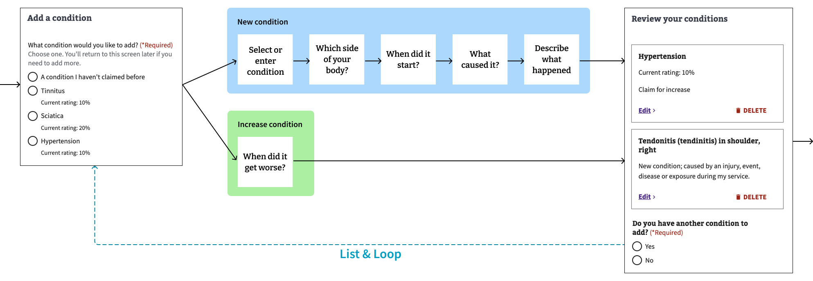 |
|---|

# Research goals

1. **Evaluate the usability of assigning new/increase type at the condition level instead of the claim level.**
   - Determine whether the new approach helps Veterans accurately select the claim type for their conditions
   - Assess ease of use
   - Determine whether the new pattern supports editing conditions after they’ve been entered
   - Identify potential usability issues
     - In particular, does removing already-selected items from the rated disabilities list cause problems?

2. **Evaluate usability improvements from previous design iterations**
   - Assess scanability and comprehension of content changes
   - Assess whether date field modifications have reduced friction points for Veterans
   - Assess whether the new laterality question makes the main conditions menu easier to use, and whether it introduces any new usability problems

3. **Assess the holistic user journey through the Conditions step**
   - Understand if the end-to-end flow of the Conditions step provides a cohesive and intuitive experience
   - Assess Veterans’ stamina and patience with the new flow from start to finish
   - Identify any remaining pain points in the conditions step

# Methodology

We conducted a one-hour moderated remote usability study with 7 Veterans from June 20–27, 2025, using a functional high-fidelity prototype in the staging environment. Participants completed six tasks representing common interactions with the claim form, including:

1. Add a new condition  
2. Request an increase for a rated condition  
3. Request an increase for another rated condition  
4. Add a new condition with a secondary service connection  
5. Edit a condition  
6. Delete a condition  

The study was conducted via Zoom, with participants recruited by Perigean. 5 participants used a desktop or laptop computer; 1 used an iPhone, and 1 used a tablet.

## Limitations

- This report's findings are based on our observations and conversations with 7 Veterans. Due to the small sample size, we cannot conclude this is representative of all Veterans.  
- Participants responded based on their past experiences or speculated about a future claim. It's important to note that our study did not involve observing Veterans in the real-time process of filling out actual claims, so their responses in a real-world scenario might differ.  
- This research did not have representation from some [*underserved communities*](https://docs.google.com/document/d/1uVzRKReVlKLfgcQ0E8RsdoTqkRACeyLX/edit#heading=h.asznv0zcqqgp), such as assistive technology users.  

## Research materials

### Research materials

- [Designs tested](https://www.figma.com/design/P6IUm8gN00H3Yi1XzN80fj/-526ez--Condition-information-entry?node-id=3395-121247&t=lYqE4X7VpWaL9Iyf-1)  
- [Research plan](https://github.com/va-gov-team/products/disability/526ez/research/CC-Team-Research/blob/master/research-plan.md)  
- [Conversation guide](https://github.com/va-gov-team/products/disability/526ez/research/CC-Team-Research/blob/master/conversation-guide.md)  
- [Research notes & recordings](https://dvagov.sharepoint.com/:f:/s/vaabdvro/EjQYUkn11tpImChEXdN4ZucBrfefe_mu1h78BRkZXJGx2Q?e=HgX2SU)

# Hypotheses and Conclusions

| Hypothesis                                                                                      | Conclusion                                                                                                                                                                                                 |
|:------------------------------------------------------------------------------------------------|:----------------------------------------------------------------------------------------------------------------------------------------------------------------------------------------------------------|
| Veterans will be able to easily add several different conditions to their claim                 | **Mostly true.** Veterans easily added a new condition and two increase conditions to their claim. The one exception was that several Veterans had trouble adding a secondary condition.                   |
| Veterans will understand how to enter an approximate date on the date screens                   | **True.** Veterans were able to enter partial dates (e.g. month + year) with no problems.                                                                                                                  |
| The condition-specific flow combined with condition-specific page headings will help Veterans feel confident they're entering the right information | **True.** The use of the condition name as the header for each follow-up screen helped Veterans orient themselves. We didn’t observe any disorientation.                                                    |
| The label on the autocomplete menu, "Select or enter new condition," will encourage Veterans to use autosuggestions | **Mostly true.** 6 of the 7 Veterans were able to easily use the autocomplete menu. One Veteran had trouble; see discussion below.                                                                          |
| Veterans will read all four cause options before making a selection                             | **Partially true.** 5 of 7 Veterans read through the options before making a selection. This is an improvement from previous research; we believe it's due in part to more concise and scannable option text. Caveat: this result may be an artifact of the “think aloud” testing format and may not hold up in the real world. |

# Key Findings

1. [Veterans found the new condition experience easy to use and highly intuitive](#finding-1-veterans-found-the-new-condition-experience-easy-to-use-and-highly-intuitive)  
2. [Participants had a hard time adding a condition that was secondary to a previously rated condition](#finding-2-participants-had-a-hard-time-adding-a-condition-that-was-secondary-to-a-previously-rated-condition)  
3. [The editing flow was difficult for some participants](#finding-3-the-editing-flow-was-difficult-for-some-participants)  
4. [The Cause options have improved, but still caused some difficulty](#finding-4-the-cause-options-have-improved-but-still-caused-some-difficulty)  
5. [No one knows the dates their condition started or worsened](#finding-5-no-one-knows-the-dates-their-condition-started-or-worsened)  

Each of these key findings is covered in the Detailed Findings section below.

# Detailed Findings

### Success Rate for each Task

| Task                        | Result        | Success Rate |
|:----------------------------|:--------------|:-------------|
| Add a new condition         | ✅ Success    | 100%         |
| Add a rated condition       | ✅ Success    | 100%         |
| Add another rated condition | ✅ Success    | 100%         |
| Add a secondary condition   | ⚠️ Mixed      | 57%          |
| Edit a condition            | ✅ Success *  | 100%         |
| Delete a condition          | ✅ Success    | 100%         |

*\* Two participants encountered some difficulty but were able to successfully complete the task.*

## Finding 1: Veterans found the new condition experience easy to use and highly intuitive

All participants were able to complete the core flows and described the experience as easy and fast. Several expressed increased confidence in their ability to file a claim on their own. Multiple participants remarked on the simplicity and self-explanatory nature of the experience, particularly in contrast to previous VA tools or paper-based workflows. Participants’ responses indicated that the streamlined form increased their confidence in completing the process independently, and reduced their perceived need for outside help.

Participants were asked to rate the experience on a scale of 1–5 for both ease of use and time efficiency, with higher scores indicating a better experience. The chart below shows the distribution of their ratings.

| 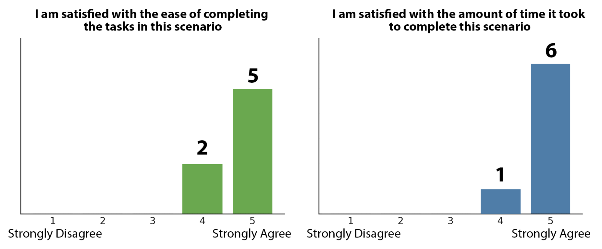 |
|---|

Many were pleasantly surprised by how short the process felt, with one participant saying it was “almost too short” to believe it was truly complete.

### 1a. Participants easily chose between “a condition I haven’t claimed before” and the rated conditions

| 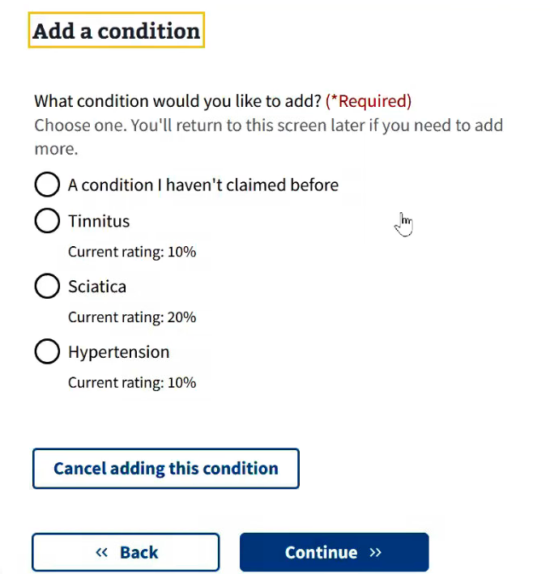 |
|---|

All participants understood the distinction between new and rated conditions and had no difficulty selecting the appropriate option. Several participants remarked on how helpful it was to see their existing conditions already pulled in.

> “It’s easy that it’s all in one place — add new ones, talk about your increases.”  
> *— Participant 1*

### 1b. Participants understood what the list of rated disabilities represented

The rated conditions list was universally understood as “already known” or “already claimed” conditions. Participants correctly inferred that these were conditions already present in their VA record. No one expressed confusion about whether these were generic options or specific to them — with the exception of one participant, who initially guessed the list might be suggested conditions. (This was likely a result of the test using dummy data.)

Participants appreciated that the system pulled in their existing information, making it feel like they were simply building on what was already there rather than starting from scratch.

> “No challenges. It’s nice that they already have [your information] and you just add to it.”  
> *— Participant 6*

### 1c. There was no confusion or concern about the list of rated conditions becoming shorter as they were added to the claim

Most participants noticed the list getting shorter and understood why the selections had narrowed. While two did not understand how the list became shorter, it did not interfere with their completion of the task.

> “It’s because I’m adding it to a claim.”  
> *— Participant 5*  
>
> “That makes sense. As you go through the page, it’s no longer available as you address it.”  
> *— Participant 1*

Participants appreciated that conditions they’d already selected were taken off the list, saying it made things clearer and helped them avoid picking the same thing twice.

> “You can’t claim it again or get confused. Especially if you get interrupted or are multi-tasking.”  
> *— Participant 7*  
>
> “If you left them up there, I’d be pushing those buttons trying to re-include them all back in there.”  
> *— Participant 5*  
>
> “It’s actually nice, since it keeps the page from getting too cluttered.”  
> *— Participant 2*

### 1d. Participants understood the purpose and appreciated the organization of the Review Conditions screen, noting it enabled them to go back and edit their information

| 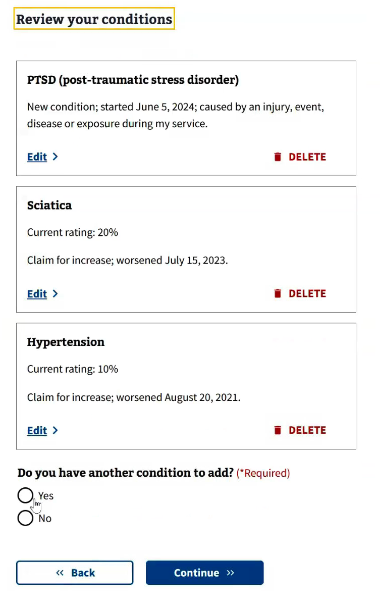 |
|---|

Participants noticed and appreciated that the conditions were listed in the same order they had added them. They understood that the screen was intended as a final review step — a place to confirm or revise what they’d entered.

> “The order of the items makes sense — that’s the order I added them.”  
> *— Participant 1*  
>
> “The content is very clear. It shows me what I’m trying to claim. Perfect.”  
> *— Participant 7*  
>
> “It gives you the opportunity to double check.”  
> *— Participant 6*

### 1e. All participants were easily able to use the list & loop structure with a continuation question on the last screen

| 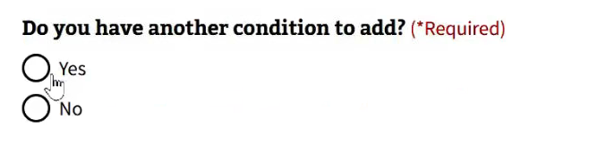 |
|---|

All participants used the list & loop pattern correctly. One participant had a slight difficulty when trying to move on at the end, but they quickly figured it out.

> “Just when I was done, [I had to remember] that you don’t have more to add, so hit No.”  
> *— Participant 6*

## Finding 2: Participants had a hard time adding a condition that was secondary to a previously rated condition

We asked participants to add a condition to their claim which had developed recently (e.g. Tendonitis in the shoulder) and was caused by a service-connected disability (e.g. Sciatica). All participants had at least some difficulty with this task.

| Participant | New condition or rated condition | Condition name                                             | Cause             | Underlying disability |
|:------------|:---------------------------------|:----------------------------------------------------------|:------------------|:----------------------|
| P1          | ❌ Chose a rated condition        |                                                           |                   |                       |
| P2          | ✅ Chose new condition            | Free text: “sciatica up to shoulder”                      | ✅ Secondary      | ✅ Sciatica           |
| P3          | ✅ Chose new condition            | Free text: “Tendonitis”                                   | ❌ VA care        |                       |
| P4          | ✅ Chose new condition            | ✅ Autosuggest: “Tendonitis (tendinitis) in shoulder”     | ✅ Secondary      | ✅ Sciatica           |
| P5          | ❌ Chose a rated condition        |                                                           |                   |                       |
| P6          | ❌ Chose a rated condition        |                                                           |                   |                       |
| P7*         | ✅ Chose new condition            | Free text: “Hearing loss related to tinnitus”             | ✅ Secondary      | ✅ Sciatica           |

*\* Due to the way the session proceeded, Participant 7 used a different scenario, “Hearing loss secondary to Tinnitus”.*

Only one participant made the ideal selections at each point. Even that person was very uncertain by the end of the task, saying they might go back and change it to an increase for sciatica.

> "I'm a little confused by this one. If it’s caused by sciatica.... I might’ve stopped, wondered if I need to delete it, and instead add it under sciatica, as a worsening condition. .... I think I would stop and consider whether I should delete this and enter in a worsening of Sciatica."  
> *— Participant 4*

There were 3 main problems for participants:

- **3 of 7 participants chose the underlying rated disability instead of entering a new condition.**

Several Veterans chose the underlying rated disability (Sciatica) instead of choosing to enter a new condition. This result is concerning, since the Veteran’s actual condition might never get communicated to the VA. Even those who chose correctly were uncertain; 2 people suggested adding another option to the screen which would more clearly describe the situation.

It is possible the frequency of this problem had to do with the artificial testing setup. In the real world, a Veteran actually suffering from Tendonitis might be more likely to enter it correctly.

*Impact:* High. The actual condition (e.g. Tendonitis) isn’t added to the claim.

- **3 of 4 participants entered, or looked for, a condition name which combined the new and existing conditions.**

Several Veterans wanted to enter a condition name that accounted for both the new condition and the old one. After not finding such an option in the autosuggestion menu, they entered free-text terms. One Veteran used the autosuggestion menu to select “Hearing loss,” then typed additional words into the text box to end up with “Hearing loss related to tinnitus.”

| 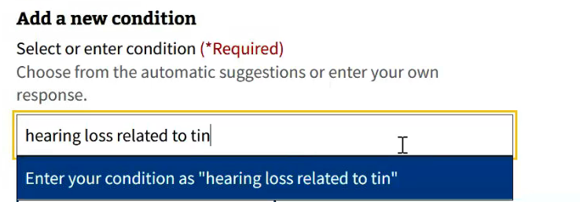 |
|---|

*Impact:* Medium. Free text entries can’t be automated and may not get classified.

- **1 of 4 participants selected the wrong cause option.**

| 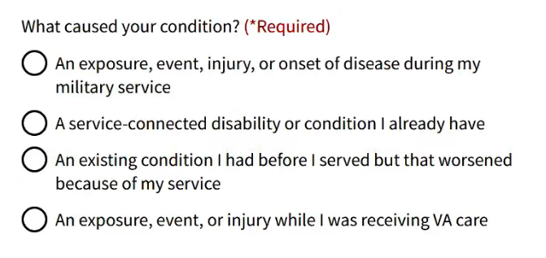 |
|---|

In considering the 4 options on the Cause page, some participants found the choice easy, while others had to think on it a bit.

> “I think you have to be careful. ... You have to take your time, read them pretty closely."  
> *— Participant 4*

One participant was completely stymied. They ended up choosing the last option, “An exposure, event, or injury while I was receiving VA care.”

> “There's no real choice that pertains to me and there's not something existing where I could tell whoever is going to read this that this is exactly what I'm trying to relate to you…  
> I would have liked an ‘Other’ option, so I could put in Tendonitis due to sciatica.”  
> *— Participant 3*

After that participant saw the follow-up page with a dropdown of rated disabilities, they said it would have made the previous screen more clear.

*Impact:* Low. VSRs will likely identify the correct cause, although it may take extra time.

## Finding 3: The editing flow was difficult for some participants

We asked participants to edit information for a condition they had already entered — either the start date or the cause details, depending on the session. While all 7 participants successfully completed the task, 2 participants struggled on the first Edit screen, unsure how to access the specific field they wanted to change.

### The main challenge: Expecting everything to be editable on the first screen

Two participants assumed the “Edit” button would bring them to a single page showing all details for that condition. When that didn’t happen, they paused, scrolled up and down, and exhibited stress before eventually clicking through and moving on.

| 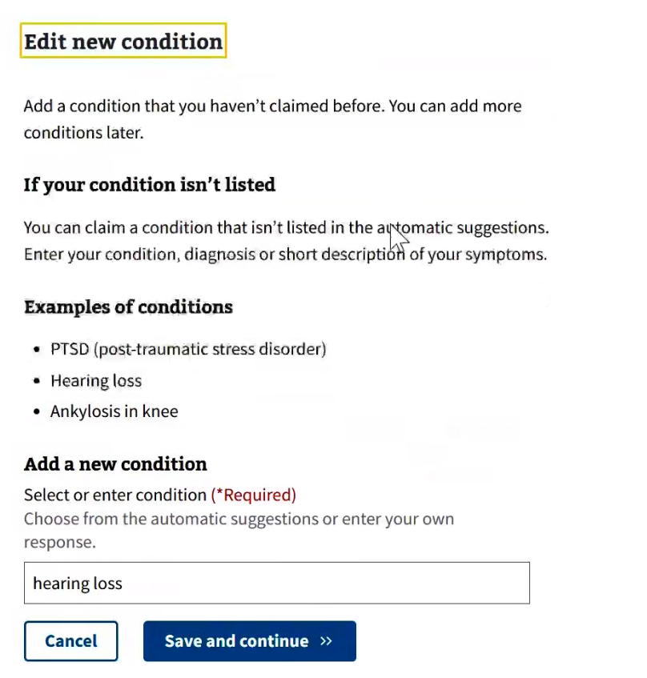 |
|---|

> “I’m kinda stuck here for just a moment. I got a little stressed out… Maybe because I expected everything to be laid out there for me to edit it.”  
> *— Participant 2*

> “What I’m looking for is that description [of what caused it]. It’s not there, so I have to assume if I save and continue it’s going to take me there. The process wasn’t as easy as it could be. What you have right now works, but…”  
> *— Participant 5*

### Other participants found the Edit flow clear and intuitive

The remaining five participants completed the Edit task without confusion. Several described the experience as straightforward or even reassuring, noting that stepping through each screen again gave them confidence that they were reviewing everything accurately.

> “I thought it was simple.”  
> *— Participant 4*

> “Very intuitive. Easy.”  
> *— Participant 1*

> “Really, really easy to do.”  
> *— Participant 3*

## Finding 4: The Cause options have improved, but still caused some difficulty

| 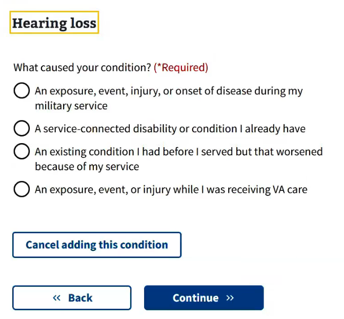 |
|---|

Most participants were able to select a cause option without major difficulty, and several commented positively on the clarity of having defined scenarios to choose from. Since the prior round of testing, all four options have been edited to be easier to scan and understand; we think their performance has improved.

However, multiple participants misunderstood or hesitated over the fourth option, which refers to disabilities caused by the VA itself. They understood “while receiving VA care” as describing the time period since the Veteran got out of service, as opposed to a more direct, causal relationship.

> “I could take that a couple ways. Like malpractice. Or maybe I was spraying my lawn with chemicals, and I just happen to be getting VA care.”  
> *— Participant 4*

> “I would pick the last one, because I was receiving VA care, but this [condition] happened while I was receiving that.”  
> *— Participant 3*
## Finding 5: No one knows the dates their condition started or worsened

> Question: For your actual condition, could you come up with a start date?  
> Answer: “That would be impossible.”  
> *— Participant 1*

> “I just put the first of the year and guess which year it was.”  
> *— Participant 3*

| 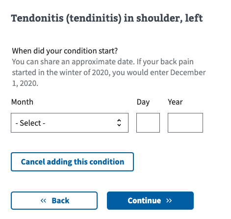 |
|---|

All participants struggled with providing accurate dates for when their conditions began or worsened, and most relied on guesswork to provide an answer. One Veteran even described this as the most difficult part of the prototype. This finding echoes what we’ve heard from VSRs: when Veterans provide dates on forms, they’re often incorrect.

| Participant | Expressed Uncertainty | Date entered       | Noticed Hint Text |
|:------------|:----------------------|:-------------------|:------------------|
| P1          | 🤔 Yes                | Month, Year        | ✅ Yes            |
| P2          | No                    | Month, Day, Year   | ✅ Yes            |
| P3          | 🤔 Yes                | Month, Day, Year   | ✅ Yes            |
| P4          | 🤔 Yes                | Month, Day, Year   | ❌ No             |
| P5          | 🤔 Yes                | Month, Day, Year   | ❌ No             |
| P6          | 🤔 Yes                | Month, Day, Year   | ❌ No             |
| P7*         | 🤔 Yes                | Month, Day, Year   | ❌ No             |

### Date Uncertainty

Only one Veteran was able to confidently provide dates for their conditions. The rest emphasized that knowing an exact date was unlikely, especially for chronic or slowly progressing conditions.

> "How do you pinpoint a date? Some things are gradual. Some things, I used to live with, until reaching a point where I deal with it."  
> *— Participant 4*

> “You might have to stop and really think… it’s more an ‘estimated’ time.”  
> *— Participant 6*

### Strategies for guessing

Participants used a variety of strategies to estimate a date:

- Using their service dates or discharge year:  *“If I didn't know the date, I’d just put the date I got out of service.”* — Participant 7
  
- Using weather or seasonal memory (e.g., *“June, because I remember the weather”* — Participant 5)

- Choosing a year when symptoms got significantly worse

- Defaulting to January 1 of the guessed year

One participant suggested showing their service dates on this page, as a way to jog their memory.

## Finding 6: We observed two problems with the autosuggestion menu

Both issues in this finding stemmed from the same participant using a mobile phone. One problem was specific to the mobile layout and screen behavior, while the other reflected a more general confusion about when and how the autosuggestion list appears.

### Problem 1: Mobile keyboard obscured the autosuggestion menu

> Question: What do you think of how the menu works?  
> Answer: “On a phone, it doesn’t.”  
> *— Participant 3*

When the Veteran using a phone tapped into the “Add a new condition” input field, the on-screen keyboard obscured the autosuggestion dropdown, making it difficult to understand whether the list was working. While this was only observed on one device, the issue may be more widespread depending on screen size, keyboard type, and how the dropdown is positioned in the viewport. Participant 3 did eventually complete the task after minimizing the keyboard manually.

| 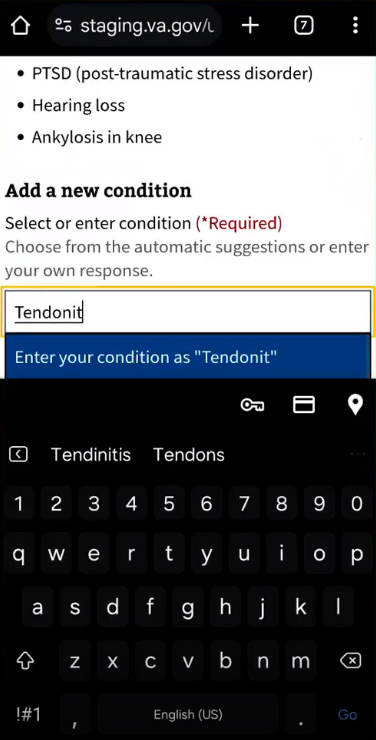 |
|---|

### Problem 2: Instructional language around autosuggestion was unclear

The on-screen instructions referred to selecting a condition from a “list,” but the autosuggest list appears only after the user begins typing. This caused initial confusion for one Veteran, who expected a visible list when the page loaded.

> “This is confusing… It says add the new condition from the list, and there is no list. It just has an empty box where I would type in.”  
> *— Participant 3*

| 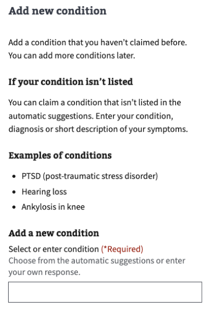 |
|---|

Despite getting stuck initially, the Veteran figured out the intended behavior on his own. But he was clearly frustrated.
## Finding 7: Autosuggestions were only partially used

When adding a new condition, only 3 of 7 participants selected a condition from the autosuggestion menu. The remaining 4 participants typed their entry as free text, either ignoring the autosuggested terms or not seeing them at all.

| Participant | Used Autosuggest | Entry Method                           | Reason                                                      |
|:------------|:-----------------|:---------------------------------------|:------------------------------------------------------------|
| P1          | ❌ No            | Free text: “hidradenitis supurativa”   | No autosuggestions                                          |
| P2          | ❌ No            | Free text: “Dislocated Elbow”          | No autosuggestions                                          |
| P3          | ❌ No            | Free text: “Respiratory”               | No autosuggestions                                          |
| P4          | ❌ No            | Free text: “Allergies”                 | Did not recognize “chronic rhinitis, allergic or non-allergic” |
| P5          | ✅ Yes           | Typed “TBI” and selected from autosuggest |                                                            |
| P6          | ✅ Yes           | Typed “neurop..” and selected from autosuggest |                                                           |
| P7*         | ✅ Yes           | Typed “ptsd” and selected from autosuggest |                                                           |
## Finding 8: Page titles using the condition name helped participants stay oriented

| 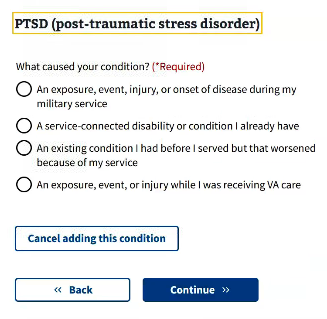 |
|---|

All participants were able to accurately report which condition they were working on in the follow-up screens. Several specifically pointed to the condition name in the `<h3>` header as a helpful reminder and confirmation that they were in the right place. No participant exhibited confusion about which screen they were on or whether they’d proceeded from the previous screen.

> “That’s good, you tend to forget. So I’m glad it’s up there to remind me.”  
> *— Participant 3*

> “If you look at the screen, it’s up there — it basically tells you what you’re into.”  
> *— Participant 6*

## Finding 9: Instructions were helpful

Most participants engaged with the on-screen instructions at some point, either by skimming them initially or referring back to them when clarification was needed. Several participants mentioned the instructions directly and described them as useful and to-the-point.  

*Caveat: people tend to read instructions more in usability testing than they do in reality; so we should not take this finding as conclusory.*

### Add a condition screen
One Veteran appreciated the statement that you could add more conditions later.

> "The older way of doing claims, you almost felt it was a one-time shot, you wouldn’t have the chance to add things later."  
> *— Participant 4*

### Add a new condition screen
The instructions on this screen garnered the most attention of any screen. We observed almost all users reading or skimming the text.

- Several people noted the heading, “If your condition isn’t listed.”
- Participant 1 was pleasantly surprised by the instruction about listing symptoms.

> “The symptoms … being able to list those, instead of having a diagnosis or a strict ‘This is what it is.’ A lot of times what I've experienced with healthcare, military healthcare: it has to fit into a neat box, something that’s already available, and not a lot of opportunity to expand or talk about it more. The opportunity to use your own language to describe what you’re going through, I think, is an improvement in terms of [VA] being more problem solving, able to hear patients.”  
> *— Participant 1*

- The list of example conditions got mixed reviews. It helped P7 by jogging his memory, but P4 felt it was not necessary.

### Date screens
3 of the 7 participants noticed the on-screen hint about entering an approximate date. Those who saw it found it reassuring.

> “It’s nice that you can give an approximate date.”  
> *— Participant 1*

## Finding 10: The laterality question was easy and reassuring

| 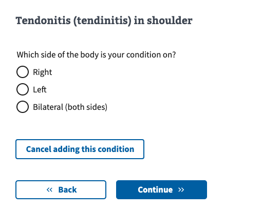 |
|---|

This design removes the laterality designations (“left”, “right”, or “bilateral”) from the main conditions menu to make it shorter and easier to navigate. During testing, the more concise menu seemed helpful. For example, when participants typed “tendonitis” into the field, the “Tendonitis, shoulder” option they were looking for was visible without scrolling.

| 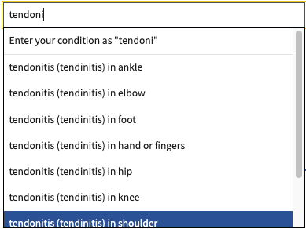 |
|---|

Veterans had no problems understanding and answering the laterality question. Interestingly, one Veteran felt reassured by the laterality question, because it showed the condition she entered was something the VA understood. Likewise, another Veteran commented positively that the condition heading updated after they made their selection.  

This reassurance may be related to a concern we heard from another Veteran about knowing what “special words” would make the VA accept his claim. When a follow-up question shows the VA recognizes a disability, it can help Veterans feel more confident in their claim.

> “That’s better. It feels like they have a grasp of what it is, and that it can be located in different places.”  
> *— Participant 1*

## Additional findings and observations

### Emotional toll
While most of the study focused on usability and task success, several participants made comments that highlighted the emotional strain involved in completing the disability claim form. They shared that entering dates or writing about specific deployments triggered painful memories or emotional fatigue.

> “Right away, as soon as I was starting to think about a particular deployment… that, for me, was probably the biggest challenge.”  
> *— Participant 4*

> “It can bring up a lot of emotions. If I got sidetracked, I wouldn’t want to have to go through this again.”  
> *— Participant 1*

### Too many short screens
One Veteran in the study expressed annoyance at having so many short screens in the design.

> “One thing I was expecting to see: boxes expanding, almost like a branching of the questions… For some of the questions, when I hit Yes or No, I expected it to open maybe a text box to expand instead of having to click Continue to do that on the next screen. Like, you have to keep hitting Continue.”  
> *— Participant 1*

### Lack of follow-up questions for increase conditions
One Veteran was surprised there was no follow-up question when he added a rated condition to his claim.

> “I’m surprised it didn't ask about details for worsening conditions. I'm ok with it not asking. Unless they deny the claim – in which case, it would’ve been nice to have the opportunity to explain."  
> *— Participant 4*

### Online application anxiety
Several participants mentioned concerns about whether their information was being saved, or whether they’d have a chance to go back and review their entries. They seemed to have a good deal of anxiety about the process of filling out this kind of form online. These concerns were based on past bad experiences and the fact that the standard auto-save notification was missing in the prototype.

> “It offered me the opportunity to go back and edit, that's always good … the ability to make it right.”  
> *— Participant 5*

> “A lot of times in the past I’ve tried to edit stuff and it doesn’t allow you to change specific fields. It’s very frustrating. That you could change anything and everything [in the prototype] -- I thought that was good.”  
> *— Participant 3*

# Recommendations

1. **Move forward with current design**
   - The success of the prototype in testing gives confidence that the new design will provide a better user experience than what exists now.
   - Before launch, address recommendations 3 and 4 below. The other recommendations can be addressed later.

2. **Address problems with adding secondary conditions**
   - Because we’re not making the secondary conditions situation worse with the new design, we’re comfortable moving forward on the new design without immediately addressing the issues we found.
   - But we should work on addressing these issues as soon as it makes sense. If supplemental claims need to be integrated into the 526 soon, we might work on secondary conditions at the same time since they could affect the same screens.
   - The most pressing issue to address is the possibility of Veterans choosing a claim for increase instead of a new condition. Mitigating this problem should be a priority.

3. **Improve wording on Cause page, particularly Option 4**
   - Re-work the fourth option about VA care to reduce confusion.
   - Look for other ways to make the first three options more clear.

4. **Improve instructions on Add a new condition screen**
   - Address the confusion around “list” wording in the instructions for the autosuggestion menu.

5. **Prevent errors around date entry**
   - Remove the day field entirely to reduce perceived precision requirements and user stress.
   - If possible, make sure no part of the date is required, even if user starts entering a partial date.

6. **Address the problem with phone keyboards obscuring the autosuggestion menu**
   - Investigate how common this problem is.
   - Work on a solution.

7. **Look at specific autosuggestion results as part of larger work on conditions taxonomy**
   - The cases we observed where users didn’t find their entries in the autosuggestion menu can be used as part of the larger effort to improve the taxonomy.

8. **Find opportunities to reduce the number of individual screens**
   - There may be opportunities to combine screens; for example, the date question might be added to the cause details screen.
   - Reducing the number of screens would reduce the amount of clicking through required to edit a condition.

9. **Consider adding a free-text follow-up question for increase conditions**
   - This would allow Veterans to add helpful information about their requests for increase.
   - It could also serve as a backstop for Veterans who choose an increase condition when they really have a new, secondary condition.

# Who we talked to

### Recruitment criteria
Perigean recruited 10 people. There were 3 cancellations, resulting in 7 actual sessions.

**Primary recruitment criteria**
- All participants are rated for at least one service-connected disability by the VA.
- All participants have recently filed a disability claim OR are planning to file a claim soon.
- At least 2 Veterans who identify as having a cognitive disability.
- 2-3 Veterans with “no degree after high school.”

While we recruited a mix of age, gender, and race/ethnicity, it turned out all our cancellations were non-White recruits and/or women. This resulted in a participant group that was more White and more male than we typically see. In the future, we should ask for higher percentages of these underrepresented groups in the initial recruit.

### Final participant pool

**Audience segment**
- Veterans: 7
- Caregivers: 0
- Family members of a Veteran: 0

**Gender**
- Male: 6  
- Female: 1  

**LGBTQ+**
- Transgender: 0  
- Nonbinary, gender fluid, gender queer, Two-Spirit (Indigenous only), or another gender beyond man or woman: Unknown  
- Gay, lesbian, or bisexual: Unknown  

**Devices used during study**
- Desktop: 5  
- Tablet: 1  
- Smartphone: 1  
- Assistive Technology: 0  

**Age**
- 25–34: 1  
- 35–44: 0  
- 45–54: 1  
- 55–64: 3  
- 65+: 2  

**Education**
- High school degree or equivalent: 0  
- Some college (no degree): 6  
- Associate's degree, trade certificate, or vocational training: 0  
- Bachelor's degree: 0  
- Master's degree: 1  
- Doctorate degree: 0  

**Geographic location**
- Urban: 5  
- Rural: 1  
- Unknown: 0  

**Race**
- White: 5  
- Black: 1  
- Hispanic: 1  
- Biracial: 0  
- Asian: 0  
- Native: 0  

**Disability and Assistive Technology (AT)**
- Did not recruit for this  

## Underserved groups we haven’t talked to
This research does not include the perspectives of the following marginalized Veteran groups:

- Other than honorable  
- Immigrant origin  
- LGBTQ+  
- Biracial  
- Asian  
- Native, American Indian or Alaska Native  
- Assistive technology users  

[*VA-recruitment-checker*](https://docs.google.com/spreadsheets/d/1pq7TSHZonfpzAQBJj6B2geGHlNUwZEs4DzEvxcRgu0o/edit?gid=790920180#gid=790920180):

| 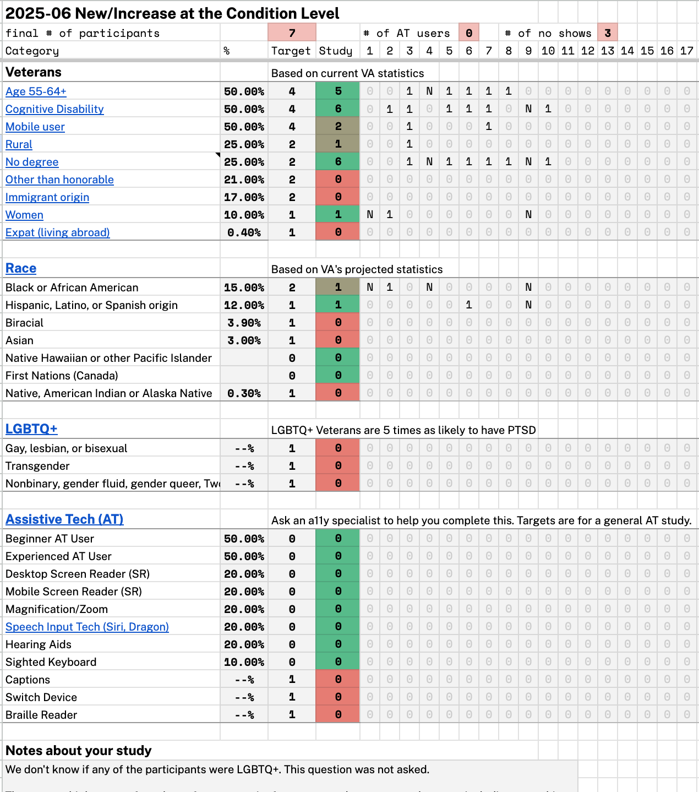 |
|---|
