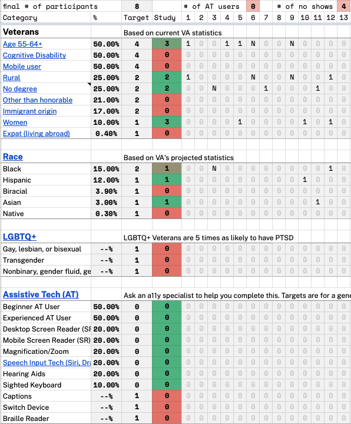

# PACT Act and presumptives Veteran discovery research findings

**Office of the CTO - Digital Experience (OCTO-DE), Automated Benefits Delivery, Virtual Regional Office (ABD-VRO)**

Date: July 2022

[Carolyn Dew](carolyn@navapbc.com), [Shannon Ford](shannonford@navapbc.com), [Kim Ladin](kimladin@navapbc.com)

[Research Report PDF] (link here)

**Jump to:**

[Key findings](#key-findings)

[Recommendations](#recommendations)

[Who we talked to](#who-we-talked-to)

[Further research needed](#further-research-needed)

# Research Goals

The VA is preparing for an increase in disability claims that is expected upon passage of the PACT Act, which would make more Veterans eligible for benefits (both compensation and health care) for conditions that were a result of toxic exposure during service, including from burn pits and Agent Orange. We would like to learn more about how Veterans, who have been exposed to burn pits or Agent Orange and have suffered health impacts, think about submitting claims for those conditions.

Services and products coming out of this effort would support **Taking Care of Myself**, and specifically **Managing primary care and chronic health issues** 

 _[See the Veteran journey](https://github.com/department-of-veterans-affairs/va.gov-team/blob/master/platform/design/va-product-journey-maps/Veteran%20Journey%20Map.pdf)_

Our goals for this study were to:

- Better understand how impacted Veterans decide on which conditions to list on their claim application (either 526 or 0995)
- Better understand how impacted Veterans decide whether to submit an original or supplemental claim for a PACT Act condition, or something else.
- Better understand how aware Veterans are of the PACT Act and its implications.

# Research Questions

### Understand how Veterans choose which claim form to use

- How well do Veterans remember what conditions they've claimed in the past (ergo, should they now submit a new or a supplemental claim?)
- How would a Veteran choose between submitting an original claim or a supplemental claim? Would they consider submitting a different type of claim for a condition that is newly presumptive under the PACT Act

### Understand how Veterans pick what to list as their conditions and how to describe them

- How clued in are Veterans to Veteran groups that provide advice on how to submit a successful claim (how to 'hack' the VA bureaucracy)?
- How comfortable would a Veteran be if, once logged in, the supplemental claim application form presented them with a list of presumptive conditions they'd previously claimed? (Or otherwise nudged them towards a specific way to describe a condition?)

### Understand how familiar Veterans are with the PACT Act

- Has a Veteran heard of / how familiar are they with:
    - The PACT Act?
    - Burn pit (Agent Orange, toxic exposure) legislation efforts?
    - presumptive claims?

# Methodology

We conducted 8 one-on-one interviews with Veterans remotely over Zoom.

# Key Findings

1. **Veterans are unfamiliar with the term 'PACT Act' and weren't sure if they would be impacted by its passage.** Veterans are similarly unfamiliar with the term 'presumptive' in describing a claim. Most veterans do not understand what form to use and rely on other sources (such as va.gov or a third-party organization) to decide.

1. **Veterans are somewhat more familiar with the terms 'open burn pit' and 'toxic exposure', although some who would qualify as having been presumptively exposed did not think they would.** This may be due to the change to having presumed exposure for being 'in-country' versus having to prove proximity to a burn pit.

1. **Veterans expected that signing up for the Burn Pit Registry would mean that the VA would reach out to them about claims they might be eligible for, and that data they shared would automatically be used by the VA to evaluate future claims.** These assumptions could damage Veteran trust if not met.

1. **Veterans who submitted claims on their own would describe their conditions using language from the VA, suggested by an online form, or used an official diagnoses from their doctors.** Those who worked with VSOs and other third party organizations left wording decisions up to those organizations.

1. **Most Veterans liked the idea of getting their rating without having to go to a C&P exam, although a few had concerns.** Comfort with skipping an exam seems correlated to how well a Veteran thinks their condition is documented in their medical records.

1. **Giving the Veteran a choice about going to a C&P exam could introduce more stress and uncertainty for the Veteran.** Similarly, getting a preliminary rating in advance of an exam may carry more risks than benefits.

1. **Veterans expressed strong support for getting notified of decisions as they're made for each condition on a multi-issue claim -- *including* for denials**. Only one Veteran expressed a preference for getting notified only after all issues had been decided.

1. **Guidance from the VA on how to submit a disability claim is lacking, confusing, or misleading.** Veterans who submit claims on their own struggle to submit ones that are likely to be granted, simply because they don't understand the process.

# Details of Findings

### Finding 1. Veterans are unfamiliar with the term 'PACT Act' and weren't sure if they would be impacted by its passage.  Veterans are similarly unfamiliar with the term 'presumptive' in describing a claim.

Labels: `AUD: Veterans`, `BNFT: Finances`, `SPG: Agent Orange`, `SPG: Burn pits`

Six of our eight research participants expressed that they had never heard of the PACT Act before, one had heard of it but was unclear of what it will do, and one Veteran was familiar with it and had a reasonable sense of its implications.

Similarly, two participants had never heard the term "presumptive" in relation to claims, and three had heard the terms but were unclear of its meaning. Only three of the eight participants knew what a presumptive conditions was.

### Finding 2. Veterans are somewhat more familiar with the terms 'open burn pit' and 'toxic exposure', although some who would qualify as having been presumptively exposed did not think they would.

Labels: `AUD: Veterans`, `BNFT: Finances`     `SPG: Agent Orange`, `SPG: Burn pits`

Several Veterans in or study were at least somewhat familiar with the terms 'open burn pit' or 'toxic exposure' -- and a few had service-connected illnesses they believed were caused by toxic exposures.

Many Veterans were unsure of whether they would qualify for presumptive toxic exposure, including at least one Veteran who said he would not be impacted by the PACT Act yet clearly fit into an eligible cohort.

### Finding 3. Veterans expected that signing up for the Burn Pit Registry would mean that the VA would reach out to them about claims they might be eligible for, and that data they shared would automatically be used by the VA to evaluate future claims.

Labels: `AUD: Veterans`, `BNFT: Finances`     `SPG: Agent Orange`, `SPG: Burn pits`

Veterans were confused about what the Burn Pit Registry is, including those who had signed up for it. Some assumed that it was somehow linked to the disability claims process within the VA, and that the VA would use the information they gathered through the registry for outreach and to help decide claims. Rather, according to the registry's website, Veterans _can_ submit that information to support a claim but there is no promise that the VA will connect the dots proactively.

> "They'll be able to see when they look at my records, you were exposed to this, this could be a cause, and if that's the case, I registered, here's my medical records, can I file a claim for disability?"

> "[The registry is] a tracking mechanism for them to find you, or research studies you might participate in."

### Finding 4. Veterans who submitted claims on their own would describe their conditions using language from the VA, suggested by an online form, or used an official diagnoses from their doctors. Those who worked with VSOs and other third party organizations left these decisions up to those organizations.

Labels: `AUD: Veterans`, `BNFT: Finances`, `SPG: Agent Orange`, `SPG: Burn pits`

Veterans tended to think that using language they got from the VA (either from a previous decision or as suggested by the website), would be the most effective language to put on their claim application. Veterans also seemed to think that an official diagnosis was more impactful than just describing symptoms.

For example, one Veteran copied the language from a previous decision letter to describe his condition. One Veteran paired a diagnosis with the knowledge that that condition was presumptively linked to Agent Orange. Another Veteran claimed a specific diagnosis, then went to the C&P Exam to describe his symptoms and see if the medical examiner agreed with him.

### Finding 5. Most Veterans liked the idea of getting their rating without having to go to a C&P exam, although a few had concerns. Comfort with skipping an exam seems correlated to how well a Veteran thinks their condition is documented in their medical records.

Labels: `AUD: Veterans`, `BNFT: Finances`, `SPG: Agent Orange`, `SPG: Burn pits`

Five Veterans shared a positive view of getting a rating without having to go to a C&P exam, particularly if they felt their condition was well documented within their medical records. They cited saving time and money and having a process that was more straightforward. Others described past C&P exams they had been to that they didn't think were useful for rating their claim.

Some Veterans expressed that if the rating were consistent with what their research suggested they were eligible for, they'd be more likely to trust the decision.

> "I think in my case I'm not sure that the medical officer who did that physical would have made any difference at all. He didn't find anything more. […] I don't think there was any value added. I think the VA could have easily taken from my medical records."

Two Veterans expressed concerns that skipping the exam would mean that someone unqualified would be making a decision on their claim without a lot of evidence. And two Veterans were concerned that skipping the exam would open the VA up to fraud, and that they understood why the exam was necessary and didn't mind making themselves available for it.

> "I would question what information they used, and whether that individual is qualified to make the decision or not."

### Finding 6. Giving the Veteran a choice about going to a C&P exam, or issuing a preliminary rating and ordering an exam, could introduce more stress and uncertainty for the Veteran.

Veterans had mixed reactions to the possibility of having a choice to go to a C&P Exam or not. Some Veterans expressed that having a choice would be good, others felt they didn't know how they might make such a decision. One Veteran expressed concern that the VA was offering that option because they saw something concerning in the records.

In the second scenario, Veterans felt that the possibility of getting a rating and receiving payments that could later get lowered outweighed any potential benefit of getting a rating sooner. This corresponds to the [Endowment Effect](https://www.investopedia.com/terms/e/endowment-effect.asp) -- the phenomenon that people tend to value something higher if they already own it versus if they don't.

One Veteran pointed out an additional risk of a Veteran becoming indebted to the VA if their preliminary rating was lowered after an exam, forcing them to pay back a portion of their earlier disability payments.

### Finding 7. Veterans expressed strong support for getting notified of decisions as they're made for each contention on a multi-issue claim - *including* for denials. Only one Veteran expressed a preference for getting notified only after all issues had been decided.

Veterans generally expressed a preference for finding out decisions as they're made, even in the case of denials. Veterans felt that if they found out about a denial sooner, they could begin working on what they might need to do to reverse that decision or make other plans. Some Veterans cited financial hardship as a reason for wanting to hear about decisions as they're made - so they could get some money in the door faster rather than waiting for the full amount (assuming that the effective date would remain the same and that there would be retroactive pay for conditions decided later).

One Veteran who had worked for the VA after she separated from service felt this was a good idea, but was concerned that most Veterans don't understand how their total rating is calculated and that the VA would need to both clearly explain the impact of subsequent decisions on their total monthly payment, and ensure that Veterans would not be required to pay back any money that the VA paid out by mistake.

### Finding 8. Veterans find guidance from the VA on how to submit a disability claim to be lacking, confusing, or misleading. Veterans who submit claims on their own struggle to submit ones that are likely to be granted, simply because they don't understand the process.

We talked to a number of Veterans who were confused about the disability claims process -- mainly those who had filed on their own but also those who had worked with VSOs. One Veteran had been intending to file a disability claim for a cancer that is presumptive to Agent Orange but that has been in remission for several years -- he did not seem to be aware that at this point he could only be service-connected at 0 percent, but could have been service-connected at 100 percent when that cancer was active (and it was active for several years).

Another Veteran described how he submitted a claim for a condition that had previously been denied twice. The first time he had filed a claim he worked with a VSO, who was listed as his POA. He worked alone for this additional claim. He found out online that the VA had closed his claim, and that the VSO had (unbeknownst to him) filed the exact same claim, which was processed and granted. The Veteran expressed considerable confusion about what had happened. (Our team's hypothesis was that since the Veteran submitted the claim on a 526, when it should have been on an 0995, that the VSO had been notified and they resubmitted the claim on the correct form, but that no one explained this to the Veteran).

# Additional Insights

1. **Veterans can feel stressed when a claim stays in the same status for a long period of time with no updates or explanation.** Some veterans will check the claim status tracker frequently after they've submitted a claim. Veterans are confused about what the statuses mean and what order they go in (particularly when a claim is sent back to an earlier step). 

    >After I submitted everything, I just waited. I would check religiously the status of my claims. Gosh, at first it was like every day, but that was getting rough. I would try to refrain from like maybe once a week, I just kept checking. And then, it wasn’t until like several months had past, I’d seen something in my status changed when I logged in. I think it was in eBenefits, something’s changed. I don’t know exactly what’s different. I checked va.gov or might have been vice versa, I was like “Whoa! Hey, finally!”

3. **WEAK SIGNAL: Some Veterans put a higher priority on the timeliness of a decision relative to its accuracy than the VA does.** Veterans generally expressed more comfort with the idea of getting a Veteran a rating faster, even if that rating was potentially lower than it could be, with the assumption that a Veteran could still pursue a higher rating if they felt is was justified.

# Recommendations

* **Outreach around the PACT Act should focus on the terms such as 'open burn pits' and 'toxic exposure', and not rely on terms such as 'PACT Act' or 'presumptive.'**
    * Most of our research participants had never heard of the PACT Act, and those that had, had only a cursory knowledge of what it did. Only one Veteran we talked to was familiar with the PACT Act and it's implications -- this Veteran was very tuned in to VA news and subscribed to several VSO and Veteran-orientated newsletters.
    * In particular, providing specific examples of scenarios that would or would not qualify for presumptive exposure -- such as being in-country for a short amount of time, or being exposed to burning oil fields in the Iraq War -- could help to correct misconceptions about eligibility.
* **Allow Veterans to quickly determine if they are part of an eligible cohort for a presumptive claim.** The change from requiring proof of toxic exposure to simply being 'in-country' is not well understood.
    * Many Veterans were unclear on whether they would qualify for newly presumptive conditions when the PACT Act passes. In particular, it seems important to clarify that simply being in-country is enough to qualify someone for presumptive exposure, which is a change from needing to prove proximity to a known burn pit.
    * Some Veterans indicated they would not be impacted by the passage of the act, despite their service history placing them into an eligible cohort. This could lead to otherwise eligible Veterans failing to file claims for presumptive conditions.

* **Veterans seem to be open to a Veteran-facing contention matching system for presumptive conditions -- concern about Veteran acceptance should not be a blocker should we decide to pursue it.** We should ensure any system does not offer wildly incorrect suggestions.
    * Our research suggests that Veterans may be open to a front-end contention matching system. Veterans who filed claims on their own had a tendency to use suggested language -- either from a previous VA decision or from suggested conditions from a website.
    * Additionally, research on supplemental claims supports the idea that "[Veterans expect to be known by the VA](https://github.com/department-of-veterans-affairs/va.gov-team/blob/master/products/decision-reviews/Supplemental-Claims/Research/top-line-summary.md)" and supports the idea of a carefully implemented contention matching process.
    * Any process should be carefully tested and incrementally designed and released -- [other research suggested that an inaccurate suggestion could damage Veteran trust](https://github.com/department-of-veterans-affairs/va.gov-team/blob/master/products/disability/526ez/research/jul-2019/synthesis.md). However, for presumptive and supplemental claims, this risk is reduced due to the limited number of presumptive or previously claimed conditions.
* **Treat the original disability claim submission as an onboarding experience.** Veterans are significantly confused by the claims process and don't receive much guidance. The first claim is an opportunity to educate Veterans on disability claims with just-in-time information and educational materials.
    * By and large, Veterans do not understand the disability claims process. Many Veterans work with VSOs and other third party organizations to put together and submit a claim, and those that do often defer most of the decision-making to the organization.
    * The first time filing a claim for those who work with a third-party organization usually involves a comprehensive review of their medical records, and a large multi-issue claim where any possible condition is claimed to get the highest rating possible. Subsequent claims are often smaller in scope -- either claims for increase for a smaller subset of conditions, supplemental claims for conditions that weren't granted or were granted at a lower level than the Veteran felt they deserved, or appeals or higher-level reviews.
    * Veterans who file on their own either do an extensive amount of research online to try to understand the process (including, in some cases, reading the CFR and the Adjudication Manual), or submit claims that are unlikely to be granted (due to lack of supporting evidence, or submitting after a condition has been resolved).
* **Consider changing VBA policy to notify the Veteran of decisions on conditions on multi-issue claims as they're decided, _even for denials_. This will need to be paired with thoughtful communications design and testing.** The VA should incrementally test this process a pilot program prior to a full release, and closely observe Veterans' reactions to this process on real claims. Splitting multi-issue claims where one or some contentions can be pulled into the Rapid Ready-for-Decision (RRD) process would be a good opportunity to test this process.
    * Veterans expressed a preference to learn about a decision on a specific contention as soon as it's decided, rather than wait for the VA to decide all issues on a claim. This included for denials. Benefits of finding out about denials early included the ability to start gathering additional evidence and start the process of reversing that decision.
    * One Veteran compared this to having items in your Amazon order delivered as soon as they're available versus waiting until they can all ship together. Her preference was to not wait.
    * Some Veterans also check the claims status tracker daily to see the status of their claims -- and a lack of change for a long period of time can exacerbate stress and anxiety. By updating the status of specific contentions as they're decided, the VA would be able to provide more frequent updates through the Claim Status Tracker and improve the Veteran experience.

* **Automatically link Veteran information gathered through the Burn Pit Registry to support relevant claims, and use contact information from the registry to reach out to Veterans about newly presumptive claims.** It is likely worth navigating whatever opt-in or permissions are needed from Veterans to do this, if any.
    * Veterans are confused about what the Burn Pit Registry does, and often assume that information they provided to the registry will automatically trigger outreach and support disability claims. There is a risk that if these expectations are not met it will erode Veteran trust in the VA.
    * This also aligns with the finding that "Veterans expect the VA to know them" (Source: [Supplemental Claims Research Top Level Summary](https://github.com/department-of-veterans-affairs/va.gov-team/blob/master/products/decision-reviews/Supplemental-Claims/Research/top-line-summary.md))

# Further research needed

* **What strategies do Veterans use to 'beat the odds' and how does this impact how claims are processed?** We talked to one Veteran who had submitted his claim on a new claim form because he believed it would be faster, even though he seemed to understand that it should be submitted as a supplemental claim. Strategies to 'beat the odds' suggest misalignment between VA practices and Veteran expectations.
* **How do Veterans decide what evidence to include with their claims?** This will be particularly true for supplemental claims where there is already research that suggests that Veterans don't understand what counts as 'new and material' information. We talked to Veterans who did not include existing PMRs, only included a personal statement, or failed to realize that their service treatment records did not include records of a key operation until after his claim had been denied twice.
* **How would Veterans respond to receiving a preliminary rating of 0 percent in advance of a C&P exam to determine severity?** We learned that the Endowment Effect and fears of indebtedness pose high risks for issuing a preliminary rating that could go down after a C&P exam. Would eliminating this risk while opening up the opportunity for free healthcare be a desirable alternative?
* **What are the perspectives from LGBTQ+ Veterans?** Our research participants did not include individuals from the LGBTQ+ community, and we should be sure to include those in future studies.

# Appendix

[Research plan](https://github.com/department-of-veterans-affairs/va.gov-team/blob/master/products/disability/abd-vro/2022-06-PACT-Act-presumptive-veterans/PACT-Act-presumptives-veterans-research-plan.md)

[Conversation guide](https://github.com/department-of-veterans-affairs/va.gov-team/blob/master/products/disability/abd-vro/2022-06-PACT-Act-presumptive-veterans/PACT-convo-guide.md)

[Interview transcripts](https://dvagov.sharepoint.com/sites/vaabdvro/Shared%20Documents/Forms/AllItems.aspx?viewpath=%2Fsites%2Fvaabdvro%2FShared%20Documents%2FForms%2FAllItems%2Easpx&isAscending=false&id=%2Fsites%2Fvaabdvro%2FShared%20Documents%2FDesign%20research%2F2022%2D05%20%2D%20PACT%20Act%20Veterans%20Research&sortField=LinkFilename&viewid=3fa7a9bb%2D3d4e%2D44c2%2Db93f%2D629268a08e72) (on VA Sharepoint)

## Tools used for Synthesis

[Synthesis Mural](https://app.mural.co/t/nava4113/m/nava4113/1656427883253/5a475cd4d1b6a3db50fc970013260123630d4f1b?sender=carolyn1198)

## Secondary research

* [2022-May: PACT Act research:RVSRs](https://dvagov.sharepoint.com/sites/vaabdvro/Shared%20Documents/Forms/AllItems.aspx?viewpath=%2Fsites%2Fvaabdvro%2FShared%20Documents%2FForms%2FAllItems%2Easpx&isAscending=false&sortField=LinkFilename&id=%2Fsites%2Fvaabdvro%2FShared%20Documents%2FDesign%20research%2F2022%2D06%20PACT%20Act%20RVSR%20research%2F2022%2DMay%5FPACT%5FAct%5Fresearch%5FRVSRs%5F%2Epdf&parent=%2Fsites%2Fvaabdvro%2FShared%20Documents%2FDesign%20research%2F2022%2D06%20PACT%20Act%20RVSR%20research) (on VA Sharepoint)
* [2022 June: PACT Act VSO research report](https://dvagov.sharepoint.com/sites/vaabdvro/Shared%20Documents/Forms/AllItems.aspx?viewpath=%2Fsites%2Fvaabdvro%2FShared%20Documents%2FForms%2FAllItems%2Easpx&isAscending=false&sortField=LinkFilename&id=%2Fsites%2Fvaabdvro%2FShared%20Documents%2FDesign%20research%2F2022%2D05%20%2D%20PACT%20Act%20VSO%20Research%2F2022%2DJune%5F%2D%5FPACT%5FAct%5FVSO%5Fresearch%5F%2D%5FReport%2Epdf&parent=%2Fsites%2Fvaabdvro%2FShared%20Documents%2FDesign%20research%2F2022%2D05%20%2D%20PACT%20Act%20VSO%20Research) (on VA Sharepoint)
* [Supplemental Claims Research Top Level Summary](https://github.com/department-of-veterans-affairs/va.gov-team/blob/master/products/decision-reviews/Supplemental-Claims/Research/top-line-summary.md)
* [Automating Claim ID type in 526 applications](https://github.com/department-of-veterans-affairs/va.gov-team/blob/master/products/disability/526ez/research/jul-2019/synthesis.md)

## Who we talked to

**Recruitment criteria**

We talked to **eight participants.** We recruited for Veterans who:
* Had previously filed a disability claim or were actively planning to file a disability claim
* Had been exposed to Agent Orange during the Vietnam War, or open burn pits during the Gulf War or War on Terror.

Audience segment:
* Veterans: 8
* Caregivers: 0
* Family members of a Veteran: 0

Gender:
* Male: 5
* Female: 3

LGBTQ+:
* Transgender: 0
* Nonbinary, gender fluid, gender queer, Two-Spirit (Indigenous only), or another gender beyond man or woman: 0
* Gay, lesbian, or bisexual: 0

Devices used during study: _Not applicable: interviews were open-ended and we did not test an interface_

Age:
* 25-34: 2
* 35-44: 0
* 45-54: 3
* 55-64: 1
* 65+: 2
* Unknown: 0

Education:
* High school degree or equivalent: x
* Some college (no degree): 3
* Associate's degree, trade certificate or vocational training: 0
* Bachelor's degree: 2
* Master's degree: 4
* Doctorate degree: 0
* Unknown: 0

Geographic location:
* Urban: 6
* Rural: 2
* Unknown: 0

Race:
* White: 4
* Black: 1
* Hispanic: 1
* Biracial: 0
* Asian: 1
* Native: 0
* Unknown: 1

Disability and Assistive Technology (AT):

***Note:** As this was discovery research, we did not test with assistive technology or for mobile users. Since we were focused on veterans who had applied for VA disability benefits, all veterans in the study could be considered as having a disability – however this may not have a direct or discernible impact their use of digital technology.*
* Cognitive: unknown

## Underserved groups we haven’t talked to

This research does not include the perspectives of the following marginalized Veteran groups:

* Cognitive disability
* Mobile user
* Other than honorable (not relevant to our study unless they were able to get their status changed)
* Immigrant origin
* Expat
* Biracial
* Native
* LGBTQ+
* Captions, Switch device, Braille reader

[Link to Recruitment Tracker spreadsheet](https://docs.google.com/spreadsheets/d/1pq7TSHZonfpzAQBJj6B2geGHlNUwZEs4DzEvxcRgu0o/edit#gid=1221033726)
