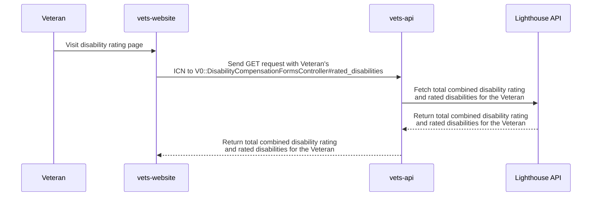

### Architecture Diagram

```mermaid
sequenceDiagram
    participant Veteran
    participant Frontend as vets-website
    participant Backend as vets-api
    participant Lighthouse as Lighthouse API

    Veteran->>Frontend: Visit disability rating page
    Frontend->>Backend: Send GET request with Veteran's<br/> ICN to V0::DisabilityCompensationFormsController#35;rated_disabilities
    Backend->>Lighthouse: Fetch total combined disability rating<br/> and rated disabilities for the Veteran
    Lighthouse-->>Backend: Return total combined disability rating<br/> and rated disabilities for the Veteran
    Backend-->>Frontend: Return total combined disability rating<br/> and rated disabilities for the Veteran
```
