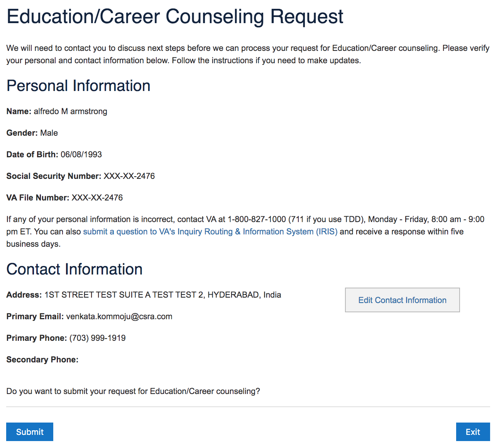

# Apply for Personalized Career Planning & Guidance (CH36)
- Launched May 10, 2021
- GitHub Label: [vsa-ebenefits](https://github.com/department-of-veterans-affairs/va.gov-team/#workspaces/vft-59c95ae5fda7577a9b3184f8/board?labels=vsa-ebenefits&repos=133843125&showPipelineDescriptions=false)
- Slack channel: [#vsa-ebenefits](https://dsva.slack.com/channels/vsa-ebenefits)
- Staging EBN link: https://sqa.eauth.va.gov/ebenefits/vre
- Form: https://www.vba.va.gov/pubs/forms/VBA-28-8832-ARE.pdf
- (staging) VA.gov link (unauth landing page): https://staging.va.gov/careers-employment/education-and-career-counseling/
- (staging) VA.gov link (tool page): https://staging.va.gov/careers-employment/education-and-career-counseling/apply-career-guidance-form-28-8832/introduction
- (prod) VA.gov link (unauth landing page): https://www.va.gov/careers-employment/education-and-career-counseling/
- (prod) VA.gov link (tool page): https://www.va.gov/careers-employment/education-and-career-counseling/apply-career-guidance-form-28-8832/introduction
- Current prototype: https://preview.uxpin.com/2dbde8d15bf667f5c584fe4a8a6d011cf9f0a14d#/pages/130194084

### Table of Contents

# Executive Summary
- [Abstract](#abstract)
- [User Problem Statement](#user-problem-statement)
- [Solution Goals](#solution-goals)
- [Assumptions](#assumptions)
- [Requirements and Constraints](#requirements-and-constraints)
- [Discovery Takeaways](#discovery-takeaways)
- [Solution Approach](#solution-approach)
- [Value Propositions](#value-propositions)
- [KPIs-OKRs](#kpis-okrs)

# Implementation Information
- [Status](#status)
- [Solution Narrative](#solution-narrative)
- [Team](#team)
- [Resources and Documentation](#resources-and-documentation)
- [Screenshots](#screenshots)

---

# Executive Summary

## Abstract

Veterans and related claimants can apply for "Chapter 36" benefits, or Education and Career Counseling benefits, through the OTED (Office of Transition and Economic Development). This is a very simple application for which we should attempt to prefill all possible fields.

## User Problem Statement

eBenefits, in its current legacy state, is no longer the best version of what can be provided to Veterans, their dependents and caregivers, so that they can quickly and easily apply and obtain the benefits they deserve.

## Solution Goals

### User Goals

- **Veterans:** Apply for Education/ Career Counseling at the VA.

### Business Goals

- Deprecate eBenefits, meet OTED office goals of better online submissions

## Assumptions

- Product will submit form to Central Mail, no other BE integration
- LOA3 users may be able to apply with one click

## Requirements and Constraints

- Application should be available for all users: UNAUTH, LOA1, and LOA3
- Excerpt from systems requirement doc: In response to the receipt of a 28-1900 - The system will display and check the following: Veteran or IDES (yes/no), service connected disability rating percentages and conditions (if 10% or more continue eligibility check); discharge other than dishonorable (continue eligibility check); served on or after September 16th 1940 (if yes to all four, Veteran is eligible to participate in an evaluation for chapter 31).

## Solution Approach

- Translate form to VA.gov, prefill logged in user info, submit to Central Mail. Current EBN functionality involves clicking a single button. 

## Value Propositions

### User Value

I can apply for CH36 benefits quickly and without mailing in a form or visiting a RO.

### Business Value

1. Sunset EBN
2. Increase CH36 applications

### KPIs-OKRs
#### KPIs
`Note: GA dashboard - https://analytics.google.com/analytics/web/?authuser=0#/dashboard/qKVD06_mTkyUhH52RYq0Vg/a50123418w177519031p176188361/`
- Conversion rate
  - Wizard-specific
    - % of people who land on wizard and start the application (Acquisition)  
    - % of skips in the wizard
    - number of referrals to another form
  - % of people who abandon form (Abandonment Rate) (Activitation)
    - where is the abandonment?  
  - % of people who complete the form  
  - number of people who complete the form  
- Customer satisfaction  
  - form has an increasing score value (Medallia?) 
- Product Health 
  - number of successful submissions
  - number of failed submissisons

##### Baseline KPIs
tbd

#### OKRs
1. Improve abandonment/conversion rate

2. Improve time to complete

--
## Go-to-Market
_How will Veterans find this product? How will they know it exists?_

- Comms isn't controlled by this team but discoverability may be a lever to pull
- Perhaps at account log-in/creation

---

## Results and Recommendations
### Results
- TBD after launch

### Recommendations
- TBD after launch
--- 

# Implementation Info

## Status

**March 24, 2020**  
- Kickoff with platform  

## Solution Narrative
- TBD

## Team
- VA Executive Sponsor `*`:
- VA Policy Expert(s):
- VA Digital Strategist(s) `*`:
- DEPO Product Lead: **Steve Kovacs** - steven.kovacs@va.gov  
- Product Manager: **Jason Wolf** - jwolf@governmentcio.com
- Designer: **James Adams** - jadams@governmentcio.com
- Frontend: **Jesse Cohn** - jesse.cohn@adhocteam.us
- Frontend: **Micah Chiang** - micah@adhocteam.us
- Backend: **Kathleen Crawford** - kcrawford@governmentcio.com
- Backend: **Derek Dyer** - ddyer@governmentcio.com

`*` = approval required for launch

## Resources and Documentation

- [Discovery](https://github.com/department-of-veterans-affairs/va.gov-team/tree/master/teams/vsa/teams/ebenefits/features/apply-CH36-VRE-counseling/discovery)
- [Research and Design](https://github.com/department-of-veterans-affairs/va.gov-team/tree/master/teams/vsa/teams/ebenefits/features/apply-CH36-VRE-counseling/research-design)

## NOTES

Form 8832: https://www.vba.va.gov/pubs/forms/VBA-28-8832-ARE.pdf

## eBenefts Screenshot

