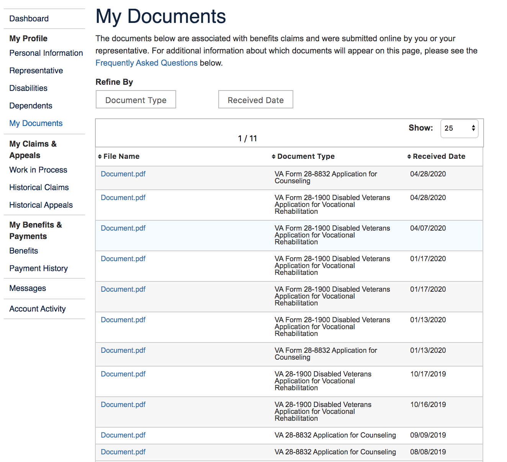
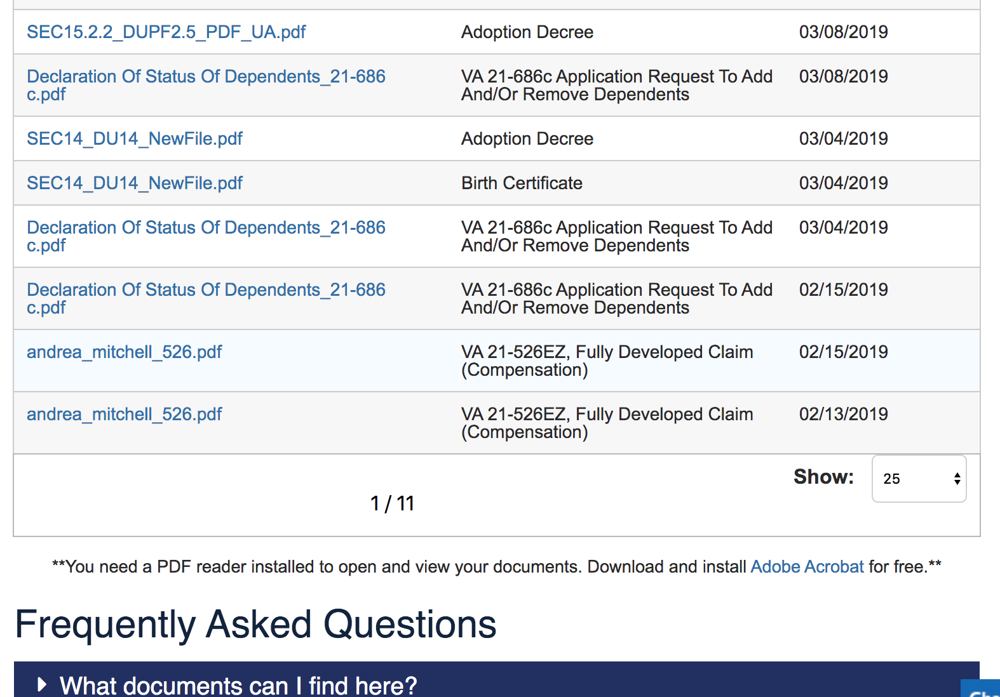

# View My Documents

## WIP

## Considerations

- Claim Status Tool already has list of socuments for that particular claim under File Upload feature
  - IOW this may just be a matter fo reframing that functionality
- Lighthouse team is connecting to eFolder through VBMS service (https://github.com/department-of-veterans-affairs/vets-api/blob/master/modules/claims_api/app/workers/claims_api/vbms_uploader.rb#L66) 
- Ruby gem for VBMS is here: https://github.com/department-of-veterans-affairs/connect_vbms
  - Documentation is internal

## eBenefits Screenshots

---

