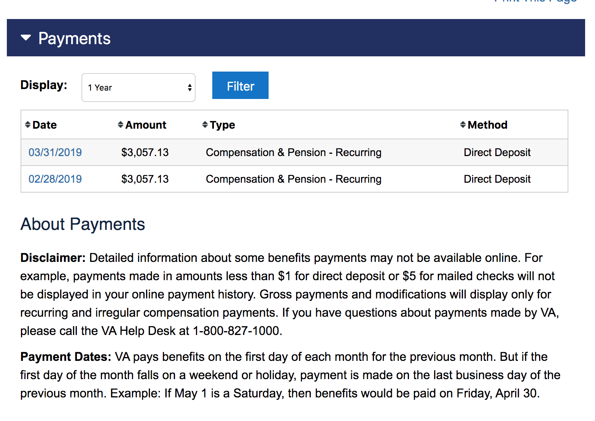
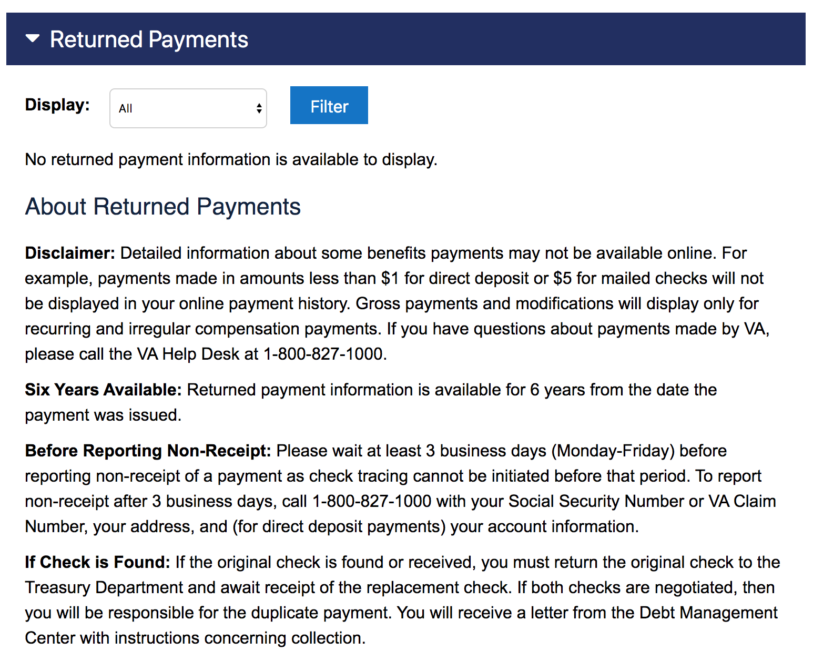
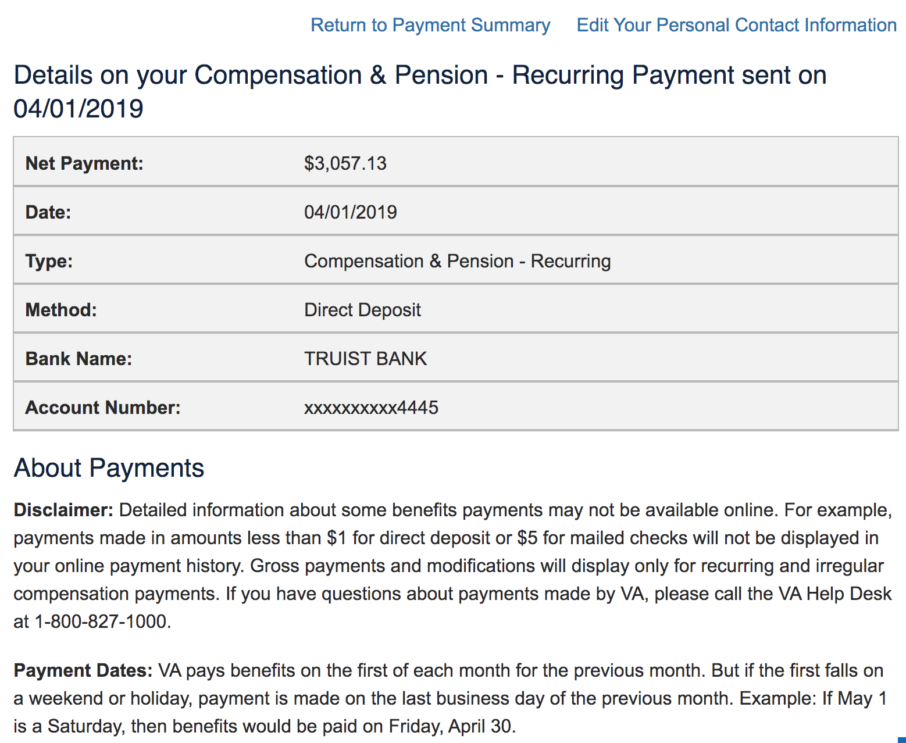

# View your VA payment history
`WIP`
- GitHub Label: [vsa-ebenefits](https://github.com/department-of-veterans-affairs/va.gov-team/#workspaces/vft-59c95ae5fda7577a9b3184f8/board?labels=vsa-ebenefits&repos=133843125&showPipelineDescriptions=false)
- Slack channel: [#vsa-ebenefits](https://dsva.slack.com/channels/vsa-ebenefits)
- Old links: 
  - [My Payment History - http://www.ebenefits.va.gov/ebenefits/payments](http://www.ebenefits.va.gov/ebenefits/payments)  
- Staging link: https://staging.va.gov/va-payment-history/payments/
- va.gov link: https://www.va.gov/va-payment-history/
- Current Prototype: https://preview.uxpin.com/546893e0b210374a0734240e0ca9fccc2e02ed11#/pages/129039987 

### Table of Contents

# Executive Summary
- [Abstract](#abstract)
- [User Problem Statement](#user-problem-statement)
- [Solution Goals](#solution-goals)
- [Assumptions](#assumptions)
- [Requirements and Constraints](#requirements-and-constraints)
- [Discovery Takeaways](#discovery-takeaways)
- [Solution Approach](#solution-approach)
- [KPIs and OKRs](#kpis-and-okrs)

# Implementation Information
- [Status](#status)
- [Solution Narrative](#solution-narrative)
- [Team](#team)
- [Resources and Documentation](#resources-and-documentation)
- [Screenshots](#screenshots)

---

# Executive Summary

## Abstract

Migrate "View your VA payment history" from eBenefits to VA.gov. View Payment History enables logged in users to view a list of payments made by the VA, and details about each payment.

## User Problem Statement

- As a Veteran I need to understand the payments the VA has made to me so that I can check them for accuracy and troubleshoot them when necessary.

## Solution Goals

The eBenefits Team will migrate this functionality from EBN to the modern front door at VA.gov, conducting research along the way to make sure Veterans are able to achieve their goals quicly and efficiently.

### User Goals

- I can find a page to view my Payment History
- I can see a list of my payments
- I can see a list of my returned payments
- I can read information about what payments are displayed in these lists, and what payments are not, and what to do if I think something is wrong
- I can sort the list of payments by date, amount, and type
- I can click on a payment to see details about that payment

### Business Goals

- Sunset eBenefits

## Assumptions

- Veterans can have hundreds of payments, so there should be some way to paginate/ filter top columns
- We assume "returned payments" arrive from the same service as regular payments
- Endpoint is theoretically BGS `PaymentInformationService` at http://bepdev.vba.va.gov/vrm-ws/PaymentInformationService?WSDL
  - ESCP request reproved as of 20200212

## Requirements and Constraints

- Only a logged in, LOA3-proofed, Veteran should be able to find and view their payment history

## Solution Approach

- Competitive analysis: Review other payment history lists
- Create designs
- Build BE integration and render data to FE
- Write e2e tests
- Perform usability tests
- Follow launch checklist

## KPIs and OKRs
### KPIs
- % of View Payment History traffic (EBN / VA.gov)
- Time to view My Payment History

#### Baseline KPIs
- Time to view My Payment History: tbd

### OKRs

**Objective 1:** Migrate out of eBenefits and into VA.gov
- Key result #1: `100%` of the functionality is addressed in VA.gov by July 2020 (for view payment history)
- Key result #2: `100%` of the EBN traffic is moved to VA.gov by August 2020 (for view payment history)
  - Establish the number and quality of gateway funnels `n` to this feature and increase it by `m`

**Objective 2:** Decrease the time taken to view payment history
- Key result #1: Decrease time to acquire data from `1 minute` to less than `30s`
 
--- 

## Go-to-market Strategy
- Update link on VA.gov to not revert back to eBenefits
- Possibly update lanugage on eBenefits to repoint
- Redirect eBenefit feature to VA.gov

## Target Launch Date
- Target launch: December 2020
- Post launch review: January 2021

--- 
 
## Results and Recommendations
### Results
- TBD after launch

### Recommendations
- TBD after launch
--- 

# Implementation Info

## Status

- March 2020: Discovery, initial design sketches

## Solution Narrative
- March 2020: Discover how the current application works, analyze existing products & features, create initial designs

## Team

- VA Executive Sponsor`*`: On Request
- VA Policy Expert(s): On Request
- DEPO`*`: TBD
- Product Manager`*`: Jacob Worrell
- Design Lead: TBD
- Eng Lead: TBD
- Designer(s): TBD
- Content Writer(s): 
- Front-end Engineer(s): TBD
- Back-end Engineer(s): TBD

`*` = approval required for launch

## Resources and Documentation

- [Discovery](#)
- [Research and Design](#)

### eBenefits Screenshots

