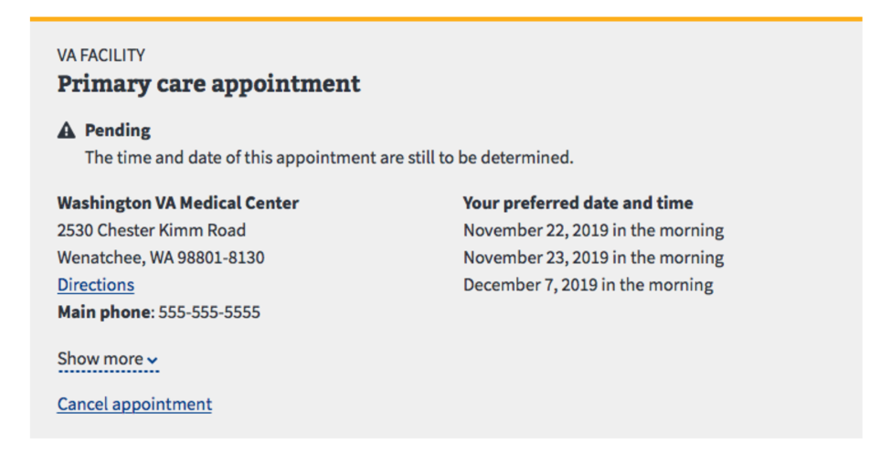
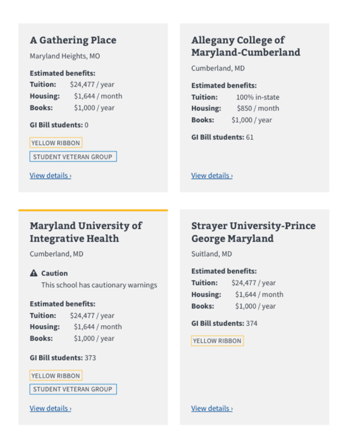
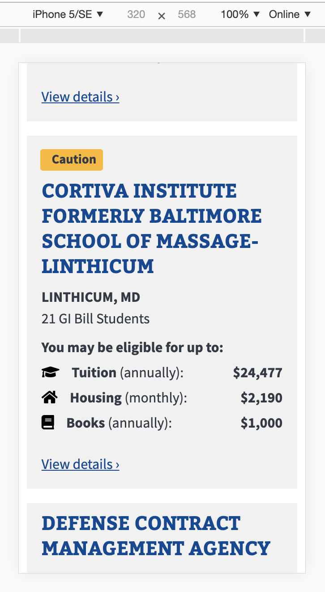
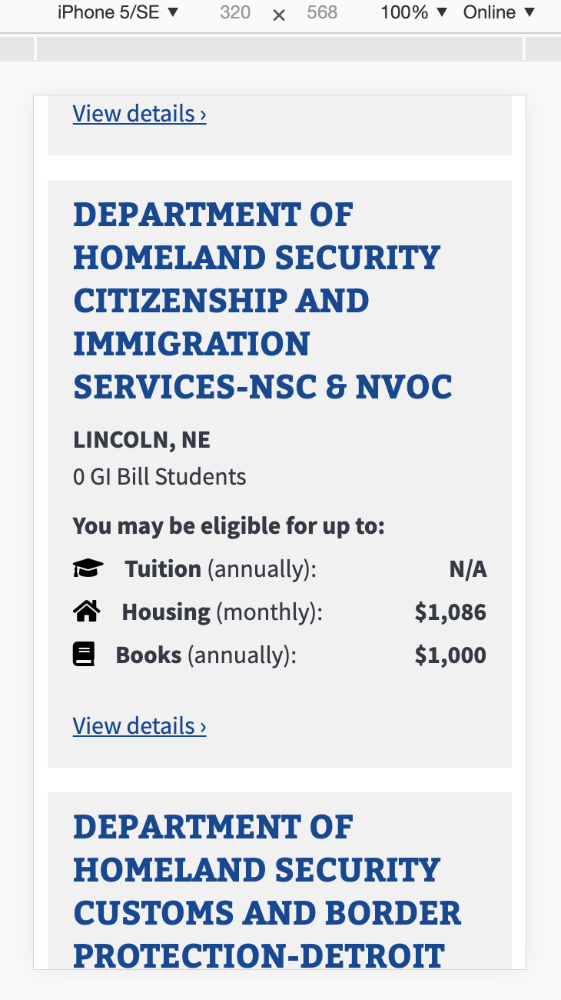

# Discovery Artifacts for Caution Flag Enhancements

## Design artifacts

[Mural for VA Design System Audit of Cards (November 2019)](https://app.mural.co/t/departmentofveteransaffairs9999/m/departmentofveteransaffairs9999/1574086026453/e8ba87ed25507f73b7c0b5c40267a3ae95a20b09) 
Includes several concepts that we could explore for our work on the Search Results page and the School Profile page.  

#### From DEPO:  

* Warning message color: https://design.va.gov/design/color-palette (down the page) 
* Feedback icons: https://design.va.gov/design/icons#feedback (warning)
* Design System: Warning Alert: https://design.va.gov/components/alertboxes#warning  

*Figure 1: Example of a caution card for a medical facility*  

*Figure 2: Medical facility variations*  
  

*Figure 3: Comparison Tool Mobile Caution Cards*  
  

## Questions for stakeholders

#### Search Results Page
* In the Comparison Tool Search Results page, two types of yellow flags are typically used in the school cards: Caution Flags and School Closing Flags. In figure 3 above, you have an example showing a caution flag. What's the plan for when you also need to display school closing warnings? Will you stack the warning details together?

* Figure 3 above displays tags for Veteran Programs. We currently have 9 listed Veteran Programs with two of them potentially being removed (Distance Learning and Online Only). Even if the tags wrapped, that would still increase the height of the cards significantly if all 7 programs were listed. Many schools provide a great deal of Veteran Programs. Is the plan to include a summarized view of them and maybe show only the top 2/3 programs? 

* Are you moving towards a singular, uniform display height for all cards regardless of the card's details? We have some schools with very long names that can wrap over 4 or 5 times on mobile displays. See examples below:

 
 

#### School Profile Page
* ...
