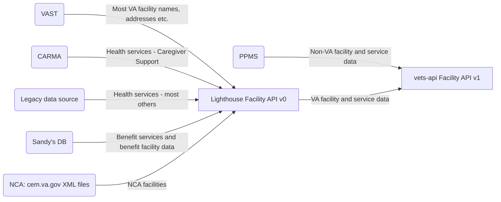
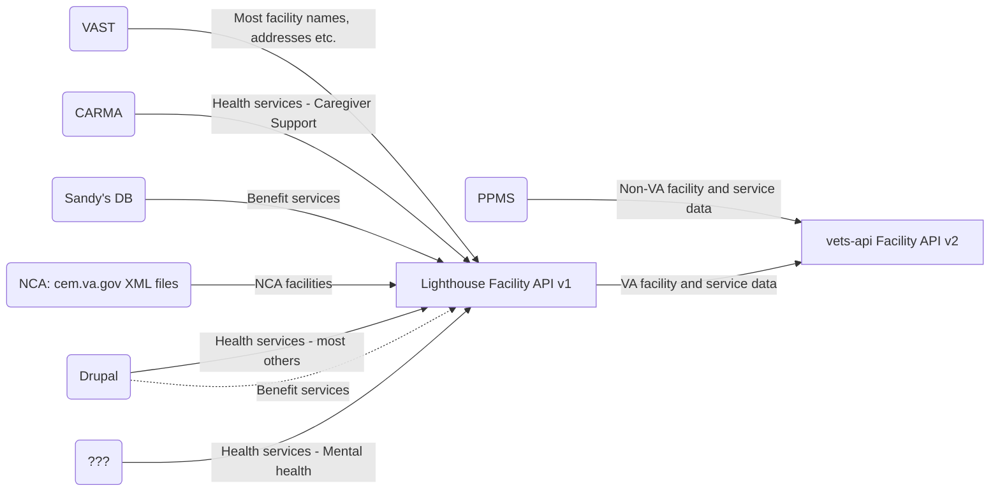

# Facilities API
Last updated: May 10, 2024

There are 2 versions of a Facilities API that are powered by vets-api. Both are owned by the Sitewide Facilities team: 
1. `facilities_api/v#/va` - referred to as **Modern Facilities API** below
2. `v#/facilities/va` - referred to as **Legacy Facilities API client** below

## Table of contents
[Modern Facilities API](https://github.com/department-of-veterans-affairs/va.gov-team/tree/master/products/facilities/facilities-api#modern-facilities-api)
* [Code](https://github.com/department-of-veterans-affairs/va.gov-team/tree/master/products/facilities/facilities-api#code)
* [Customers](https://github.com/department-of-veterans-affairs/va.gov-team/tree/master/products/facilities/facilities-api#customers)
* [Data sources](https://github.com/department-of-veterans-affairs/va.gov-team/tree/master/products/facilities/facilities-api#data-sources)
* [Lighthouse Facilities API product dependencies / scope](https://github.com/department-of-veterans-affairs/va.gov-team/tree/master/products/facilities/facilities-api#lighthouse-facilities-api-product-dependencies--scope)

[Legacy Facilities API client](https://github.com/department-of-veterans-affairs/va.gov-team/tree/master/products/facilities/facilities-api#legacy-facilities-api-client)
* [Code](https://github.com/department-of-veterans-affairs/va.gov-team/tree/master/products/facilities/facilities-api#code-1)
* [Customers](https://github.com/department-of-veterans-affairs/va.gov-team/tree/master/products/facilities/facilities-api#customers-1)
* [Data sources](https://github.com/department-of-veterans-affairs/va.gov-team/tree/master/products/facilities/facilities-api#data-sources-1)

## Modern Facilities API
Is built as a vets-api module, and powers the Facility Locator, the CTA widget on some Healthcare pages, and the 1010 health app(?).

### Code
https://github.com/department-of-veterans-affairs/vets-api/tree/master/modules/facilities_api
Current versions: 
* V1 = maps to Lighthouse V0. LH V0 slated for deprecation June 14, 2024.
* V2 = maps to Lighthouse V1. Shipped May 10, 2024

Uses the `VADOTGOV_FacilityLocator` API consumer's API key to access Lighthouse

### Customers
1. Facility Locator
2. 1010 Health apps team - PM: Heather Justice (May 2024)
3. CTA widget code on Health apps pages:
    * Medical records
    * Lab results
    * Prescriptions
    * Secure messaging
    * Appointments 

### Data sources
- Lighthouse Facilities API (/va endpoint) -- Lighthouse centralizes data from a variety of other upstream sources, including: 
  - [**VHA**] VAST: source of truth for VHA facility locations, hours, status (open vs. closed), including VA Medical Centers, VA Clinics, and all types of Vet Centers. 
  - [**VBA**] Sandy's DB: source of truth for VBA facility locations, hours, status (open vs. closed). Sandy's DB is manually maintained by Michelle Middaugh. Long-term: Sandy's DB will be deprecated when VBA facility information is fully migrated to Drupal, modernized facilities are launched, and Drupal becomes source of truth.
  - [**NCA**] cem.va.gov: The NCA TeamSite, cem.va.gov, hosts two XML files that Lighthouse scrapes for NCA records, below, and LH augments that data with some fields pulled from CDW via the table SQL40.BISL_GIS_SpatialData.[DOEx].[v_FacilityLocator_NCA]:
    - national.xml which contains all National VA Cemeteries 
    - cems.xml which has State, Local, and Tribal Cemeteries
- PPMS / Community Care (/ccp endpoint)

#### Inaccurate Data
Facility Locator documentation includes additional info on the [Process for reporting inaccurate data in Facility Locator ](https://github.com/department-of-veterans-affairs/va.gov-team/blob/master/products/facilities/facility-locator/reporting-inaccurate-data.md).

#### vets-API Facilities API v1

#### vets-API Facilities API v2

### Lighthouse Facilities API product dependencies / scope
In the event that Lighthouse Facilities API releases a new version or is deprecating an old endpoint, the following interactions need to be kept in mind and tested / updated accordingly:

#### Products/features using facilities-api calls with LH Facilities API data

- Facility pages (VAMC, Vet Center, VBA Regional Offices):
  - Other locations list 
  - Mini map - LH request returns the lat/long used to generate the maps
- Facility Locator UI
  - Facilities returned from searches
  - Facility detail page contents for non-modernized facilities (currently: Cemeteries, Benefits offices), e.g. https://www.va.gov/find-locations/facility/nca_907
  - Urgent care > Service type filter options. These options are combined with PPMS data from outside LH API & presented as a single list.
  - Emergency care > Service type filter options. These options are combined with PPMS data from outside LH API & presented as a single list.
- CTA widget on healthcare apps pages (Medical records, Appointments, Prescription refill, Secure messaging, Lab/test results): uses Facility API user and calls facility-api in order to return Cerner facility data for logged in users 

#### Products/features integrated directly with LH Facilities API data (_not_ via facilities-api):

- Facility pages data (VAMC, Vet Center, VBA Regional Office): e.g. name, location info, geocoding (pull)
- Facilities CMS migration (cms-overlay). Drupal does **not** route through the vets-api facilities-api. However: in cases where Drupal is the source of truth and provides data to Lighthouse, the facilities-api then also receives/ contains that info via the Lighthouse Facilities API.Includes:
  - Facility statuses (push)
  - Operating Status
  - Detailed Health Services (push)
  - Health Care System
    - health connect phone
  - Core Fields
    - Mental Health phone numbers (push)
    - Facility URL (not yet used)
 - Flagged facilities migration script, [Delete portion](https://github.com/department-of-veterans-affairs/va.gov-cms/blob/main/READMES/migrations-facility.md#delete)

More information on Drupal content models that interact with the Lighthouse Facilities API is available within Drupal's content model documentation: https://prod.cms.va.gov/admin/structure/cm_document?title=&documented_entity_op=contains&for=&stakeholder=All&pulled=All&pushed=1112&notes=

#### Products/features NOT YET dependent on LH Facilities API data but roadmapped

- Facility Locator UI
  - Contents of the Service Type filter for any Facliity type - [#15541](https://github.com/department-of-veterans-affairs/va.gov-cms/issues/15541)

#### Products/features NOT dependent on LH Facilities API data 

- Facility Locator UI
  - Contents of the Facility Type filter
- PPMS Community care, Community pharmacy, and provider training data, including Service type typeahead

## Legacy Facilities API Client
Is built as an API client, and enables any other code in vets-api to invoke the Lighthouse facilities API.

### Code
https://github.com/department-of-veterans-affairs/vets-api/tree/master/lib/lighthouse/facilities
Current versions: 
* V0 = maps to Lighthouse V0. LH V0 deprecated June 14, 2024.
* V1 = maps to Lighthouse V1. Shipped April 10, 2024

Uses the `VADOTGOV_FacilityLocator` API consumer's API key to access Lighthouse

### Customers
* VA Mobile app

### Data sources
- Lighthouse Facilities API

