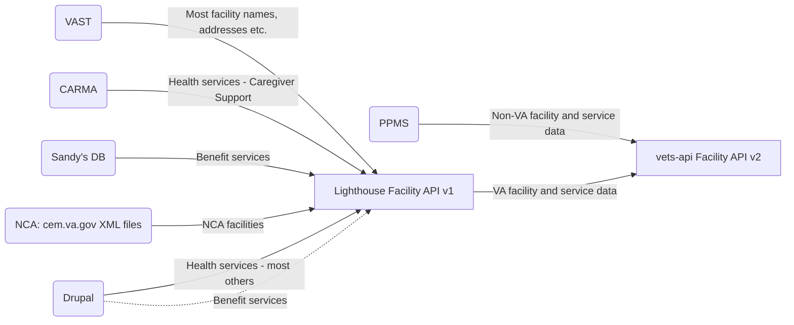

# Facilities API

There are 2 versions of a Facilities API that are powered by vets-api. Both are owned by the Sitewide Facilities team: 
1. `facilities_api/v#/va` - referred to as **Modern Facilities API** below
2. `v#/facilities/va` - referred to as **Legacy Facilities API client** below

## Table of contents
* [Modern Facilities API](https://github.com/department-of-veterans-affairs/va.gov-team/tree/master/products/facilities/facilities-api#modern-facilities-api)
  * [Code](https://github.com/department-of-veterans-affairs/va.gov-team/tree/master/products/facilities/facilities-api#code)
  * [Data sources](https://github.com/department-of-veterans-affairs/va.gov-team/tree/master/products/facilities/facilities-api#data-sources)
  * [facilities-api Consumers](https://github.com/department-of-veterans-affairs/va.gov-team/tree/master/products/facilities/facilities-api#customers)
  * [Lighthouse Integration](#lighthouse-integration)
  * [Working with the facilities-api](#working-with-the-facilities-api)
* [Legacy Facilities API client](https://github.com/department-of-veterans-affairs/va.gov-team/tree/master/products/facilities/facilities-api#legacy-facilities-api-client)
  * [Code](https://github.com/department-of-veterans-affairs/va.gov-team/tree/master/products/facilities/facilities-api#code-1)
  * [Legacy API client consumers](https://github.com/department-of-veterans-affairs/va.gov-team/tree/master/products/facilities/facilities-api#customers-1)
  * [Data sources](https://github.com/department-of-veterans-affairs/va.gov-team/tree/master/products/facilities/facilities-api#data-sources-1)

## Modern Facilities API
The `facilities-api` provides endpoints to retrieve data about facilities from multiple upstream data sources, including Lighthouse and PPMS.

### Code
https://github.com/department-of-veterans-affairs/vets-api/tree/master/modules/facilities_api
`facilities-api` is built as a vets-api module

### Upstream Data sources
- **PPMS** (Provider Profile Management System) Community Care -- `/ccp` endpoint -- PPMS is a data warehouse that stores details of Community Care providers and services. It provides a minimal API.
- **Lighthouse Facilities API** -- `/va` endpoint -- Lighthouse centralizes data from a variety of other upstream sources, including: 
  - [**VHA**] VAST (Veteran Affairs Site Tracking) - VHA database that is source of truth for VHA facility locations, hours, status (open vs. closed), including VA Medical Centers, VA Clinics, and all types of Vet Centers. 
  - [**VBA**] Sandy's DB: source of truth for VBA facility locations, hours, status (open vs. closed). Sandy's DB is manually maintained by Michelle Middaugh. Long-term: Sandy's DB will be deprecated when VBA facility information is fully migrated to Drupal, modernized facilities are launched, and Drupal becomes source of truth.
  - [**NCA**] cem.va.gov: The NCA TeamSite, cem.va.gov, hosts two XML files that Lighthouse scrapes for NCA records, below, and LH augments that data with some fields pulled from CDW via the table SQL40.BISL_GIS_SpatialData.[DOEx].[v_FacilityLocator_NCA]:
    - national.xml which contains all National VA Cemeteries 
    - cems.xml which has State, Local, and Tribal Cemeteries
  - **VA.gov Drupal CMS** - Content management system operated by OCTODE where business administration editors enter single source of truth data about specific Facilities and services offered at those locations. Some Drupal data is pushed to Lighthouse, more information on that data relationship is available in [facility migration docs](https://github.com/department-of-veterans-affairs/va.gov-cms/blob/main/READMES/migrations-facility.md) & in [Drupal's content model documentation for Facility API data pushes](https://prod.cms.va.gov/admin/structure/cm_document?title=&documented_entity_op=contains&for=&stakeholder=All&pulled=All&pushed=1112&notes=)

### Technical diagrams 

#### Inaccurate Data
Facility Locator documentation includes additional info on the [Process for reporting inaccurate data in Facility Locator ](https://github.com/department-of-veterans-affairs/va.gov-team/blob/master/products/facilities/facility-locator/reporting-inaccurate-data.md), depending on the nature of the data and who owns it upstream.

#### vets-API Facilities API v2

### facilities-api Consumers

1. Facility Locator: uses the facilities-api for facility and service search and filtering
2. 1010 Health apps team - PM: Heather Justice (May 2024)
3. CTA widget code on Health apps pages: on the following pages, KISS data uses the facilities-api to display facility listings, in order to show a logged-in Veteran the various facilities where they have received care (if those facilities use Cerner for medical records): 
    * Medical records
    * Lab results
    * Prescriptions
    * Secure messaging
    * Appointments
  
### Lighthouse integration 
The facilities-api heavily integrates the Lighthouse Facilities API and it is somewhat difficult to separate the topics of the `facilities-api`, the Lighthouse Facility API, and the behavior of the Facility Locator. This section should help. 

Lighthouse Facilities API Documentation: https://developer.va.gov/explore/api/va-facilities

* `facilities-api` V1 = mapped to Lighthouse V0. Deprecated.
* `facilities-api` V2 = maps to Lighthouse V1. Shipped May 10, 2024

#### Lighthouse API user/key
Lighthouse provides API Consumers who have associated API keys. Traffic is measured and rate limits are set **per consumer** not per key.

`facilities-api` uses the **`VADOTGOV_FacilityLocator` consumer** and associated API key. The `VADOTGOV_FacilityLocator` consumer has a single API key & rate limit.

**This API key is shared** 
Right now this API key only accesses the LH Facilities API. But within Lighthouse, the rate limit for API Keys is shared across all accessed APIs. If this key were used to access multiple APIs, traffic spikes will affect the rate limit for all other APIs using the same key. 
[Background on shared API keys (Slack)](https://dsva.slack.com/archives/CUB5X5MGF/p1695666665300929), originally related to the Forms product.

#### **Rate limits**
Rate limits are applied _**per consumer**_ to _**all APIs**_ accessed by that consumer.
As of 12/23, the API rate limit is **2,000 requests/min.** (The 2,000 requests/min. rate limit applies to the collective traffic across all APIs accessed by the consumer/key.)

If/when we request rate limit changes, that rate limit will be set for all APIs accessed by the `VADOTGOV_FacilityLocator` API consumer, even if products are using different API keys. 

More info on [rate limit changes (Github)](https://github.com/department-of-veterans-affairs/va.gov-team/blob/master/products/find-a-va-form/engineering/troubleshooting.md#request-api-limit-increase).

#### Error messages
When LH API calls hit a rate limit... TODO: Verify what happens and document here and for Facility Locator

#### Request API limit increase
If 429 errors occur in Datadog or Sentry, this indicates that traffic is high and we are being throttled by an API rate limit / requests are being rejected. We can request API limit increases for specific endpoints, and the Lighthouse Facilities team can help expedite approvals. Rate limit changes will affect all users of the API key, across used APIs. 

To request a rate limit increase:
1. Ping #cms-lighthouse in DSVA slack, and explain the issue / what you're seeing to the Lighthouse Facilities API team.
2. LH can provide specifics on the current rate limit for a given endpoint, and will need to be increased. They can also help suggest the new limit. If you already know this info, skip to 3.
3. Visit https://developer.va.gov/support/contact-us. Fill out the form with endpoint, limit, and limit increase information/
4. Share with #cms-lighthouse that request is made. Lighthouse team can then help expedite approval.

Typically, we may want to reduce the limit again after traffic spikes end. If that's true, create a ticket to track requesting the lower limit. 

### Lighthouse API updates
In the event that LH releases a new version or is deprecating an old endpoint, the following interactions need to be updated & tested accordingly:

#### Products/features using facilities-api calls with LH Facilities API data

- Facility pages (VAMC, Vet Center, VBA Regional Offices):
  - Other locations list 
  - Mini map - LH request returns the lat/long used to generate the maps
- Facility Locator UI
  - Facilities returned from searches
  - Facility detail page contents for non-modernized facilities (currently: Cemeteries, Benefits offices), e.g. https://www.va.gov/find-locations/facility/nca_907
  - Urgent care > Service type filter options. These options are combined with PPMS data from outside LH API & presented as a single list.
  - Emergency care > Service type filter options. These options are combined with PPMS data from outside LH API & presented as a single list.
- CTA widget on healthcare apps pages (Medical records, Appointments, Prescription refill, Secure messaging, Lab/test results): uses Facility API user and calls facility-api in order to return Cerner facility data for logged in users 

#### Products/features integrated directly with LH Facilities API data (_not_ via facilities-api):
Noting here because they are otherwise easy to lose track of: 
- Facility pages data (VAMC, Vet Center, VBA Regional Office): e.g. name, location info, geocoding (pull)
- Facilities CMS migration (cms-overlay). Drupal does **not** route through the vets-api facilities-api. However: in cases where Drupal is the source of truth and provides data to Lighthouse, the facilities-api then also receives/ contains that info via the Lighthouse Facilities API.Includes:
  - Facility statuses (push)
  - Operating Status
  - Detailed Health Services (push)
  - Health Care System
    - health connect phone
  - Core Fields
    - Mental Health phone numbers (push)
    - Facility URL (not yet used)
 - Flagged facilities migration script, [Delete portion](https://github.com/department-of-veterans-affairs/va.gov-cms/blob/main/READMES/migrations-facility.md#delete)

#### Products/features NOT YET dependent on LH Facilities API data but roadmapped

- Facility Locator UI: Contents of the Service Type filter for any Facility type - [#15541](https://github.com/department-of-veterans-affairs/va.gov-cms/issues/15541)

#### Products/features NOT dependent on LH Facilities API data 

- Facility Locator UI: Contents of the Facility Type filter
- PPMS Community care, Community pharmacy, and provider training data, including Service type typeahead

### Working with the Facilities API

You will need to run vets-api locally to modify the facilities-api itself. 
* [Sandbox](https://github.com/department-of-veterans-affairs/devops/blob/master/ansible/deployment/config/fwdproxy-vagov-sandbox.yml)
* [Production](https://github.com/department-of-veterans-affairs/devops/blob/master/ansible/deployment/config/fwdproxy-vagov-prod.yml)

For PPMS local development: PPMS is hard to work with due to network restrictions. Follow steps in [how to connect vets-api to PPMS for local development](https://github.com/department-of-veterans-affairs/va.gov-team/tree/master/products/facilities/facilities-api/how-to-connect-vets-api-to-PPMS-for-local-development.md) to configure your setup.

## Legacy Facilities API Client
The Legacy Facilities API client enables any other code in vets-api to invoke the Lighthouse facilities API.

Usage is currently best documented [here](https://github.com/department-of-veterans-affairs/va.gov-cms/issues/18351#issuecomment-2211459157) in comments.

### Code
https://github.com/department-of-veterans-affairs/vets-api/tree/master/lib/lighthouse/facilities
Current versions: 
* V0 = maps to Lighthouse V0. LH V0 deprecated June 14, 2024.
* V1 = maps to Lighthouse V1. Shipped April 10, 2024

Uses the `VADOTGOV_FacilityLocator` API consumer's API key to access Lighthouse

### Facilities API client consumers
* VA Mobile app

### Data sources
- Lighthouse Facilities API

