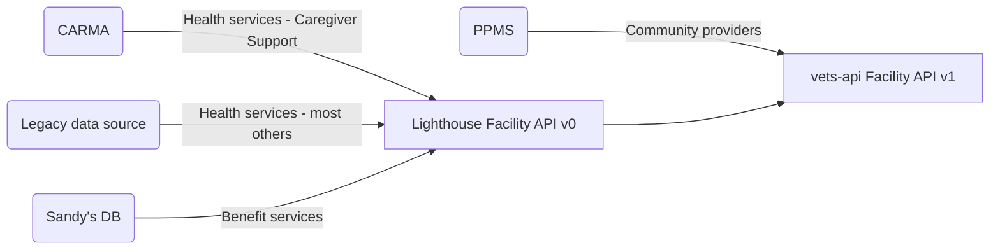
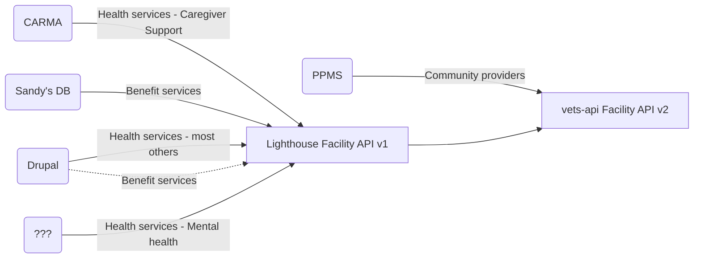

# Facilities API
Last updated: May 10, 2024

## Code
https://github.com/department-of-veterans-affairs/vets-api/tree/master/modules/facilities_api
Current versions: 
* V1 = maps to Lighthouse V0. LH V0 slated for deprecation June 1, 2024.
* V2 = maps to Lighthouse V1. Shipped May 10, 2024

## Customers
1. Facility Locator
2. 1010 Health apps team - PM: Heather Justice (May 2024)

## Data sources
Lighthouse Facilities API (endpoint?)
PPMS / Community Care (/ccp endpoint)

### vets-API Facilities API v1

### vets-API Facilities API v2

