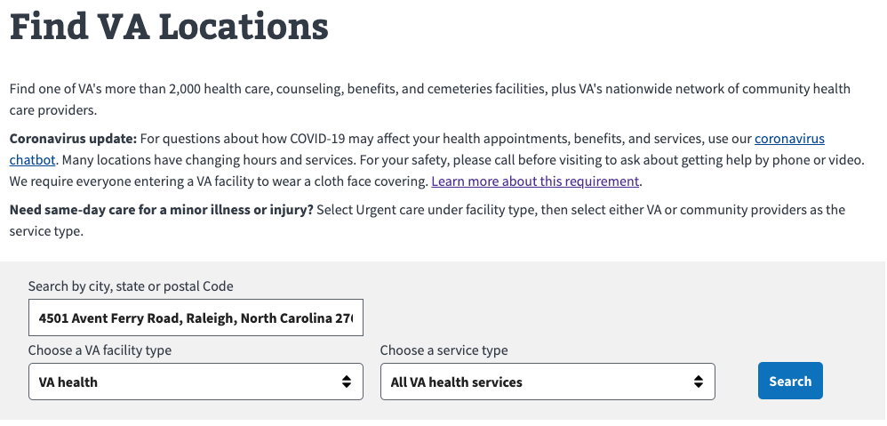
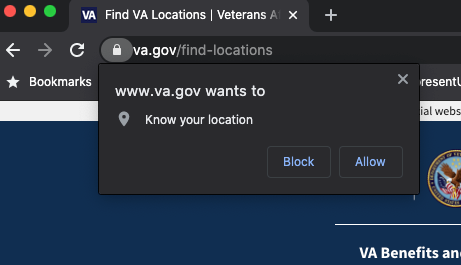
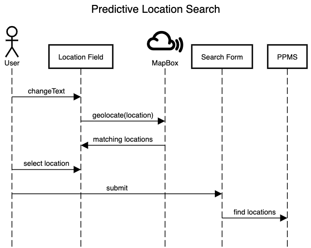

# Mapbox Geocoding Research

Michael Pelz-Sherman

Sr. Front-end Engineer

GovernmentCIO

## [Issue 9410: [Discovery] "Did you mean" search parameters](https://github.com/department-of-veterans-affairs/va.gov-team/issues/9410)

## Short-term Improvements

Turn off autocomplete: [https://github.com/department-of-veterans-affairs/vets-website/pull/13370](https://github.com/department-of-veterans-affairs/vets-website/pull/13370) (merged 7/6/2020)

## Useful Links

*   [https://docs.mapbox.com/api/search/#geocoding](https://docs.mapbox.com/api/search/#geocoding)
*   Mapbox Geocoding Playground: [https://docs.mapbox.com/search-playground/](https://docs.mapbox.com/search-playground/)

## Current Solution

The Facility Locator page currently operates as follows:

*   There is a single text field in which the user is prompted to “Search by city, state or postal Code”
*   When the page is loaded, we try to find the user's location using the [browser’s native geolocation support](https://developer.mozilla.org/en-US/docs/Web/API/Navigator/geolocation). On the first visit to VA.gov, the browser prompts the user to grant permission to our application, like so:

    *   It would be interesting to know how many users do NOT select “Allow”.
    *   This location is used as a fallback if no MapBox-geocoded locations are found.
*   There is no auto-completion of the user input. Input is not evaluated at all until the form is submitted.
*   The function that performs the geocoding is [genBBoxFromAddress](https://github.com/department-of-veterans-affairs/vets-website/blob/master/src/applications/facility-locator/actions/index.js#L208). It calls the MapBox Javascript API’s [forwardGeocode](https://docs.mapbox.com/api/search/#forward-geocoding) function, which “allows you to look up a single location by name and returns its geographic coordinates” - a bounding box array in the form [minX,minY,maxX,maxY]. These coordinates are passed to the search API and used to filter the matching facilities that fit inside the coordinates.
*   We are using the @mapbox/mapbox-sdk npm package, v. 0.10.0, which supports predictive/interactive geolocation. This was released 3 months ago. It appears we are keeping this up to date via [dependabot](https://dependabot.com/). We should be vigilant about automated updates to this package, but it seems very unlikely that MapBox will introduce breaking changes to this core functionality.
*   There is currently no opportunity for the user to interact with the geocoding results from MapBox and make a selection. The location string is sent to MapBox "behind the scenes", and we just take the first match. We could improve this fairly easily by using “predictive search”, showing the list of matching place names in a scrolling div under the text field, e.g.

MapBox returns a maximum of 10 locations. This limit can be adjusted lower if needed.

If we decide to implement predictive search, we should use the [Autocomplete](https://design.cms.gov/components/autocomplete/) component from the VSP design team. However, this component has known 508 compliance issues, which should be addressed, perhaps by the VSP team. Screen readers will speak every character typed, then the full word, which may collide with the speaking of the search results. It’s unclear to me at this time what, if anything, can be done about this.

## Investigation

For the purposes of this effort, only MapBox and native geolocation have been considered.

Google Maps API is a widely used competitor of MapBox, but has been deemed too expensive and therefore will not be considered here.

*   _Does the tech geolocate the user to improve address predictions?_
    *   We use native browser geolocation, and we can provide that info to MapBox. MapBox has a “proximity bias” feature that favors results that are closer to a specific geographic location. This could be helpful if the user searches for a city with a common name, (e.g. “Bloomington”). We are not using proximity bias currently. Most users probably know to enter a state to disambiguate their city.
*   _Can the tech handle addresses such as APOs, FPOs?_
    *   As long as a city and state are provided, the MapBox geocoder will ignore any text that doesn’t match anything. However, APO and FPO addresses are not included in the MapBox geocoding results. Standard street addresses must be provided in order to get an exact match. 
*   _Does the tech standardize the address according to the official postal format?_
    *   MapBox does provide the user’s location in a standardized format, e.g. “4501 Avent Ferry Road, Raleigh, North Carolina 27606, United States”. This is not necessarily the same as the USPS standard format though. While the benefit to the user is unclear, we could use the [USPS address verification API](https://www.usps.com/business/web-tools-apis/#api) to achieve this if desired.
*   _How are fake addresses handled?_
    *   Again, as long as a city and state are provided, MapBox will ignore any text that doesn’t match anything.
*   _How many characters must be entered before results are suggested?_
    *   Depends on the implementation. Only one character can trigger a search if we want.
*   _How are results restricted (limited to state? Country?)_
    *   We currently limit search results to the US and territories (Puerto Rico, Guam, etc.)
*   _How will parameters be impacted by user interaction with map?_
    *   Currently the search results are updated as the map is panned/zoomed. We do not update the search field.
*   _How will suggested options be presented for users of assistive tech (508 compliance)?_
    *   MPS to meet with Jennifer Strickland on 7/7 to discuss. Autocomplete or “Did You Mean” behavior may be difficult for blind users.
*   _Determine if our current version of Mapbox will allow this functionality (do we need to move to API/other component?)_

	MapBox does a good enough job of geocoding for our purposes, in my opinion. There is no need to investigate alternatives at this time.

## Proposed Predictive Location Search Implementation

## Test Scenarios

 Identify set of test scenarios to help evaluate the tech/prototype, such as

*   Same city name found in more than one state (such as Hollywood)
    *   Must enter a state to disambiguate. I don’t think this is a big problem since users typically know what state they are in.
*   Location entered as state abbreviation vs full state name
    *   The above scenarios are already handled by turning off autocomplete.
*   5 digit house numbers vs zip codes
    *   MapBox is pretty good at figuring out whether a number entered is a zip code or a street address.
    *   “27606 Main St” -> Bedford, MD
    *   “27606” -> Raleigh, NC
*   Test with/without location bias
    *   Can do this using the [MapBox Geocoding Playground](https://docs.mapbox.com/search-playground). Could be useful in cases where the user doesn’t enter a state, but seems very uncommon.
*   Test number of characters needed as input to generate solid result list
    *   Using the [MapBox Geocoding Playground](https://docs.mapbox.com/search-playground), probably 4 chars. The recommendation from accessibility is that suggestions do not begin until 3 characters are entered.
*   Test match on full words and substrings
    *   “Carolina” matches Carolina, Puerto Rico. (Proximity bias could help address this if the expectation is to see results in North or South Carolina.)
    *   “nort carolina” => North Carolina
