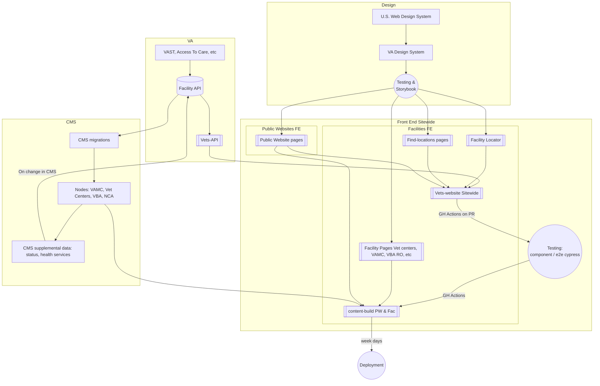

# Facility Locator Engineering README 
TOC:
* [High level](https://github.com/department-of-veterans-affairs/va.gov-team/blob/master/products/facilities/facility-locator/engineering/README.md#)
* [Facilities-api integration](https://github.com/department-of-veterans-affairs/va.gov-team/blob/master/products/facilities/facility-locator/engineering/README.md#)
* [Working with the Facility Locator](#working-with-the-facility-locator)
* Supporting the Facility Locator
    * [URL handling]()
    * [Incident response](https://github.com/department-of-veterans-affairs/va.gov-team/blob/master/products/facilities/facility-locator/engineering/README.md#incident-response)

## **High level:**
[Facilities and Facility Locator pages dependencies and testing](https://github.com/department-of-veterans-affairs/va.gov-team/blob/master/products/facilities/facility-locator/engineering/facilities_landscape.md)
> document covers the landscape, System Dependencies, Component Dependencies, Unit Testing, and Integration Testing

The Facility Locator is a React application built in vets-website: [applications/facility-locator](https://github.com/department-of-veterans-affairs/vets-website/blob/main/src/applications/facility-locator)

The Facility Locator retrieves data from a few upstream data-sources using the `facilities-api` in vets-api: 
* [modules/facilities_api](https://github.com/department-of-veterans-affairs/vets-api/blob/master/modules/facilities_api) in vets-api
* [Facilities-api documentation](https://github.com/department-of-veterans-affairs/va.gov-team/blob/master/products/facilities/facilities-api) <br/>

The Locator also uses Mapbox via API key for mapping functionality.


## Facilities-API integration 
All Facility Locator data is delivered via facilities-api, which is integrated with the [Lighthouse Facilities API](https://developer.va.gov/explore/api/va-facilities).

* [**facilities-api data sources**](https://github.com/department-of-veterans-affairs/va.gov-team/blob/master/products/facilities/facilities-api#data-sources) describes all the data sources available to facilities-api
* [**facilities-api Lighthouse API integration**](https://github.com/department-of-veterans-affairs/va.gov-team/blob/master/products/facilities/facilities-api/README.md#lighthouse-integration) includes information on Lighthouse API endpoint mapping, API consumers / keys, rate limits, and the process to [request a rate limit increase](https://github.com/department-of-veterans-affairs/va.gov-team/blob/master/products/facilities/facilities-api/README.md#request-api-limit-increase)

## Facility Locator business logic

### Services autosuggest 

When Facility Type = VA Health, Services field becomes an autosuggest field referencing VA Services taxonomy terms. 
Taxonomy terms and their field data are parsed into a KISS data file: https://www.va.gov/data/cms/va-healthcare-services.json.

The cheat sheet below maps the relevant chunks of data that are used in the matching algorithm.


If the user-entered Service search term matches any of the following fields in va-healthcare-services.json, the related VA Service term will be returned as a suggested result (case insensitive). Suggested results are weighted as Primary or Secondary: 

* Priority matches (Equivalently weighted)
    * Anywhere in “Name”
    * Anywhere in “AKA”
* Secondary matches (Equivalently weighted)
    * Some “common condition” starts with a match of the text
    * Anywhere in description
    * Anywhere in Tricare description

Within results of the priority and secondary matches, results are alpha-sorted.

Lighthouse API ID should not be used for matching. 


### OLD INFO that needs to be verified
Previously, we talked about facilities-api and facility locator interchangeably. Now facilities-api is considered its own product. Some of the old docs are likely out of date, but some information may be valuable. Docs we need to sort out: 

* Data sources & API integrations: [/engineering/data-and-api-integrations](https://github.com/department-of-veterans-affairs/va.gov-team/tree/master/products/facilities/facility-locator/engineering/data-and-api-integrations)` contains information about each data integration in the Facility Locator, from ~2022. Is any of this accurate / true in the modern facilities-api? If so: move it to https://github.com/department-of-veterans-affairs/va.gov-team/tree/master/products/facilities/facilities-api. Each subfolder contains an implementation .md file with details specific to that integration. 

* API Endpoint descriptions: https://github.com/department-of-veterans-affairs/va.gov-team/tree/master/products/facilities/facility-locator/engineering/data-and-api-integrations#api-data


# Working with the Facility Locator

* Frontend: To run the Facility Locator locally, you can run the front-end only in vets-website. 
* Backend: To modify the backend, you must run facilities-api from vets-api locally. Follow facilities-api docs: [Working with the facilities-api](https://github.com/department-of-veterans-affairs/va.gov-team/tree/master/products/facilities/facilities-api#working-with-the-facilities-api)

**Platform Developer docs**
- [Platform Developer docs](https://depo-platform-documentation.scrollhelp.site/developer-docs/) - Platform documentation about infrastructure, integrations, testing, monitoring, and releasing as well as engineering processes, best practices, and standards.
- [Vets-website feature toggles](https://depo-platform-documentation.scrollhelp.site/developer-docs/feature-toggles-guide)


### Interactions with dependent VA backends
TODO: what is this? Is this useful? IF so, add narrative. If not, remove.

**Query examples**
```
https://sandbox-api.va.gov/facilities_api/v1/va?bbox%5B%5D=-122.440689&bbox%5B%5D=-122.786758&bbox%5B%5D=45.451913&bbox%5B%5D=45.64&type=benefits
```

```
https://np.dws.ppms.va.gov/v1.0/PlaceOfServiceLocator?address=40.415217,-74.057114&maxResults=11&posCodes=17,20&radius=200
```

```
https://np.dws.ppms.va.gov/v1.0/ProviderLocator?acceptingnewpatients=0&address=40.415217,-74.057114&driveTime=10000&gender=0&maxResults=11&network=0&primarycare=0&radius=200&specialtycode1=%27213E00000X%27&specialtycode2=null&specialtycode3=null&specialtycode4=null
```

```
https://np.dws.ppms.va.gov/v1.0/ProviderLocator?address=40.415217,-74.057114&maxResults=11&radius=200&specialtycode1=213E00000X
```


## Supporting the Facility Locator

### Facility URL handling
In the Facility locator, search results will return Facilities or providers. Facility titles will be linked in search results. Where those facility titles link to is dependent on the state of the Facility modernization / publishing. 

In short: 
* If a facility has a modernized, published Drupal page: That URL gets sent to Lighthouse, and the facility-locator app will use that URL via vets-api. The linked title will point to the modernized page.
* If a facility does NOT have a modernized, published Drupal page: 
    * the linked title will point to a Facility Locator detail page.
    * The URL will be provided by Lighthouse, who receive it from a different source depending on Facility type. (VBA = Sandy's/Michelle's DB; NCA = XML files)

The Facility Locator will never point out to TeamSites. Always only either a modernized, or a facility locator detail, page.


### Incident response  
Last updated: 3/6/2025

#### Points of contact for system and dependent VA backends
   - Lighthouse 
     - #cms-lighthouse in DSVA Slack
     - Dawn Pruitt, VA PO
     - Adam Stilton, Engineering lead (adam.stilton@libertyits.com) (through March 2025)
   - Platform team / vets-api: #vfs-platform-support in DSVA slack  
   - PPMS (upstream system) 
     - incidents must be reported via [YourIT Service Portal](https://yourit.va.gov/va?id=va_report_incident)
     - [Instructions for creating a Service Now issue](https://github.com/department-of-veterans-affairs/va.gov-team/blob/master/products/facilities/facility-locator/images/Service%20Now%20instructions.pdf)
 

### Monitoring
Links to dashboards that help identify and debug application issues

[monitoring.md](https://github.com/department-of-veterans-affairs/va.gov-team/blob/master/products/facilities/facility-locator/engineering/monitoring.md)


# Facilities and Facility Locator pages dependencies and testing

## Table of Contents

1. [Landscape chart](#landscape-chart)
2. [System Dependencies](#system-dependencies)
3. [Component Dependencies](#component-dependencies)
4. [Unit Testing](#unit-testing)
5. [Integration Testing](#integration-testing)

## Landscape chart - 3/2025 NEEDS UPDATE


## System Dependencies (2025, needs review / update)


### CMS (prod/staging)
#### Content-build
The CMS system is the primary dependency on which content-build relies. All pages are processed from the pages.json file statically at compile time and therefore doesn’t depend on CMS at runtime. This makes it not a likely point of failure. The only type of failure that could happen is if the CMS diverges from the graphql queries in `stages/build/drupal/graphql`. If there is divergence, broken pages will result (verified by modifying data in the graphql queries without corresponding values in the CMS– causing banners to appear when they shouldn’t). The metalsmith build process doesn’t seem to indicate what testing is being done on the pages built from the liquid components. There don’t seem to be any tests to guarantee correctness of data on any page. This is likely due to the fact that the majority of pages are dynamic based on CMS content.

> In case of failure, contact [#sitewide-cms-platform](https://app.slack.com/client/T03FECE8V/CT4GZBM8F).

### Next-build
Next-build is the next-gen content publishing mechanism that will eventually replace content-build. The same logic and dependency notes generally apply.

#### Vets-website
Vets-website does not directly pull from dynamic CMS. So, changes in CMS will not affect vets-website. Vets-website does pull from static CMS data in the form of the `https://www.va.gov/data/cms/vamc-ehr.json`. However, this is a small portion of the data on vets-website. There is an indirect link between CMS and vets-website, in that CMS pushes data to LightHouse and LightHouse is consumed via vets-api by vets-website.

### Vets-api
The facilities-api in vets-api is more thoroughly documented at [products/facilities/facilities-api](https://github.com/department-of-veterans-affairs/va.gov-team/blob/master/products/facilities/facilities-api/README.md).

#### Content-build
No vets-api dependencies in content-build

#### Vets-website
Vets-website heavily uses vets-api for all facility related data (locator/find-locations/details about various types of facilities). All calls to vets-api from vets-website should be using vets-api’s v2 endpoints.

| Facility type | endpoint called by vets-website | 
| --- | --- |
Vet Centers, VA Benefits, VAMC facilities, and VA Cemeteries |  `https://api.va.gov/facilities_api/v2va`|
| Community care providers | `https://api.va.gov/facilities_api/v2/ccp/provider`
| Urgent care | `https://api.va.gov/facilities_api/v2/ccp/urgent_care`| 
| Emergency care | `https://api.va.gov/facilities_api/v2/va?type=health&services[]=EmergencyCare` and `https://api.va.gov/facilities_api/v2/ccp/provider?specialties` with several (4) specialties |
| Pharmacy | `https://api.va.gov/facilities_api/v2/ccp/pharmacy`|

All routes on Vets-api are managed by the Facilities team and monitored in datadog. 

> Vets-api is a bit ambiguous who the line of defense is for when the system fails. If vets-api services dev, sandbox, staging, or prod are not responding, escalate to the Platform team via a support request in #vfs-platform0-support. These systems are on EKS and therefore unlikely to be completely down. 

### Lighthouse (LH)
While lighthouse is not directly called by vets-website or content-build, vets-api heavily relies on lighthouse for data. CMS feeds data directly to Lighthouse and therefore, to some degree vets-website depends indirectly on CMS.

> Questions about LH on the DSVA slack Platform channel often end up identifying that the platform team does not control LH or operate on LH in any meaningful way.

### "Sandy’s" Database 
(Owned by Michelle Middaugh) 
This database is the source of truth for information about VBA Facilities.

While Sandy’s database is not directly called by vets-website or content-build, vets-api and CMS rely on data from this database for things such as location of facilities, hours of operation, etc. 

> Questions about this database should be directed to Michelle.

### VAST
VAST (Veteran Affairs Site Tracking) is a VA-owned data system that is the source of truth for hours, address, naming for VHA Facilities.

Outside OCTO. VAST is consumed by Lighthouse Facilities API


## Component Dependencies

### Content-build
Uses VA Design System (VADS) components which in turn use uswds components

### Vets-website
Uses the VADS components which use uswds components

> If components are not functioning correctly, contact design system team


## Unit Testing

For all unit tests, the Facilities team is responsible for successful testing of components. 

### Content-build

Most unit tests in content-build are tests to determine whether the liquid processing helper functions are correct. 

> There are some facility specific tests, such as the spec which tests centralized content processing. This is maintained by the Facilities team. 

### Vets-website
These tests seem somewhat sporadic. Components tested are in `src/applications/facility-locator/tests/components`. 

Those include:
- CCProvider link
- Covid19 component for facility locator
- Location directions link
- Location distance
- Location information
- Operational status
- Phone Link
- CCP result
- Covid Result
- Emergency Care result
- Pharmacy
- Urgent care
- VA Facilities


## Integration testing

### Content-build
According to cy:open/cy:run there are only a few specs for e2e testing vets-website:
VA and TRICARE Lovell About page (2) ✅
VA and TRICARE Lovell Main pages (2) ✅
An accessible dialog that does not work ❌
A required test for analytics and homepage test ✅
No other facility static page has testing. It may be that testing these pages is impossible or superficial testing for unchanging objects would yield not useful data. Additionally, when datadog status is in place, the only types of monitoring on these pages would be to determine if the pages are receiving 404s or some other error.

### Vets-website
There are hundreds of end-to-end tests. The majority are tests related to form completion either by mouse-clicks and typing or keyboard only navigation and not related to facilities. There are a number of end-to-end tests related to facilities that should be maintained by the Facilities team that must pass (are not disabled).

Find-locations via URL with facility ID (nested under facility-locator, is this misleading?) - no separate testing for keyboard accessibility
- detail page uses: http://localhost:3001/find-locations/facility/vc_0304V
- Closed message: tests alert for facility closed ✅
- Limited service: as above but for limited service ✅
- No message: no alert ✅
- Any message ✅

Facility locator - 
- messages in returned data - no separate accessibility for the error message tested✅
- downtime notification - waits for tool to break - looks like a broken test, but is running correctly ✅ AXE NOT INJECTED
- accessibility - tests everything except whether search actually functions. However doesn’t enter text in zipcode text input ❓
-  CCP Disabled - ✅ - disables option in dropdown
- CCP Enabled - ✅- enables option in dropdown 
- detailPage - AXE NOT INJECTED - also this seems like the wrong location for this 
- errorMessages - AXE NOT INJECTED - error messages for facility locator drop downs and text boxes ✅
- facilitySearch all succeed except breadcrumbs. Uncertain why it’s left in an ambiguous state. Possibly because it doesn’t multiple tests missing AXE, but is it necessary in all scenarios?
- gaEvents - ✅
- Geolocation - AXE missing -  ✅
- Map-zoom - flaky❓
- Mobile - missing AXE check ✅
- Provider search - About half are missing AXE check ✅
- serverErrors  Missing AXE check ✅


## Axe tests
Axe testing is done via cypress injection. Axe tests are required to be done in any unit or integration test. However, a majority of tests do not have Axe injected into the testing and there are warnings all over the place that Axe was not included. It is not just facilities tests that do not include Axe. It is possible the Axe injection and the rule to inject it came after those tests were created. 
