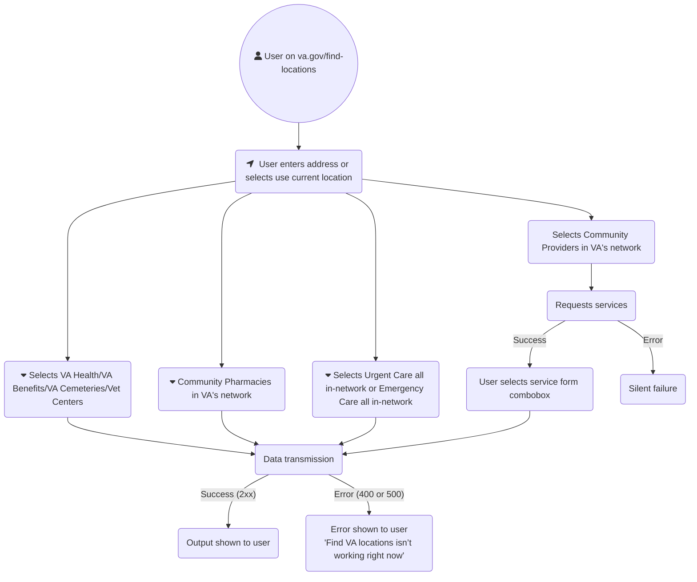

This flow chart shows a user entering the Facility locator from va.gov/find-locations. The data connections are with the vets-api facilities-api service but secondary connections to external services like PPMS (for Community Care Providers) is shown and sometimes generates errors.

