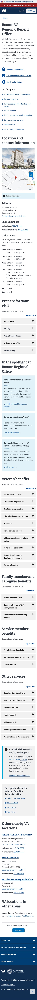
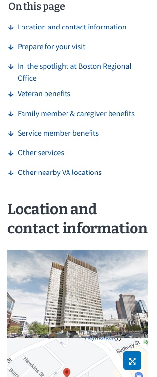
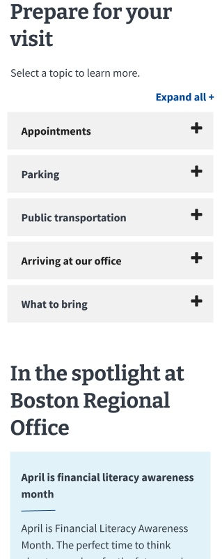
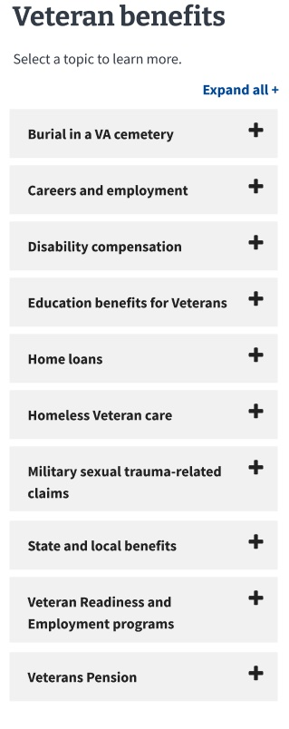
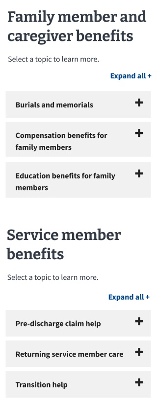
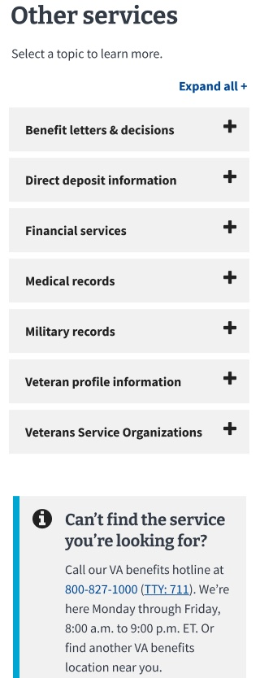

**Office of the CTO - Digital Experience (OCTO-DE), VBA facilities, Sitewide Facilities**

Date: 010/13/2023

**Alexis Logsdon**, [alexis.logsdon@a1msolutions.com](alexis.logsdon@a1msolutions.com)

[Research readout (must be logged in to VA system to view)](https://dvagov.sharepoint.com/b:/r/sites/SitewideFacilitiesTeam/Shared%20Documents/General/VBA/20231012%20VBA%20Regional%200ffices%20Usability%20Research%20Readout.pdf)

 

**Jump to:**

[Research Goals](https://github.com/department-of-veterans-affairs/va.gov-team/tree/master/products/facilities/regional-offices/research/2023-06-veteran-facing/research-findings.md#research-goals)

[Methodology](https://github.com/department-of-veterans-affairs/va.gov-team/tree/master/products/facilities/regional-offices/research/2023-06-veteran-facing/research-findings.md#methodology)

[Hypotheses and conclusions](https://github.com/department-of-veterans-affairs/va.gov-team/tree/master/products/facilities/regional-offices/research/2023-06-veteran-facing/research-findings.md#hypotheses-and-conclusions)

[Key findings](https://github.com/department-of-veterans-affairs/va.gov-team/tree/master/products/facilities/regional-offices/research/2023-06-veteran-facing/research-findings.md#key-findings)

[Recommendations](https://github.com/department-of-veterans-affairs/va.gov-team/tree/master/products/facilities/regional-offices/research/2023-06-veteran-facing/research-findings.md#recommendations)

[Appendix (including screenshots of prototype)](https://github.com/department-of-veterans-affairs/va.gov-team/tree/master/products/facilities/regional-offices/research/2023-06-veteran-facing/research-findings.md#appendix)

[Who we talked to](https://github.com/department-of-veterans-affairs/va.gov-team/tree/master/products/facilities/regional-offices/research/2023-06-veteran-facing/research-findings.md#who-we-talked-to)

 

## Research Goals
The purpose of this research is to get user feedback on the new modernized design for VBA regional office sites.

There are many potential touchpoints between the Veteran and this application throughout the [Veteran journey](https://github.com/department-of-veterans-affairs/va.gov-team/blob/master/platform/design/va-product-journey-maps/Veteran%20Journey%20Map.pdf) when they might want to know whether they may be eligible for VA health care with their current income:
* Getting out (Engaging VA to access benefits and services)
* Starting up (Finding something to do, Finding a place to live)
* Taking care of myself (Managing primary care and chronic health issues > Disability Compensation)
* Putting down roots (Revisiting housing, Taking care of my family, Saving for my retirement, Engaging VA to access benefits and services)
* Retiring (Finding additional sources of income)

## Research Questions
**Before seeing the prototype:**
1. What do Veterans (and others) know about VA regional benefit offices?
2. What tasks do Veterans (and others) expect to do at VA regional benefit offices?

**From the prototype:**

3. Do Veterans (and others) understand which services are available at this location?
* Categories of services (i.e., Veteran benefits, Family member & caregiver benefits, Service member benefits, Other services)
* Service offering accordions that have multiple locations inside them
* What if they don't find an applicable service on the page?

4. Do Veterans (and others) understand how services are delivered at this location?
* In-person, virtual, or by phone (do people open the appointments accordion unprompted?)
* With or without appointments (any comments about location of appointments information?)
* Hours of operation--for the office vs. only for a specific service
* Hours of operation--2 sets of hours in a single day (i.e., morning and afternoon but closed for lunch hour), comment about one of the days
* Notice different hours/appointments per service vs. regional office in general?

5. What feedback do Veterans (and others) have on content, organization, and length of the regional benefit office web page?
* Do Veterans (and others) interact with any of the Prepare for your visit accordions?
* Do Veterans (and others) interact with any of the 3 Action links near the top of the page? If so, which ones?
* How do Veterans (and others) react to seeing 2 phone numbers? Which phone number would they use and why? What do they expect when they call?

## Methodology 
We conducted **usability testing** on August 28-September 5, 2023 to get feedback from research participants using a click-through prototype over Zoom. Perigean recruited the participants.

**We talked to 8 Veterans** and 3 Veteran's family members or caregivers. One caregiver was also a Veteran, so the total number of participants was **10**.

- 5 of 10 used a smartphone for the session, 4 used a computer, 1 used a tablet
- 2 of 10 had never visited a benefit office
- 3 of 10 had visited within the past 6 months
- 5 of 10 visited more than 6 months ago

For more details, see [Who we talked to](https://github.com/department-of-veterans-affairs/va.gov-team/tree/master/products/facilities/regional-offices/research/2023-06-veteran-facing/research-findings.md#who-we-talked-to).

## Hypotheses and Conclusions
* Veterans (and others) will understand what they can do at a VA benefit office from the new web page.

  **TRUE**
  - Participants were able to locate the service accordions when prompted.

    
* Veterans (and others) will understand how services are delivered at this location from the new web page.

  **SOMEWHAT TRUE**
  - Participants had mixed results when asked to identify appointment modalities and hours of service.

    
* Veterans (and others) will understand how to prepare for a visit to a VA benefit office from the new web page.

   **MOSTLY FALSE**
  - Participants had mixed results when asked to locate information on what to bring to their visit. Success rates were lower for participants with cognitive disabilities and BIPOC participants.
    
* Veterans (and others) will know what to do if they don't find the kind of help they need on the new web page.

  **TRUE**
  - Participants identified a phone number to call for help or would use one of the action links.

## Key Findings
### Service offerings
1. Veterans understood what services were available and navigated to the relevant sections easily.
2. Ways to get help were  easy to locate.
3. The farther down information was in an accordion, the less likely Veterans were to find it.

### Service delivery
4. Veterans were able to determine the appointment options, with some variation depending on the task.
5. Veterans had mixed results with identifying whether an appointment was required for a given task.
6.	Veterans with cognitive disabilities and Veterans over 55 were less likely to identify how services were delivered.

### Content and organization
7. Veterans had a strong preference for using one of the three Action links to complete tasks.
8. Some content was hard to locate. 

 

## Details of Findings 
### *Service offerings*

### 1. Veterans understood what services were available and navigated to the relevant sections easily.
| Service located | Task # | Success rate | Raw numbers |
| :-- | :---------- | :-- | :-- |
| Home loan | 4 | 90% | 9 out of 10 |
| Education for dependants | 8 | 90% | 9 out of 10 |
| Burials - Family and caregiver section | 9 | 90% | 9 out of 10 |
| Education for Veterans | 7 | 88% | 7 out of 8 |
| Direct deposit | 10 | 80% | 8 out of 10 |
| Disability | 3 | 70% | 7 out of 10 |
| What to bring | 5 | 70% | 7 out of 10 |
| COE status check | 6 | 67% | 6 out of 9 |
| Average across all tasks |  | 78% | |

 *Note: due to Veteran/caregiver status and time constraints, not every participant was asked to complete every task. This accounts for the varied number of participants for each task.*

Some participants didn't scroll much until they were nudged to do so, but once they did, they understood how the page was organized and navigated to the relevant sections with ease. Rates were somewhat lower for the first task in the prototype (task 3) as participants got comfortable navigating the prototype. They were also slightly lower on tasks 5 and 6. These tasks required participants to navigate away from the Home loan section to the Prepare for your visit section or to scroll farther down in the Home loan accordion, respectively.

 #### Participant comments
> It had pretty good information as far as phone numbers, the office times, whether you need an appointment or not. - P8

> I appreciate how all veterans' benefits are grouped together in one place. - P9

### 2. Ways to get help are easy to locate.
9 out of 10 of participants either located a number to call when they couldn't find a benefit on the page or would use the Ask the VA benefits chat.

 #### Participant comments
> I couldn't find specific information but noted that there were options to call or schedule an appointment online. - P12

### 3. The farther down information was in an accordion, the less likely Veterans were to find it.

| Content | Average success rate |
| :------- | :---------- |
| Appointment type | 66% |
| Office hours | 45% |
| Phone numbers | 36% |

- Participants struggled to locate content inside the service accordions.
- Averages were lower for participants with cognitive disabilities
- Hours and appointment type rates were both lower for participants over 55.
*Note: Success rates are averaged across 3 tasks (3, 4, and 9) where participants were asked about appointment type, hours, and phone numbers.*
 #### Participant comments
> So I'm simply not going to scroll down the veterans benefits and dig into all these pieces here. - P2

### *Service delivery*
### 4. Veterans were able to determine the appointment options, with some variation depending on the task.
The majority of participants understood which services required an appointment and which were walk-in only. 

| Task| Success rate | Raw numbers |
| :-- | :---------- | :-- | 
| 3: Disability | 50% | 5 out of 10 |
| 4: Home loan | 90% | 9 out of 10 |
| 9: Burials - Family and caregiver section | 60% | 6 out of 10 |

### 5. Veterans had mixed results with identifying whether an appointment was required for a given task.
- Some participants assumed the hours inside the accordion were the same as the main office hours.
- In the Home loan accordion, some only noted the walk-in hours, not the phone appointment hours for checking the status of their COE

| Task| Success rate | Raw numbers |
| :-- | :---------- | :-- | 
| 3: Disability | 50% | 5 out of 10 |
| 4: Home loan | 50% | 5 out of 10 |
| 9: Burials - Family and caregiver section | 30% | 3 out of 10 |

 #### Participant comments
>I like that this pulls up the hours too so that way you don't have to like go back up to the other section. - P7
*Note* This observation was not accurate: the hours for the service were different from the ones for the facility.

### 6. Veterans with cognitive disabilities and Veterans over 55 were less likely to identify how services were delivered.
- Success rates for all tasks and subtasks were lower for those with cognitive disabilities
- Finding hours and appointment information was significantly more challenging for those over 55.

  
Chart showing success by demographic (Click to show screenshots)

 ! [Task success by demographic.jpg](./images/Task%20success%20by%20demographic.jpg)

  

  
### *Content and organization*
### 7. Veterans had a strong preference for using one of the three Action links to complete tasks.
- This was true even for tasks where using the Action links was a less direct route to getting answers.

 #### Participant comments  
> I like these because these are probably the main reasons I'd visit this page. - P7

### 8. Some content is hard to locate.
- 50% (3 out of 6) found the What to bring accordion in the Prepare for your visit section
- 30% (3 out of 10) found the hours for Burials
- 22% (2 out of 9) found the phone number for Home loans

 #### Participant comments  
> Under each specific service there could be links directing people to what documents they need. - P3

## Additional Insights

### Many Veterans are skeptical about whether calling or chatting with AVA will yield meaningful insights.

#### Participant comments 
> I'm scared to death of a phone call because it takes so long to just get a yes or no answer - P7

> I'm not sure if this chat function is live or just messaging - P9

> I wouldn't call the office number because they're working, busy doing other stuff. - P10

### Participants had mixed feelings about spotlight boxes
- Some participants stopped scrolling when they reached the Spotlight boxes, but all of the service accordions were located below the boxes.
- Some didn't distinguish between the Spotlight content and the rest of the page.
- One identified information about life insurance from it, another a link to forms they could use.

#### Participant comments 
> These three blue boxes really bother me…they're so unnecessary. They make me feel like the web page is essentially over. All the important stuff that I need is still below this. -P2

### Some Veterans felt the page was too long.

### Most could identify at least one service offered at ROs
- Most commonly identified service: general help with benefits/status updates

### Most used the term Benefits interchangeably with Disability

### Participants thought some services should be categorized differently
- Direct deposit: Financial services, What to bring (with more specific information about what direct deposit info was needed), connected to a specific benefit, or something they would need to do in person
- Medallions: Veteran Burial services
- Life Insurance (not currently located on page): Veteran benefits section (3), Service member section, Compensation benefits, VSO, Other services, State and local services, Financial services

## Recommendations

- Explore ways to make essential appointment and contact information easier to locate.
- Explore options for increasing findability of What to bring content.
- Consider coordinating with Action link product teams to sync on services-related content delivery.

## Appendix
[Research plan](https://github.com/department-of-veterans-affairs/va.gov-team/blob/master/products/facilities/regional-offices/research/2023-06-veteran-facing/research-plan.md)

[Conversation guide](https://github.com/department-of-veterans-affairs/va.gov-team/blob/master/products/facilities/regional-offices/research/2023-06-veteran-facing/conversation-guide.md)

[Interview notes](https://github.com/department-of-veterans-affairs/va.gov-team/tree/master/products/facilities/regional-offices/research/2023-06-veteran-facing/transcripts)

## Tools used for Synthesis
[Synthesis spreadsheet](https://docs.google.com/spreadsheets/d/1adPKduNfvJTDuNDRzxyyQDw2r24-5_L-ouYOMrVqdeM/edit?usp=sharing)

[Task completion tally spreadsheet (must be logged in to VA system to view)](https://dvagov.sharepoint.com/:x:/s/SitewideFacilitiesTeam/EZgjwsrisRRPsM9ZZSPjsX4BFY9J00hBmc9FrM9MTsMM3g?e=cYpxUG))

[Mural board](https://app.mural.co/t/departmentofveteransaffairs9999/m/departmentofveteransaffairs9999/1692999071676/faf135ff7c2bb24825ac0529ed16fd4643f59408?sender=u3f35bedf61955cb051f44770)

## Pages and applications used

[Link to Prototype](https://www.figma.com/proto/8RYmYfVGS9CUfZbomH5lBe/VBA-Regional-Office-Prototype?page-id=0%3A1401&node-id=3-10371&starting-point-node-id=3%3A10371&hotspot-hints=0&t=OxYmMLn6Vyri5PSE-1&mode=design)

### Screenshots of the prototype screens

  
Prototype screens (Click to show screenshots)

 
 
 
 
 
 
 
 
 
 
 
 
 
 

## Who we talked to

**Recruitment criteria**

We talked to **10 participants.**

Audience segment:
* Veterans: 8 
* Caregivers or family members: 3

  1 participant was both a caregiver and a Veteran.

Gender:
* Male: 7
* Female: 3

LGBTQ+:
* LGBTQIA+: 1

Devices used during study: 
* Desktop: 4 
* Tablet: 1 
* Smart phone: 5 
* Assistive Technology: 0

Age:
* 18-34: 1
* 35-54: 6
* 55+: 3

Education:
* No degree: 3
* Post-HS degree: 7

Geographic location:
* Urban: 6
* Rural: 4
* Continental district: 7

Race:
* White: 8
* Black: 2
* Hispanic: 1
* Biracial: 1
* Asian: 0
* Native: 1

Disability and Assistive Technology (AT):
* Cognitive: 3
* AT user: 0

  

  
Charts and images (Click to show screenshots)

 
 

 

 

## Underserved groups we haven’t talked to 

This research does not include the perspectives of the following marginalized Veteran groups:
- Identify as Asian or Transgender
- Expat (living abroad)
- Users of Assistive Technology 

