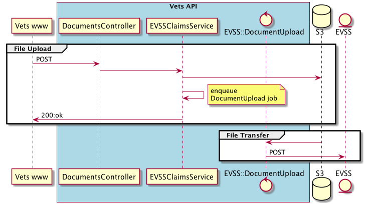
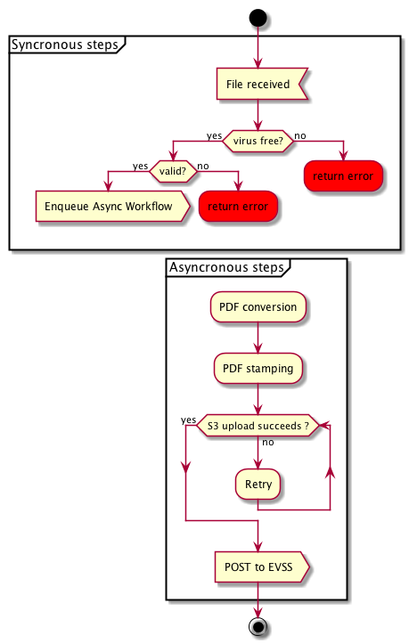

# Document Upload Workflow Design
**Author:** Alastair Dawson  
**Last Updated:** April 12th, 2017

## Overview

### Objective
Create a document upload workflow that abstracts away the process of uploading, verifying, and converting a document. 

### Background
Although vets.gov is moving many forms online the site often needs supporting scanned documents or the ability to send PDFs of our forms to other systems within the VA. Currently EVSS and disability claims documents are uploaded to AWS S3 via the CarrierWave gem. Pensions and Burials will require similar support. 

**Below: A sequence diagram for the current flow for uploads to S3 -> external service**


### High Level Design
To allow for immediate user feedback file validation and upload confirmation is required syncronously. File manipulation is more expensive and should be offloaded to a background job. To allow for both modes of execution the upload workflow will be split into syncronous and asyncronous steps. 

#### Syncronous pre-upload processing
Once a file is received it will be cached and a pre-storage virus scan will be performed via the [Clam Scan gem](https://github.com/jschroeder9000/clam_scan); a Ruby lib that wraps [ClamAV](https://www.clamav.net/). If a virus is found the file will be deleted and an error returned.

#### Asyncronous upload/post-upload processing
To allow for background uploading, different post-upload processing workflows, and to simplify adding future jobs to a workflow, background jobs will be chained via a workflow runner.


**Above: An example workflow**

## Specifics
### Detailed Design
#### API
The interface for document uploads will be a DocumentUpload class which composes in a configuration class for options (local, remote storage, etc). And a 'workflow' plugin that defines the order of jobs. Parameters can be passed to a workflow and routed to the correct job in the chain or pipelined to a following job if they are derived from the current job.

```ruby
class EVSSClaimDocumentUpload < DocumentUpload
  configuration EVSS::UploadConfiguration
  workflow EVSS::ClaimDocumentWorkflow
  
  def initialize(user_uuid, tracked_item_id)
    super
    @user_uuid = user_uuid
    @tracked_item_id = tracked_item_id
  end
  
  def start!(file)
    # kicks off sync workflow: virus scan, validation
    # raises error on virus or invalid
    super(file)  
  end
```

```ruby
class EVSS::ClaimDocumentWorkflow < Gush::Workflow # Note: we use Shrine with a plugin workflow, not Gush
  def configure(file_id)
    run ConvertToPDFJob, params { file_id: file_id }
    run StampPDFJob, after: ConvertToPDFJob, params: { text: "Received: #{Time.now.utc}", x: 10, y:10 }
    run UploadToEVSSJob, after: StampPDFJob
  end
end
```

#### Uploading
Uploads will be performed via Shrine which allows for [more flexible](https://twin.github.io/better-file-uploads-with-shrine-motivation/) pre and post upload processing than Carrierwave due to its plugin system. 

```ruby
class DocumentUploader < Shrine
  plugin :validation_helpers
  plugin :logging
  
  Attacher.validate do
    # validation...
  end

  process(:store) do |io, context|
    # pre-upload processing ...
  end
end
```

#### PDF Conversion/Stamping
PDF Conversion will be through rmagick:
```ruby
img = Magick::ImageList.new(image_input_path)
img.write(pdf_output_path)
```
PDF stamping will be throught the Prawn lib which provides [Prawn::Stamp](http://prawnpdf.org/docs/0.11.1/Prawn/Stamp.html)
```ruby
pdf.create_stamp("my_stamp") {
  pdf.fill_circle([10, 15], 5)
  pdf.draw_text("hello world", :at => [20, 10])
}
pdf.stamp("my_stamp")
```

### Code Location
https://github.com/department-of-veterans-affairs/vets-api

### Testing Plan
_To be determined._

### Logging
_To be determined._

### Debugging
_To be determined._

### Caveats
_To be determined._

### Security Concerns
Extracted from the [Open Web Application Security Project's file upload page](https://www.owasp.org/index.php/Unrestricted_File_Upload).

> Uploaded files represent a significant risk to applications. The first step in many attacks is to get some code to the system to be attacked. Then the attack only needs to find a way to get the code executed. Using a file upload helps the attacker accomplish the first step.

> The consequences of unrestricted file upload can vary, including complete system takeover, an overloaded file system or database, forwarding attacks to back-end systems, client-side attacks, or simple defacement. It depends on what the application does with the uploaded file and especially where it is stored.

> There are really two classes of problems here. The first is with the file metadata, like the path and file name. These are generally provided by the transport, such as HTTP multi-part encoding. This data may trick the application into overwriting a critical file or storing the file in a bad location. You must validate the metadata extremely carefully before using it.

> The other class of problem is with the file size or content. The range of problems here depends entirely on what the file is used for. See the examples below for some ideas about how files might be misused. To protect against this type of attack, you should analyse everything your application does with files and think carefully about what processing and interpreters are involved.

#### Mitigation
1. Virus scan (Clam Scan).
1. Whitelist file/mime types (supported by both Carrierwave and Shrine).
1. Image content verification
1. File size limit (file space DoS).
1. Rename file, don't use provided file names. 
1. No execute permissions in target dir.
1. Only allow delivery/downloading of processed files

### Open Questions and Risks
_To be determined._

### Work Estimates
_To be determined._

### Alternatives
#### File upload as a (micro) service
Even though Puma improves MRI's throughput by allowing blocking IO to be run concurrently moving file upload to a micro service would allow expensive requests and pre-processing to be offloaded to an independently scalable service. A microservice would allow more performant [Ruby framework/server or language](https://blog.altoros.com/performance-comparison-of-ruby-frameworks-app-servers-template-engines-and-orms-q4-2016.html) to be implemented.

#### Carrierwave
Continue using Carrierwave rather than Shrine. There are modules for Carrierwave which support virus scanning, direct upload (including skipping the file cache), and backgrounding. However they are not easily composable and would require extra work to orchestrate. 

### Future Work
#### Pub Sub messaging for job status
The current system responds once file upload is complete, leaving jobs to run unattended (other than error logging). If an asyncrounous workflow complete events were to be surfaced to the front-end we would need to push them from the server to the client. The MessageBus gem provides pub/sub via long polling or alternatively short polling (if IE/TIC/GovCloud doesn't support long polling).

### Revision History
Date | Revisions Made | Author | Reviewed By
-----|----------------|--------|--------------
April 5th, 2017 | Initial Draft | Alastair Dawson |
April 12th, 2017 | Updates based on revised functional specs | Alastair Dawson |
