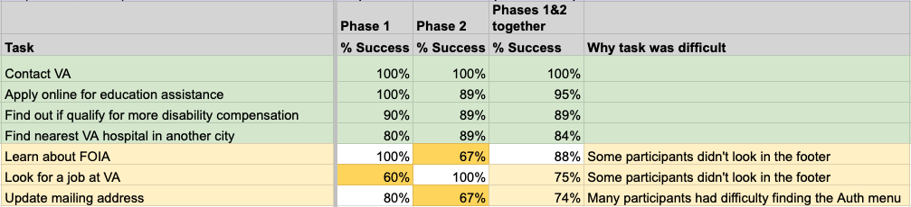
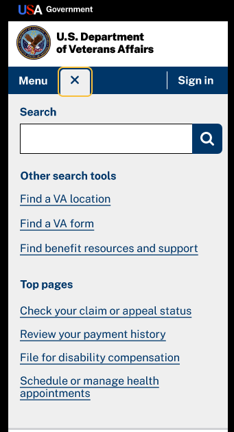
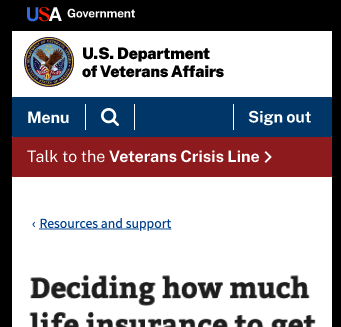
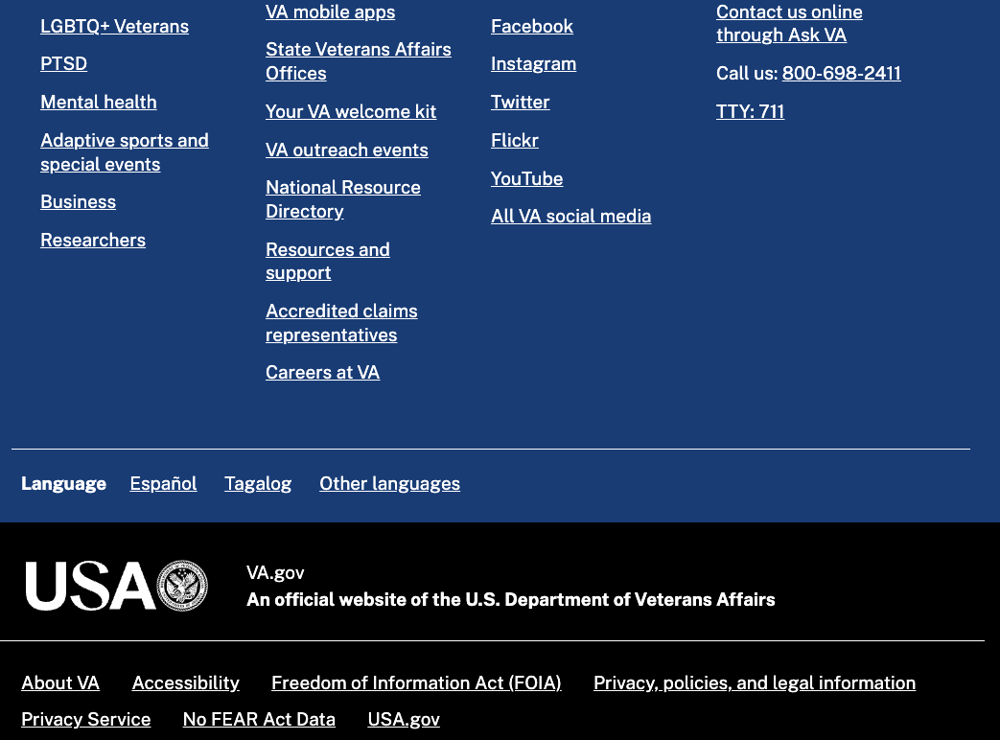

# Federal Standardized Header/Footer Usability Testing -- Research Findings from Phases 1 & 2

**Office of the CTO - Digital Experience (OCTO-DE), Sitewide Public Websites**

Date: 3/6/2024

**Cindy Merrill** [cindy.merrill@adhocteam.us]

 

**Jump to:**

[Hypotheses and conclusions](#hypotheses-and-conclusions)

[Key findings](#key-findings)

[Recommendations](#recommendations)

[Appendix (including screenshots of design prototypes)](#appendix)

[Who we talked to](#who-we-talked-to)

 

## Research Goals
OFCIO and GSA (USWDS) proposed a federal header and footer in an effort to standardize across all federal agencies, and it included a new “USA” logomark. The Department of Veterans Affairs volunteered to be the first high-impact service provider (HISP) to attempt to adopt this proposed header and footer and integrate them into the department’s design system.

Initial usability research tested with Veterans to see whether  adoption would have minimal or no negative impact to site visitors.

There are many potential touchpoints between the Veteran and the header and footer throughout the [Veteran journey](https://github.com/department-of-veterans-affairs/va.gov-team/blob/master/platform/design/va-product-journey-maps/Veteran%20Journey%20Map.pdf):
- Getting out 
- Starting up 
- Taking care of myself 
- Retiring 
- Aging 

The purpose of this research was to find out:
- **Wayfinding task success rate** using the proposed Federal header and footer
- **How Veterans using screen reader or screen magnifier technology navigate** the proposed header and footer
- **Veteran sentiment on USA logo and VA seal**, with the dropping of the “VA” brand mark

The findings from this research show how the proposed header and footer design impacts the Veteran wayfinding experience. 

## Research Questions
1. Are Veterans (and others) able to navigate the newly organized footer with new column headings, link names, and separate VA and Federal footer sections? 
    - What tasks, if any, do participants struggle navigating to?  
1. How does the new font family and increased font size impact readability?  
1. Do Veterans (and others) using screen readers or other assistive technology have a positive experience with information wayfinding and task completion?  
1. What do Veterans (and others) think of the integration of both the authenticated menu and main menu on mobile into one menu? 
    - Do they provide a better, positive experience or create confusion? (i.e., how to sign in, sign out, locate  auth menu items) 
1. What are Veterans’ (and others’) task success rates?  
1. What are Veterans’ (and others’) first impressions of the new header and footer? 
    - How do Veterans (and others) feel about the way VA is represented in the header without the letters "VA"?  
    - How do Veterans (and others) feel about the new USA logo? 

## Methodology

We conducted **remote usability testing** over Zoom in 3 research phases to get feedback from participants using a design prototype showing VA.gov:

Research Phase | Participants | Tasks | Design prototype tool | Dates | Topline Summary
----- |------|-------|--------|--------|-------
1 | 10 non-assistive technology users | Unauthenticated + authenticated | Figma | Dec 15-21, 2023 | [link](https://github.com/department-of-veterans-affairs/va.gov-team/blob/master/products/header-footer/initiatives/2024-federal-standardized-header-footer/research/phase1-no-AT/topline.md)
2 | 9 assistive technology (screen reader and/or screen magnifier) users | Unauthenticated + authenticated | CodePen | Jan 29-Feb 5, 2024 | [link](https://github.com/department-of-veterans-affairs/va.gov-team/blob/master/products/header-footer/initiatives/2024-federal-standardized-header-footer/research/phase2-AT/topline.md)
3 | 4 assistive + 8 non-assistive technology users | Authenticated only | CodePen | Jan 29-Feb 1, 2024 | [link](https://github.com/department-of-veterans-affairs/va.gov-team/blob/master/products/identity-personalization/discovery-research/authenticated-menu-usability/summary.md)

This report will cover Phases 1 and 2 in detail. Phase 3 is covered in the third topline summary link above. Because the same participant numbers are reused in each research phase, references to specific participants in Phase 1 will be labeled as "**non-AT**" (not assistive technology users), and participants in Phase 2 will be labeled as "**AT**" (assistive technology).

The Phase 2 CodePen prototype was very similar to the Phase 1 Figma prototypes with the following differences:

- Coded so it was accessible to screen readers and screen magnifiers
- Responsive page layout so it automatically adjusted to each participant's device screen size
- USA logo in the header changed slightly and placed on a white background (*vs.* black in phase 1)
- Before each research session, the authenticated menu was updated to include the participant's first name
- Third column of footer changed from "Connect with us" to "News and Media", and the "Careers at VA" link was moved out of it into "More resources"
- Fewer links in the black federal footer
- Font was changed to Public Sans for page content in Phase 2 (header and footer already had this font in Phase 1)

## Participants
 Perigean recruited all of the participants. In Phases 1-2, **we talked to 19 people**.

- **Most** (18 of 19) **were Veterans**, 4 were family members of Veterans, 2 were caregivers of Veterans, and 1 was a Service Member (some had multiple roles).
- **Almost half** (8 of 19) **saw a mobile prototype**, and the others (11 of 19) saw a desktop prototype. 
- **About half** (9 of 19) **were full-time assistive technology users**: 5 used a screen reader, and 5 used a screen magnifier (one person used both).

The assistive technology used by the 9 participants in Phase 2 is summarized in the table below. All had experience using their assistive tech for at least 2 years (average of 10 years; range 2-18 years).

P# | Screen Reader/ Magnifier | Software | Device | O/S | Browser | Prototype version
-- | ----- |------|-------|--------|--------|---------
1 | SR | JAWS | computer | Windows | Chrome | desktop
2 | SR | Fusion | computer | Windows | Chrome | mobile (b/c browser window small)
3 | SR & SM | MAGic | computer | Windows | Firefox | desktop
4 | SM | Magnified screen by 160% | phone | iOS | Chrome | mobile
6 | SM | ZoomText | computer | Windows | Edge | desktop
7 | SR | VoiceOver | phone | iOS | Safari | mobile
9 | SM | Increased font to 125% | tablet | iOS | Safari | desktop
10 | SR | VoiceOver | tablet | iOS | Safari | desktop
11 | SM | Increased font to 150% | computer | Windows | Chrome | desktop

For demographic details, see [Who we talked to](#who-we-talked-to).

## Hypotheses and Conclusions
1. Veterans (and others) will be able to easily use the header and footer. 
     - MOSTLY TRUE: Wayfinding wasn't adversely affected by the header and footer design. However, half of the participants had difficulty finding the Auth menu.

1. Veterans (and others) won’t have any difficulty reading any of the text shown in the prototypes. 
     - MOSTLY TRUE: The participants who were able to read the text in the prototype without a screen reader didn't mention any difficulty reading any of it. One participant who uses a screen magnifier said that he would prefer a larger font.

1. Veterans (and others) who use assistive technology (screen reader or screen magnification software) will be able to easily use the header and footer. 
     - FALSE: There were a number of accessibility problems that affected task completion by participants using screen readers.

1. The new VA seal helps Veterans (and others) understand this is a VA website. 
    - TRUE: All participants noticed the VA seal along with the text "U.S. Department of Veterans Affairs", which were sufficient to recognize the site as pertaining to the VA.

1. Veterans (and others) will be able to easily find the authenticated menu when it’s integrated with the main menu in the mobile header. 

    - FALSE: 5 of 8 mobile users didn't try to click on the Menu button because they were looking for their name or something like "My profile" at the top of the screen.

1. The new USA logo mark helps Veterans (and others) understand this is a Federal government website. 

    - FALSE: More than half of the participants said that they would look at the URL to see if it's *.gov*, and others would tell by the VA seal. More than half of the participants who could see the federal USA logo had negative impressions of it, including some who thought it looked fraudulent, fake, or like phishing.
     

## Key Findings

1. **Wayfinding wasn't adversely affected** by the header and footer design.
1. There were some **accessibility problems that affected task completion by participants using screen readers**.
1. **Half of the participants had difficulty finding the Auth menu**, and a third of the participants didn't recognize that they were signed in.
1. There was **confusion about what constituted the footer and the bottom of the page**, due to a long VA footer followed by a shorter federal footer.
1. **More than half of the participants who could see the colored federal USA logo in the header had negative impressions** of it. Some of these participants preferred the white USA logo in the footer.
1. **None of the participants mentioned missing the "VA" logo**. Everyone noticed the VA seal and the text "U.S. Department of Veterans Affairs", which were sufficient to recognize the site as pertaining to the VA.

## Details of Findings 

### 1. Wayfinding wasn't adversely affected by the header and footer design
For each of the 7 wayfinding tasks that research participants did during the sessions, the moderator recorded how it was completed:
- **Directly successful** (right away using one of the "correct" paths implemented in the prototype)
- **Indirectly successful** (using a different path that wasn't implemented in the prototype but was plausible and would likely work in Production such as doing a site search, OR using one of the "correct" paths in the prototype but not as the first try)
- **Needed help** (needed a hint or other assistance from the moderator in order to successfully complete the task)
- **Unsuccessful** (unable to complete the task, even with help from the moderator)

The success rate for each task was computed by adding together the directly and indirectly successful numbers and dividing by the number of participants who completed that task. A summary of the data is shown in the table below. **All 7 tasks were completed successfully without any help by at least 60% of the participants**. The 3 tasks with the lowest success rates (60-75%) were challenging for some participants because they didn't look in the footer (for the FOIA and VA Careers links) or couldn't find the Auth menu (needed to update mailing address). Almost all non-successful task completions were because help from the moderator was needed (one task was unsuccessful for one participant). 

The page design was well received overall. Participants mentioned specifically liking the page layout, the links in the header and footer, the placement of the *Sign in* button in the top right, the simple font (Public Sans) with good color contrast, the menus that start out collapsed, and the ample spacing between touchable links on mobile devices.

### 2. There were some accessibility problems that affected task completion by participants using screen readers

The 9 participants that we talked with each used their assistive technology in different ways, depending on their experience level and their amount of visual perception. Their visual abilities ranged from impaired vision to low vision to completely blind. And assistive technology can have different versions that behave differently, so reproducing some of the issues has been challenging. **Because there was such variability in technology and visual ability, accessibility issues that affected even one participant are included here**. All such issues for consideration are listed below, starting with the issues that caused difficulty while participants were doing tasks. Then we'll follow with other issues that came up during the post-task interview but hadn't directly interfered with completing tasks.

#### Issues that caused difficulty in doing tasks
1. Two screen reader users (desktop using JAWS and VoiceOver) had **difficulty using search in the desktop header**. It was unclear what happened after they activated the search button. Focus didn't appear to be in the search box when it opened, though both participants expected to be able to activate *Search* and type. 
     1. The JAWS user (AT p1) tried "enter" to open the search box but couldn't find it to type text. They expected to *right arrow* or *tab* to the right and expand the box, but that didn't work. They had to *arrow down* to get to the box. They were also unable to close the search box.
     1. The VoiceOver user (AT p10) had difficulty opening the search box and software keyboard. It didn't work at first, so they tried double-tapping but didn't expect to have to do that before typing their search string.   

1. For AT p1 (desktop using JAWS screen reader) **after signing in, only the page title was read on the landing page**--not any of the content.
1. AT p3 (desktop using MAGic version 14 screen reader and magnifier) **couldn't understand some pages and links because MAGic didn't read them** at all. He's accustomed to hovering with his mouse to get the screen reader to read the link aloud, and then clicking on the link to go there. For many links, he had to click on them to get them to be read, but others weren't read at all. MAGic is older screen reader technology for which support has been discontinued by Freedom Scientific, but p3 reported that it usually works. Below is a list of what didn't work in our prototype with his screen reader:

    1. *VA Benefits and Health Care* and *About VA* in header not read (but *Find a VA Location* was fine). 
    1. *US Department of Veterans Affairs* reads the page URL instead of "US Department of Veterans Affairs". 
    1. *Use the life insurance needs calculator* reads the URL before the link title.  
    1. *VA Benefits and Health Care* megamenu items not read with mouse hover as expected. He had to click on them to hear them read, but then it also took him there.
    1. *Contact us* page not read at all. The content and jump links say nothing. The *Ask VA* content says "blank blank blank...", so it was reading but none of the actual words or characters.
    1. *USA Government* on the *Contact* page not read (but this reads out correctly on the life insurance page).

1. AT p3 (desktop using MAGic version 14 screen reader and magnifier) **didn't notice the 4th column of footer links** with his magnified screen. When we discussed it later in the session, he said that there's a larger gap after column 3 than there is between the other columns, and so he assumed that there was nothing more to the right.
1. AT p10 (desktop using VoiceOver screen reader on an iPad) was **confused by navigation in the blue footer because he didn't perceive any columns but saw (with limited vision) the screen jump**, which happened every time he moved from the last link in one column to the first link in an adjacent column.
   > *"When I swipe to the right, it jumped to the top. Yeah, just jump right back to the top again...I've got one eye [that] has got some vision with it, and I see no columns in there...If you see my hand, I'm just going across. And in my mind with this usable vision, it's supposed to be going straight across instead of jumping screens like that...I'm down here at the lower part of screen. Now I'm back at the top of the screen, and...I think I did something wrong or something's going funky with the screen" (AT p10).*
   
1. AT p7 (mobile using VoiceOver screen reader on an iPhone) was **confused by the header buttons changing name**: search magnifying glass changed to *X*, and *Menu* changed to *Close*.
   > *"It isn't quite self-evident. You just kind of got to remember that. That's where the search icon used to be, and it is now replaced with just an X" (AT p7).*
1. AT p1 (desktop using JAWS screen reader) was confused about why the **screen reader said "button menu" in addition to her name** (to open the Auth menu). She wondered if it was a button or a menu because they're two different things that you interact with differently. 

1. AT p10 (desktop using VoiceOver screen reader on an iPad) tried to click on the *Contact us* column header in the blue footer. They **couldn't tell that it wasn't interactive** from what the screen reader said. This same participant also tried clicking on the *Get education benefits* header text on the *VA Benefits and Health Care > Education and training* page.

#### Issues discussed that *didn't* cause difficulty during sessions
9. AT p10 (desktop using VoiceOver screen reader on an iPad) changed his accessibility settings during the research session to **inverse/high contrast**. After he did that, the **"A" in the header *USA Government* was no longer visible, as was the entire USA white logo and seal** in the footer. 

1. AT p7 (mobile using VoiceOver screen reader on an iPhone) said that it's **difficult to differentiate a menu from the content underneath** when the menu background is the same color as what it's overlaying. In this way, it's hard for the participant to tell where the menu ends and the content underneath resumes. 

1. AT p6 (desktop using ZoomText screen magnifier) said that the ***VA Benefits and Health Care* menu options aren't visible with her screen magnification**, but she knows to scroll horizontally to find the options because the arrows tell you which direction to look (to the right).

1. AT p11 (desktop with the font enlarged ~150%) said that they **preferred a larger font**, which they suggested doing by having less white space on the left and right sides of the content. 

### 3. Half of the participants had difficulty finding the Auth menu, and a third of the participants didn't recognize that they were signed in

After signing in using the prototype, about **a third of the participants** (6 of 19, which was 4 on mobile and 2 on desktop) **didn't recognize that they were actually signed in** because the user interface didn't change much. The subtle change of the "Sign in" button to "Sign out" (on mobile) or their first name (on desktop) wasn't enough for everyone to notice.

  > *"When I clicked that, it just kind of went back to this page...it looked the same. I was like wait, so I go back. Usually when you sign in, the page will change at the top where it says Department of Veteran Affairs in that upper right hand portion--there'll be an icon on my VA.gov app...It shows my name with the hyperlink underscore where it goes directly to my profile. So I'm not looking down to say, did I sign in? Okay, I know it says 'sign out', but did it sign in as me?...Usually there's stuff about you or information that's connected directly to your account when you see your name" (non-AT p7 on mobile).*

After signing in, **half of the participants (9 of 19) had difficulty finding the Auth menu**. 
- On mobile, the Auth menu was located *under their name within the mobile header menu*. **5 of 8 phone users** didn't try to click on the *Menu* button because they were looking for their name or something like "My profile" at the top of the screen.

  > *"I clicked on the menu and it opened up to my name, which is kind of odd. Why would I want to do that to find my name? When I open this up, I sign in. It should tell me 'Hi Janet you're here', and then I should be able to navigate from there. I shouldn't have to keep clicking on things to open up for it to say that it recognizes that I've logged in" (AT p4).*

  > *"It just seems a little hidden for me. My eyes wouldn't naturally look to right there for my personal profile...I would look in the upper right area, even just to see if I was actually signed in. I mean the fact that it says 'sign out' is nice, but blind people tend to read or fight their way through the first 2 or 3 letters. And if it says 'sign [out]', and it used to say 'sign in', I might not read all the way across to see that it now says 'sign out'. I wouldn't feel like I was signed in because the sign in button looks virtually the same even though I'm signed in. A more significant change would be easier for me (AT p7).* 

- On desktop, the Auth menu was under their name in the top right corner of the page.  **4 of 11 desktop users** didn't try to click on their name. One participant's difficulty was because he didn't notice the triangle dropdown indicator to the right of his name (he was using a screen magnifier, and the shape was different from the carat symbol for dropdowns in the blue menu bar). Another participant's difficulty was due to confusion about what her screen reader said ("button menu"), and she wondered whether it was a button or a menu.

  > *"The triangle I didn't really acknowledge that it was a pull down. If you look at the blue [header menu] area, it's more clear to me that they're pulldowns...than over where the search is and where the name is" (AT p9).*

After finding and opening the Auth menu, ALL participants recognized and clicked on *Profile*, which was the correct navigation path. However, 2 participants wondered aloud if they should try *My VA* instead (which was not a functional path in the prototype).

### 4. There was confusion about what constituted the footer and the bottom of the page, due to a long VA footer followed by a shorter federal footer

**A third of the participants (6 of 19 participants: 5 desktop, 1 mobile) misperceived the bottom of the page and didn't notice any of the links in the black federal footer** until prompted by the moderator to scroll farther down. 3 of them *stopped scrolling at the blue VA footer*, and 3 *stopped at the white USA logo*. One participant said that the blue footer is a good place to look for quick information, and so they started here instead of the header for each task.

**Three participants (2 desktop, 1 mobile) interpreted the footer as only the black federal part**, and so when they were looking for links that they thought would be in the footer *(Careers, Contact us)*, they **looked only there and not in the blue VA part** of the footer. They interpreted the blue VA part of the footer as part of the page content, not part of the footer where they should be looking. One participant commented that the black footer looks like a typical footer.

> *"I'm confused cause this part like the language [links at bottom of blue part], that's stuff you would typically see in the footer...That is a typical footer [pointing to black part], maybe a little more. But this [pointing to blue part] is confusing. Why is it blue here?...Is this supposed to be like an alternative additional footer?" (AT p3).*

> *"If if I'm looking for something, I'm usually gonna look at the bottom before I go to the [header] menu because in my mind the menu is based on what I'm looking at in front of me--insurance on that page" (non-AT p2).*

**Half of the participants** (8 of 16 participants--5 desktop, 3 mobile) who were **asked about the Freedom of Information Act used search** and didn't find the *Freedom of Information Act (FOIA)* link in the black footer.

  > *"I was not able to find that Freedom of Information Act right away, so I had to resort to the search bar" (non-AT p8)."*

**Four participants (2 desktop, 2 mobile) looked for *Find a VA Location* in the blue VA footer**, which is not there in the prototype (but *is* there in Production). Two participants instead selected the *State Veterans Affairs Offices* link that enables you to pick a state and then go to that state's VA link (unmodernized page), which doesn't go to the Facility Locator. The third participant looked in 3 different columns of the blue footer before looking in the header instead. The fourth participant opened all the mobile footer accordions before trying the header. (*Note*: Research participants heard ALL user task prompts while they were at the top of one of the pages in the prototype, so the header and page content were visible but the footer was not, so they had to deliberately scroll down to the footer.)

**Three participants (all on desktop) said that the blue VA footer is too large** and has too many links. 

> *"It's a LOT down here...it's too much" (non-AT p4).*

> *"It's just so much stuff down there...it's too much" (AT p1).*

> *"That is a lot. I mean crazy a lot of links all to be on the bottom...you could have it just like a quick drop down menu...Look how much space it is: on this current page, it's half the page. So it doesn't seem like what you would expect to be a footer" (AT p3).*

### 5. More than half of the participants who could see the colored federal USA logo in the header had negative impressions of it; some preferred the white USA logo in the footer

Only 16 of the 19 participants had enough vision that they were able to provide feedback on the USA logos. (The 16 participants were all Veterans or caregivers or family members of Veterans, which isn't a representative sample of all US citizens.)  

**11 of 16 participants were concerned about the colored USA logo in the header** with varying degrees of sentiment: 
   - **Looks fraudulent, fake, or like phishing** (4 participants)
     > *"If I clicked and I got navigated to the web page and I saw this, I would just go, okay, this isn't it. And I would just close my web browser and start over...nothing about it says 'official'" (AT p11).*

     > *"Amateurish to me, so I would immediately if I saw it on a .gov website think that I'm being phished" (non-AT p8).*

     > *"Am I getting spoofed right now, and I'm going to put in my information and have my identity stolen?" (non-AT p7).*

     > *"It looked weird there to me. Thought it was fake like it was just added on...It is redundant to me because it's the **US** Department of Veterans Affairs...We all know that we serve, so we know that it's part of the government...I just don't understand the importance of it being there" (non-AT p4).*

   - **Not telling you anything new** (3 participants) 
     > *"Just cause it says USA Government don't mean nothing" (non-AT p11).*
     
     > *" I don't think the U.S.A. Government at the top is necessary...Why somebody would want it, I guess, to give them the warm and fuzzies that it's a government website...you gotta watch out for scamming websites and phishing and all that other stuff. Just putting U.S.A. Government at the top does not make it official to me" (non-AT p3).*

      > *"It's aesthetically pleasing, but it's not necessary. It could have been in all white on a black background" (non-AT p10).*

   - **Doesn't look like an official government website** (2 participants)
     > *"It doesn't look professional that it doesn't instill confidence in me...There's no uniformity, it's not basic enough. It looks too frilly...When you open that up, it looks like the Olympics. It doesn't look like any official government website. It doesn't look serious at all" (AT p4).*

     > *"Looks kind of legit with the blue and the red, maybe not the black" (AT p6).*
   - **The font of the "S" seems out of place** (2 participants)
     > *"The font is not the best--that S is a little too fancy" (AT p4).*

     > *"The fonts aren't consistent, so S is different than the U and A (AT p9).*
   
   - **Not sure why it says "USA Government"** because things usually say "*U.S.* Government"

  - **Not sure why it says "USA"**  because VA is what matters
     > *"The VA part...is what I'm focused on--more than the U.S. I know the VA is part of the U.S. Government" (AT p3).*
  - **Just taking up real estate on the page**
     > *"Just unnecessary real estate being used there at that point. So unless I'm able to click on it and go to another government resource, I don't really see a need for it...doesn't necessarily seem to blend in with the page. It's just like something added up top there (non-AT p8).*

Only **one person loved the colored USA logo**, and this was a Veteran who had previously worked professionally on branding and logos. He had very specific reasons for liking it so much. One other person thought it looked nice but didn't need color.

   > *"It's interesting...The S is...a different..logo/type from the U and the A...It draws your eye to it because of the improbability of the mixed logos. It creates an improbability that creates curiosity, which increases time looking...When it's colored, it kind of dances...due to that odd S in the middle. It's sort of the perception...that it's moving...the S in the middle is wiggly. And the red...ordinarily would be red, white, blue, but it's blue, red, white. That's another improbable thing...Whoever's involved with that, tell them I said that they were smarty pants, and I like it...It's very well done. It's very well considered, and it's awesome. I've done a lot of this work in the past" (non-AT p2).*

Of the 11 participants who didn't like the colored USA logo in the header, **5 said they liked the black/white USA logo in the footer better** because it's a single color and has the seal next to it instead of the word "government". 

  > *"The S is different than the U and A (the font), but...you don't see it as much because it's in all in the same color font so it doesn't stand out as much...The black and white makes it look pretty clean...It looks organized" (AT p9).*

  > *"It's USA and then you have the symbol [seal] right next to it--that looks more official...[The word] 'Government' seems more generic...The first thing that makes me think official is when I see the seal" (AT p3).*

  > *"This bottom one seems a little bit more official to me...states an official website...more boring and professional" (non-AT p8).*

  > *"It's not some...scam website that at the top it looks cheesy to me...Looks very nice...at the bottom it's like a seal of approval, this is an official website...it just looks very good...it's simple. I like that. It's colorless. It has the eagle" (non-AT p4).*

  However, one participant said that they didn't like it even in white: 
  > *"It's got the same font as the red U.S.A. up at the top...I don't like that because it actually is divergent from the U and the A...They keep nice solid, thick lines throughout the letter, but this gets real skinny at the top and the bottom, and I'm not sure why they would choose to do that" (AT p4).*

3 participants had **feedback on the white VA seal to the right of the white USA logo**.

  - 2 AT participants had **difficulty seeing the details** of the white logo, noting that it's smaller than the colored version at the top of the page.
  - 1 person said that the **black and white coloring was wrong for the eagle**:
      > *"If I blow it way up, I can see that...the poor eagle has a black head. And that wasn't the case at the top because it was colored right and eagles don't have black heads. [They have] white heads" (AT p4).*
   - 1 person wondered why it was the VA seal and not a US seal.

After each research session, the moderator reviewed all of the participant's comments on the two USA logos and the VA seal, and then recorded whether their sentiment on each was positive, negative, or neutral. **Half of the 16 participants who commented on the logos were neutral**, and the **other half were mostly negative about the colored logo** in the header and **mostly positive about the white logo** in the footer. This is summarized in the table below. An example of a participant making only neutral comments includes an AT participant who referred to the USA logo as "marketing" and said nothing else about it.

17 of the 19 participants were asked **how they recognize that this is an official government website** (the other 2 participants were not asked due to lack of time). More than half of the participants (11 of 17) said that they would **look at the URL to see if it's *.gov*** because the words and graphics could be a fake copy. Participants also mentioned other features of the page:
  - **VA seal** (12 participants)
  - ***U.S. Department of Veterans Affairs* in the header** (8)
  - "**An official website of the U.S. Department of Veterans Affairs**" in the footer (5)
  - ***USA Government*** in header (5)
  - Logo, typeface, and accordions of other VA pages (3) 
  - Veterans Crisis Line (2)
  - Blue menu bar and white background (1) 
  - "USA" logo in footer (1)

  One participant said that just because the website says "An official website of the U.S. Department of Veterans Affairs" doesn't mean that she will necessarily trust it.
 

### 6. None of the participants mentioned missing the "VA" logo; everyone noticed the VA seal and the text "U.S. Department of Veterans Affairs", which were sufficient to recognize the site as pertaining to the VA

Not a single participant said anything about the website missing the "VA" logo. **Everyone figured out that it was VA-related from the VA seal** and the text "U.S. Department of Veterans Affairs".

The sentiment from participants on the VA seal was mostly positive (88%) and neutral (13%), without any negative sentiment at all. Most participants recognized the VA seal right away from the colored image or the alt text.

## Additional Insights

### A. Content feedback to consider
Participants had feedback on the content and information architecture in the prototypes they saw, and it's documented below for consideration.
#### Specific to the footer
1. See all **feedback in the footer finding detailed section above** *(4. There was confusion about what constituted the footer and the bottom of the page, due to a long VA footer followed by a shorter federal footer)*.
1. Two participants **didn't know what the "Business" link was** in the blue footer area. One wondered why they would need that and the "Researchers" link. The other participant thought the "Business" link might be for classes on having your own business.  
1. One participant said that the **"Privacy, policies, and legal information" and "Privacy Service" links seem redundant**. They wondered if they could be combined into one link.
1. One participant said that **"About VA" doesn't make sense in the black part** of the footer unless the VA link would be there for all federal agencies. All the other VA information is in the blue part of the footer.
1. One participant **wanted to see information specifically for seniors** or geriatrics since there are already so many other links for other kinds of Veterans. He would like to see information on activities for seniors (e.g., day programs, the Senior Olympics) and medical links (e.g., how to get tested for Alzheimers). He said *"I feel discriminated against" (AT p9).*
1. One participant **wanted the "Information for" footer accordion to be more descriptive**. She said that the items underneath were a mixture of individual identities, medical diagnoses, group events, and unknown information for "Business" and "Researchers".  
1. One participant **wanted the White House VA Hotline** to be included in the footer.

#### Non-footer feedback
8. One participant noticed that the **mobile header close buttons are inconsistent**: *X* to close the search panel *vs.* *Close* for the Menu.
     > *"There's no standardization between the two...If I'm looking for an X, it should have the same function across the website" (AT p7).*
1. One participant **wanted to see an "email us" option on the Contact page**.
1. On the prototype first page, one participant was **confused by the life insurance wording: "Our life insurance needs calculator"** and "use the life insurance needs calculator" because they thought there was a typo in the content. They appeared to be interpreting the word "needs" as a verb instead of as a noun.
 
 ### B. Screen reader navigation
 The 5 participants who used a screen reader exhibited a variety of strategies for navigating web pages:
 - Let the screen reader read the entire page from top to bottom (2 participants)
 - Open the list of links on the page and then select one (2 participants)
 - Go through the headings on the page
- Jump to the top of the page
- Jump to the bottom of the page, then read every link up from the bottom
- Tab down line-by-line to read every link from the top of the page down to the bottom. Also do it in reverse: tab up line-by-line to slowly get to the top of the page.
- Use the mouse to point at what the screen reader should read (this participant had some vision, which he was able to use with a magnified screen)

In order to be optimally accessible to screen readers, our websites need to support all of these methods of navigation.

 
 ### C. Contacting VA
 **5 of 9 participants** in phase 2 (who all use assistive tech) said that they **call the VA, rather than use the VA website** because it's easier for them. It might take a lot to change this habit in the population of assistive tech users.

 > *"I do go to the [VA] website periodically, but I find that it's too much, it's too cluttered. And the way you have to kind of go down to get the information it does open to like a new website or whatever. So I found it easier just to call instead of trying to navigate the website. But that's mostly what I do: I just call" (AT p1).*

## Research methodology learnings
1. In phase 2 research, in order to keep research participants within the prototype, we created a dummy page that many links on the CodePen pages went to that said to wait for instructions. The problem we discovered during research sessions is that after a participant navigates to that page for the first time, all other links in the CodePen pages that go to that page say "visited link" instead of just "link" by screen readers—-thus falsely claiming that the user has visited multiple links that they haven’t. This confused 2 of our 5 screen reader users.
1. Sometimes assistive technology doesn't behave as expected during research sessions, so it's important to have backup plans. During some of these sessions, we had to pivot in order to get useful data. Some of those pivots are summarized below:
     
     - If you can't see the magnified screen of a screen magnifier user, ask the participant how much of the screen they can see horizontally and vertically without scrolling.
     - If you can't hear the participant's VoiceOver screen reader, it may not be possible over Zoom. You might be able to see a transcript of what VoiceOver is saying, or you might not have even this.
     - If the participant is unable to share their screen over Zoom even after troubleshooting help, ask the participant to proceed but talk a LOT to describe what they're seeing.

## Recommendations
Some potential recommendations based on the research findings are listed below.
1. **For mobile, consider a different placement for the Auth menu** because underneath the Menu button wasn't intuitive for any of the mobile participants.
1. **Consider additional personalization after sign in** (e.g., incorporating the user's name on mobile, or changing the screen more significantly) because it was hard for some participants to recognize that they were signed in. 
1. **Revisit the large blue footer area in conjunction with the small black footer** area because participants were confused about where the bottom of the page was and where to find typical footer links.
1. **Review and investigate accessibility issues and whether/how to address**, especially the following:
     1. Difficulty using search in desktop
     1. Pages not being read by the JAWS or MAGic screen readers
     1. Spacing and arrangement of columns in the blue footer in desktop
     1. Mobile header menu and search buttons changing name
     1. Support for inverse/high contrast mode
1. **Review the content and information architecture of the footer**, as well as mobile header close buttons.
1. **Share feedback on the two federal USA logos with OFCIO and GSA**.

## Appendix

### Phase 1 research with non-AT participants

[Research plan](./phase1-no-AT/research-plan.md)

[Conversation guide](./phase1-no-AT/conversation-guide.md)

[Interview notes](./phase1-no-AT/session-notes)

[Mobile prototype](https://www.figma.com/proto/vX5j5yiSW55PhX2ut8EFe5/USA-header-footer-Prototype?page-id=55%3A1867&type=design&node-id=55-1912&viewport=637%2C167%2C0.22&t=MQWFg5kgCdybvhLi-8&scaling=min-zoom&starting-point-node-id=55%3A1912&hotspot-hints=0&hide-ui=1)

[Desktop prototype](https://www.figma.com/proto/vX5j5yiSW55PhX2ut8EFe5/USA-header-footer-Prototype?page-id=36%3A633&type=design&node-id=36-2413&viewport=1166%2C233%2C0.2&t=0JDRK9PEBhJ0iiyp-8&scaling=min-zoom&starting-point-node-id=36%3A2413&hotspot-hints=0&hide-ui=1)

#### Tools used for synthesis

[Synthesis spreadsheet](./phase1-no-AT/analysis/Header_footer%20phase%201%20usab%20notes%20%26%20data%20analysis.xlsx)

[Mural board](https://app.mural.co/t/departmentofveteransaffairs9999/m/departmentofveteransaffairs9999/1702404444027/711442d4b780551c710b8594ddf1e662f04b1ddb?sender=uff8fa85716c1796ccf022668)

#### Screenshots of the mobile prototype in Figma
##### Unauthenticated

  
First screen (Click to show screenshot)

  
  
  
  

  
Menu open (Click to show screenshot)

  
  

  
Search open (Click to show screenshot)

  
  

##### Authenticated (signed in)

  
First screen (Click to show screenshot)

  
  

  
Menu open (Click to show screenshot)

  
  

  
Name menu open (Click to show screenshot)

  
  

#### Screenshots of the desktop prototype in Figma
##### Unauthenticated

  
First screen (Click to show screenshot)

  
  
  

##### Authenticated (signed in)

  
First screen (Click to show screenshot)

  
  

  
Name menu open (Click to show screenshot)

  
  

### Phase 2 research with AT participants

[Research plan](./phase2-AT/research-plan.md)

[Conversation guide](./phase2-AT/conversation-guide.md)

[Interview notes](./phase2-AT/session-notes)

[Responsive prototype](https://cdpn.io/pen/debug/gOEPoyo/43fa8051200887cb97f5b154ed54c8a3)

#### Tools used for synthesis

[Synthesis spreadsheet](./phase2-AT/analysis/Header_footer%20phase%202%20usab%20notes%20%26%20data%20analysis.xlsx)

[Mural board](https://app.mural.co/t/departmentofveteransaffairs9999/m/departmentofveteransaffairs9999/1705968636854/21a2da5c771047b31063a128a500e133522ffcf9?sender=uff8fa85716c1796ccf022668)

#### Screenshots of the responsive prototype in CodePen (mobile)

##### Unauthenticated

  
First screen (Click to show screenshot)

  
  
  

  
Menu open (Click to show screenshot)

  
  

  
Search open (Click to show screenshot)

  
  

##### Authenticated (signed in)

  
First screen (Click to show screenshot)

  
  

  
Menu open (Click to show screenshot)

  
  

  
Name menu open (Click to show screenshot)

  
  

#### Screenshots of the responsive prototype in CodePen (desktop)
##### Unauthenticated

  
First screen (Click to show screenshot)

  
  
  

##### Authenticated (signed in)

  
First screen (Click to show screenshot)

  
  

  
Name menu open (Click to show screenshot)

  
  

## Who we talked to 

We talked to **19 participants in research Phases 1 and 2** together.

Audience segment (some people were in multiple segments):
* Veterans:  18
* Family members of a Veteran: 4
* Caregivers of a Veteran: 2
* Service members: 1 
  

Gender:
* Male:  11
* Female: 8 

LGBTQ+: 1

Devices used during study: 
* Desktop: 8
* Smart phone: 7
* Tablet:  4

Age:
* 25-34: 2
* 35-44: 4
* 45-54: 2
* 55-64: 6
* 65+:   4
* Unknown: 1

Education:
* High school degree or equivalent: 3
* Some college (no degree): 5
* Associate's degree, trade certificate or vocational training: 1
* Bachelor's degree: 4
* Master's degree:   6
* Doctorate degree:  0

Geographic location:
* Urban: 12
* Rural:  7

Race:
* White: 6
* Black: 8
* Hispanic: 4
* Biracial: 1
* Asian:  0
* Native: 0
* Unknown: 1

Disability and Assistive Technology (AT):
* Cognitive: 9
* AT user:   9 
  * Screen reader users: 5
  * Screen magnifier users: 5

## Underserved groups we haven’t talked to 

This research does not include the perspectives of the following marginalized Veteran groups: 
- Identify as Asian or Native
- Other than honorable discharge
- Immigrant origin
- Expat (living abroad)
- Beginner AT user

