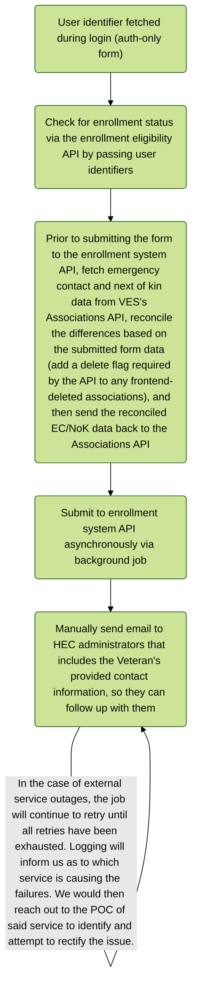

```mermaid
---
config:
  theme: forest
---
flowchart TD
    A("User identifier fetched during login (auth-only form)")
    A --> B(Check for enrollment status via the enrollment eligibility API by passing user identifiers)
    B --> C("Prior to submitting the form to the enrollment system API, fetch emergency contact and next of kin data from VES's Associations API, reconcile the differences based on the submitted form data (add a delete flag required by the API to any frontend-deleted associations), and then send the reconciled EC/NoK data back to the Associations API")
    C --> D(Submit to enrollment system API asynchronously via background job)
    D --> E("Background job fails with no retries left(16 total retries that span 2d 1h 47m 12s)")
    E -->|In the case of external service outages, the job will continue to retry until all retries have been exhausted. Logging will inform us as to which service is causing the failures. We would then reach out to the POC of said service to identify and attempt to rectify the issue.| E(Manually send email to HEC administrators that includes the Veteran's provided contact information, so they can follow up with them)
```
