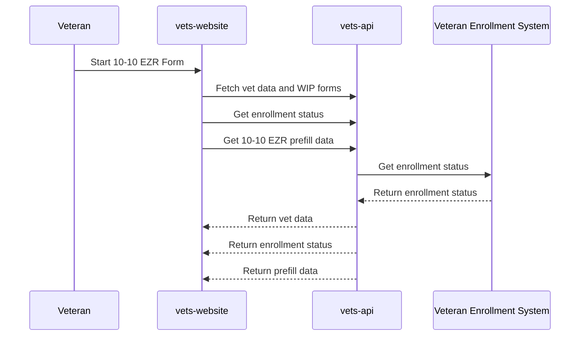
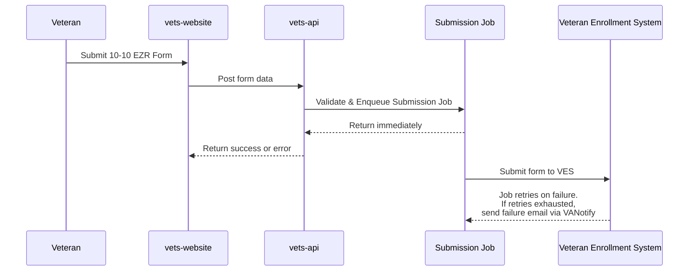

## Filling Out Form 10-10EZR

```mermaid
sequenceDiagram
    participant Veteran
    participant Frontend as vets-website
    participant Backend as vets-api
    participant VES as Veteran Enrollment System

    Veteran->>Frontend: Start 10-10 EZR Form

    Frontend->>Backend: Fetch vet data and WIP forms
    Frontend->>Backend: Get enrollment status
    Frontend->>Backend: Get 10-10 EZR prefill data

    Backend->>VES: Get enrollment status
    VES-->>Backend: Return enrollment status

    Backend-->>Frontend: Return vet data
    Backend-->>Frontend: Return enrollment status
    Backend-->>Frontend: Return prefill data
```
## Submitting Form 10-10EZR

```mermaid
sequenceDiagram
    participant Veteran
    participant Frontend as vets-website
    participant Backend as vets-api
    participant Job as Submission Job
    participant VES as Veteran Enrollment System

    Veteran->>Frontend: Submit 10-10 EZR Form
    Frontend->>Backend: Post form data
    Backend->>Job: Validate & Enqueue Submission Job
    Job-->>Backend: Return immediately
    Backend-->>Frontend: Return success or error

    Job->>VES: Submit form to VES
    VES-->>Job: Job retries on failure.<br/>If retries exhausted,<br/>send failure email via VANotify
```
