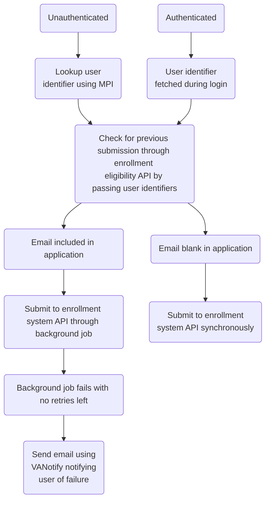

```mermaid
flowchart TD
    A(Unauthenticated) --> B(Lookup user <br/>identifier using MPI)
    C(Authenticated) --> D(User identifier <br/>fetched during login)
    B --> E(Check for previous <br/>submission through enrollment <br/>eligibility API by <br/>passing user identifiers)
    D --> E 
    E --> F(Email included in application)
    F --> G(Submit to enrollment <br/>system API through background job)
    G --> H(Background job fails with no retries left)
    H --> I(Send email using <br/>VANotify notifying <br/>user of failure)
    E --> J(Email blank in application)
    J --> K(Submit to enrollment <br/>system API synchronously)
```
