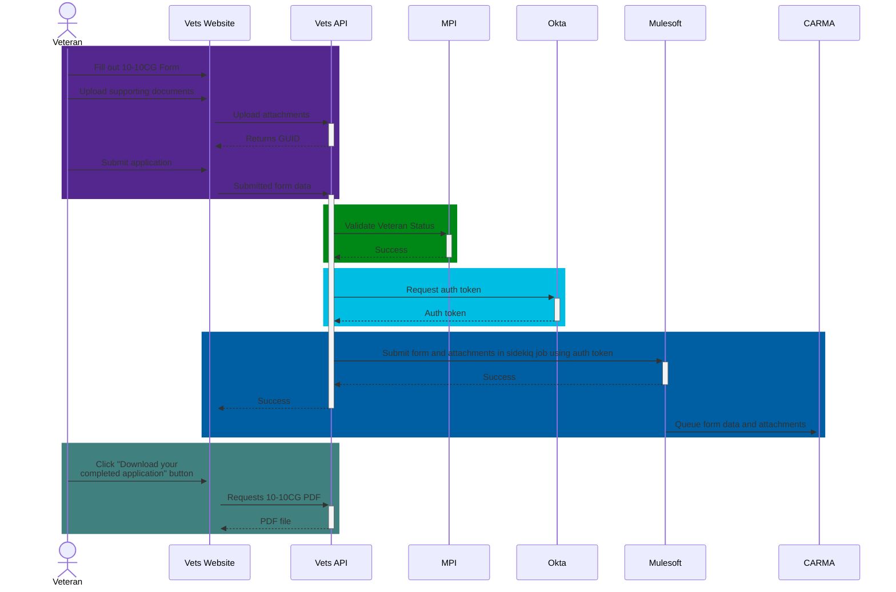

```mermaid
sequenceDiagram
  actor Veteran as Veteran

  participant vets-website as Vets Website
  participant vets-api as Vets API
  participant mpi as MPI

  participant Okta
  participant mulesoft as Mulesoft
  participant carma as CARMA

  rect rgb(84, 39, 143)
  Veteran ->>+ vets-website: Fill out 10-10CG Form
  Veteran ->>+ vets-website: Upload supporting documents
  vets-website ->>+ vets-api: Upload attachments
  vets-api -->>- vets-website: Returns GUID
  Veteran ->>+ vets-website: Submit application
  vets-website ->>+ vets-api: Submitted form data
  end

  rect rgb(0, 136, 23)
  vets-api ->>+ mpi: Validate Veteran Status
  mpi -->>- vets-api: Success
  end

  rect rgb(0, 189, 227)
  vets-api ->>+ Okta: Request auth token
  Okta -->>- vets-api: Auth token
  end

  rect rgb(0, 94, 162)
  vets-api ->>+ mulesoft: Submit form and attachments in sidekiq job using auth token
  mulesoft -->>- vets-api: Success
  vets-api -->>- vets-website: Success
  mulesoft ->>+ carma: Queue form data and attachments
  end

  rect rgb(64, 128, 126)
  Veteran ->>+ vets-website: Click "Download your <br> completed application" button
  vets-website ->>+ vets-api: Requests 10-10CG PDF
  vets-api -->>- vets-website: PDF file
  end
```
