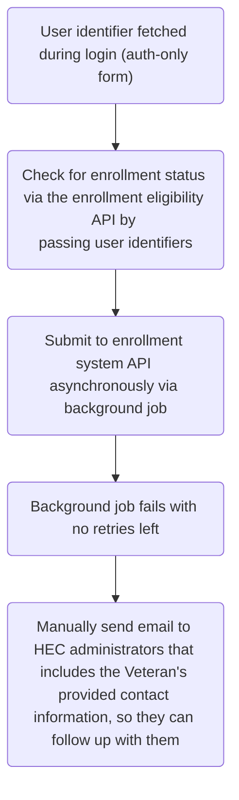

```mermaid
flowchart TD
    A("User identifier fetched during login (auth-only form)")
    A --> B(Check for enrollment status via the enrollment eligibility API by <br/>passing user identifiers)
    B --> C(Submit to enrollment system API asynchronously via background job)
    C --> D(Background job fails with no retries left)
    D --> E(Manually send email to HEC administrators that includes the Veteran's provided contact information, so they can follow up with them)
```
