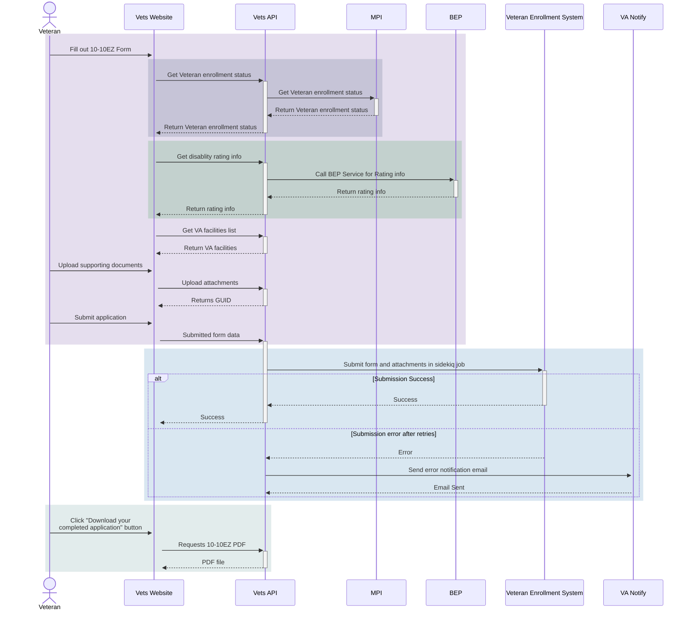

```mermaid
sequenceDiagram
  actor Veteran as Veteran

  participant vets-website as Vets Website
  participant vets-api as Vets API
  participant mpi as MPI
  participant bep as BEP

  participant VES as Veteran Enrollment System
  participant vanotify as VA Notify

  %% Form Filling Section - Purple with transparency
  rect rgba(84, 39, 143, 0.15)
  Veteran ->>+ vets-website: Fill out 10-10EZ Form
    %% Facility Search Section - Dark Blue with transparency
    rect rgba(22, 46, 81, 0.15)
    vets-website ->>+ vets-api: Get Veteran enrollment status
    vets-api ->>+ mpi: Get Veteran enrollment status
    mpi -->>- vets-api: Return Veteran enrollment status
    vets-api -->>- vets-website: Return Veteran enrollment status
    end
    %% MPI Validation Section - Green with transparency
    rect rgba(0, 136, 23, 0.15)
    vets-website ->>+ vets-api: Get disablity rating info
    vets-api ->>+ bep: Call BEP Service for Rating info
    bep -->>- vets-api: Return rating info
    vets-api -->>- vets-website: Return rating info
    end
  vets-website ->>+ vets-api: Get VA facilities list
  vets-api -->>- vets-website: Return VA facilities
  Veteran ->>+ vets-website: Upload supporting documents
  vets-website ->>+ vets-api: Upload attachments
  vets-api -->>- vets-website: Returns GUID
  Veteran ->>+ vets-website: Submit application
  vets-website ->>+ vets-api: Submitted form data
  end

  %% VES Submission Section - Deep Blue with transparency
  rect rgba(0, 94, 162, 0.15)
  vets-api ->>+ VES: Submit form and attachments in sidekiq job
  alt Submission Success
    VES -->>- vets-api: Success
    vets-api -->>- vets-website: Success
  else Submission error after retries
    VES -->> vets-api: Error
    vets-api ->>+ vanotify: Send error notification email
    vanotify -->> vets-api: Email Sent
  end
  end

  %% PDF Download Section - Teal with transparency
  rect rgba(64, 128, 126, 0.15)
  Veteran ->>+ vets-website: Click "Download your <br> completed application" button
  vets-website ->>+ vets-api: Requests 10-10EZ PDF
  vets-api -->>- vets-website: PDF file
  end
```
