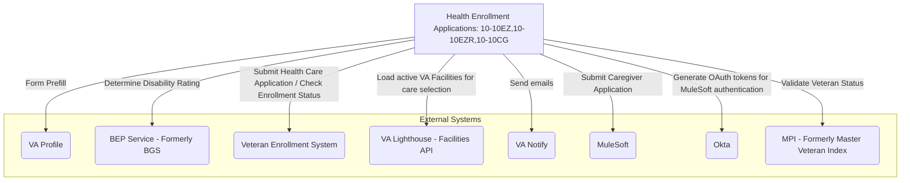

```mermaid
graph TD
    subgraph External Systems
        S1(VA Profile)
        S2(BEP Service - Formerly BGS)
        S3(Veteran Enrollment System)
        S4(VA Lighthouse - Facilities API)
        S5(VA Notify)
        S6(MuleSoft)
        S7(Okta)
        S8(MPI - Formerly Master Veteran Index)
    end

    A[Health Enrollment Applications: 10-10EZ,10-10EZR,10-10CG]

    A -- Form Prefill --> S1
    A -- Determine Disability Rating --> S2
    A -- Submit Health Care Application / Check Enrollment Status --> S3
    A -- Load active VA Facilities for care selection --> S4
    A -- Send emails --> S5
    A -- Submit Caregiver Application --> S6
    A -- Generate OAuth tokens for MuleSoft authentication --> S7
    A -- Validate Veteran Status --> S8
```
