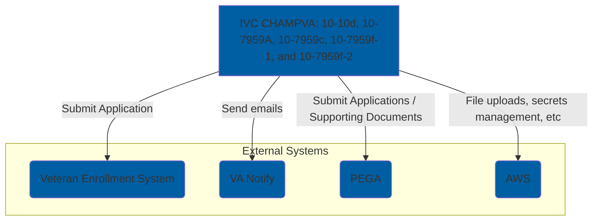

```mermaid
graph TD
    subgraph E[External Systems]
        S1(Veteran Enrollment System)
        S2(VA Notify)
        S3(PEGA)
        S4(AWS)
    end

    A[IVC CHAMPVA: 10-10d, 10-7959A, 10-7959c, 10-7959f-1, and 10-7959f-2]

    A -- Submit Application --> S1
    A -- Send emails --> S2
    A -- Submit Applications / Supporting Documents --> S3
    A -- File uploads, secrets management, etc  --> S4

    style A fill:#005EA2
    style S1 fill:#005EA2
    style S2 fill:#005EA2
    style S3 fill:#005EA2
    style S4 fill:#005EA2
```
