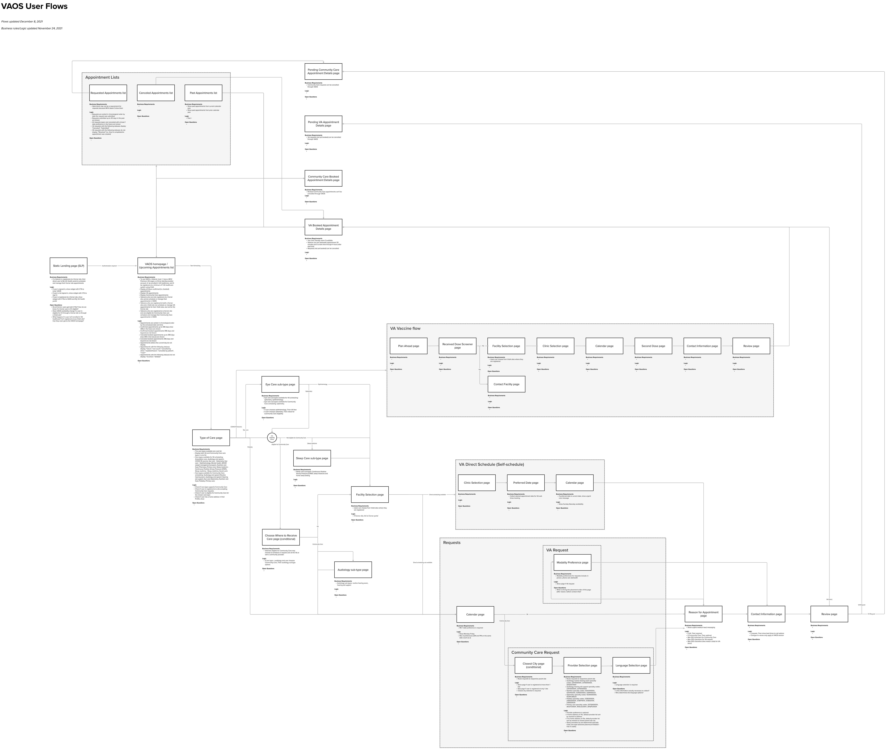

# VA Online Scheduling UX Hub

## Contacts

Peter Russo

Ciera Maddox

## Starting points

[Figma projects](https://www.figma.com/file/SreCOa4xyyBP0YxUug3QfA/Setting-our-stuff-up?node-id=0%3A1)

[Research](https://github.com/department-of-veterans-affairs/va.gov-team/tree/master/products/health-care/appointments/va-online-scheduling/research#readme)

[Copy docs](https://github.com/department-of-veterans-affairs/va.gov-team/tree/master/products/health-care/appointments/va-online-scheduling/content/copy-docs)

## Scheduling journey maps

[**VA patient experience journey**](https://github.com/department-of-veterans-affairs/va.gov-team/blob/master/platform/design/va-product-journey-maps/Patient%20Experience%20Journey%20Map.pdf) <-- start here

Other helpful journeys

* [VA Inpatient and Discharge](https://github.com/department-of-veterans-affairs/va.gov-team/blob/master/platform/design/va-product-journey-maps/Inpatient%20Journey%20Maps%20with%20Photos%20and%20Moments%20that%20Matter.pdf)
* [VA Inpatient Discharge](https://github.com/department-of-veterans-affairs/va.gov-team/blob/master/platform/design/va-product-journey-maps/Inpatient_Discharge_Journey_101018_V7.5.pdf)
* [VA Inpatient Hospitalization](https://github.com/department-of-veterans-affairs/va.gov-team/blob/master/platform/design/va-product-journey-maps/Inpatient_Hospitalization_Journey_112818_V7.5.pdf)
* [VA Employee-Patient Journey](https://github.com/department-of-veterans-affairs/va.gov-team/blob/master/platform/design/va-product-journey-maps/Veterans%20Outpatient%20Journey%20Map.pdf)

 
## Scheduling touchpoints

VAOS is [one of many touchpoints](https://github.com/department-of-veterans-affairs/va.gov-team/blob/master/products/health-care/appointments/va-online-scheduling/design/scheduling-channels-touchpoints.md) Veterans can use to schedule and manage health care appointments.

## Scheduling research

[Research folder](https://github.com/department-of-veterans-affairs/va.gov-team/tree/master/products/health-care/appointments/va-online-scheduling/research#readme)

## VAOS user flows

[Screenshots](https://github.com/department-of-veterans-affairs/va.gov-team/tree/master/products/health-care/appointments/va-online-scheduling/design) of the different flows.

Previous flow diagrams

  
- [Updated VAOS Flow - Flowmapp](https://app.flowmapp.com/share/0fdcf2559a4c55625591f89c2e5d7649/userflow/83089/)
- [VAOS Flow - Figma](https://www.figma.com/file/KGChcQHMrTReo7T7cML418/VAOS-Flow)

## VAOS UX documentation

Appointments list [overview](https://www.figma.com/file/5UPYWKTuy7FgSSTxsejtGI/?node-id=2%3A25). 

## VAOS UI documentation

VA Online scheduling is built on the [VA.gov design system](https://design.va.gov/).

[VAOS in the VA design system](https://www.figma.com/file/sWiXcrB6sgw1z4F8AtOqfK/?node-id=1203%3A89).

Page templates for the [appointments list](https://www.figma.com/file/twogqAIoOL9WAFRqvUbwiS/?node-id=0%3A50) and [details pages](https://www.figma.com/file/twogqAIoOL9WAFRqvUbwiS/?node-id=54%3A11449).

Templates for the [scheduling flows](https://www.figma.com/file/twogqAIoOL9WAFRqvUbwiS/?node-id=0%3A1911).

## VAOS content

[Content overview](https://github.com/department-of-veterans-affairs/va.gov-team/tree/master/products/health-care/appointments/va-online-scheduling/content)

[Copy docs](https://github.com/department-of-veterans-affairs/va.gov-team/tree/master/products/health-care/appointments/va-online-scheduling/content/copy-docs)

## VAOS design process

We measure the success of designs by following the [VAOS OKRs & KPIs](https://github.com/department-of-veterans-affairs/va.gov-team/blob/master/products/health-care/appointments/va-online-scheduling/analytics/vaos-kpis.md).

We track design work on the [VAOS Product/Design Board](https://app.zenhub.com/workspaces/vaos---productdesign-5fff340c2d80a4000fb6f69c/board?labels=vaos-product-design&repos=33202667,62409417,133843125,66304117)

## A short history of VAOS

At the end of 2019, the VAOSR initiative, a re-design project, launched with UAT testing with Veterans on the new application flow. By May 2020, VAOSR was at 100% availability on VA.gov. Around the same time, due to Covid-19, all facilities turned off direct scheduling (the ability to choose a date and time in VAOS).

In October 2020, the team collaborated with the Facility Locator team to research community care scheduling. The goal was to improve the provider selection as there was a steep drop-off rate on the community care provider selection page. Veterans had to navigate to Facility Locator to find their preferred provider and then copy/paste their information into VAOS. The team tested a prototype for selecting providers directly in VAOS and the Facility Locator uncovered insights about how schedules and Veterans search for providers. 

By December 2020, the team started work on improvements to the appointment list on the VAOS homepage. Veterans were having difficulty navigating the list and finding appointments, as well as distinguishing between video, phone, and in-person appointments.

Because other teams also display appointments, the VAOS team kicked off a cross-team effort to help other teams display appointments across different channels and tools where a Veteran might need to see them and followed up with usability testing.

Additional dev work on the homepage was put on hold as the team pivoted to COVID-19 vaccine scheduling in VAOS. This functionality is currently in pilot with limited facilities as of April 2021.
