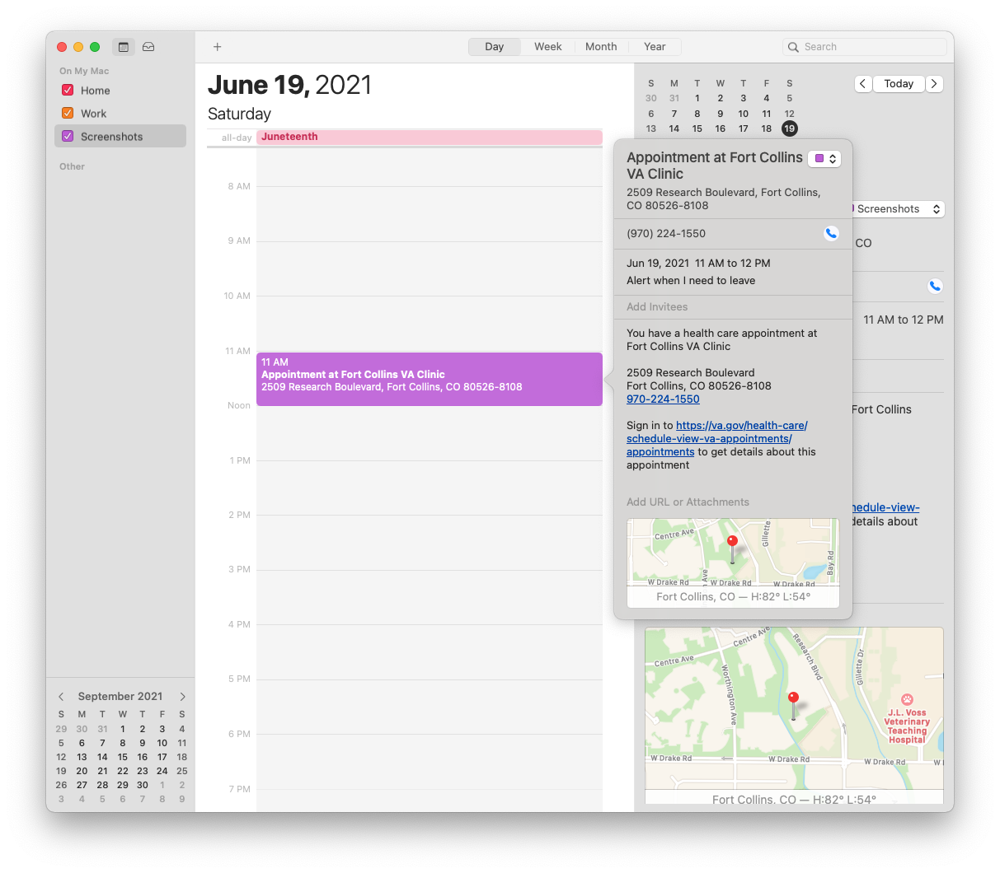
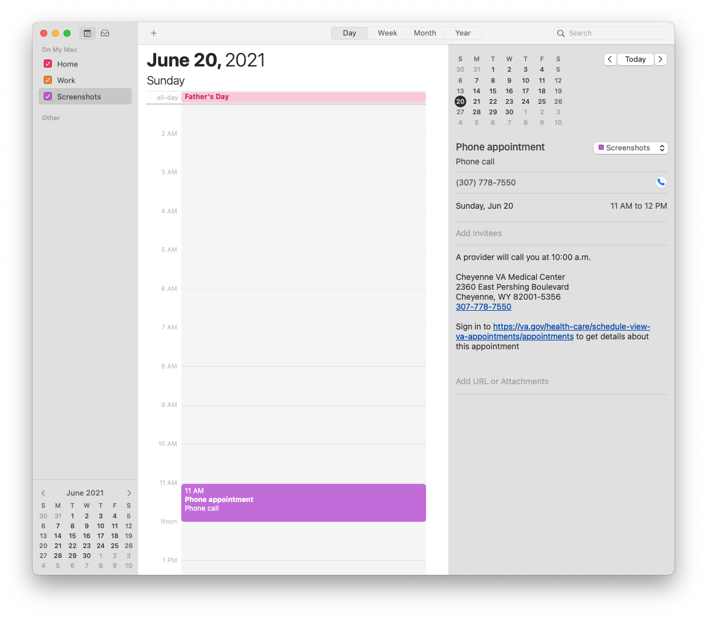
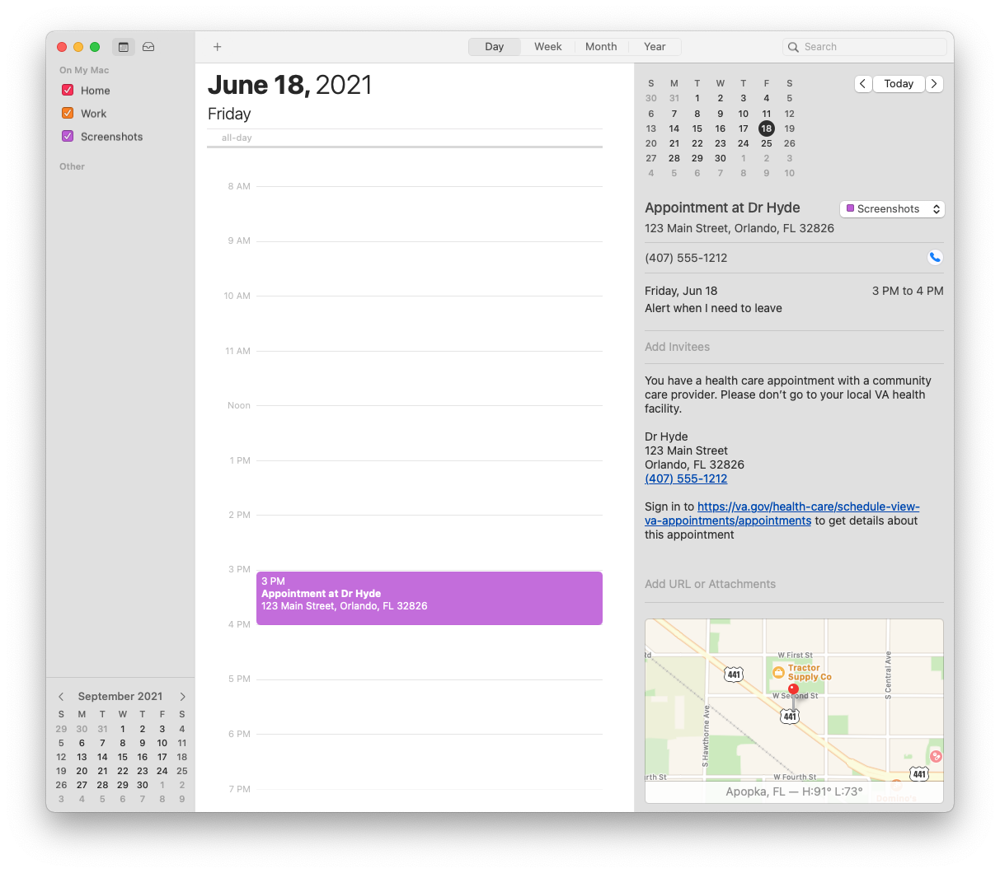
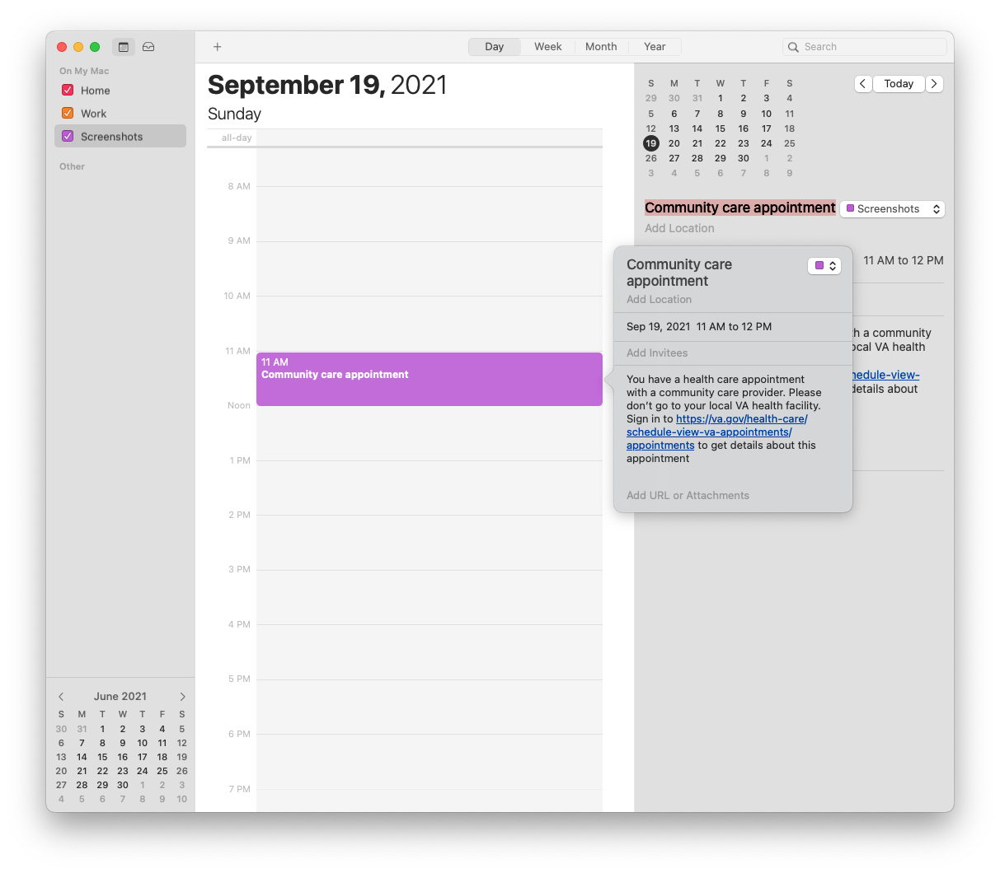
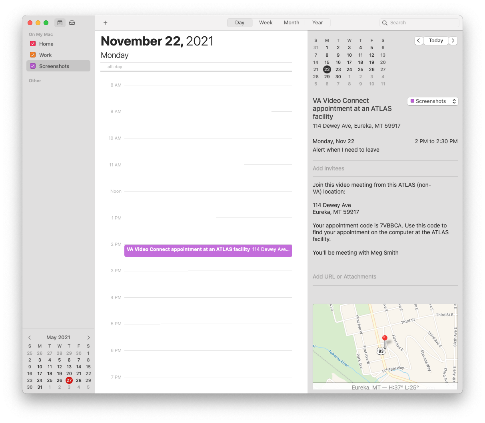
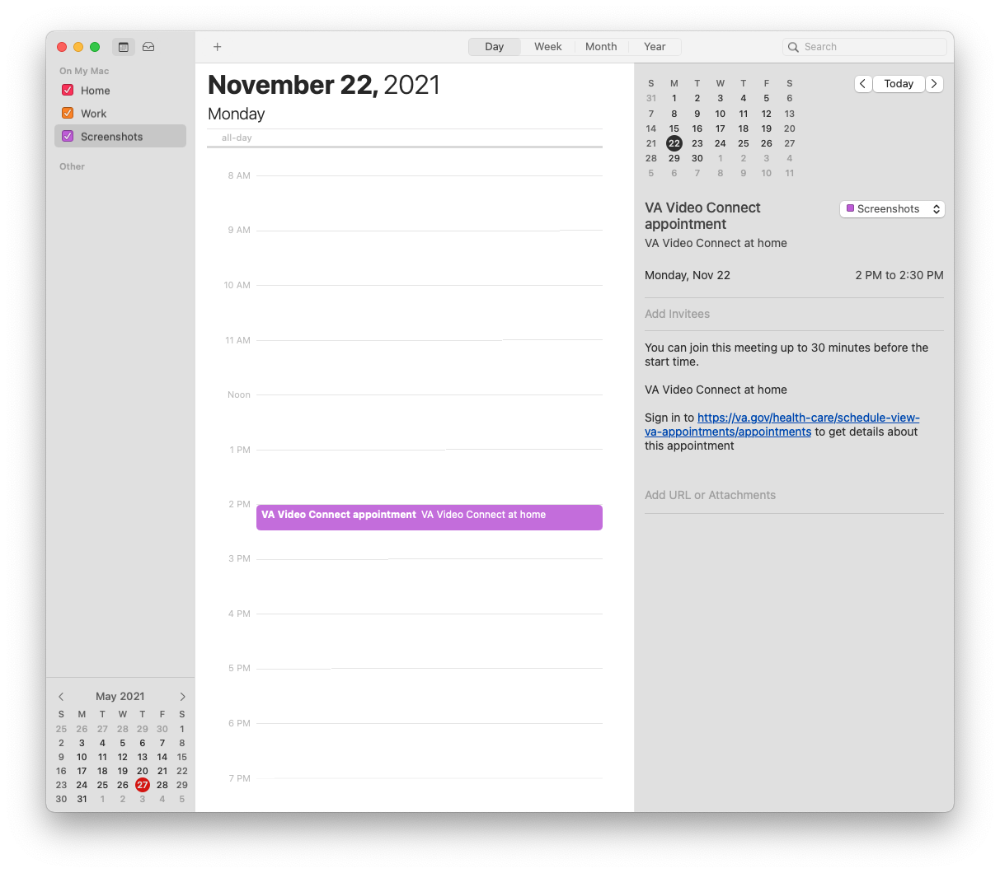
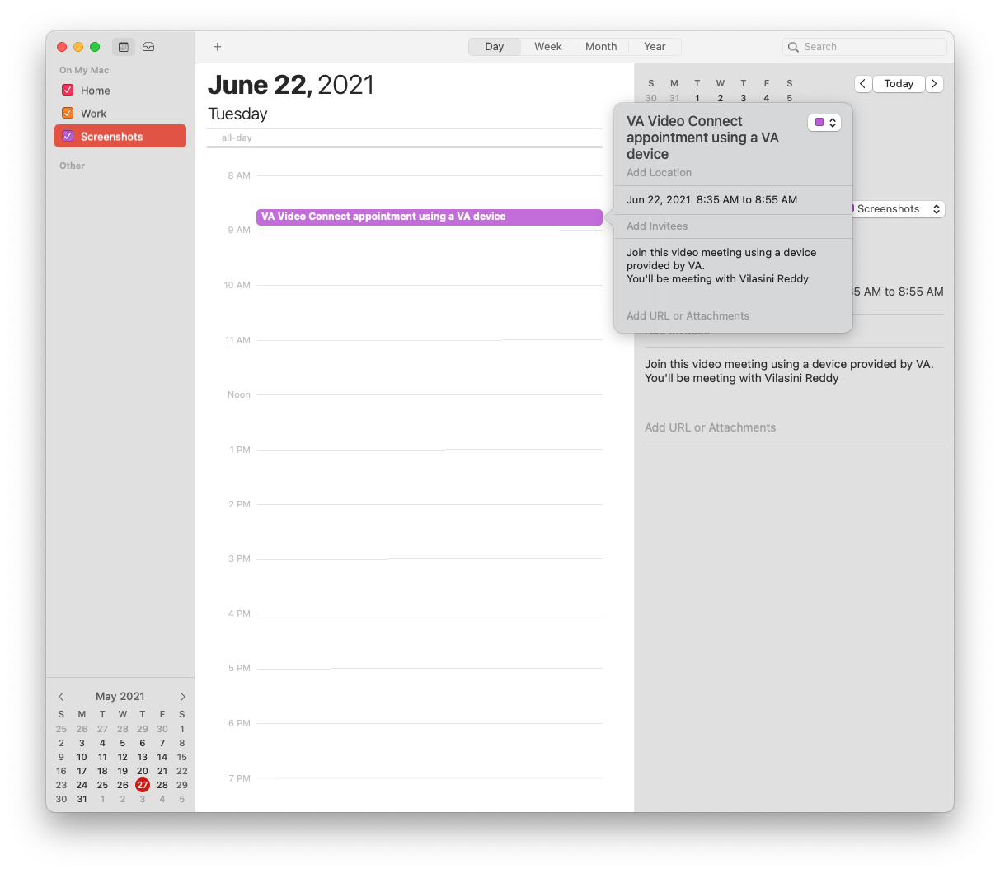
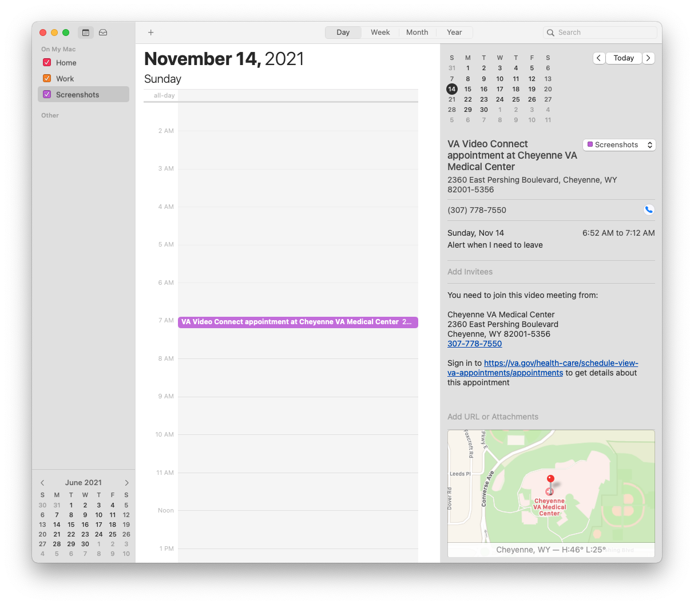

# Add to calendar
The following documents all of the different variations of the information contained in an appointment event when added to a user's personal calendar.

## VA in-Person

## VA phone

## Community Care

## Community Care (No provider)

## VA Video Connect ATLAS

## VA Video Connect home

## VA Video Connect VA device

## VA Video Connect VA location

