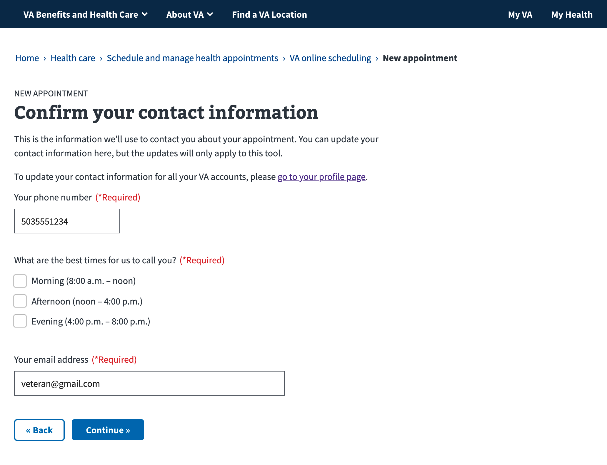

# Request a Community Care appointment flow

## 1. Type of Care Page
User can select from pre-defined types of care, which are defined in VATS but also hardcoded on the front end

If user has no residential address, has or a PO Box in vet 360 profile, the alert appears to prompt them to update their info

## 1a. Type of Eye Care Page
Extra sub-type of care selection if user selects eye care

## Type of Facility Page
Shown if user and type of care are Community Care eligible.  If the type of care they select is CC only (such as Podiatry) this page would be skipped and they'd be navigated directly to Calendar page

## Calendar Page
User can select up to 3 Date and AM/PM combintations where they'd prefer to be seen

### Calendar Validation 
Calendar page, too many preferred times chosen

Calendar page, no time selected

## Preferences page

User can select closest city and state, language preference, and optionally enter in provider info

If user chooses "Yes" for provider question, fields appear where they can enter info

## Provider Selection Page (unreleased)

Once released, users will be able to search for a provider based on their residential address or current location

## Language Selection Page (unreleased)

## Reason for Appointment Page

## Contact Info Page
Phone and email are pre-populated from VA Profile

## Review page

### Submit failed
Review page with server error after submit

## Community Care Confirmation page

Confirmation page with show more expanded

## Email notifications
### If scheduled on requested date:
* Subject: Response to your VHA appointment Request.
* Body: Your Community appointment was scheduled based upon your request.

### If scheduled on different date:
* Subject: Response to your VHA appointment Request.
* Body: Your Community appointment has been scheduled at a time that differs from what you originally requested.
