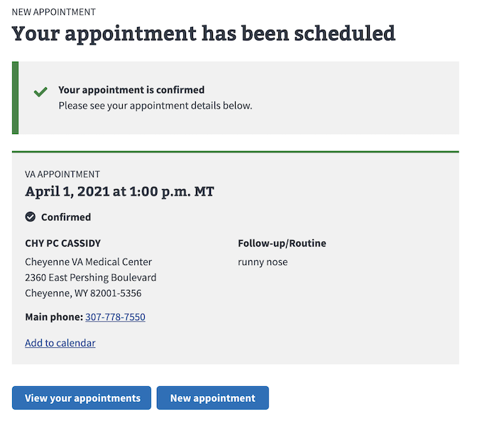
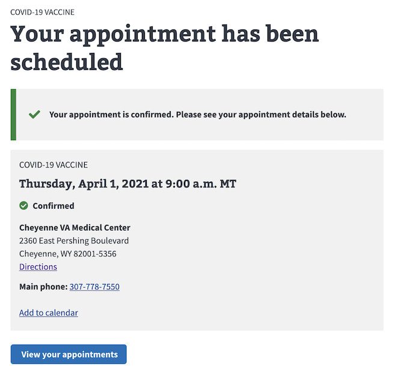

# Confirmation Cards
The following documents all of the different variations of confirmation cards we display on the VAOS confirmation page. 

## Data Source
As the user enters the appointment form, the data are stored in the react redux store. The data are collected then displayed in the confirmation page

## Scheduled Confirmation Appointments
Schedule confirmation cards are available through VA appointment and COVID-19 vaccine appointments. Scheduled cards have a green check and "Confirmed" marked on the card. Direct schedule offers only in-person appointments at the present time.

### VA Appointments

User will see facility detail and one of four reason for appointment:

* New issue
* Follow-up/Routine 
* Medication concern
* My reason isn't listed

It does not however show the type of care user has selected. The example below is for Primary care

### COVID-19 Vaccine Appointments

Covid vaccine displays facility details

## Requested Confirmation Appointments
Requested confirmation cards are available through VA request, Community Care request and Express Care request. It displays up to three preferred request dates. Request appointments are differienated with a yellow horizonal bar above the card, a caution icon and "Pending" text

### VA Request ###

VA requests have three visit types:
 * Office visit
 * Phone call
 * Telehealth (through VA video Connect)

**Office visit**

The example below is for Office visit and displays as VA APPOINTMENT. User has also selected 3 preferred dates

To view additional information about the request confirmation, click on the "Show more" link to reveal reason for visit and contact details.

**Phone call**

Dispite being a phone call request, it displays as VA APPOINTMENT

**Telehealth**

Displays as VA VIDEO CONNECT

### Community Care Request ###

Community care request have the option of having user select from chose of providers or none at all. In either case, the user selects a preferred language spoken. 

**Provider Selected**

**No Provider Selected**

