# Alerts

Below you'll find screenshots and copy for every AlertBox that we display throughout the New Appoitnment flow

## Generic Error Message

**We’re sorry. We’ve run into a problem**
Something went wrong on our end. Please try again later.

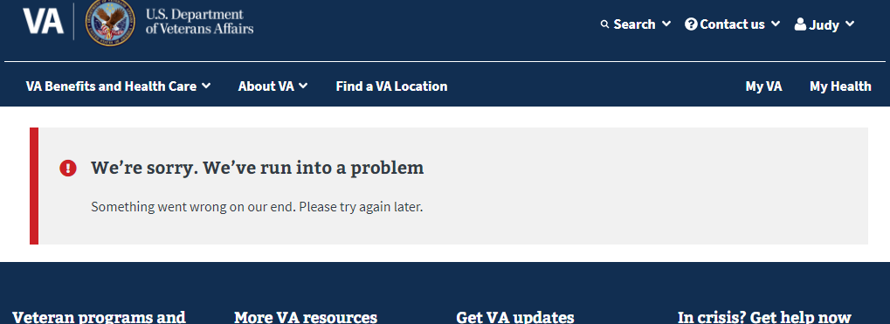

## VAOS Unavailable

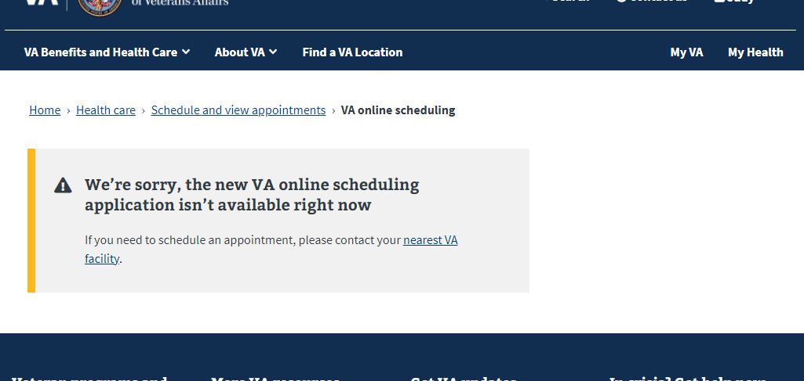

## Type of Care Page

### No Address Alert

**You need to have a home address on file to use some of the tool's features**
You can update your address in your VA profile. Please allow some time for your address update to process through our system.

Update your address

### Missing Type of Care

**Not seeing the type of care you need?**
You’ll need to call your VA health facility to schedule an appointment.

Find a VA location

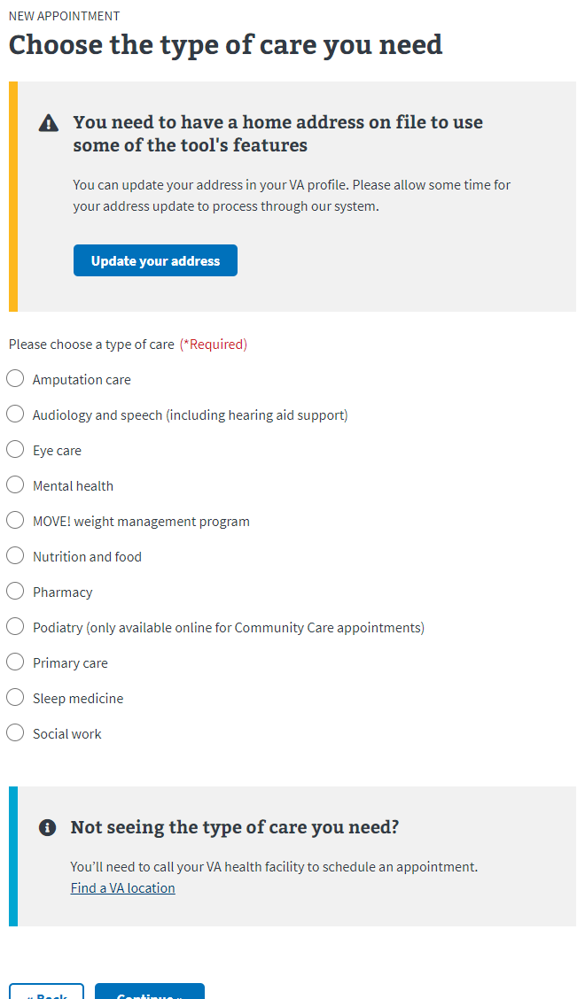

## Facilities Page

### Generic Error

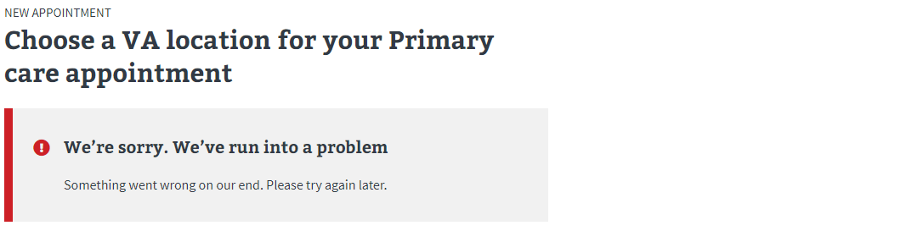

### No Registered VA Systems

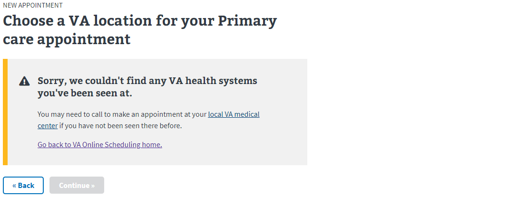

### No Valid VA Facilities

User is registered to a health system, but there are no facilities that support online scheduling for the selected type of care

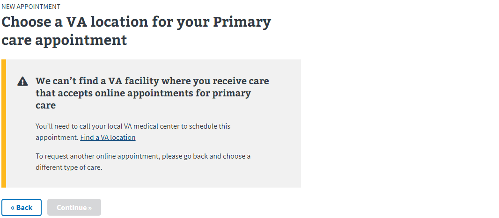

### Multiple VA Facilities - Eligibility Modal

If the type of care is schedulable at multiple facilities, we do further eligibility checks once the user selects a facility and hits continue.  If they are ineligible, we display the error message in a pop up modal:

#### Request Limit

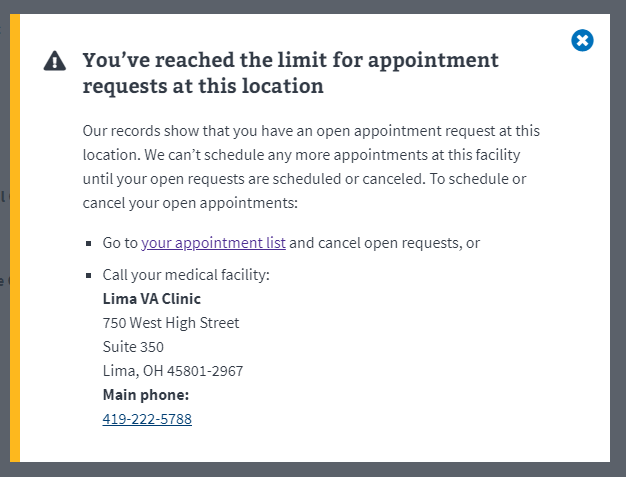

#### Past Visit

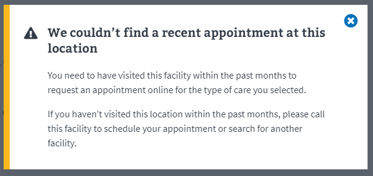

#### Requests not supported

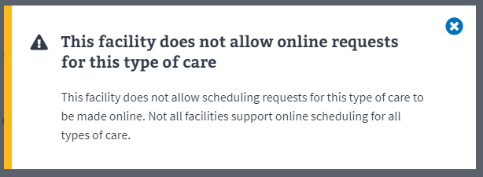

### Single VA Facility

If the selected type of care only has one facility available that supports scheduling, we display the following messages depending on whether they are eligible or ineligible:

#### Single Facility and Eligible to Schedule

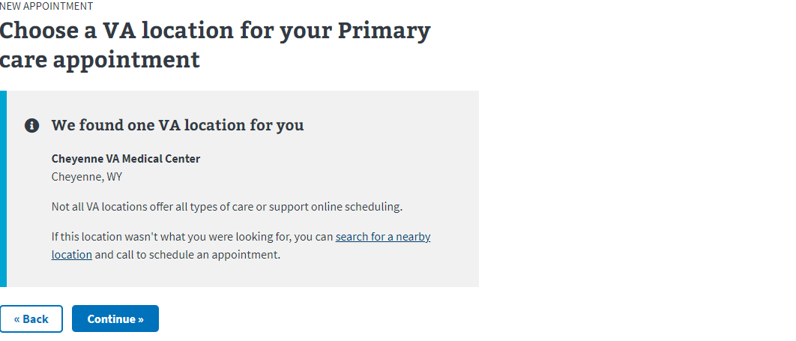

#### Single Facility But Ineligible - Request Limit

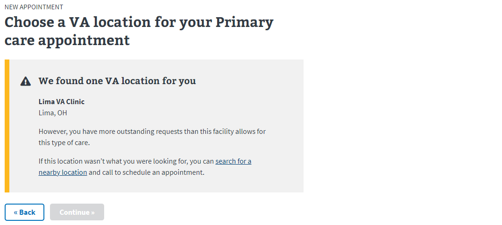

#### Single Facility But Ineligible - Past Visit Required

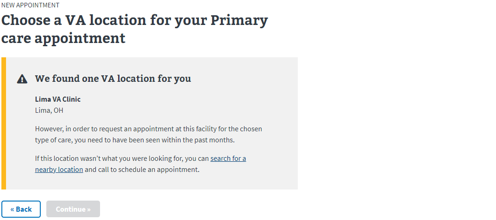

#### Single Facility But Ineligible - Requests Not Supported

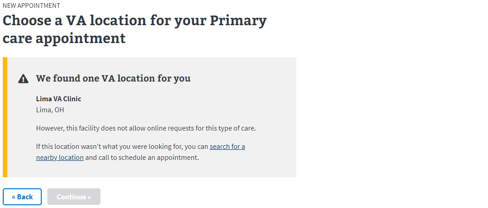

## Calendar Page: Direct Schedule

### Slot Loading Error

**We’ve run into a problem when trying to find available appointment times**
To schedule this appointment, you can submit a request for a VA appointment or call your local VA medical center.

### Urgent Care Alert

**Your earliest appointment time**

The earliest we can schedule your appointment is [date] at [time].

If this date doesn't work, you can:

* Submit a request for an earlier date, **or**
* Pick a date from the calendar below, **or**
* Call your local VA medical center

If you have an urgent medical need, please:

* Call the Veterans Crisis hotline at 800-273-8255 and press 1, **or**
* Go to your nearest emergency room or VA medical center. Find your nearest VA medical center

Request an earlier appointment OR Contact your local VA medical center

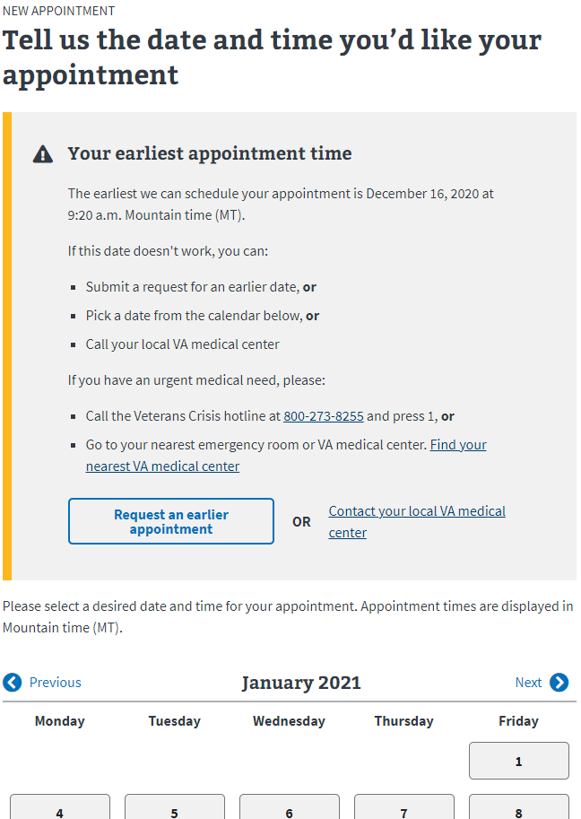

### Not Meeting Standard of Care Alert

**Your earliest appointment time**

The earliest we can schedule your appointment is [date] at [time].

If this date doesn't work, you can:

* Submit a request for an earlier date, **or**
* Pick a date from the calendar below, **or**
* Call your local VA medical center

Request an earlier appointment OR Contact your local VA medical center

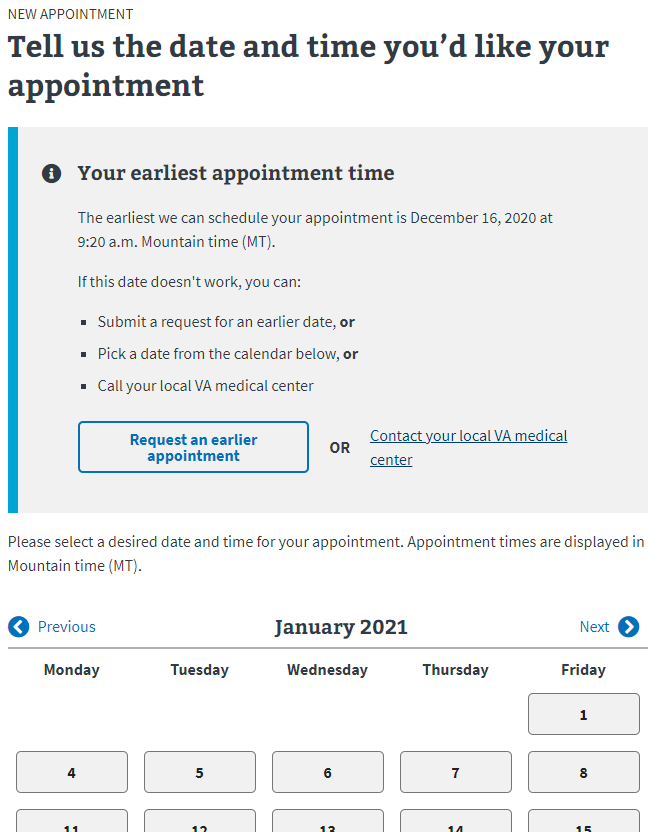

## Community Care Preferences Page

**We’ll try to schedule your appointment with your preferred community provider** 
If we aren’t able to schedule this appointment with your preferred provider, we’ll make every effort to schedule your appointment with another community provider closest to your home.

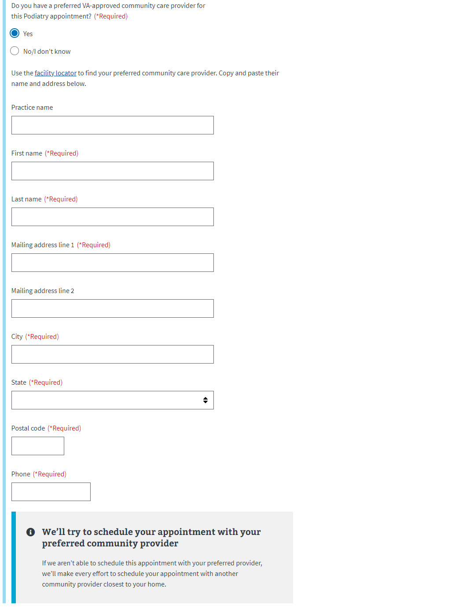

## **Reason for Appointment Page**

**If you have an urgent medical need, please:**

* Call 911, **or**
* Call the Veterans Crisis hotline at, **or**
* Go to your nearest emergency room or VA medical center. *Find your nearest VA medical center*

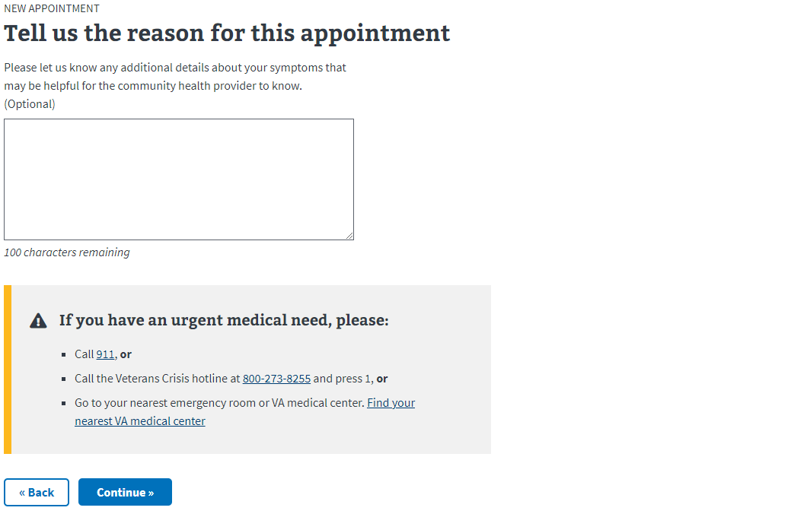

## **Direct Schedule Confirmation Page**

**Your appointment has been scheduled.** 
Your appointment is confirmed. Please see your appointment details below.

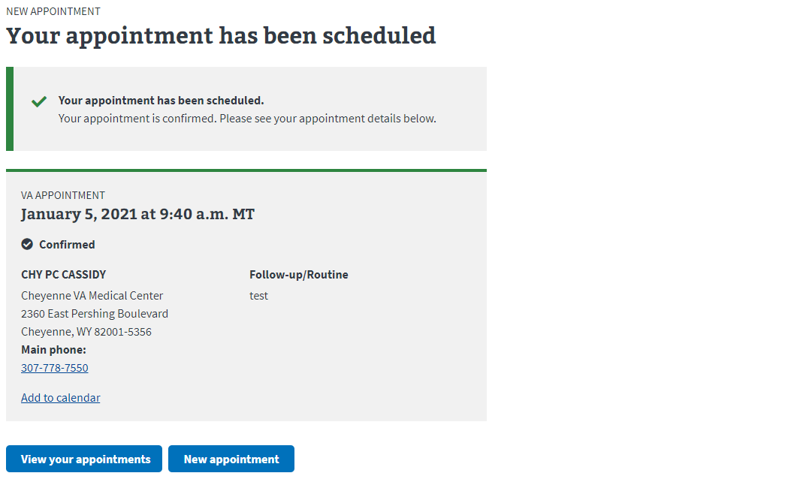

## Request Confirmation Page

**Your appointment request has been submitted.**
We’re reviewing your request. You don’t have anything to do right now. A scheduler will contact you to schedule the first available appointment.

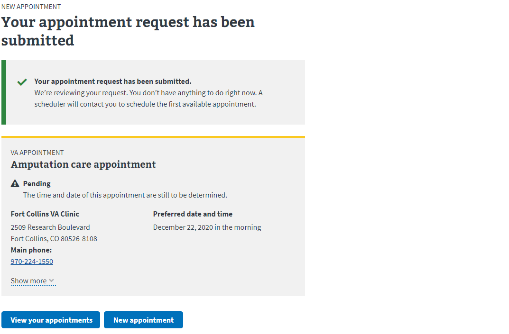
