# Appointment Cards
The following documents all of the different variations of appointment cards we display on the VAOS appointment lists.

## Data Source
Appointments are fetched from the backend and then transformed into FHIR format before being displayed.  Some examples of mock data we use for development can be found in.json files here:
* [Confirmed VA Appointments](https://github.com/department-of-veterans-affairs/vets-website/blob/master/src/applications/vaos/services/mocks/var/confirmed_va.json)
* [Confirmed Community Care appointments](https://github.com/department-of-veterans-affairs/vets-website/blob/master/src/applications/vaos/services/mocks/var/confirmed_cc.json)
* [Appointment Requests](https://github.com/department-of-veterans-affairs/vets-website/blob/master/src/applications/vaos/services/mocks/var/requests.json)

## Future Appointments
The future appointments tabs contain a combination of confirmed appointments (stored in VistA) and pending appointments (appointment requests).

Each card future card also has a colored top border that corresponds to the following statuses:

* Green: confirmed
* Yellow: pending (needs to be confirmed by a scheduler)
* Red: canceled (either by user or scheduler)

### Confirmed Appointments

#### In-person 

**VA Appointments**

Facility details available, no note, or note does not start with one of the preset purposes (see next item)

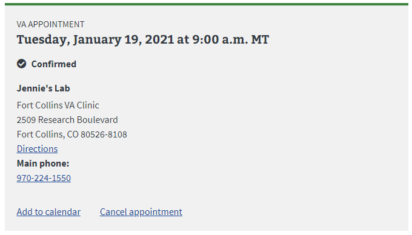

Facility details available and has booking note that starts with one of:

* Follow-up/Routine
* New issue
* Medication concern
* My reason isn't listed

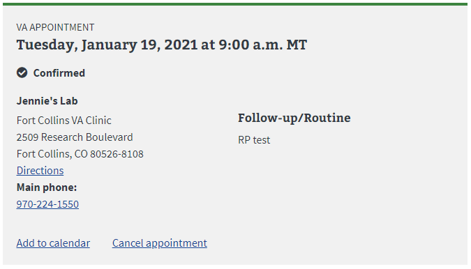

Facility details unavailable (fetching of info from facilities API failed)

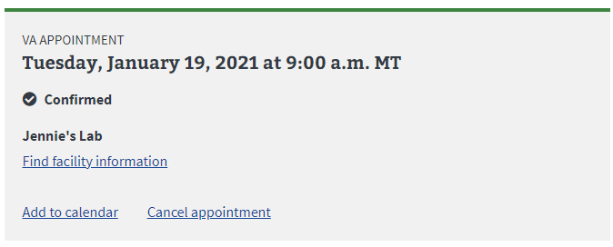

**Community Care**

Facility details available

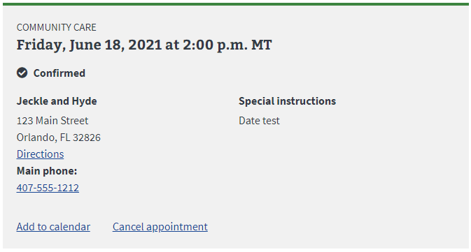

Facility details unavailable, has instructions for veteran

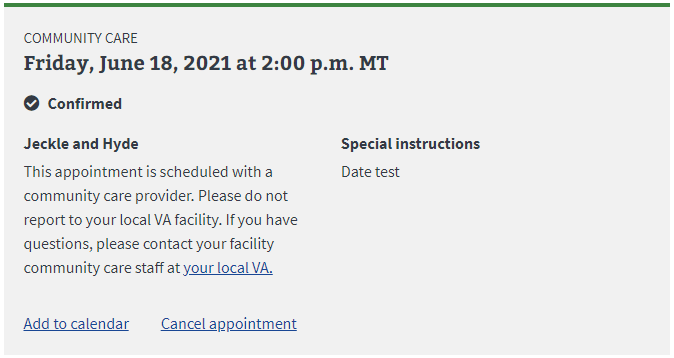

Facility details unavailable, no instructions

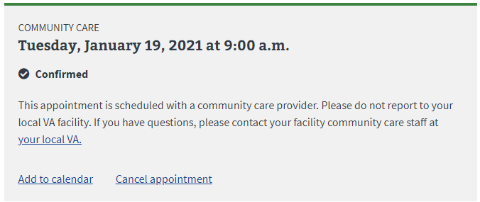

#### Phone

VA phone appointments allow a user to speak to a VA provider over the phone. The indicator text is to the right of the appointment type

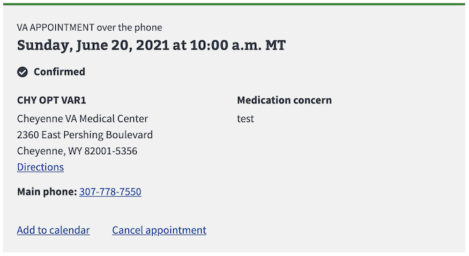

#### Video

Video visits allow a user to speak with a provider remotely.  There are several types of video appointments and they can be done either from home, a specified location, or through government furnished equipment (GFE).

VA Video Connect at home

* Button is disabled if > 30 minutes before start time, or 4 hours past start time

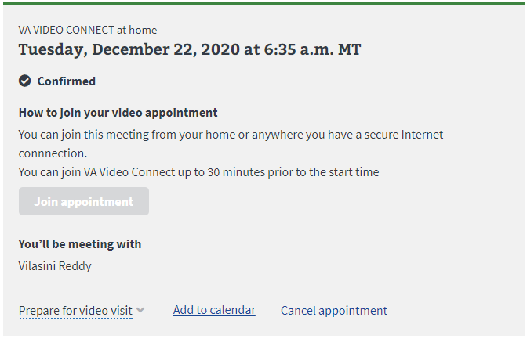

VA Video Connect at home with active join button

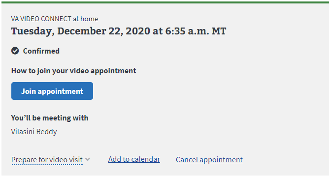

VA Video Connect at home "Prepare for video visit" expanded

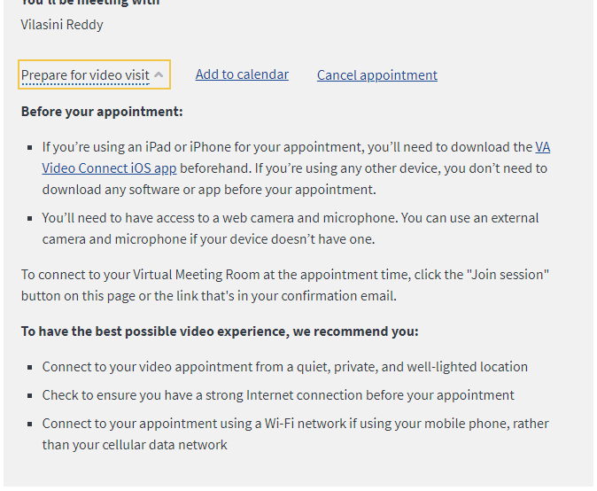

VA Video Connect at home "Prepare for video visit" expanded -  Medication review

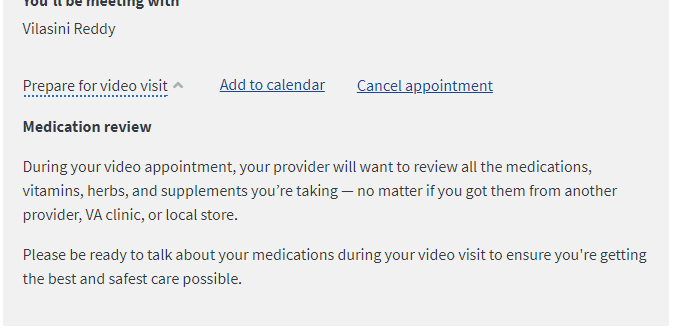

VA Video Connect at a VA location

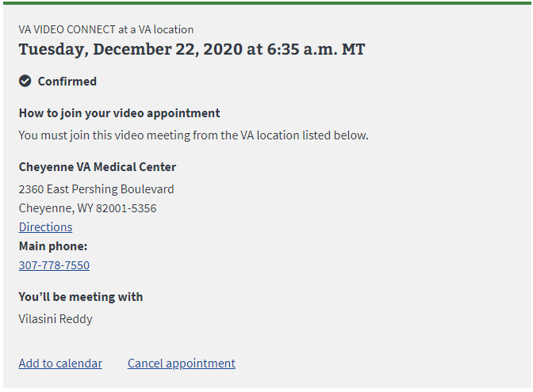

VA Video Connect using a VA device (GFE)

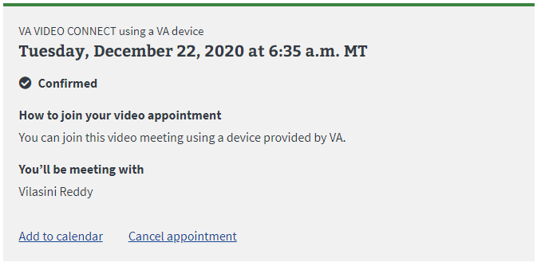

VA Video Connect at an ATLAS location

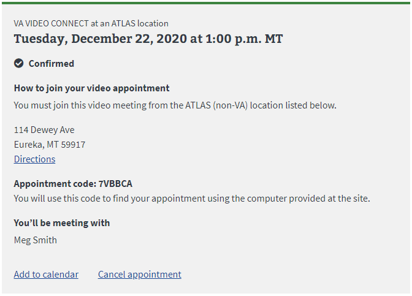

### Pending Appointments

Pending VA

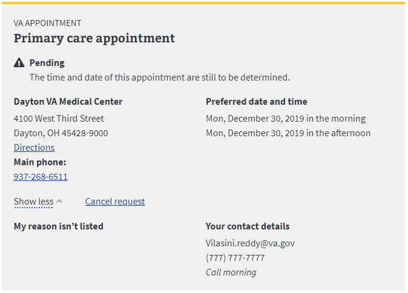

Pending CC

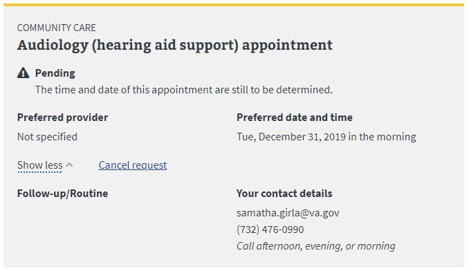

Pending Video

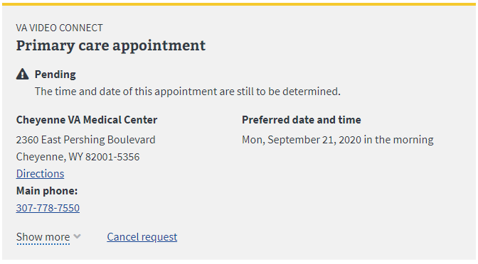

### Canceled Appointments

Canceled VA

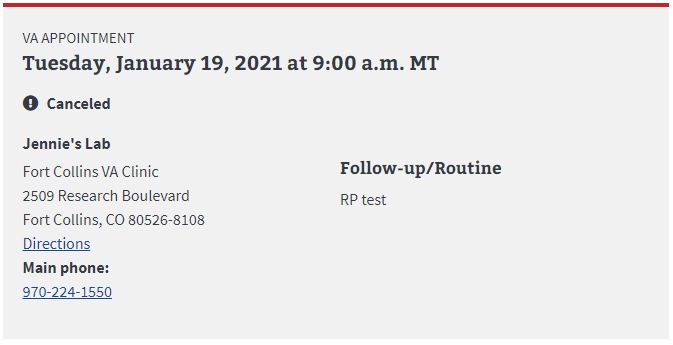

Canceled VA Video

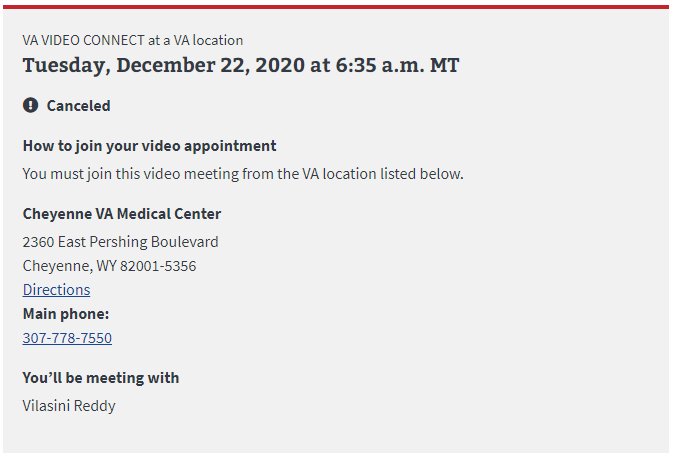

## Past Appointments

Past VA appointment

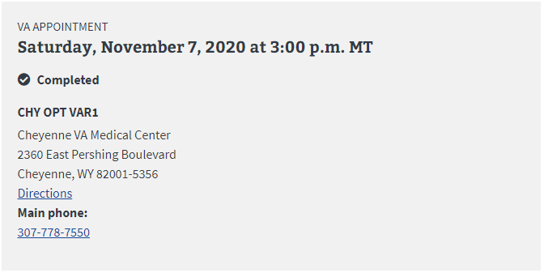

Past VA appointment

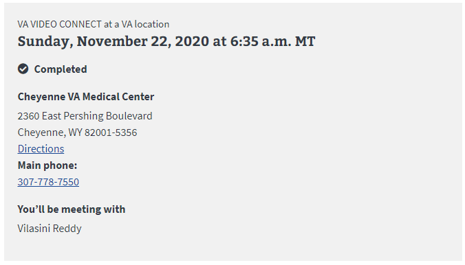

Past CC appointment

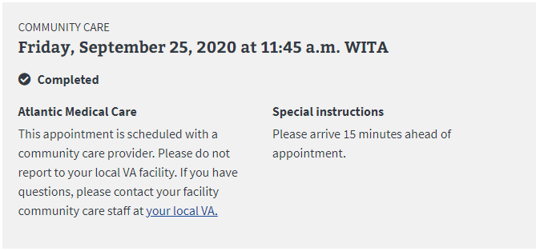

## Express Care

Pending

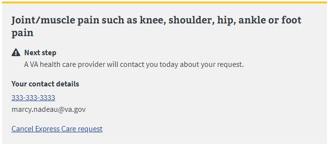

Completed

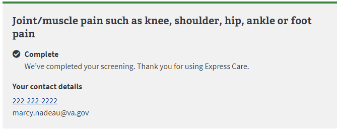

Canceled

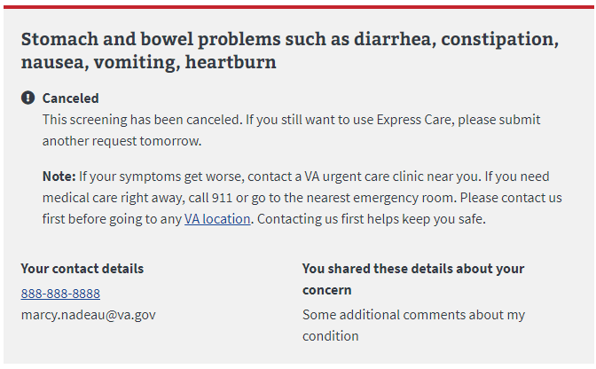

Canceled: Couldn't reach vet

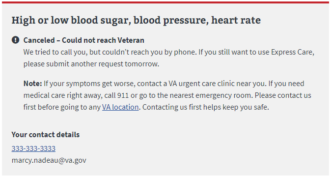
