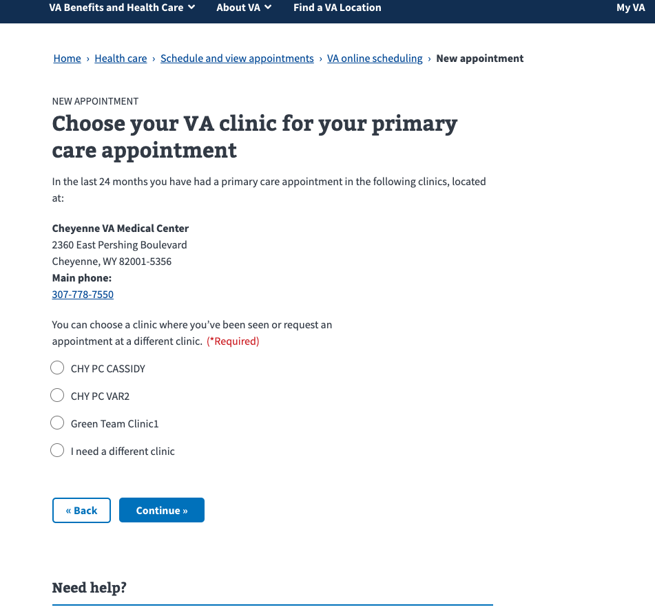
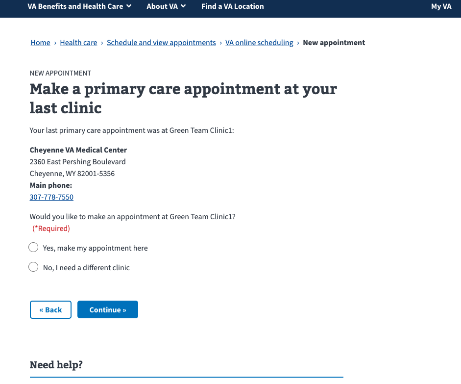
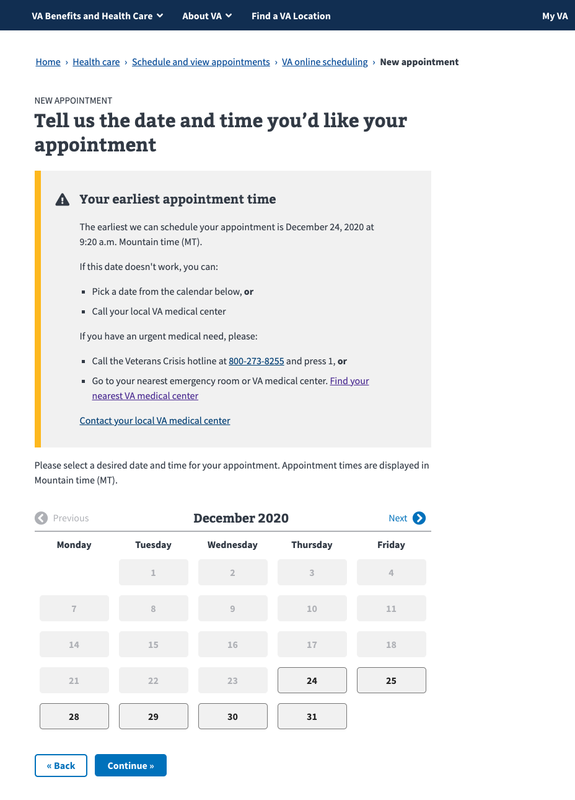
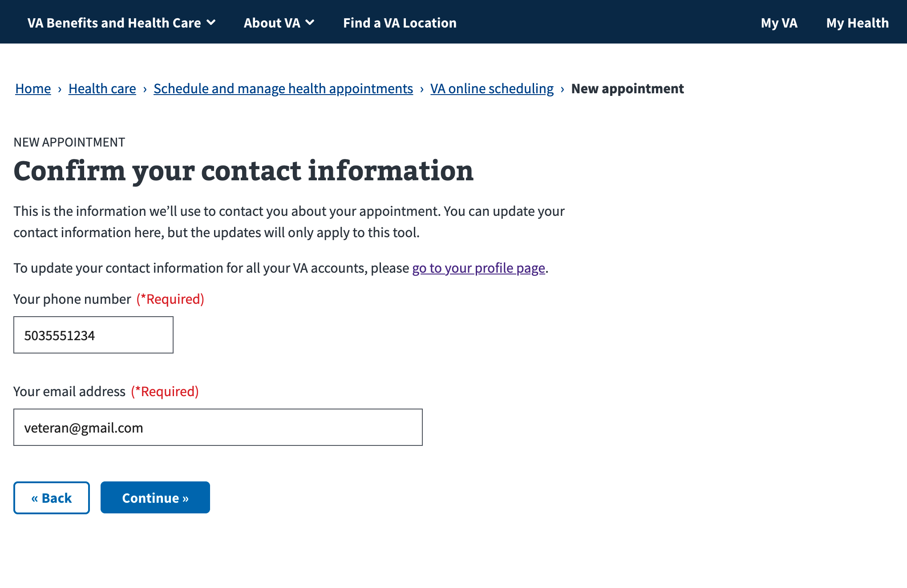
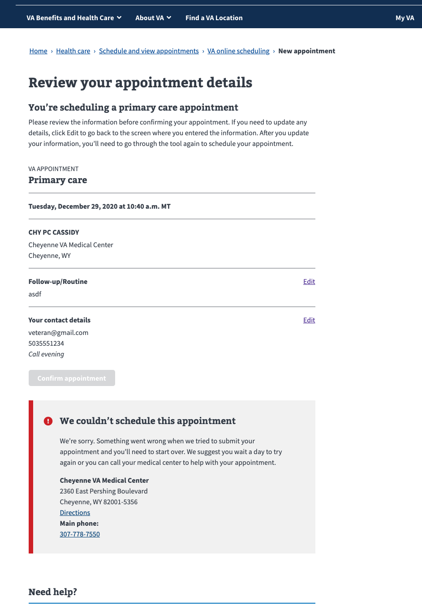

# Direct schedule flow

Type of care page. There are some branches for different types of care, but they're not really relevant to the direct scheduling part of the flow:

Type of facility page. Only appears if a user is eligible for Community Care:

Facility page:

Facility page sorted by current location:

Facility page with single supported facility:

Clinic page, when there is more than one valid clinic to choose from. These are VistA clinics, which are scheduling buckets at a particular facility:

Clinic page when there is only one valid clinic to choose from:

Clinic page when you choose "need a different clinic", which puts you in the request flow, and requests aren't supported:

Clinic page when you choose "need a different clinic", which puts you in the request flow, and you are over the request limit:

Preferred date page, which are required to capture for wait time metrics:

Calendar page

Calendar page with date open

Calendar page when there's an error fetching slots:

Calendar page when your preferred date is earlier than the next slot and that next slot doesn't meet standard of care requirements for wait time

Reason for appointment page:

Reason page with option selected:

Contact info page. Email and phone are pre-populated from VA Profile:

Review page

Submission error with an error type that indicates there's a configuration issue and not a transient technical error

Submission error with an error type that indicates there's an unexpected technical error

Confirmation page

