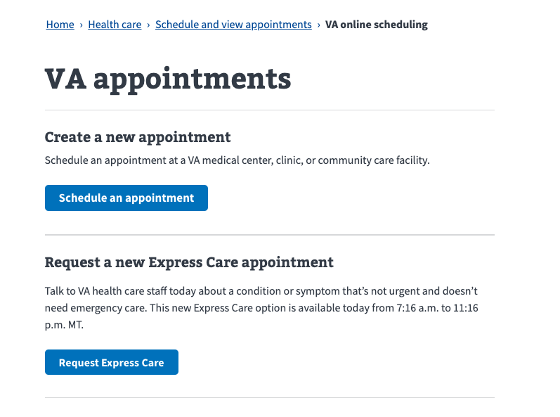
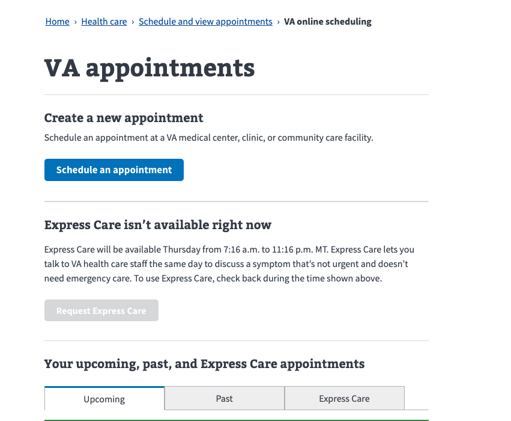
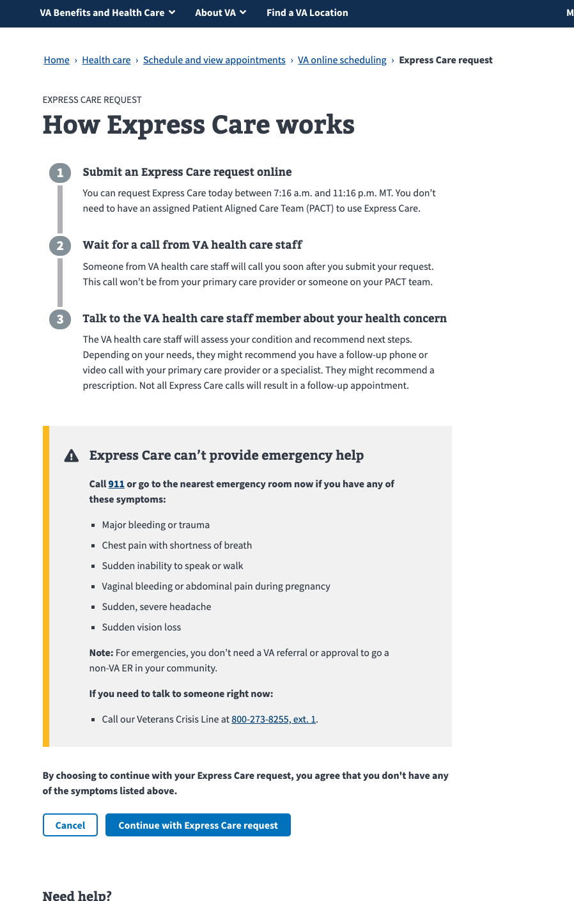
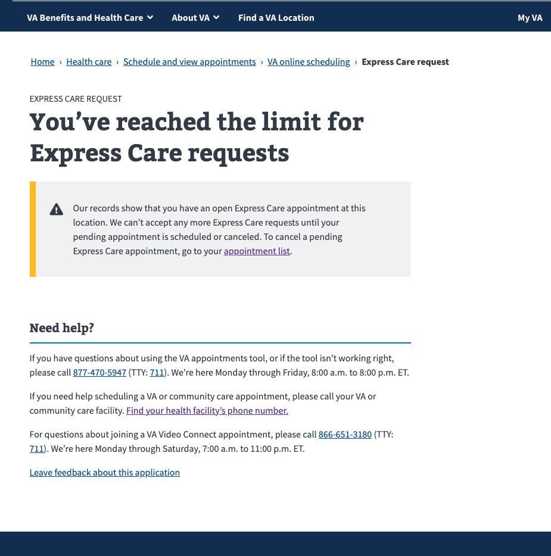
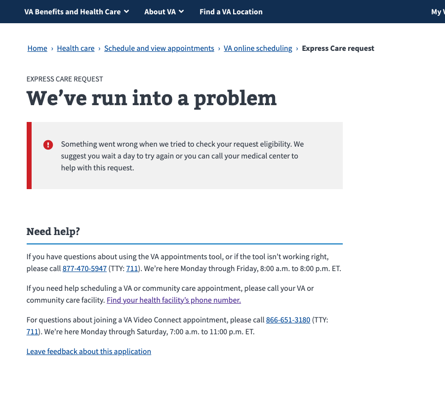
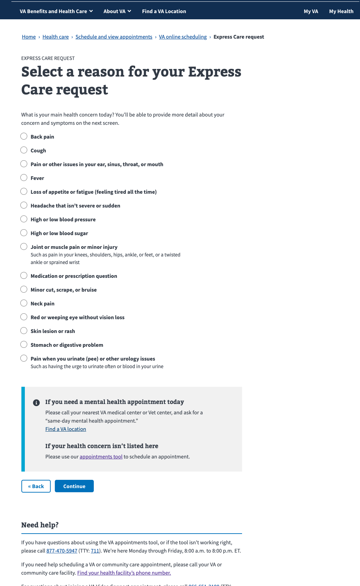
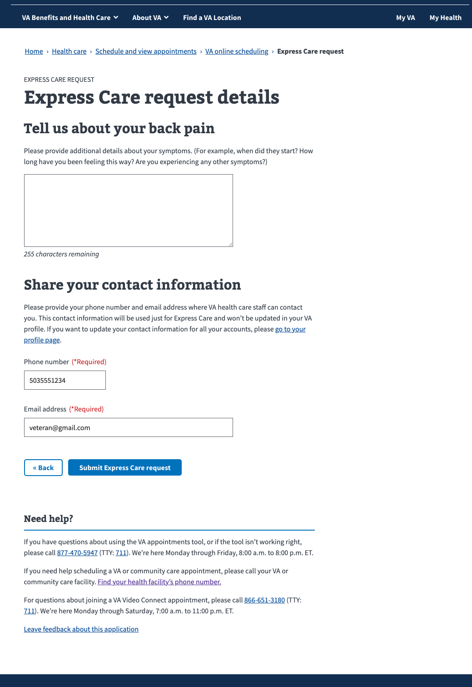
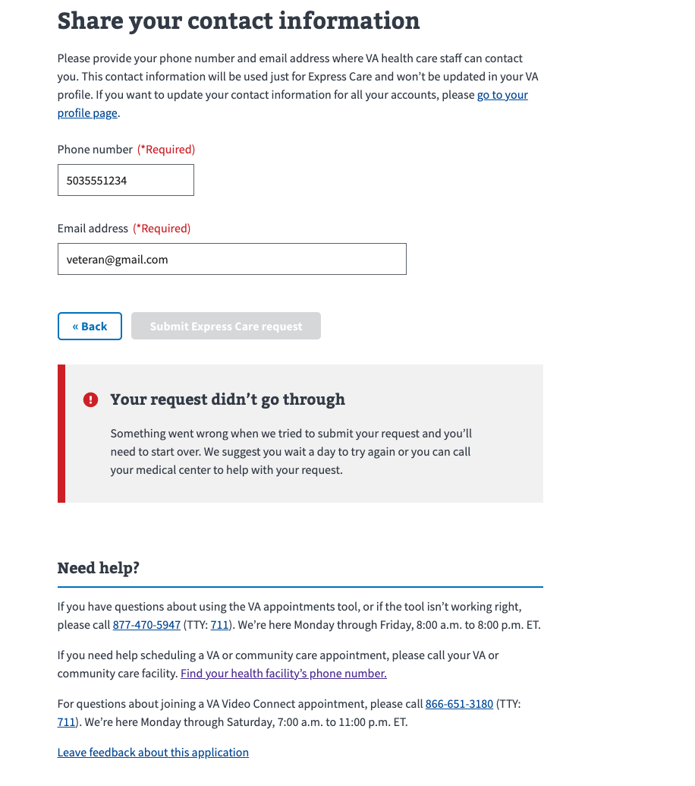
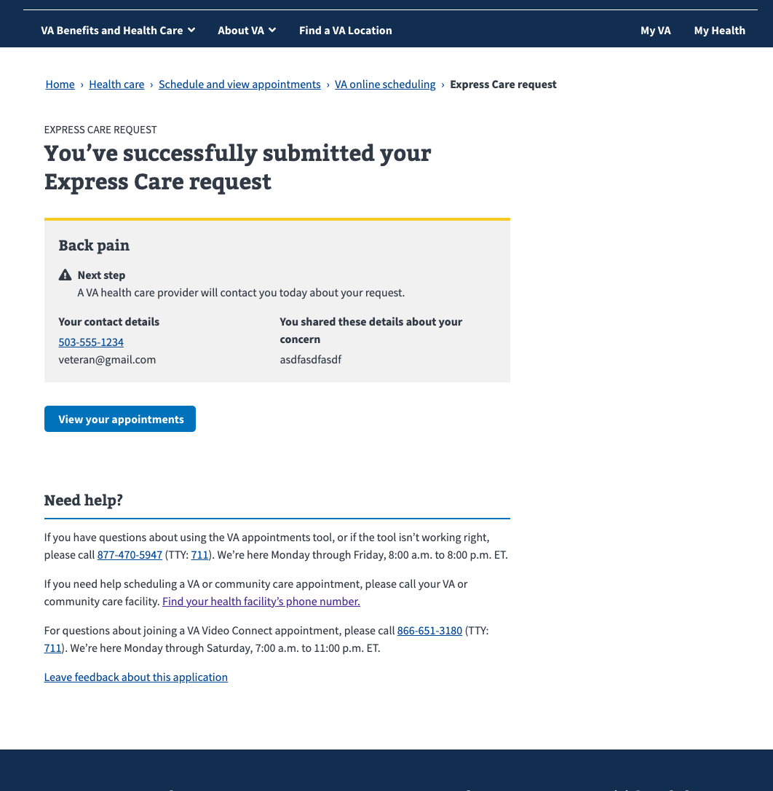

# Express Care flow states

Open Express Care window:

Closed Express Care window:

Info Page:

Request limit reached page:

Error when checking request limit page:

Symptoms page:

Contact info page:

Submit error page:

Confirmation page:

