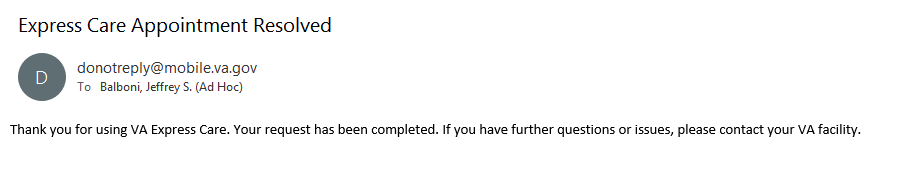

# Express Care flow states

Open Express Care window for the nearest facility to a user's residential address, where the user is registered:

Closed Express Care window, when a user is registered at at least one site that supports Express Care:

Info Page:

Request limit reached page (request limit is set to 2 per facility):

Error when checking request limit page (when attempting to check to see if user is over request limit):

Symptoms page (symptoms are hardcoded on front end, based on list from stakeholders):

Contact info page (phone and email are pre-populated from VA Profile)

Submit error page (happens when the server returns an error for our request):

Confirmation page:

Email sent out when request is resolved:

