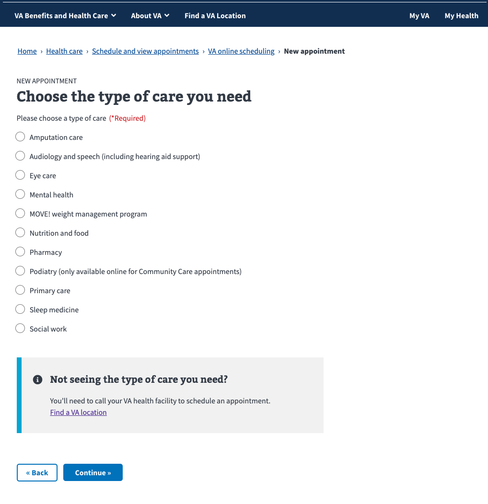
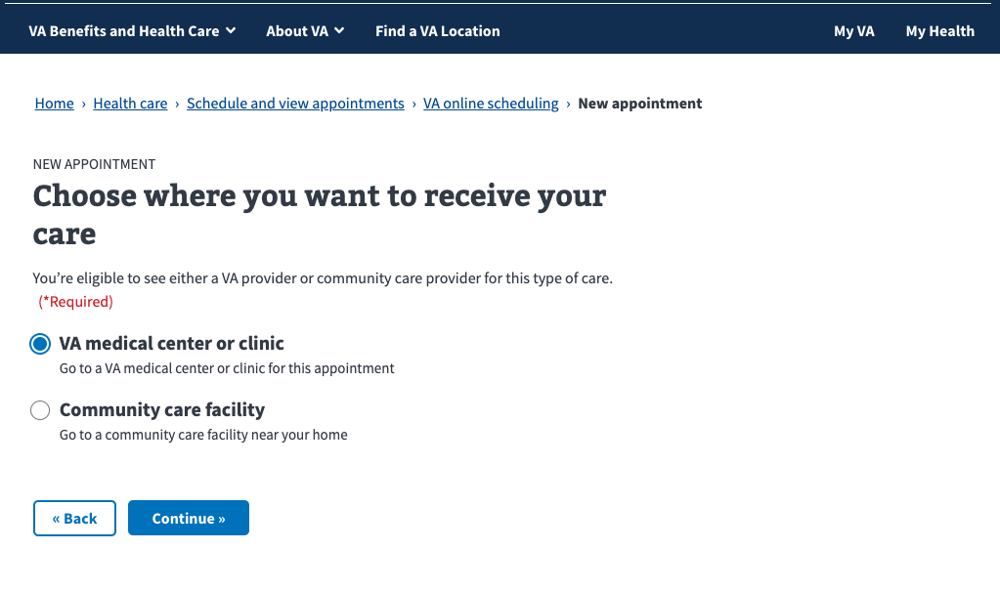
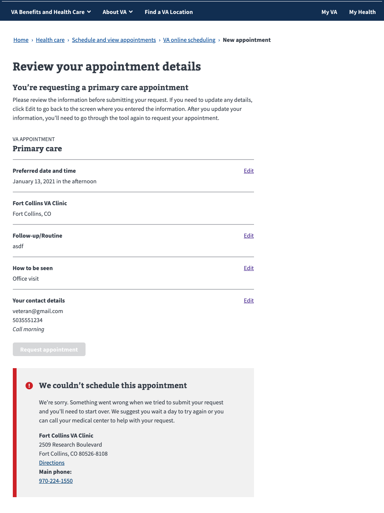

# Request a VA appointment flow

Type of care page, types are defined in VATS, but are also hardcoded on front end

Type of care page with missing address alert, shown when VA Profile has no residential address, or a PO Box

Type of eye care page

Type of sleep care page

Type of facility page, shown if user and type of care are Community Care eligible

VA facility page, with facilities from registered sites that support the chosen type of care, sorted by distance from VA Profile address

VA facility page, facilities sorted by distance from current location

VA facility page, alert shown if browser blocks location services

VA facility page, alert shown if user has open requests excceding the configured limit (1 or 2)

VA facility page, alert shown if user doesn't have a recent enough visit to the facility for the chosen type of care. This is configured in VATS, and doesn't apply to primary care

VA facility page, alert shown if facility supports direct scheduling, but user doesn't meet recent appointment requirement, and the facility has requests turned off. A pretty rare edge case.

VA facility page, dropdown show when a user is registered at facilities within 100 miles that don't support online scheduling

Calendar page

Calendar page, too many preferred times chosen

Calendar page, no time selected

Reason for appointment page

Reason for appointment page with additional info expanded

Type of appointment page

Contact info page, phone and email pulled from VA Profile

Review page

Review page with server error after submit

Review page with VistA configuration issue after submit

Confirmation page

Confirmation page with show more expanded

Email when appointment is scheduled by scheduler

