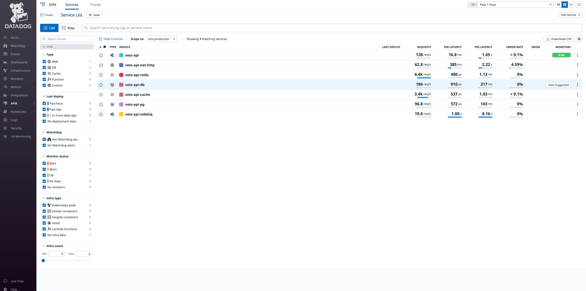
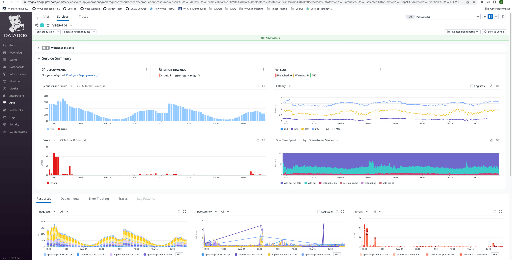
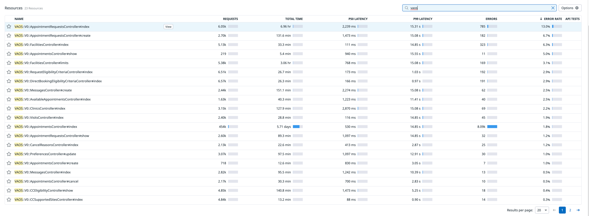
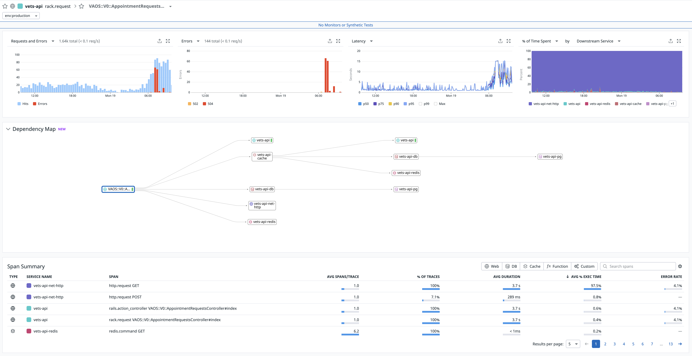
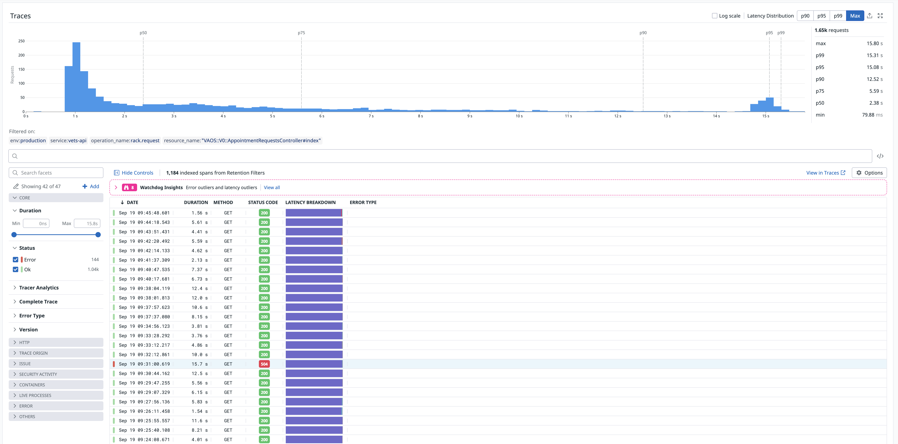
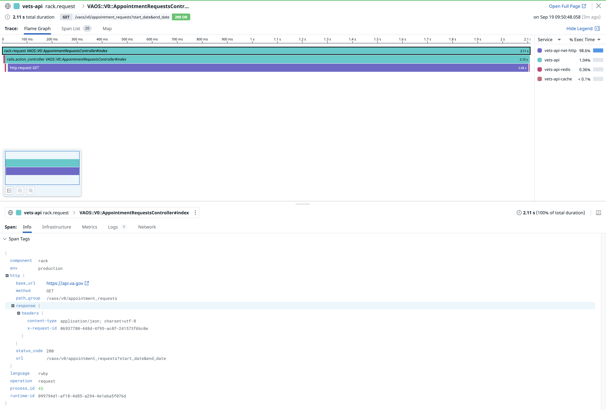
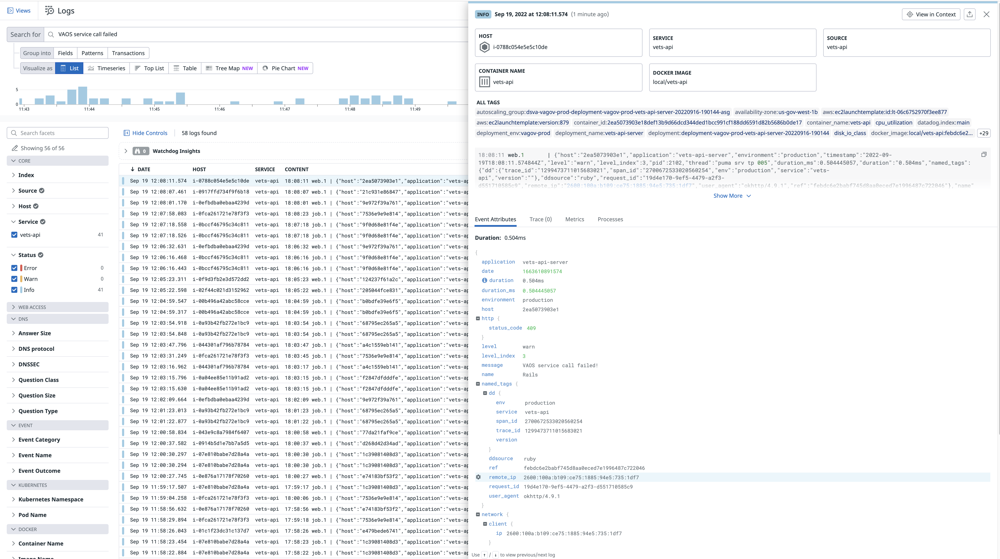

# Datadog
Datadog is an infrastructure monitoring and log collection application. It is currently viewed as a Grafana and Loki replacement. Access for VFS team members is not currently supported in the vagov Datadog instance. 

## Application Monitoring

Selecting the Application Performance Monitoring (APM) Services navigation menue will display an overview of the Vets API components and metric summaries.

---
 
 

Clicking on vets api will bring up an overview of the Vets API performance: request rate, errors, and latency. A list of all Vets API resources corresponding to Rails controllers is presented at the bottom of the graphical metrics; the resources can be filtered.

---
 
 

Clicking on a specific resource will bring up performance metrics for that resource.

---
 
 

More detail, for instance, time spent in the controller, and time spent in HTTP calls,  can be seen by selecting a specific request.

## Logging
Datadog also aggregates Rails logs from Vets API. The logs can be searched and viewed. 

