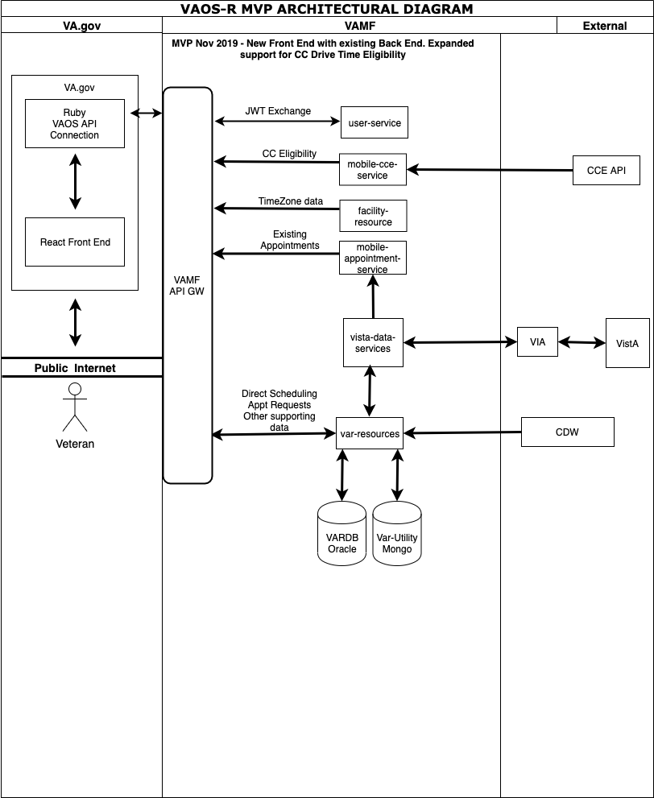

# Mobile Application System Design Document (SDD)

The System Design Document (SDD) is a dual-use document that provides the conceptual design as well as the as-built design. This document will be updated as the product is built, to reflect the as-built product. 

## 1. Mobile Application Information

### Overview

|   |   |
|---|---|
| Software Name                            | VA Online Scheduling (VAOS) Web Application  |
| Project Increment / Release Designation  | Beta? |
| Product Version (current)  | 0  |
| Source Repository Frontend | https://github.com/department-of-veterans-affairs/vets-website |
| Source Repository API Wrapper  | https://github.com/department-of-veterans-affairs/vets-api |
| Software Type | App |
| Intended Audience | Veteran |

### Data Storage

| Question  | Yes  | No  | If Yes, what information?  | If Yes, what consumer or source systems for the data?  |
|---|---|---|---|---|
| Does the new application pull data from VA Database (external to VAMF)?  | X  |   | <ul><li>Patient Information</li><li>Booked appointments</li><li>Facilities</li><li>Providers and clinics</li><li>Community care eligibility data</li></ul>  | <ul><li>VARDB</li><li>VistA</li><li>CDW</li><li>ADR</li></ul>  |
| Does the user enter information or data into the mobile application?  | X  |   | <ul><li>Appointment request information</li><li>VistA appointment information</li><li>Notification preference data</li></ul>  | <ul><li>VARDB</li><li>VistA</li></ul>  |
| Does the Mobile Application transmit/push data entered outside of the VAMF to VA?  | X  |   | <ul><li>Appointment request information</li><li>Appointment information</li></ul>  | <ul><li>VARDB</li><li>VistA</li></ul>  |
| Does the Mobile Application store in the VAMF or on the device data pulled from a VA Database | X |  | <ul><li>Patient Information</li><li>Patient preference data</li><li>Appointment request information</li><li>Community care eligibility data</li></ul> | <ul><li>VARDB</li><li>VistA</li></ul> |
| Does the Mobile Application store information or data entered by the user? | X |  | <ul><li>VARDB Oracle Database</li></ul> | <ul><li>VARDB</li><li>VistA</li></ul> |

### Application Classification

| Mobile Application Classification (Only one box may be checked) | Mark with X |
|-----------------------------------------------------------------|-------------|
| 1 - Very Low: Mobile Application does not use VA Resource | |
| 2 - Low: Read only access to VA Resources (No PII / PHI) | |
| 3 - Medium: Write access to VA Resources | |
| 4 - High: Read and/or Write access of sensitive data to VA Resources (include PII/PHI) | X |

### Supported Devices:

The new redesign is a web only interface, there is no native application component. It should be accessible across all smart devices that have a web client.

### Supported Browsers:

#### Browsers

| Browser | Minimum version  | Note |
|---------|------------------| ---- | 
| Internet Explorer | 11 |
| Microsoft Edge    | 14 |
| iOS               | 9 |
| Safari            | 10 |
| Chrome            | 60 |
| Chrome (Android)  | 64 |
| Firefox           | 56 |

Source: [Browser Support Policy](https://github.com/department-of-veterans-affairs/va.gov-team/blob/master/platform/engineering/request-for-comment/browser-support.md)

#### Accessibility (Screen Readers and 508 Compliance)

See: [Accessibility Best Practices](https://github.com/department-of-veterans-affairs/va.gov-team/blob/master/platform/accessibility/508-accessibility-best-practices.md)

### Capabilities:

1. View list of VistA booked appointments.
1. Cancel VistA booked appointments.
1. View list of appointment requests made in VAR.
1. Cancel appointment requests.
1. ~Directly book a VistA appointment at a clinic.~
1. Request an appointment at a facility.
1. Submit message to clerk along with request.
1. ~Submit an Express Care request.~
1. Request a Community Care appointment (This capability is available depending on the Veteran's community care eligibility based on EE codes from ADR)

## 2. Application Design

### Design Principles and Patterns
Coming Soon

### Conceptual Perspective

The combination of the new veteran facing application on VA.gov and the API wrapper that it interfaces are the only two changes to the existing SDD. The API wrapper interfaces with VAMF services in precisely the same way that VAR Web does today. The wrapper ensures that ICN, EDIPI, patient IDs, and other PII are not exposed to VA.gov FE.  The API wrapper receives a JWT token from UserService, thereby enabling it invoke other service calls within the API Gateway. The API wrapper maintains a short lived cache of the JWT token for future requests it needs to make during the duration of the users session and interactions withing the veteran facing tool. The details of this authentication flow are available here in [Authentication Flow](https://github.com/department-of-veterans-affairs/va.gov-team/blob/master/products/health-care/appointments/engineering/authentication_flow.md)

The veteran facing application on VA.gov does not interface with any VAMF services directly, all interactions are facilitated through the VA.gov BE API Wrapper (the client). This is the only significant change from an architectural standpoint from how service calls would be made on VAR Web today.

### Common Concepts

1. Feature Flags - Features can be disabled / enabled based on user email, environment, and other conditions.
1. Circuit Breakers - Timeouts and Failed Requests are closely monitored, and can trigger a circuit break, which will limit outbound requests until the service becomes available again.
1. StatsD Metrics - Realtime metrics for any type of data can be added.
1. Rails Logs - Can add logs at any point in execution
1. Grafana - Can create custom graphs to monitor statsd and other metrics
1. Prometheus - Can view statsd and other metrics in realtime
1. Cloudwatch - Can view and query logs in aggregate
1. Sentry - Detailed realtime error reporting
1. Google Analytics - FE analytics

### Logical Perspective

### User Service

No Routes are exposed to user service. This is handled entirely by the va.gov backend and does not expose user service JWT to the veteran facing application. 

[Authentication Flow](https://github.com/department-of-veterans-affairs/va.gov-team/blob/master/products/health-care/appointments/engineering/authentication_flow.md)

### Appointments Service

#### Collection Actions
All appointment collections including VA, CC, and Booked are facilitated by a single controller. More notably they are facilitated by a single controller action.

| Method | Route | VAOS Route | Description | Swagger |
|--------|-------|------------|-------------|---------|
| GET | `/v0/vaos/appointments?type=va` | `/appointments/v1/patients/{patient-id}/appointments` | Lists confirmed VA appointments | Coming Soon |
| GET | `/v0/vaos/appointments?type=cc` | `/VeteranAppointmentRequestService/v4/rest/direct-scheduling/patient/{assigning-authority}/{patient-id}/booked-cc-appointments` | Lists community care appointments | Coming Soon |
| GET | `/v0/vaos/appointments?type=booked` | `/VeteranAppointmentRequestService/v4/rest/direct-scheduling/site/{site-code}/patient/{assigning-authority}/{patient-id}/booked-appointments` | Lists booked appointments | Coming Soon |

Supported Params: `type`, `start_date`, `end_date`
Required Params: `type`, `start_date`, `end_date`
Unsupported Params: `page`, `per_page`, `caching`

| Method | Route | VAOS Route | Description | Swagger |
|--------|-------|------------|-------------|---------|
| POST | cannot create confirmed appointment | ? | ? | ? |

Should this exist?

#### Member Actions
| Method | Route | VAOS Route | Description | Swagger |
|--------|-------|------------|-------------|---------|
| PUT | `/v0/vaos/appointments/{id}` | `/VeteranAppointmentRequestService/v4/rest/direct-scheduling/site/{site-code}/patient/{assigning-authority}/{patient-id}/cancel-appointment` | Cancels confirmed appointment | Coming Soon |

### Request Service

#### Collection Actions
All appointment request collections are facilitated by a single controller.

| Method | Route | VAOS Route | Description | Swagger |
|--------|-------|------------|-------------|---------|
| GET  | `/v0/vaos/appointment_requests` | `/var/VeteranAppointmentRequestService/v4/rest/appointment-service/patient/{assigning-authority}/{patient-id}/appointments` | Lists pending requests | Coming Soon

Supported Params: `type`, `start_date`, `end_date`
Required Params: `type`, `start_date`, `end_date`
Unsupported Params: `page`, `per_page`, `caching`

| Method | Route | VAOS Route | Description | Swagger |
|--------|-------|------------|-------------|---------|
|POST | `/v0/vaos/appointment_requests?type=va` | `/VeteranAppointmentRequestService/v4/rest/appointment-service/patient/{assigning-authority}/{patient-id}/appointments` | Create a va appointment request | Coming Soon |
|POST | `/v0/vaos/appointment_requests?type=cc` | `/VeteranAppointmentRequestService/v4/rest/appointment-service/patient/{assigning-authority}/{patient-id}/community-care-appointment` | Create a Community Care request | Coming Soon |

#### Member Actions
| Method | Route | VAOS Route | Description | Swagger |
|--------|-------|------------|-------------|---------|
| PUT | `/v0/vaos/appointment_requests/{id}` | `/VeteranAppointmentRequestService/v4/rest/appointment-service/patient/{assigning-authority}/{patient-id}/appointments/system/var/id/{requestId}` | Cancel a requested appointment | Coming Soon |

### Messaging Service
Messaging is facilitated through a distinct controller nested as a resource under its parent request.

#### Collection Actions

| Method | Route | VAOS Route | Description | Swagger |
|--------|-------|------------|-------------|---------|
| GET | `/v0/vaos/appointment_requests/{id}/messages` | `/VeteranAppointmentRequestService/v4/rest/appointment-service/patient/{assigning-authority}/{patient-id}/appointments/system/var/id/{requestId}/messages` | List messages associated with a request | Coming Soon |
| POST | `/v0/vaos/appointment_requests/{id}/messages` | `/VeteranAppointmentRequestService/v4/rest/appointment-service/patient/{assigning-authority}/{patient-id}/appointments/system/var/id/{requestId}/messages` | Send a message for the request | Coming Soon |

#### Member Actions
Messaging does not have any member actions.

### Scheduling Preferences

### VA Scheduling Eligibility
Various controllers and nested controller that return collections of "constants" to determine when and where a veteran can schedule appointments

#### Collection Actions

| Method | Route | VAOS Route | Description | Swagger |
|--------|-------|------------|-------------|---------|
| GET | `/v0/vaos/systems` | `/users/v1/session/identifiers.json` | Lists systems to which a user is registered | Coming Soon |
| GET | `/v0/vaos/systems/{system_id}` | `/VeteranAppointmentRequestService/v4/rest/direct-scheduling/institutions` | Lists of child facilities along with their eligibility for direct scheduling or requests | Coming Soon |
| GET | `/v0/vaos/systems/{system_id}/pact` | ` /VeteranAppointmentRequestService/v4/rest/direct-scheduling/site/{site-code}/patient/{assigning-authority}/{patient-id}/pact-team` | Lists pact teams for a VA health system | Coming Soon |
| GET | `/v0/vaos/facilities` | `/VeteranAppointmentRequestService/v4/rest/direct-scheduling/parent-sites ` | Lists detail info about the facilities requested | Coming Soon |
| GET | `/v0/vaos/facilities/{facility_id}/clinics` | `/VeteranAppointmentRequestService/v4/rest/clinical-services/patient/{assigning-authority}/{patient-id}/clinics` | Lists clinics at the specified facility that support the specified type of care | Coming Soon |
| GET | `/v0/vaos/facilities/{facility_id}/visits/?schedule_type=direct` | `/VeteranAppointmentRequestService/v4/rest/direct-scheduling/site/{site-code}/patient/{assigning-authority}/{patient-id}/direct-eligibility/visited-in-past-months` | Lists info about previous direct visits | Coming Soon |
| GET | `/v0/vaos/facilities/{facility_id}/visits/?schedule_type=request` | `/VeteranAppointmentRequestService/v4/rest/direct-scheduling/site/{site-code}/patient/{assigning-authority}/{patient-id}/request-eligibility/visited-in-past-months` | Lists info about previous request visits | Coming Soon |
| GET | `/v0/vaos/facilities/{facility_id}/cancel_reasons` | `/VeteranAppointmentRequestService/v4/rest/direct-scheduling/site/{site-code}/patient/{assigning-authority}/{patient-id}/cancel-reasons-list ` |  Lists the allowed cancel reasons for a facility | Coming Soon |
| GET | `/v0/vaos/facilities/{facility_id}/limits` | `/VeteranAppointmentRequestService/v4/rest/direct-scheduling/patient/{assigning-authority}/{patient-id}/request-limit` | Lists visit limits for specified facility | Coming Soon |
| GET | `/v0/vaos/facilities/{facility_id}/available_appointments` | ` VeteranAppointmentRequestService/v4/rest/direct-scheduling/site/{site-code}/patient/{assigning-authority}/{patient-id}/available-appointment-slots` | Lists available date/time slots for a specific facility | Coming Soon |

#### Member Actions
There are no member actions

### Community Care Scheduling Eligibility
| Method | Route | VAOS Route | Description | Swagger |
|--------|-------|------------|-------------|---------|
| GET | `/v0/vaos/community_care/eligibility` | ` /adr/v2/patients/{patient-icn}/eligibility/communityCare` | Returns whether user is CC eligible | Coming Soon |
| GET | `/v0/vaos/community_care/supported_sites` | ` /VeteranAppointmentRequestService/v4/rest/facility-service/supported-facilities` | Lists VA parent facilities that are CC enabled | Coming Soon |

Since the first action above is not really returning a collection, perhaps it should be part of systems or an attribute of the user?

## Technology Stack and Service Dependencies

### Technology Stack Overview

The following is a running list of all major technologies chosen to build out the new VAOS veteran facing application.

#### Back-end

| Technology, Libraries, and Tools | Version | On the TRM (If not, provide a link to the waiver) |
|----------------------------------|---------|----------------------------------------------------|
| Ruby | 2.4.5 | Yes |
| Rails | 5.2.3 | ? |
| breakers |  | ? |
| faraday | | ? |
| fast_jsonapi | | ? |
| flipper | | ? |
| json-schema | | ? |
| jwt | | ? |
| redis | | ? |
| ruby-saml | | ? |
| statsd-instrument | | ? |
| swagger-blocks | | ? |

[Full backend end dependency list](https://github.com/department-of-veterans-affairs/vets-api/blob/master/Gemfile.lock)

#### Front-end

| Technology, Libraries, and Tools | Version | On the TRM (If not, provide a link to the waiver) |
|----------------------------------|---------|----------------------------------------------------|
| HTML 5 | 5 | Yes|
| CSS | 3 | Yes |
| SASS | 4 | Yes |
| Google Analytics | | Yes |
| React | 16.8.6 | Yes |
| Redux | 4.0.4 | No |
| React Router | 3.2.1 | No |
| MomentJS | 2.24.0 | No |
| Webpack | 4.32.2 | No |

[Full front end dependency list](https://github.com/department-of-veterans-affairs/vets-website/blob/master/package.json)

Note: tools and technologies used are all approved for use on the Veteran Facing Services Platform and are currently in use for other production applications on VA.gov.

### VA.gov Intefaces

|Interface Name | Version | Domain | Description of Role | SDD |
|---------------|---------|--------|---------------------|-----|
| VA.gov API    | 0       | VA.gov | Wrapper for services in VAMF | N/A |

### VAMF Intefaces

[Existing Var Resources SDD](https://wiki.mobilehealth.va.gov/pages/viewpage.action?spaceKey=ARA&title=VA+Online+Scheduling+%28VAOS%29+VAR-Web+Application+4.18.x+SDD#VAOnlineScheduling(VAOS)VAR-WebApplication4.18.xSDD-4.TechnologyStackandServiceDependencies)

## Developer and Program Manager Contact Information
|**Title** | **Name**  | **Point of Contact (VA Email)** | **Phone Number** | 
|---|:---:|:---:|---|
|**Tech Lead**|Stephen Barrs|stephen.barrs@va.gov|727.295.6998|
|**PM**|Eric Hopkins|eric.hopkins@va.gov|801.232.7059|
|**Business Owner**|Dr. Kathy Frisbee|kathleen.frisbee@va.gov|
|**CC Business Owner**|Dr. Leo Greenstone|clinton.greenstone@va.gov|

 
