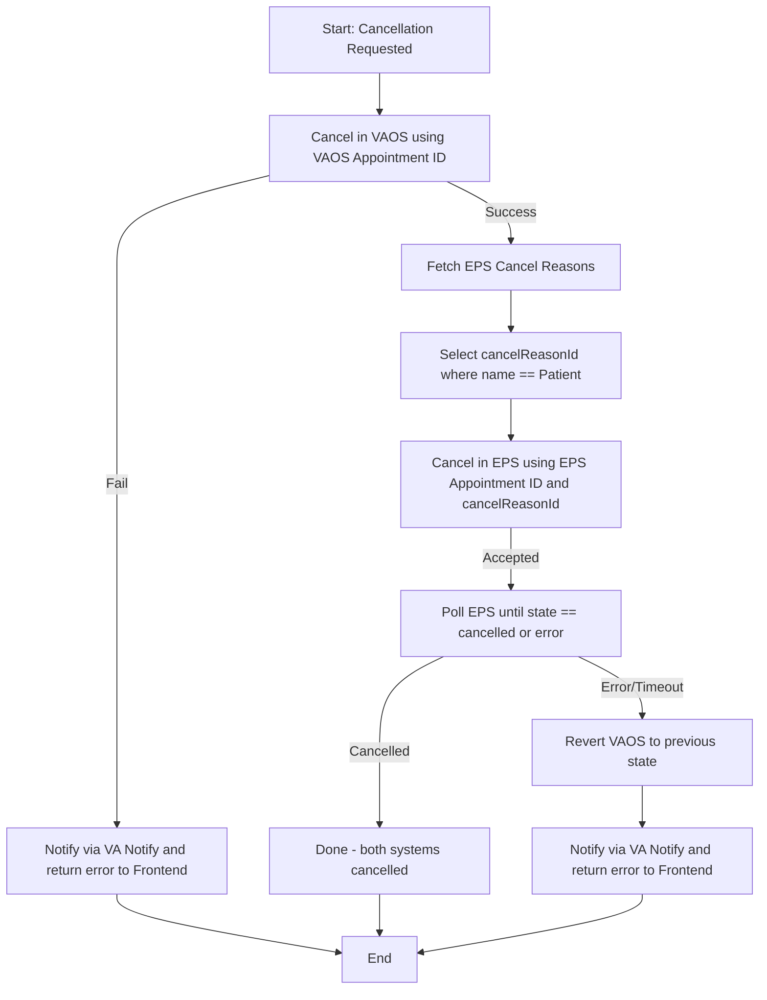
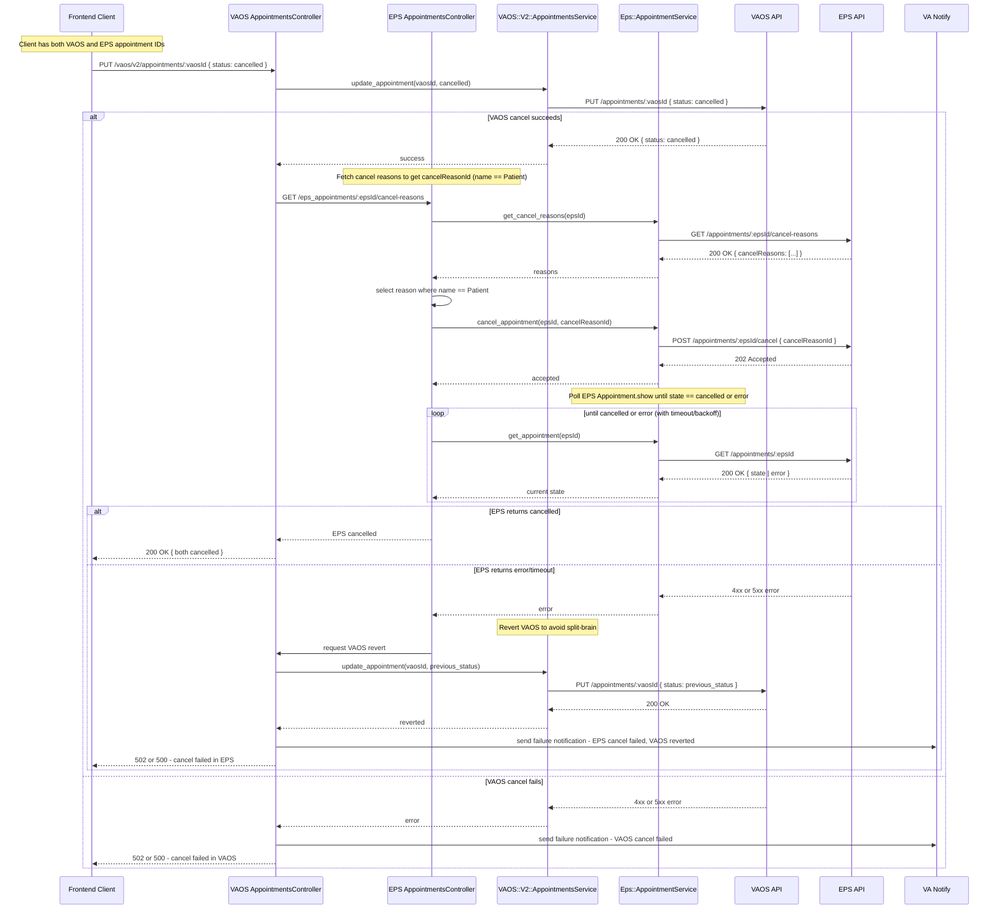

## Community Care (EPS) Appointment Cancellation

This document summarizes the current product direction and technical flow for cancelling Community Care (EPS/Wellhive) and VAOS appointments in vets-api.

### Goals

- Prevent data de-synchronization between VAOS and EPS by coordinating cancellations.
- Provide clear user feedback (via VA Notify) when cancellation fails.
- Maintain auditability with clear logs and (future) Wellhive trace usage.

### Sources of Truth

- We treat VAOS and EPS as independent sources that must both reflect the same appointment state. For a cancellation to be considered successful, both sources should end in a cancelled state.

### Key Assumptions

- We will have both appointment IDs (VAOS and EPS) when initiating cancellation.
- EPS requires a cancel reason; we will fetch valid reasons and select the one whose name equals "Patient".
- If EPS cancellation fails after VAOS has been cancelled, we will attempt to revert the VAOS cancellation to avoid split-brain state.
- If any step fails, we will notify the Veteran via VA Notify (email/SMS) from vets-api.

### References

- Wellhive Care Navigation API: `https://wellhive.github.io/api-docs/`

---

## Product-Level Flow (Happy Path and Failures)

Notes:

- EPS requires a valid `cancelReasonId`: we first retrieve reasons from EPS for the given appointment, select the one with `name == "Patient"`, and use its ID for the cancellation call.
- If EPS cancellation fails after a successful VAOS cancellation, we attempt to revert VAOS to avoid divergence.
- If any API call fails along the way, we send a VA Notify message to the Veteran.

---

## Full Technical Sequence Diagram (with controllers/services and notifications)

---

## Intended Use of VA Notify (on Failure)

When cancellation fails in either system, vets-api will send an email/SMS via VA Notify to the Veteran explaining that the cancellation could not be completed and what the next steps are (e.g., try again later or contact support). This mirrors our existing use of VA Notify in the appointment creation flow (confirmation/communication), but is focused on failure notification for cancellation.

Suggested copy themes (final copy owned by product/content):

- "We were unable to cancel your appointment at this time. Your original appointment remains scheduled."
- If VAOS cancelled but EPS failed (and we reverted VAOS): "We were unable to cancel your Community Care appointment. We restored your VA appointment to its previous status."

---

## Open Questions (for Product/Stakeholders)

1. Are VAOS and EPS to be treated as equal sources of truth for cancellation outcomes (i.e., both must be cancelled to call the operation successful)?
2. Exact error message copy and support instructions when cancellation fails.
3. Support escalation path: if EPS cancellation fails repeatedly, do we contact Wellhive support with a trace/transaction ID?
4. Can we always use the EPS reason with `name == "Patient"`, or do certain scenarios require a different reason?

---

## Technical Sequence (High Level)

1. Inputs: `vaosAppointmentId`, `epsAppointmentId`
2. Cancel VAOS appointment: `PUT /vaos/v2/appointments/:vaosAppointmentId { status: "cancelled" }`
   - If this fails → notify via VA Notify and stop
3. Fetch EPS cancel reasons: `GET /appointments/:epsAppointmentId/cancel-reasons`
   - Select the reason with `name == "Patient"` → `cancelReasonId`
4. Cancel EPS appointment: `POST /appointments/:epsAppointmentId/cancel { cancelReasonId }`
   - EPS responds 202 Accepted. Then poll `GET /appointments/:epsAppointmentId` until `state == cancelled` or error (with timeout/backoff). See Wellhive docs on cancellation polling [here](https://github.com/wellhive/api-docs#6-cancel-an-appointment).
   - If EPS returns error or polling times out → revert VAOS appointment to its prior state, then notify via VA Notify
5. Success: both systems reflect cancelled state

Logging & tracing:

- We log failures with masked IDs and context. Future enhancement: capture `X-Wellhive-Trace-Id` when available to aid Wellhive support correlation.

Risk considerations:

- If EPS fails and VAOS can’t be reverted, we could end up with conflicting states. Product decision needed for how to message the Veteran and coordinate follow-up.

Implementation notes:

- The polling pattern mirrors appointment submission polling already used in our booking flow; reuse the same backoff/timeout strategy for cancellation to keep behavior consistent.
