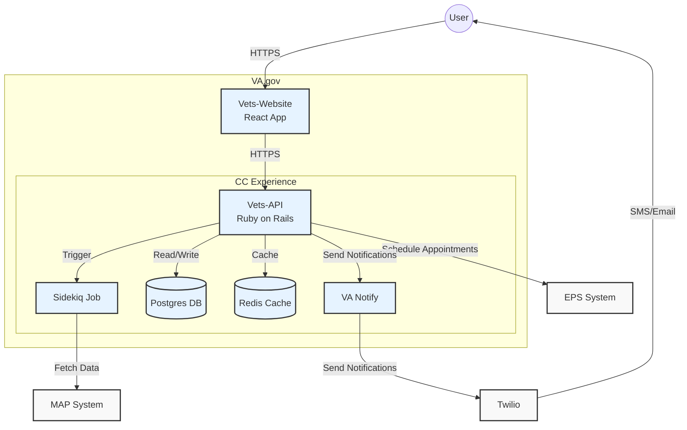
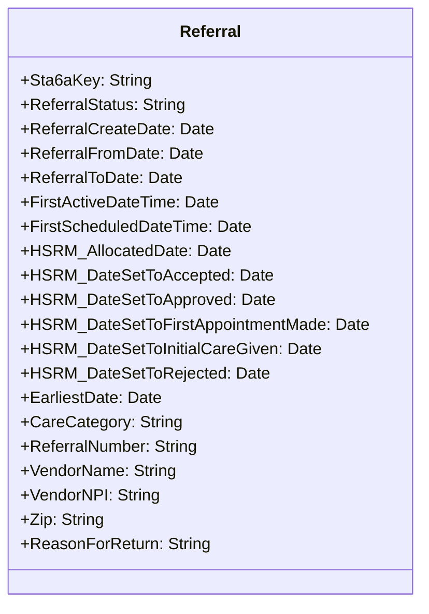
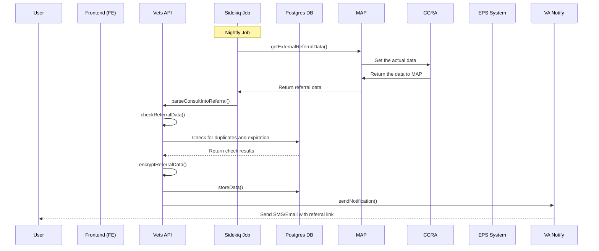
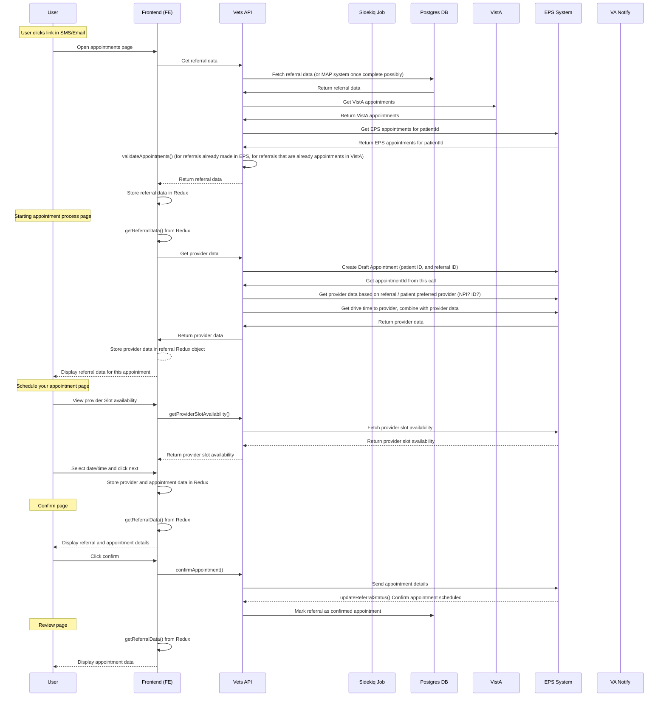

# External Referral Appointment Scheduling System

## Goals
1. Streamline the process of scheduling external referral appointments for veterans
2. Reduce manual intervention in the referral and appointment scheduling process
3. Improve veteran experience by providing easy access to referral information and appointment scheduling
4. Ensure data security and privacy throughout the referral and appointment process
5. Integrate with existing VA systems (MAP, EPS, Vista) to provide a seamless experience

## Overview
The External Referral Appointment Scheduling System is designed to automate and simplify the process of managing external referrals and scheduling appointments for veterans. It involves a nightly job to fetch and process referral data ~from MAP~, secure storage of this data, veteran notifications, and a user-friendly workflow for veterans to schedule appointments based on these referrals. The system integrates with VA Notify for communications and EPS for appointment management.

## Scope
- Implementation of a nightly job to fetch and process external referral data ~from MAP~
- Secure storage of referral data in a Postgres database
- Integration with VA Notify for sending referral notifications to veterans
- Development of a frontend interface for veterans to view referrals and schedule appointments
- Integration with the External Provider Services (EPS) system for appointment management
- Implementation of a data retention policy for referral data
- Ensuring compliance with VA accessibility standards

## Assumptions
1. Referral data through MAP services which references CCRA (which is built within HSRM, a 3rd party cloud system)
2. Veterans have access to either SMS or email for receiving notifications
3. The EPS system is available and can be integrated for appointment scheduling
4. Staff members will continue to manually synchronize appointment data between EPS and Vista systems
5. The existing vets-api encryption library is suitable for securing referral data
6. The system will operate within the VA's existing authentication framework

## Design Decisions
1. Use of Sidekiq for scheduling and running the nightly job
2. Storage of encrypted referral data in a Postgres database for security
3. Utilization of Redux for state management in the frontend
4. Integration with VA Notify for sending notifications to veterans
5. Use of the existing vets-api encryption library for securing referral data
6. Implementation of a two-tier approach for referral data retention
7. Daily checks for appointment synchronization between EPS and Vista

## System Architecture



## Referral Data Model


## Sequence Diagrams

### Nightly Job


### Workflow once SMS/Email received


## Key Processes

### Nightly Job
1. `getExternalReferralData()`: Pulls referral data from MAP/CCRA for the next 3 months, or however long they allow.
2. `parseConsultIntoReferral()`: Vets API parses consult data into a referral object.
3. `checkReferralData()`: Ensures referrals are not expired and don't exist in the Postgres DB.
4. `encryptReferralData()`: Encrypts referral data using the vets-api encryption library.
5. `storeData()`: Stores encrypted data in Vets API Postgres DB.
6. `sendNotification()`: Sends notification to user via VA Notify (SMS or email) with a referral link.

### User Workflow
1. User receives SMS/Email with referral link and clicks it.
2. User is directed to login and authenticate.
3. After authentication, user is redirected to the referral page.
4. Frontend retrieves referral data from Vets API and stores it in Redux.
5. Frontend checks for EPS appointments and combines them with existing appointments in Redux.

## Resources

Since we already have 'Appointment' resource under VAOS (VA Online Scheduling) service, we're going to use that resource. We have discussed this with the VAOS backend engineering team and they are in agreement with this approach. This avoids any confusion for the Appointment resource and object. However the downside is that we're going to have to add logic to retrieve the appointments from EPS and dedupe those within the existing appointments service code, which is going to add complexity and latency for existing consumers.

'Referral' and 'Provider' are going to be a new resources. Endpoints are:

* GET `/vaos/v2/referrals` (new)
  
  Sample Response
  ```
  TBD
  ```
* GET `/vaos/v2/appointments` (existing)
* GET `/vaos/v2/appointments/{appointmentId}` (existing)
* POST `/vaos/v2/appointments` (existing)
* GET `/vaos/v2/providers` (new)
* GET `/vaos/v2/providers/{providerId}/slots` (new)
* GET `/vaos/v2/providers/{providerId}/drivetime` (new)


## Removing duplicates and preventing duplicates of referrals
- A duplicate referral refers to a referral that has already been entered into our system. The incoming referral ID will match an existing referral ID in our postgress DB. This is likely a referral that hasn't been scheduled into an appointment yet. See blow for existing appointment
- An existing appointment refers to an appointment that has been made with a referral ID, that referral ID matches to a "new" referral, which means it was already made. We can also possibly hold referrals in our DB and mark them as "completed" or "referral made" in the same manner, after the user has completed making an appointment with a referral
- Expired referrals are referrals whose end date has expired, regardless of if an appointment exists or not

## Data Retention Policy

### Two-tier Approach

#### First Pass (Initial Release)
- Store referral data from MAP until the appointment exists in CCRA.
- Daily checks for appointment existence in Vista.
- Additional check when user views appointments.
- Remove referral data once the appointment is verified in Vista.
- Verification involves matching patientICN, provider, and other data between EPS and Vista.

#### Second Tier (Future Implementation)
- Utilize CCRA to provide referralID.
- Remove need to store referral information after user makes an appointment.
- Use CCRA (via vets-api) to pull referral data and associated appointments from EPS or other systems.

#### Addendum
- Delete referrals after the expiration date (ReferralToDate).
- Perform deletion during the daily scan for new referrals.

## Security Considerations
- Referral data encrypted using the existing vets-api encryption library.
- Referral link in notifications contains an encrypted referralID.
- Full authentication required before accessing referral information.

## Integration Points
1. CCRA: Source of referral data
2. VA Notify: For sending notifications to veterans
3. EPS (External Provider Services): For appointment management

## Performance Considerations
- The nightly job is not time-critical and can run for a couple of hours if needed.
- Daily scans for appointment verification and referral expiration.

## Accessibility
- The frontend interface will comply with existing VA accessibility standards.
- No additional accessibility requirements specific to this project.

## Open Questions and Future Considerations
1. What metrics should be tracked to measure the system's effectiveness and user satisfaction?
2. Need to get what will be referred to as the providerID for the EPS system that matches to what's in the CCRA object. Refer to EPS document/yaml/json for the call `provider-services/{providerServiceId}`
3. We need to add a shortURL for email/SMS (also need to expose CHIP / vets-api in order to do this)
4. We MIGHT need to write something to parse data over FTP to get data from CCRA
5. Text for initial scope (SMS)
6. Get user data from full auth user object in vets-api to get address and phone and email
