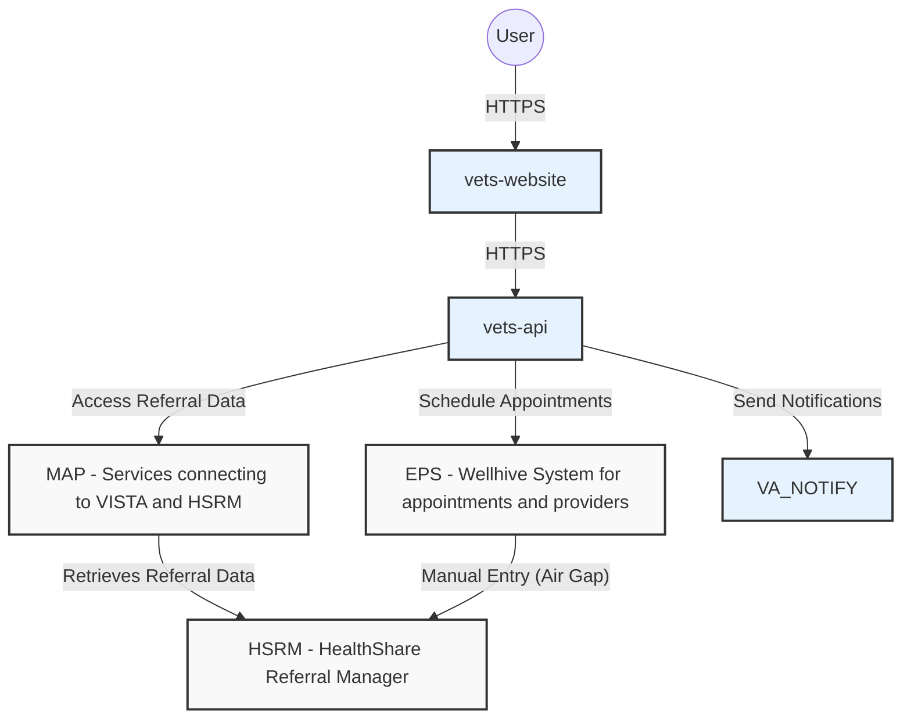
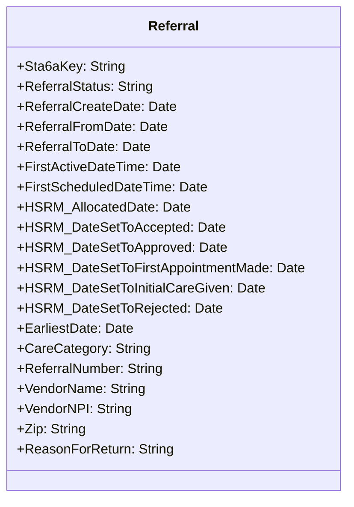
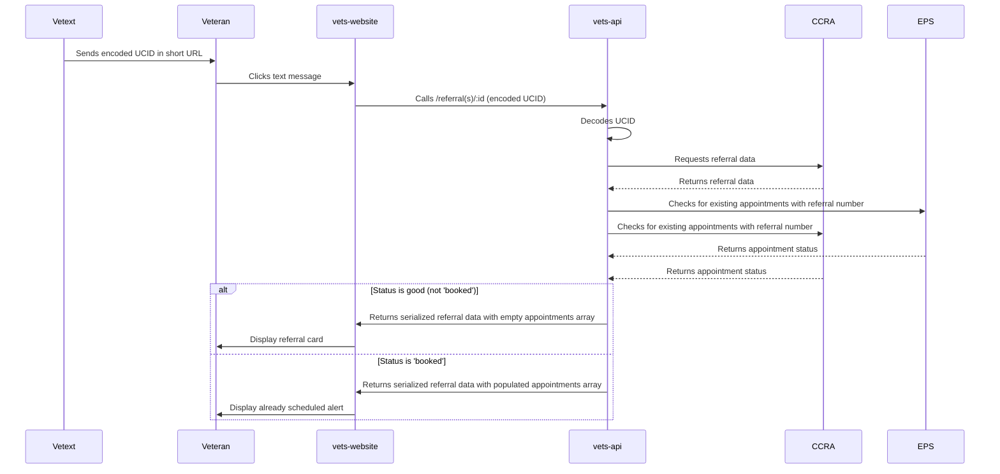
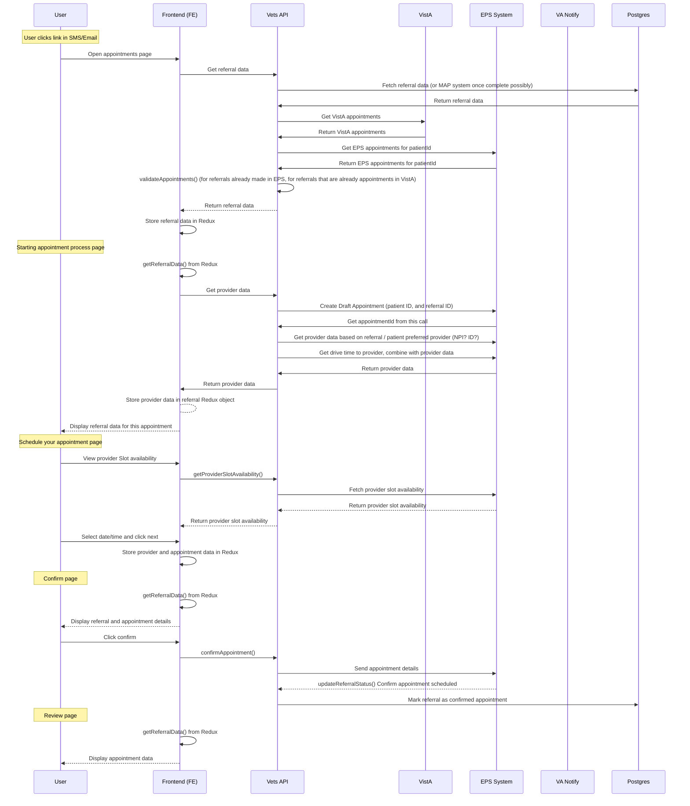
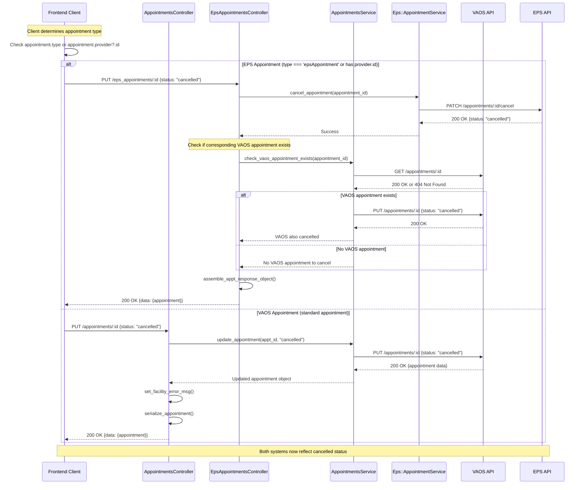

# External Referral Appointment Scheduling System
## Better known as the Community Care system or CC

## Goals
1. Streamline the process of scheduling external referral appointments for veterans
2. Reduce manual intervention in the referral and appointment scheduling process
3. Improve veteran experience by providing easy access to referral information and appointment scheduling
4. Ensure data security and privacy throughout the referral and appointment process
5. Integrate with existing VA systems (MAP, EPS, Vista) to provide a seamless experience

## Overview
The External Referral Appointment Scheduling System is designed to automate and simplify the process of managing external referrals and scheduling appointments for veterans.  The system integrates with VA Notify for communications and EPS for appointment management.

## Scope
- Integration with VA Notify for sending referral notifications to veterans
- Development of a frontend interface for veterans to view referrals and schedule appointments
- Integration with the External Provider Services (EPS) system for appointment management
- Integration with the CCRA (VA referrals and other info) via the MAP services as a pass through service
- Ensuring compliance with VA accessibility standards

## Assumptions
1. Referral data through MAP services which references CCRA (which is built within HSRM, a 3rd party cloud system)
2. Veterans have access to either SMS or email for receiving notifications
3. The EPS system is available and can be integrated for appointment scheduling
4. Staff members will continue to manually synchronize appointment data between EPS and Vista systems
5. The system will operate within the VA's existing authentication framework

## Design Decisions
1. Utilization of Redux for state management in the frontend
2. Integration with VA Notify for sending notifications to veterans
3. Use of the existing vets-api encryption library for securing referral data
4. Implementation of a two-tier approach for referral data retention
5. Daily checks for appointment synchronization between EPS and Vista

## System Architecture



## Referral Data Model


## Sequence Diagrams

### Workflow starting with VeText



### Workflow once SMS/Email received


### Appointment Cancellation (as of 10.22.25)


## Key Processes

### Referral Appointment Scheduling Flow

1. The user receives an SMS or email notification indicating that they can self-schedule an appointment for a referral.  
2. The notification directs the user to the **Referrals and Requests** page on **vets-website**, which lists all active referrals.  
3. The user selects the relevant referral from the list.  
4. **vets-website** retrieves the referral details and displays them to the user.  
5. If no appointment exists for that referral, the user can begin the scheduling process.  
6. The user navigates to the **Scheduling View**, where a draft appointment is created and available time slots are displayed.  
7. After selecting a time slot, the user reviews the appointment details on a **Final Verification** page.  
8. When the user clicks **Confirm**, the appointment is successfully booked.  
9. At a later point, the booked appointment is manually synced to external systems by staff.


## Resources

Since we already have 'Appointment' resource under VAOS (VA Online Scheduling) service, we're going to use that resource. We have discussed this with the VAOS backend engineering team and they are in agreement with this approach. This avoids any confusion for the Appointment resource and object. However the downside is that we're going to have to add logic to retrieve the appointments from EPS and dedupe those within the existing appointments service code, which is going to add complexity and latency for existing consumers.

'Referral' and 'Provider' are going to be a new resources. Endpoints are:

### * GET `/vaos/v2/referrals` (new)
```
{
  "data": [
    {
      "id": "6cg8T26YivnL68JzeTaV0w==00",
      "type": "referrals",
      "attributes": {
        "expirationDate": "2026-04-09",
        "uuid": "6cg8T26YivnL68JzeTaV0w==00",
        "categoryOfCare": "CHIROPRACTIC",
        "referralNumber": "VA0000007241",
        "referralConsultId": "984_646907",
        "stationId": "659"
      }
    }
  ]
}
```
### * GET `/vaos/v2/referrals/{referralNo}`
Response when not booked ie: no appointments have been booked for this referral)
```
{
  "data": {
    "id": "6cg8T26YivnL68JzeTaV0w==00",
    "type": "referrals",
    "attributes": {
      "uuid": "6cg8T26YivnL68JzeTaV0w==00",
      "referralDate": "2023-01-01",
      "stationId": "659BY",
      "expirationDate": "2025-06-02",
      "referralNumber": "VA0000007241",
      "categoryOfCare": "CHIROPRACTIC",
      "referralConsultId": "984_646907",
      "appointments: null,
      "referringFacility": {
        "name": "Batavia VA Medical Center",
        "phone": "(585) 297-1000",
        "code": "528A4",
        "address": {
          "street1": "222 Richmond Avenue",
          "city": "BATAVIA",
          "state": "NY",
          "zip": "14020"
        }
      },
      "provider": {
        "name": "Dr. Moreen S. Rafa",
        "npi": "1346206547",
        "phone": "(937) 236-6750",
        "facilityName": "fake facility name",
        "address": {
          "street1": "76 Veterans Avenue",
          "city": "BATH",
          "state": "NY",
          "zip": "14810"
        }
      }
    }
  }
}

```
Appointment data appended to the response object: 
```
"data" : {
   ...

   "appointments": {
      "EPS":  {
          "data": [
             { "id": 12345, status: "booked", "start": "2024-11-21T18:00:00Z" }
          ]
      },
      "VAOS":  {
          "data": [
             { "id": 56789, status: "booked", "start": "2024-11-21T18:00:00Z" }
          ] 
      }
}
```

### * POST `/vaos/v2/appointments/create_draft` (new)
Request:
```
{
  "referral_id": "add2f0f4-a1ea-4dea-a504-a54ab57c6800"
}
```
Response:
```
{
  "data": {
    "id": "string",
    "provider": {
      "id": "string",
      "name": "string",
      "isActive": boolean,
      "individualProviders": ["string"],
      "providerOrganization": "string",
      "location": {
        "address": "string",
        "latitude": number,
        "longitude": number
      },
      "networkIds": ["string"],
      "schedulingNotes": "string",
      "appointmentTypes": [
        {
          "id": "string",
          "name": "string",
          "isSelfSchedulable": boolean
        }
      ],
      "specialties": [
        {
          "id": "string",
          "name": "string"
        }
      ],
      "visitMode": "string",
      "features": {
        "isDigital": boolean
      }
    },
    "slots": [ // Optional - Only included if available
      {
        "id": "string",
        "start": "ISO8601 datetime",
        "end": "ISO8601 datetime"
      }
    ],
    "driveTime": { // Optional - Only included if available
      "origin": {
        "latitude": number,
        "longitude": number
      },
      "destination": {
        "latitude": number,
        "longitude": number
      }
    }
  }
}
```
### * GET `/vaos/v2/appointments?_include=facilities,clinics,eps` (existing)
* NOTE: Will include eps in the includes parameter to tell vets-api to fetch eps appointments.

Request:
```

```
Response:
```

```

### * GET `/vaos/v2/eps_appointments/{appointmentId}`

```
{
  "data": {
    "id": "qdm61cJ5",
    "type": "eps_appointment",
    "attributes": {
      "appointment": {
        "id": "qdm61cJ5",
        "status": "booked",
        "patientIcn": "care-nav-patient-casey",
        "created": "2025-02-10T14:35:44Z",
        "locationId": "sandbox-network-5vuTac8v",
        "clinic": "Aq7wgAux",
        "start": "2024-11-21T18:00:00Z",
        "referralId": "12345",
        "referral": {
          "referralNumber": "12345",
          "facilityName": "Linda Loma",
          "facilityPhone": "555-555-5555"
          "typeOfCare": "Physical Therapy"
          "modality": "In Person"
        }
      },
      "provider": {
        "id": "test-provider-id",
        "name": "Timothy Bob",
        "isActive": true,
        "individualProviders": [
          {
            "name": "Timothy Bob",
            "npi": "test-npi"
          }
        ],
        "providerOrganization": {
          "name": "test-provider-org-name"
        },
        "location": {
          "name": "Test Medical Complex",
          "address": "207 Davishill Ln",
          "latitude": 33.058736,
          "longitude": -80.032819,
          "timezone": "America/New_York"
        },
        "networkIds": [
          "sandbox-network-test"
        ],
        "schedulingNotes": "New patients need to send their previous records to the office prior to their appt.",
        "appointmentTypes": [
          {
            "id": "off",
            "name": "Office Visit",
            "isSelfSchedulable": true
          }
        ],
        "specialties": [
          {
            "id": "test-id",
            "name": "Urology"
          }
        ],
        "visitMode": "phone",
        "features": null
      } 
    }
  }
}
```
### * POST `/vaos/v2/appointments/submit_referral_appointment` (existing)
Request:
```
{
  "id": "string", // Required - Draft appointment ID
  "network_id": "string", // Required
  "provider_service_id": "string", // Required
  "slot_ids": ["string"], // Required - Array of slot IDs
  "referral_number": "string", // Required
  "birth_date": "string", // Optional
  "email": "string", // Optional
  "phone_number": "string", // Optional
  "gender": "string", // Optional
  "address": { // Optional
    "type": "string",
    "line": ["string"],
    "city": "string",
    "state": "string",
    "postal_code": "string",
    "country": "string",
    "text": "string"
  },
  "name": { // Optional
    "family": "string",
    "given": ["string"]
  }
}
```
Response:
```
{
  "data": {
    "id": "string",
    "provider": {
      "id": "string",
      "name": "string",
      "isActive": boolean,
      "individualProviders": ["string"],
      "providerOrganization": "string",
      "location": {
        "address": "string",
        "latitude": number,
        "longitude": number
      },
      "networkIds": ["string"],
      "schedulingNotes": "string",
      "appointmentTypes": [
        {
          "id": "string",
          "name": "string",
          "isSelfSchedulable": boolean
        }
      ],
      "specialties": [
        {
          "id": "string",
          "name": "string"
        }
      ],
      "visitMode": "string",
      "features": {
        "isDigital": boolean
      }
    },
    "slots": [ // Optional - Only included if available
      {
        "id": "string",
        "start": "ISO8601 datetime",
        "end": "ISO8601 datetime"
      }
    ],
    "drivetime": { // Optional - Only included if available
      "origin": {
        "latitude": number,
        "longitude": number
      },
      "destination": {
        "latitude": number,
        "longitude": number
      }
    }
  }
}
```
### * GET `/vaos/v2/providers` (new)
### * GET `/vaos/v2/providers/{providerId}/slots` (new)
### * GET `/vaos/v2/providers/{providerId}/drivetime` (new)


## Removing duplicates and preventing duplicates of referrals
- A duplicate referral refers to a referral that has already been entered into our system. The incoming referral ID will match an existing referral ID in our postgress DB. This is likely a referral that hasn't been scheduled into an appointment yet. See blow for existing appointment
- An existing appointment refers to an appointment that has been made with a referral ID, that referral ID matches to a "new" referral, which means it was already made. We can also possibly hold referrals in our DB and mark them as "completed" or "referral made" in the same manner, after the user has completed making an appointment with a referral
- Expired referrals are referrals whose end date has expired, regardless of if an appointment exists or not

## Submit Asynchronous Process
1. When confirming and submitting the final appointment, the async process will be dual
2. The FE will submit the appointment and if successful poll the /appointments/{appointmentId} endpoint until a valid response or failure returns (up to 30 to 60 seconds)
3. The BE will poll the same endpoint, but send a notification via VA Notify the user on success or failure

## Integration Points
1. CCRA: Source of referral data 
2. VA Notify: For sending notifications to veterans
3. EPS (External Provider Services): For appointment management (Wellhive)
    - https://wellhive.github.io/api-docs/

## Performance Considerations
- Drive time seems to take a long time to retrieve results
- Async process in the confirmation

## Accessibility
- The frontend interface will comply with existing VA accessibility standards.
- No additional accessibility requirements specific to this project.

## Open Questions and Future Considerations
1. Need to get what will be referred to as the providerID for the EPS system that matches to what's in the CCRA object. Refer to EPS document/yaml/json for the call `provider-services/{providerServiceId}`
2. Get user data from full auth user object in vets-api to get address and phone and email

### Open cancellation questions (last updated 10.22.25)
1. When appointment status is updated in EPS to cancelled, does the status update take effect for the appointment in VAOS via the same manual transfer process as creation (staff / "swivel chair" process)?
2. If the status of the corresponding VAOS appointment is not updated by staff do we need to send a request to VAOS to update the appointment at the time the EPS appointment status update request is sent? - This is our current plan.
3. If the appointment is created and cancelled in EPS before it appears in VAOS does the appointment still appear and if so does it appear with cancelled status?
4. If the appointment is surfaced in EPS but not yet in VAOS should we disallow cancellation until it surfaces in VAOS? - This is our current plan.
5. If the cancellation request to one of the sources succeeds but the other does not, what notification / appointment status should be displayed to the veteran?
