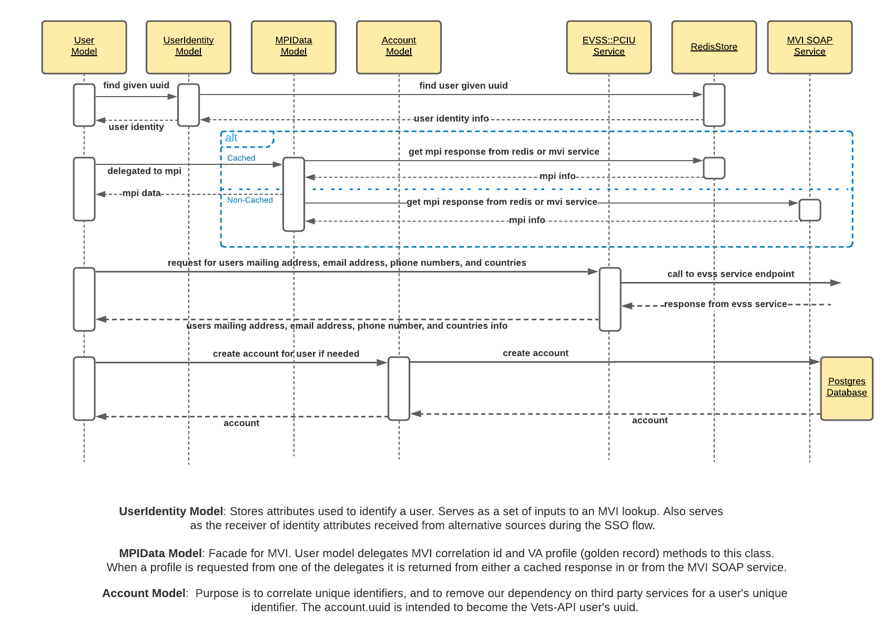
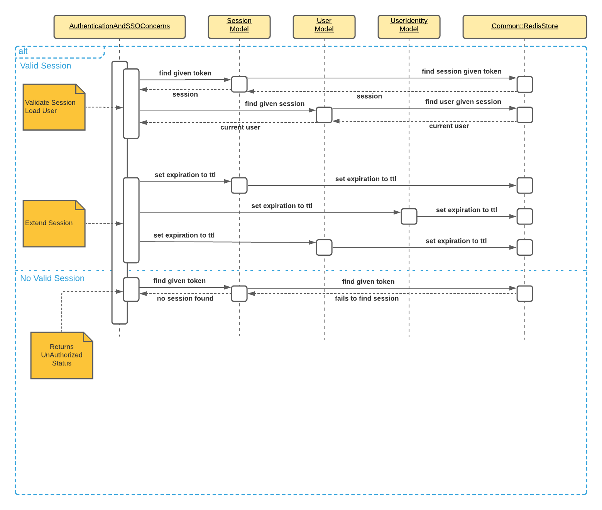

### Vets API User Creation and VAOS Session Validation

## User Creation
Those wanting to access the services provided by the Vets API services must first be authenticated by one of VA's Single Sign-On (SSOe) systems. Currently, ID.me, My Healthy Vet or DS Logon can perform verification. Once identified, users can then be authorized to access the appointment scheduling services.

NIST 800-63-2 provides guidelines for levels of assurance (LOAs) in identity proofing and authentication. An LOA3 level of assurance is needed to access appointment scheduling services. To obtain an LOA3 one of the following must be provided, a valid government ID number or a financial or utility account number. 

The Vets API Rails application gathers this information from various available sources and creates the Active Record models. MVI Service, Redis, and EVSS are the sources where this information is obtained. The User, UserIdentity, MPIData, and Account are the Active Record models created.

The following is a sequence diagram of the User model creation.

## Session Validation
Vets API uses a Ruby gem called Pundit to set the access policies to the scheduling services. Users need to have the va_online_scheduling flipper enabled and be at an LOA3. 

When a request is made on behalf of a user, the VAOS controllers first check the Redis Store to see if there is a valid session already in place. If there isn't a valid session an UnAuthorized status is returned. If a valid session exists the request is processed.

The following is a sequence diagram of VAOS Session Validation.

 