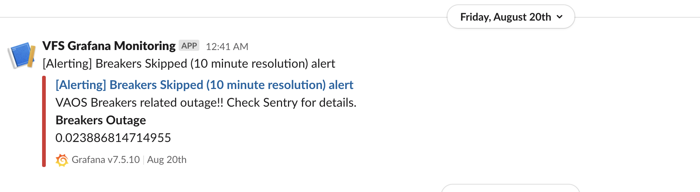
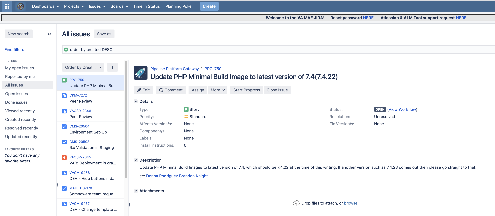
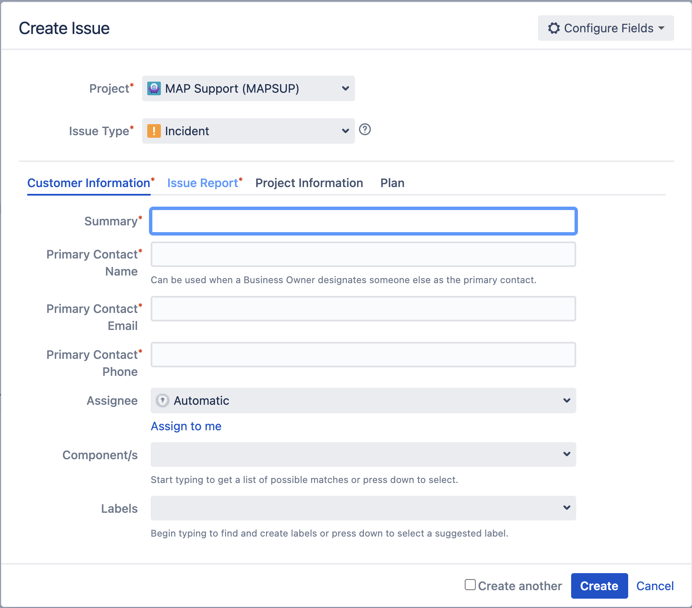
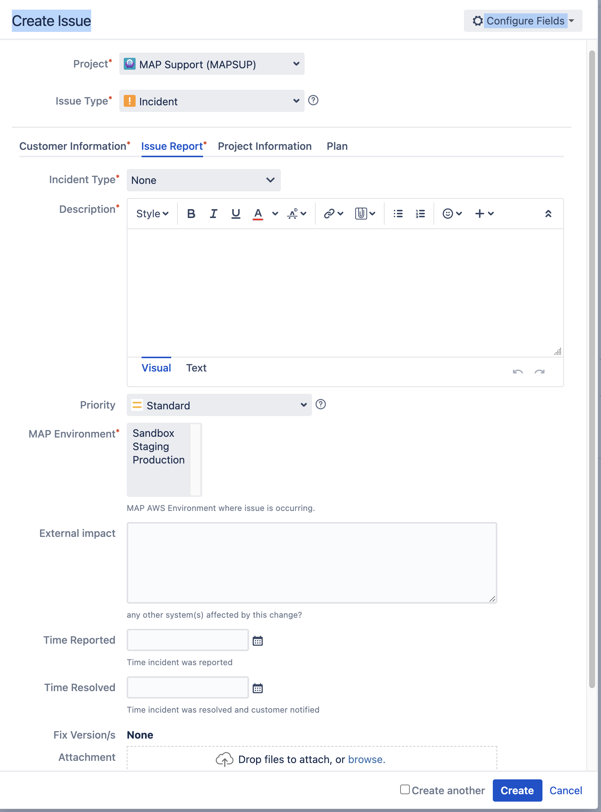

Usually, the first indication that we have a problem comes from Slack's **[#appointments-alerts](https://dsva.slack.com/archives/C016QB6T340)** channel on the **DSVA Service @VA** workspace.  The alert will look something like this: 

The next step is to gather information from our logging tools. Currently, these consist of the VAOS alerts page on Datadog, [VAOS Alerts](https://vagov.ddog-gov.com/dashboard/7t4-7fw-pgj/vaos-alerts?fromUser=false&refresh_mode=sliding&view=spans&from_ts=1717117684558&to_ts=1717204084558&live=true); vets-api server logs on Datadog, [Logs](https://github.com/department-of-veterans-affairs/va.gov-team/blob/master/products/health-care/appointments/va-online-scheduling/engineering/application-monitoring/monitoring-urls.md#appointment-calls-to-external-map-endpoints).

Once the problem is understood, the next step would be to check Slacks **VA PPG Workspace** to see if the backend group has already identified the problem and is working on it. 

If the problem is from the VAMF backend and the backend groups (MACM, CKM) are not aware of it the next steps are to create a MAPSUP ticket with the information gathered.  In order to create a MAPSUP ticket an Atlassian account is needed. Open the Issues browsing page in Jira, [Issues](https://issues.mobilehealth.va.gov/) and click on the Create link found on the right in the upper menu:

**Select MAP Support (MAPSUP)** in the Project dropdown and fill out the Customer Information:

Click on the **Issue Report** section and fill information gathered in discovery (making sure that production is selected in MAP Environment).

When all necessary information is entered click on the Create button.

