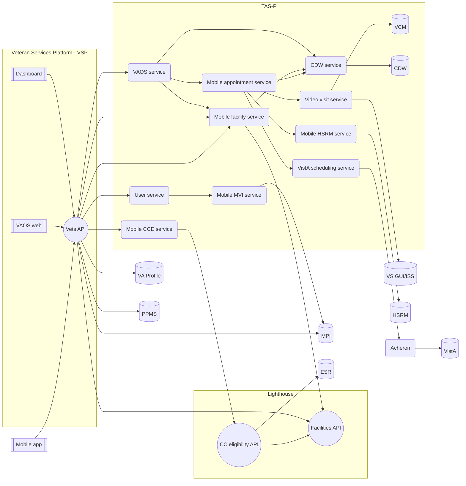

# VAOS architecture - Mermaid.js experiment [DRAFT]

Experimenting with mermaid.js to add charts to markdown. Don't use for reference until finalized.

```mermaid

flowchart LR

vf-flagship-mobile-app[[Mobile app]] --> vets-api

subgraph Veteran Services Platform - VSP
    vf-vaos-web[[VAOS web]] & vf-dashboard[[Dashboard]] --> vets-api((Vets API))
end


vets-api --> db-va-profile[(VA Profile)] & db-ppms[(PPMS)] & db-mpi[(MPI)]


subgraph Lighthouse
    cc-eligibility-api((CC eligibility API)) --> facilities-api((Facilities API))
end
cc-eligibility-api --> db-esr[(ESR)]

subgraph TAS-P 

vets-api --> vaos-service(VAOS service) & mobile-facility-service(Mobile facility service) & mobile-cce-service(Mobile CCE service) & mobile-facility-service & facilities-api

vets-api --> user-service(User service) --> mobile-mvi-service(Mobile MVI service)

vaos-service --> mobile-facility-service & mobile-appointment-service

mobile-appointment-service(Mobile appointment service) --> mobile-hrsm-service(Mobile HSRM service) & vista-scheduling-service(VistA scheduling service) & video-visit-service & cdw-service
video-visit-service(Video visit service) --> db-vcm[(VCM)]


mobile-facility-service & vaos-service --> cdw-service(CDW service) --> db-cdw[(CDW)]
mobile-facility-service --> facilities-api


end

mobile-mvi-service --> db-mpi

video-visit-service --> db-vs-gui-iss[(VS GUI/ISS)]


vista-scheduling-service --> acheron(Acheron)
mobile-hrsm-service --> hsrm-db[(HSRM)]


acheron --> db-vista[(VistA)]


mobile-cce-service --> cc-eligibility-api

```

Reference:

