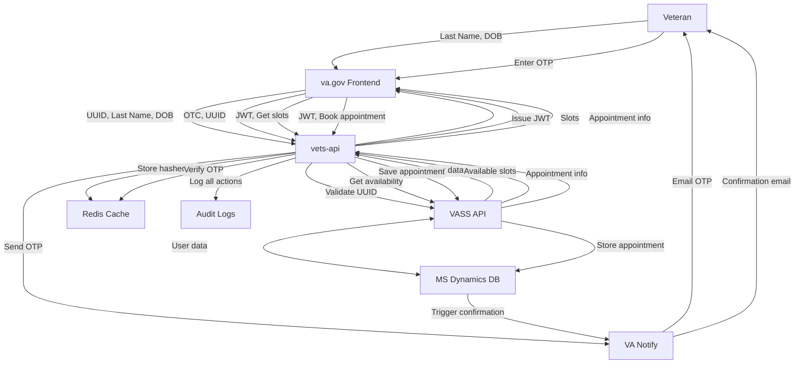

# Data flow diagram

```mermaid
flowchart TD
    Veteran[Veteran] -->|Last Name, DOB| Frontend[va.gov Frontend]
    Frontend -->|UUID, Last Name, DOB| VetsAPI[vets-api]
    VetsAPI -->|Validate UUID| VASSAPI[VASS API]
    VASSAPI <-->|User data| Dynamics[MS Dynamics DB]
    VASSAPI -->|User data| VetsAPI
    VetsAPI -->|Store hashed OTP| Redis[Redis Cache]
    VetsAPI -->|Send OTP| VANotify[VA Notify]
    VANotify -->|Email OTP| Veteran
    
    Veteran -->|Enter OTP| Frontend
    Frontend -->|OTC, UUID| VetsAPI
    VetsAPI -->|Verify OTP| Redis
    VetsAPI -->|Issue JWT| Frontend
    
    Frontend -->|JWT, Get slots| VetsAPI
    VetsAPI -->|Get availability| VASSAPI
    VASSAPI -->|Available slots| VetsAPI
    VetsAPI -->|Slots| Frontend
    
    Frontend -->|JWT, Book appointment| VetsAPI
    VetsAPI -->|Save appointment| VASSAPI
    VASSAPI -->|Store appointment| Dynamics
    Dynamics -->|Trigger confirmation| VANotify
    VANotify -->|Confirmation email| Veteran
    VASSAPI -->|Appointment info| VetsAPI
    VetsAPI -->|Appointment info| Frontend
    
    VetsAPI -->|Log all actions| AuditLog[Audit Logs]
```
